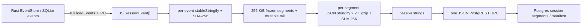
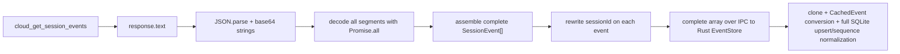
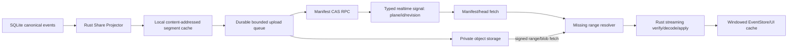

# Shared Session Bandwidth, Memory, CPU, and Architecture Review

Date: 2026-07-18

Scope: ORG2 Cloud shared-session metadata, event uploads, member/guest downloads, read-only replay, fork and continue, Realtime invalidation, and the local EventStore/SQLite bridge. This is an audit and design document; it does not change production code.

> **Implementation status (2026-07-17, `fix/session-sharing-reliability`)**
>
> This document originally described the code before changes on that branch. Interpret the findings below in light of the completed work:
>
> | Item | Status |
> | --- | --- |
> | P0 `afterSeq` not passed through and tests locking in full fetch | ✅ Fixed: adapter passes `p_after_seq`; client filtering remains defense in depth; tests assert pass-through. A credential-gated deployed-contract probe also covers cloud-org-ui scenario M. |
> | P0 Full download on OCC conflict | ◐ Mitigated: `readServerEpoch` uses `afterSeq: MAX_SAFE_INTEGER` for a head read and skips all frozen bodies. Tail body still returns; a true manifest/head RPC needs server support. |
> | P1 Double stringify | ✅ `segmentCanonicalBytes` encodes once for both gzip and hash. |
> | P1 Unbounded `Promise.all` codec work | ✅ `mapSegmentsBounded` limits upload encoding and download decoding to concurrency four. |
> | P1 Fetch without AbortSignal | ✅ The resolve → fetch → decode → durable-apply chain accepts a signal; closing or changing a dialog attempt and unmounting member replay actually cancel work. |
> | P2 UTF-16 sizing | ✅ Segment budgets use UTF-8 bytes, with CJK regression coverage. |
> | P2 Unused `cloudPublishSeededSessionEvents` | ✅ Removed; driver now has a `publishCloudSessionEvents` fixture with real wire shape. |
> | Missing per-segment hash/count verification (test gap) | ✅ `fetchAndAssembleSegments` checks `eventCount` and recomputed hash for each segment, returns typed `SegmentIntegrityError`, and has a payload-tampering test. |
> | P0 Repeated read/hash when one session is shared with N orgs | ✅ Per-pass prepare memo reads complete history, hashes each event, and plans frozen/tail once per session per pass; lazy planning preserves early returns. |
> | P1 Two entitlement coordinators | ✅ `org2CloudEntitlementCoordinator` supplies store-keyed single-flight and TTL to roster bootstrap/refetch and Realtime; the old floor stamp was removed. |
>
> Still open: a hard single-event maximum and external attachments; the full `syncAllOrgs` scan itself (clean markers avoid hashing unchanged sessions, but the loop remains O(org×session)); durable SQLite cursor/metadata hashes; telemetry and 5/20/100 MiB performance fixtures; Phase 1+ Rust data plane; Phase 2+ manifest and object storage; Phase 3 lazy replay and copy-on-write fork. These form a separate performance epic and do not block that branch's merge.

## Executive conclusion

The design already has sound building blocks: gzip, frozen segments, a mutable tail, OCC epochs, and upload/download cursors. The data plane still runs in renderer TypeScript, however, and several “incremental” paths reduce server writes without reducing full client reads, hashes, assembly, or persistence.

The four priorities are:

1. **Send the download cursor to the server.** `getSessionEvents` accepts `p_after_seq`, but `org2CloudBackendAdapter` omitted `afterSeq` and filtered only after downloading a full epoch. Existing tests even asserted that old behavior.
2. **Move session-event data work from React/TS to Rust.** Upload deserializes full SQLite history into UI-enriched `SessionEvent[]`, transfers it to JS over IPC, then hashes, compresses, and base64-encodes it. Download reverses the process and writes a full array again.
3. **Use RPC for control and addressable, resumable objects for large payloads.** Keep manifests, authorization, and epoch/OCC in Postgres RPC. Put immutable segments in object storage, fetched by hash/sequence with signed URLs, resume, and caching.
4. **Schedule only the affected `(session, org)` for a local event.** `es:changed(sessionId)` still leads to a scan of every org and local session. Sharing one session with several orgs repeats full history reads, hashes, and compression.

Low-risk work starts with a deployed-server range contract, `afterSeq` pass-through, manifest-only conflict recovery, AbortSignal, bounded concurrency, and telemetry. Material reductions in bandwidth, memory, and CPU require a Rust streaming projector plus manifest/blob data plane.

## Review boundary and evidence

The review read these main paths:

- Upload scheduling/protocol: `org2CloudSyncEngine.ts`, `org2CloudSyncClient.ts`, `org2CloudSyncAtoms.ts`.
- Segment planning/codec: `collabSyncEngineHelpers.ts`, `segmentCodec.ts`, `collabGzip.ts`.
- Download adapter, import, fork: `org2CloudBackendAdapter.ts`, `useCloudSessionActions.ts`, `CloudShareImportDialog.tsx`, `forkSession.ts`, `useForkImportedSession.ts`.
- Local event storage: `EventStoreProxy.ts`, `session-persistence` schema/CRUD, Rust event conversion and payload compaction.
- Realtime/listing: `useOrg2CloudRealtime.ts`, `org2CloudRemoteSessionsAtom.ts`.
- Existing polling audit: `SharedSessionPolling.md`.

Deployed `cloud_*` SQL/RPC implementations are outside this repository. This review confirms client wire contracts, calls, and mock tests, but cannot confirm production DB query plans, function memory, statement timeout, Storage/RLS policy, or whether the deployed endpoint currently accepts `p_after_seq`. Add staging endpoint contract/performance tests before rollout.

## Current data flow

### Upload



`eventStoreProxy.subscribe` identifies the changed session, but the scheduler uses that only to clear a clean marker. It then calls `syncAllOrgs` and loops across every org and local session. Each org repeats full history reads and hashes for a matched session.

### Download and import



Member replay and guest share-token import converge on this importer. Fork downloads from sequence zero. Forking an already imported session first lists all org sessions and then downloads complete replay again.

## Reproducible synthetic baseline

Using Node 22, medium-compressibility tool-call JSON was generated and processed with equivalent existing algorithms: stable serialization/hash per event, 256 KiB segmentation, parallel gzip/hash of every segment, base64, and RPC-body serialization. Download parsed the response, gunzipped and parsed every segment in parallel, assembled the full array, rewrote session IDs, and serialized an IPC body.

These are **conservative algorithm baselines**, excluding network/TLS, server Postgres, real deserialization copies on both sides of Tauri IPC, Rust `SessionEvent`/`CachedEvent` clones, full SQLite comparisons, and turn-index work. They are not formal production WebView benchmarks.

| Raw transcript | Frozen segments | After gzip | Base64/RPC body | Upload hash | Upload encode | Extra JS RSS peak |
| ---: | ---: | ---: | ---: | ---: | ---: | ---: |
| 5.00 MiB | 21 | 1.61 MiB | 2.15 MiB | 86 ms | 148 ms | ~62 MiB |
| 20.00 MiB | 81 | 6.47 MiB | 8.64 MiB | 456 ms | 664 ms | ~159 MiB |

| Raw transcript | Download response | Second IPC JSON | Parse + decode + IPC serialization | Extra JS RSS peak |
| ---: | ---: | ---: | ---: | ---: |
| 5.00 MiB | 2.16 MiB | 5.01 MiB | ~37 ms | ~33 MiB |
| 20.00 MiB | 8.67 MiB | 20.02 MiB | ~134 ms | ~98 MiB |

Base64 expands compressed binary by about 33.3%; on the JS heap it is also a string, with further copies during encoding, JSON stringify, and Fetch-body construction. The 20 MiB sample added roughly eight times its raw size in renderer RSS from the algorithm alone. Reducing full materialization and cross-layer copying matters more than tuning gzip level.

## Findings

| Priority | Line / Element | Verdict | Reason | Suggested change |
| --- | --- | --- | --- | --- |
| P0 | `org2CloudSyncClient.ts:369-398`; `org2CloudBackendAdapter.ts:70-95`; `org2CloudBackendAdapter.test.ts:91-104` | fix | Client wrapper can send `p_after_seq`, but adapter omits it and filters a full epoch locally. Tests expect the RPC to return a full epoch. One new segment may still download the entire session. | Verify deployed capability with a staging contract test. Pass `{ afterSeq, shareToken }` and remove client frozen filtering when supported; otherwise upgrade RPC first, then tests. |
| P0 | `org2CloudSyncEngine.ts:1472-1559`; `EventStoreProxy.ts:656-670`; `event_conversion.rs:687-850` | fix | Every dirty event plane fully reads SQLite, parses `args/result/meta`, recomputes `extracted`, moves a complete `SessionEvent[]` over IPC, and hashes each event. CPU, JS/Rust heaps, and IPC are O(full history). | Add versioned Rust `share_prepare_session` that generates/reuses a segment manifest from persistence and returns small control results or streamed blobs. |
| P0 | `collabSyncEngineHelpers.ts:398-468`; `EventStoreProxy.ts:489-494,710-720`; `cache_bridge.rs:97-135`; `crud.rs:93-197` | fix | “Incremental” import still reads full local history, assembles a new full history, copies every event, sends a complete IPC `set`, clones Rust store, converts every CachedEvent, upserts every row, and normalizes every sequence. Only the network might be incremental. | Add transactional Rust `share_apply_segments`: verify epoch/seq/hash, append new frozen segments, replace tail, write changed rows, and return count/revision. |
| P0 | `org2CloudSyncEngine.ts:1673-1745` | fix | OCC conflict calls `getSessionEvents` merely to obtain `epoch`, but receives every segment. Lost push cursor or multi-device conflict can cause a full download before a full upload. | Add manifest/head RPC, or carry current epoch/frozenSeq/tailHash in the conflict response; no segment body in recovery. |
| P0 | `org2CloudSyncEngine.ts:625-653,656-914` | fix | `es:changed` has sessionId, but sync scans every org × session. Sharing one change with multiple orgs rereads, rehashes, resegments, and recompresses the same history. Large session uploads also precede project/task control work. | Use durable dirty-set key `(sessionId, targetOrgIds, localRevision)`; prepare/compress once per revision and fan out manifests. Separate blob queue from project/task control queue. |
| P1 | `collabSyncEngineHelpers.ts:124-141`; `org2CloudSyncEngine.ts:1553-1617` | fix | Frozen area is the longest terminal prefix. One old awaiting_user/running/pending event pins all later completed events in a tail that is replaced on every append and may grow indefinitely. | Use turn/block-level mutable units that freeze on terminal state, or content-addressed event blocks plus a small patch/tail manifest. |
| P1 | `segmentCodec.ts:24-43`; `collabGzip.ts:15-100`; `org2CloudSyncClient.ts:94-120,281-325` | fix | Each segment is stringified separately for gzip and hash; all segments encode with `Promise.all`; compressed chunks are copied, base64-encoded, and joined into one JSON body. Download expands all segments in parallel too. | While in JS, limit concurrency to 2–4, reuse canonical bytes, stream upload, and pass AbortSignal. Move to bounded Rust binary streaming later. |
| P1 | `session_event.rs:115-170`; `event_conversion.rs:713-850`; `payload_compaction.rs:58-73` | fix | Network sharing reuses UI-enriched `SessionEvent`: raw args/result, display fields, and derived `extracted` may repeat large text. A UI snapshot has 64 KiB compaction, but share reads full persisted events. | Version `ReplayEventV2` with only canonical replay fields; rebuild derived UI fields on receipt. Store large stdout/diff/images as content-addressed attachments with lazy fetch. |
| P1 | `org2CloudSyncClient.ts:94-120`; `CloudShareImportDialog.tsx:121-169`; `useCloudSessionActions.ts:86-145` | fix | Fetch lacks AbortSignal. Closing a dialog or changing generation ignores results but lets network, decompression, JSON parse, IPC, and SQLite work continue. One JSON RPC has no progress/resume. | Carry AbortSignal through replay fetch/import and genuinely cancel on close/change; report byte/segment progress and use resumable transport for large objects. |
| P1 | `org2CloudSyncAtoms.ts:32-56,91-100`; `org2CloudSyncEngine.ts:349-358` | fix | Segment cursor is in localStorage; metadata hash is only in memory. Clearing storage, reinstalling, or changing device loses cursor, causing full rewrite plus OCC. Restart also re-upserts all candidate metadata. | Persist manifest/cursor/hash in SQLite with event revision or durable queue; provide cheap server head/ETag and revision/If-Match metadata comparison. |
| P1 | `org2CloudRemoteSessionsAtom.ts:143-202`; `useForkImportedSession.ts:176-193`; `useOrg2CloudRealtime.ts:261-291` | fix | `listOrgSessions` accepts `since`, but major consumers always list all. Fork of an imported session lists the whole org to find one row. Coarse `org_change_signals` invalidates unrelated sessions/projects/comments. | Merge server-cursor deltas and tombstones; add get-one/manifest-by-ID. Realtime signal should include plane, entity/session ID, revision, origin. See `SharedSessionPolling.md`. |
| P1 | `org2CloudSyncEngine.ts:1472-1479`; `rustBridge.ts:63-72`; `imported/index.ts:41-53` | fix | External-history upload reads full source chunks, maps them in JS, IPCs them to Rust for normalization, IPCs full events back for hash/compression. With no native `es:changed`, it rereads every 10-minute clean TTL, trading performance against freshness. | Give each source a durable stat/revision and Rust iterator/exporter. Skip unchanged revisions O(1), process only changed ranges, share the native projector contract. |
| P2 | `collabSyncEngineHelpers.ts:144-171,148-150`; `collabSyncEngineHelpers.test.ts:114-121` | fix | “256 KB” uses `JSON.stringify(event).length` UTF-16 code units, not UTF-8 bytes, up to ~3× wrong for Chinese. A single huge event may explicitly exceed the segment budget. | Count canonical UTF-8 bytes, enforce a hard event max, externalize large fields, and test CJK/emoji/oversize wire contracts. |
| P2 | `org2CloudSyncClient.ts:94-120`; sharing data plane | fix | No common raw/compressed/wire bytes, prepare/hash/compress/decode/apply time, full-rewrite reason, OCC conflict, tail size, range hit, abort waste, or peak memory metrics. Optimization cannot be proved without budgets. | Aggregate telemetry by `(org, session, revision)` with sizes/times/reasons only; add 5/20/100 MiB fixtures and CI budget. |
| Keep | `org2CloudSyncEngine.ts:1562-1644`; `segmentCodec.ts:9-52` | keep with reason | OCC anchors, segment/tail hashes, epoch rewrite, and importer contiguity/count checks are sound integrity foundations. | Preserve semantics while moving one hash/manifest implementation to Rust and keeping conflict/range requests control-only. |
| Keep | `collabSyncEngineHelpers.ts:291-350` | keep with reason | `(orgId, sourceSessionId)` in-flight dedup prevents duplicate replay downloads/writes from clicks and other importers. | Extend key/guard to manifest revision with reference-counted cancellation so one consumer cannot cancel another's shared work. |

## Upload changes

### 1. Precise dirty queue

One `es:changed(sessionId, localRevision)` should make one session prepare job. The job resolves target orgs under current access policy, makes one segment plan, and submits small manifests separately. Suggested durable key:

```text
(session_id, local_revision, payload_projection_version, codec_version)
```

Each org stores only authorization, remote manifest revision, and delivery state, without recomputing local compressed data. Merge new events into jobs not yet started. If a running job finishes behind the current revision, enqueue one successor instead of preparing two full histories concurrently.

### 2. Rust canonical replay projection

Do not rebuild UI `SessionEvent` from SQLite first. A Rust projector should read canonical persisted rows into `ReplayEventV2` with identity, time, source, function, required args/result, terminal state, and replay provenance. Remove derived `extracted` and UI preview/index fields that can be rebuilt. Move large fields into `{hash, rawBytes, mediaType, preview}` attachment references. Put projector version in the manifest so upgrades rebuild explicitly rather than relying on key order.

Store `share_segments`/`share_manifests` locally and cache compressed bytes by content hash. Normal append reads only events after the cursor and the current mutable block. Rewind/edit regenerates the changed suffix, retaining hashes for an unchanged prefix.

### 3. Separate control and data planes

- Postgres RPC: authorization, manifest CAS, epoch/revision, retention, share grant.
- Object storage: immutable compressed segments and attachments.
- Realtime/Broadcast: invalidation payload `{plane, sessionId, manifestRevision, origin}` only.

Scope object keys within org/session/owner authorization to avoid a cross-tenant content-equality side channel from global hash dedup. Upload missing blobs before manifest commit; a successful commit makes the new revision visible atomically. Retry only missing blobs.

Supabase documentation recommends TUS resumable uploads for files above 6 MB, unstable networks, or progress, and direct storage hostnames for larger files; resumable/S3 is more reliable than standard upload above 6 MB: [Resumable Uploads](https://supabase.com/docs/guides/storage/uploads/resumable-uploads), [Upload file size restrictions](https://supabase.com/docs/guides/troubleshooting/upload-file-size-restrictions-Y4wQLT). Do not mechanically create one request per current 256 KiB pre-gzip segment. Benchmark real data for ~0.5–2 MiB compressed objects at concurrency 2–4, using TUS for objects or bundles above 6 MB.

### 4. Bound mutable tail

One mutable suffix is too coarse for parallel tools and awaiting-user turns. Use turn blocks: active blocks replaceable; terminal blocks immutable; huge tool payloads updated through attachment manifest; fixing orphaned interactive events no longer prevents later turns from freezing. A streaming update then retransmits only the current turn's small block.

### 5. Containment before Rust/Storage migration

- Replace `Promise.all(allSegments)` with 2–4 bounded workers.
- Reuse canonical UTF-8 bytes for gzip/hash; do not stringify twice.
- Size segments with `TextEncoder().encode(...).byteLength`.
- Enforce a hard single-event max and externalize large fields.
- Track dirty session IDs instead of scanning every session.
- Persist metadata hashes so unchanged sessions do not upsert on restart.
- While hidden/on battery, upload only terminal turns or explicit flushes instead of preparing full histories at every streaming gap.

## Download changes

### 1. Manifest first, with server-side range

A list needs only a small summary. On opening replay, fetch a manifest/header such as:

```json
{
  "manifestVersion": 2,
  "sessionRevision": 42,
  "epoch": 3,
  "eventCount": 12000,
  "codec": "gzip",
  "projection": "replay_event_v2",
  "segments": [
    { "seq": 17, "hash": "...", "compressedBytes": 481220, "eventCount": 320 }
  ],
  "tail": { "revision": 9, "hash": "...", "compressedBytes": 81220 }
}
```

Incremental refresh sends owned epoch/sequence/hash; server returns missing segment descriptors only. Fetch blobs through signed URLs or authorized Storage API, without base64 payloads in manifest JSON.

### 2. Replay does not imply full offline import

- **Remote replay:** Fetch visible turns or the latest one or two blocks first, load more on scroll/jump, and keep an LRU disk cache.
- **Offline save:** User explicitly opts into full background download with pause/resume/progress.
- **Fork and continue:** Reuse identical cached manifests and reference inherited blocks copy-on-write; new events write new-session blocks. The first handoff round consumes at most 80 items of 1,200 characters, so it need not load all history into JS.

If the product still requires complete local history immediately after fork, Rust streaming apply should write SQLite directly. An imported session with the same manifest should clone/reference locally, without another download.

### 3. Real cancellation, progress, and recovery

- Propagate AbortSignal/generation through fetch, decode, and apply. Cancellation stops network reads, workers, and DB transactions.
- Measure progress by `downloadedCompressedBytes / manifest.totalCompressedBytes`, not event count.
- Durably commit each segment after hash verification, resuming from confirmed sequence after restart.
- Decompress, JSON-decode, and upgrade projections in Rust worker/blocking pool, sequentially or with small concurrency. Renderer receives windowed events only.

### 4. Lists and Realtime

Use the server cursor and tombstones from `cloud_list_org_sessions(since)`. Find an imported source with get-one/manifest-by-ID rather than full org listing. Dispatch `org_change_signals` by plane/entity/revision.

Supabase documentation recommends Broadcast over Postgres Changes for scalable Realtime and supports explicit trigger payloads: [Subscribing to Database Changes](https://supabase.com/docs/guides/realtime/subscribing-to-database-changes). This aligns with typed signals in the prior polling audit.

## Proposed target architecture



Every entry point shares protocol capabilities:

```text
manifest_version
projection_version
codec
server_range_read
blob_transport
max_segment_bytes
realtime_signal_version
```

One aggregate `schema_version` cannot imply all of them. `getSessionEvents` already accepts `afterSeq` while the adapter/tests assumed it did not, illustrating capability drift.

## Phased implementation

### Phase 0: remove incorrect full paths and measure

1. Add deployed `p_after_seq` contract test, pass `afterSeq`, and remove client frozen filtering and tests that lock in old behavior.
2. Add manifest/head RPC so OCC conflict does not download segments.
3. Add AbortSignal throughout fetch, bounded codec concurrency, UTF-8 sizing, and a hard single-event max.
4. Measure bytes, time, rewrite reasons, tail size, range hits; add 5/20/100 MiB fixtures.
5. Use dirty-session set and reuse hash/compression for the same local revision across orgs.

### Phase 1: unify Rust data plane

1. Define `ReplayEventV2` without derived/UI-only duplicated fields.
2. Implement Rust `share_prepare_session` plus local manifest/segment cache.
3. Implement Rust `share_apply_segments` for incremental SQLite writes, replacing full JS `set + saveToCache`.
4. Bring external history into the projector via stat/revision and Rust iterator.

### Phase 2: manifest and object storage

1. Immutable blobs, signed reads, manifest CAS, and orphan-blob GC.
2. TUS/resume for large objects and bounded parallel upload for small ones.
3. Typed Realtime/Broadcast signals; revision/range lists and per-session manifests.
4. Keep old JSON RPC reads for a capability-negotiated compatibility window, then remove them; no permanent dual writes.

### Phase 3: lazy replay and copy-on-write fork

1. Fetch replay by turn/window for first screen and scroll; LRU disk cache.
2. Make offline save an explicit full-download action.
3. Fork by reusing local/remote manifest blocks and write only new session blocks.
4. Query the last 80 available canonical items directly for handoff, without loading all history.

## Acceptance metrics

### Upload

- Unchanged session: zero full-event IPCs, hashes, and data bytes.
- One new 1 KiB event: prepare only that session; send at most the changed compressed block plus 5% control overhead.
- Same revision shared with N orgs: canonicalize/hash/compress once; N manifest/auth commits only.
- Append to a 20 MiB history: renderer main-thread blocking below 16 ms per segment; extra renderer RSS below 20 MiB.
- OCC conflict: manifest/head under 10 KiB, without historical segments.
- An old awaiting-user event does not make mutable upload tail grow without bound across later turns.

### Download

- With local sequence 80 and remote 81: download 81 and current tail only, not 1–80.
- First replay screen: at most two blocks or 2 MiB compressed, whichever budget is smaller; load the rest on demand.
- Within one second of cancellation, network/decode/apply stop; measure extra downloaded bytes after cancel.
- No full multi-copy peak in renderer or Rust for 100 MiB replay; target extra working set below 64 MiB per process.
- Fork of an imported session with identical manifest: zero remote replay bytes; local copy-on-write.
- Resume from verified segments after interruption/restart, without redownloading an epoch.

### Control plane

- A session signal invalidates one list/manifest key, not projects/comments/roster.
- Signals carry plane, entity ID, revision, and origin; ignore stale or already-applied own revisions.
- Dashboard distinguishes full rewrite, incremental append, manifest-only, range hit, retry/resume, and abort waste.

## Overloaded terms

| Term | Current meanings | Risk | Recommendation |
| --- | --- | --- | --- |
| `sessionId` | Owner bare ID, `${org}:${owner}:${source}` remote row ID, `imported-session-*` local ID, fork local ID | Adapter splits on colon and can confuse local/remote keys. | Types `SourceSessionId`, `RemoteSessionRowId`, `LocalSessionId`. |
| `seq` | Frozen segment number, special tail zero, SQLite event `history_sequence`, import cursor | Name does not reveal event vs segment. | `frozenSegmentSeq`, `eventSequence`, `tailRevision`. |
| `epoch` / `version` / `revision` | Remote rewrite epoch, Rust EventStore version, Realtime version, local dirty stamp | Unsafe to interchange across layers. | Manifest `epoch` plus `manifestRevision`; local `eventStoreRevision`. |
| `snapshot` | Rust derived UI snapshot, cloud segment snapshot, complete imported local copy | Size and authority are unclear. | `DerivedUiSnapshot`, `SessionManifest`, `ReplayWindow`. |
| `full_replay` | Permission tier and implied full download before open | Couples access scope to load strategy. | Permission `replay_access`, separate lazy/offline strategy. |
| `tail` | Entire suffix after first nonterminal event | Sounds small but may cover most of a session. | Turn/block mutable set; explicit bytes/count in manifest. |

## Ten-layer architecture audit coverage

| Layer | Coverage | Conclusion |
| --- | --- | --- |
| 1. Compilation correctness | `pnpm typecheck` passed; 116 tests across five sharing/codec files passed; `cargo check -p session_persistence --quiet` passed. | Existing tests accept the problematic performance/protocol behavior; this is not a compile failure. |
| 2. Dead code and deduplication | Traced upload/download entry points, duplicate server `afterSeq` versus client full filter, double canonicalization, and complete `set + save` movement. | Remove client filter and renderer data plane rather than adding a helper layer. |
| 3. Naming consistency | Adapter comment/test say “RPC always returns full epoch,” although client contract already has `p_after_seq`. | Comments, tests, and deployed capability drifted. |
| 4. Semantic overloading | Reviewed ID/sequence/epoch/snapshot/replay/tail table above. | New manifest types must remove raw string/number overloads. |
| 5. Default branches | Reviewed metadata-only/full replay, missing cursor, epoch conflict, missing displayStatus, oversize event, fetch-validation fallback. | Dangerous defaults are full refetch/rewrite after failure and sending oversize events anyway. |
| 6. Cross-domain leakage | UI-enriched `SessionEvent` is canonical network payload; React sync engine owns segmentation, compression, and OCC planning. | Move data-plane responsibility to Rust; UI consumes windows only. |
| 7. New-developer confusion | Three session IDs, tail seq zero, two hash canonicalizations, multiple revisions, no capability matrix. | Add branded IDs, clear manifest schema, owner docs. |
| 8. Wire protocol | Inspected actual JSON body, gzip/base64, segment schema, range options, list cursor, Realtime signal. | Main issue: binary is base64 inside one JSON RPC and range is disconnected. |
| 9. Init parity | Compared member replay, guest import, remote fork, imported-session fork, native upload, external-history upload. | Member/guest auth reuse is sound; `afterSeq` stops at adapter, fork forces full, external history lacks native dirty signal. |
| 10. Resolver symmetry | Compared `shareToken`/`afterSeq` options, native/external revision sources, member/guest manifests. | `shareToken` flows end to end, `afterSeq` did not, external history lacks equivalent revision resolver. |

## Test gaps

- No deployed-endpoint `p_after_seq`/manifest capability contract test.
- No 5/20/100 MiB upload/download performance fixtures, peak-memory or main-thread long-task budget.
- No CJK/emoji UTF-8 segment-size test.
- Oversize single-event test proves only that it is not dropped, not a hard limit or attachment split.
- No test that network/CPU/DB truly stop after cancellation.
- No assertion that OCC conflict omits segment body.
- No assertion that one session shared to several orgs is prepared once.
- No stress test for old awaiting-user events growing tail.
- No assertion that incremental import writes only changed SQLite rows.
- No range-fetch E2E for initial replay screen and scrolling.

## Final recommendation

First fix range contract and conflict head to eliminate obvious repeated downloads, alongside AbortSignal, bounded concurrency, UTF-8 budgets, and measurement. Then move projector, hashing, compression, and download apply to Rust to eliminate complete `SessionEvent[]` IPC transfers. Longer term, use manifests, private object blobs, typed Realtime, windowed/lazy replay, and copy-on-write forks.

Changing to zstd is not the first step. Full reads, materialization, IPC copies, base64-in-JSON, and full rewrites remain the main CPU/memory multipliers even if compression improves by 20%. Compare gzip with zstd levels 1/3 using real transcripts after Rust streaming is in place, measuring ratio, throughput, and compatibility cost.
