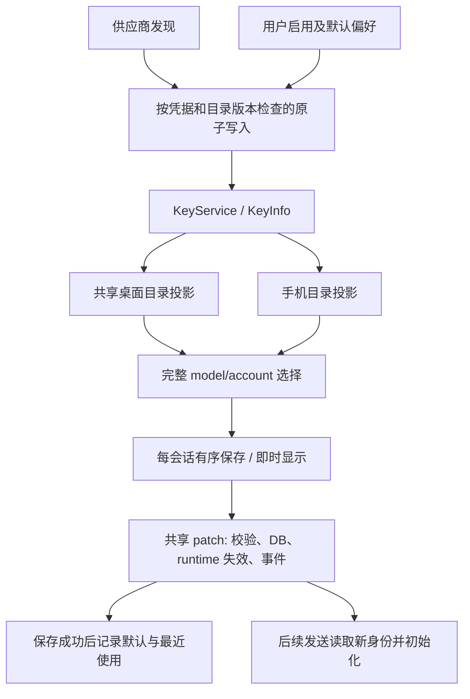

# 模型选择数据流修复

日期：2026-09-23。对应 [原始数据流审计](./ModelSelectionDataFlow.md)。用户要求多 agent 实施，并保持已有选择入口、布局与操作步骤。

## 权威与完成条件

| 值 | 权威 | 本轮不变量 |
| --- | --- | --- |
| 账户目录 | KeyService / credentials 持久化 | 发现结果原子写入；晚到结果不能覆盖更新后的凭据或目录 |
| 用户偏好 | enabled、手动 alias、显式 family default | 刷新保留最新用户选择；供应商默认与用户覆盖分开 |
| 可选账户/模型 | KeyInfo 与共享前端目录投影 | 空 enabled 保持为空；健康状态不被 executor adapter 提升；wire 元数据优先 |
| 会话身份 | session DB 的 model/account pair | 桌面与手机使用同一写入用例；确认成功时旧 runtime 已失效 |
| 当前轮执行身份 | 已入场 turn 捕获的 runtime 与对应 lease | 已开始的回复继续使用原 provider；取消/清理保持同一 lease；新选择用于后续入场的轮次 |
| creator 默认、recent | 成功接受的完整选择 | 保存失败或作用域已切换时，不记入默认/最近使用 |
| 上下文窗口 | 当前 session 的运行时遥测，然后当前账户目录 | 不读取另一会话的 creator 默认来猜测当前窗口 |

Market 保持独立权限源。内置产品目录仍是支持资料，不表示账户已获实时授权。既有会话 immutable source/engine 限制保留。



## 生产边界与修复

| Line | Element | Verdict | Reason | Suggested change |
| --- | --- | --- | --- | --- |
| `key_store/service/model_catalog.rs:21` | discovery 写入 | fix | 原刷新丢 variants/defaults、重写 enabled；读网络请求起点的旧偏好会丢更新 | 已由原子 discovery 命令读取锁内最新偏好，并校验两个 generation |
| `key_store/types.rs`、`commands/crud/models.rs:383`、`save_default_variants.rs:6` | 默认档位来源 | fix | provider 默认和显式选择原来混在一张表；修改某家族会把其余投影默认固定成用户覆盖 | 分开保存 discovered default 与 user override；三个编辑入口只提交所改家族；endpoint/目录重置清除旧 discovery |
| `accountModelCatalog.ts:127`、`crud/models.rs:541`、mobile adapter | 可选目录 | fix | 不同入口各自解释空启用、variant-only 与账户健康 | 共享可选规则、wire-first 变体解析和 registry 兼容关系 |
| `session_directory/patch.rs:491` | 身份更新事务 | fix | 手机绕过 runtime invalidation；失败或取消可留下 DB/runtime 分裂 | 桌面手机共用写入边界、短身份锁与 admission guard |
| `state/session_identity.rs:15`、session init callers | 初始化并发 | fix | 旧初始化可能在改选后安装旧 runtime 或写回旧身份 | 同会话准备/初始化与 patch 串行；现有会话的完整 pair 优先于 seed |
| `sessionPatchQueue.ts:58` | 连续选择和回滚 | fix | 完整旧快照回滚可能覆盖新选择或拆散 model/account | 有序保存、按原子字段组识别回声/外部更新、仅回滚仍持有的字段 |
| `defaultVariantSaveCoordinator.ts` | 默认档位连续保存 | fix | 多入口并发写、全量旧返回与失败快照可能覆盖较新意图 | 共享每账户队列，只提交 family delta；确认值重放 pending，成功回复不替换整行 |
| session turn entry / gateway pipeline | 执行上下文 | fix | 初始化后再次读 cache 可能拿到已失效或已更换的 runtime，lease 也可能错配 | 贯穿准备时的 runtime 和 lease；既有 admission 检查保留 |
| `ModelPill.tsx:250`、`modelSelectionCommit.ts` | 成功时机 | fix | recent/default 先于保存成功 | 保留即时关闭与即时显示；成功且仍属当前意图才记入偏好 |
| `selectionFromSession.ts:15`、`useContextUsageInfo.ts` | fallback | fix | 不同来源的 model/account、context 拼接 | 已有身份整体使用；只有完全未选模型时使用完整 creator fallback |
| `sharedLocalKeyStore.ts` | 账户 store | keep with reason | 已有共享发布与 single-flight，不需要新账户副本 | 保持 |
| Market catalog / prepared source | 权限与生命周期 | keep with reason | 与本地 key 不同的凭据和套餐生命周期 | 保持独立源；晚到准备结果不能替换新的 own-key 选择 |

## 状态机与边缘情况

| 状态/事件 | 显示与写入政策 | 验证边界 |
| --- | --- | --- |
| 刷新中 | 原目录保持；同账户请求合并 | TS 刷新测试 |
| 空目录/发现失败 | 拒绝破坏性覆盖，可重试 | TS + KeyService |
| 刷新期间账户或目录变化 | 拒绝旧 generation 的提交 | KeyService 持久化测试 |
| 显式禁用全部模型 | 选择器保持空候选；管理页仍能管理 | KeyInfo/前端/mobile |
| 选择后保存中 | 保留即时菜单关闭与乐观显示；同会话保存顺序化 | palette + queue |
| 多次快速选择 | 最新意图保持显示；早到自身事件不覆盖后续选择 | queue |
| 默认档位连改/关闭管理页 | 保留原 300ms debounce；关闭时交给共享保存队列；双失败回滚确认值 | default coordinator + rendered table hook |
| 保存失败 | 回到最近确认值，保留外部更新与无关字段；显示错误，可重试 | queue + rendered ModelPill + SQLite |
| 外部 pair 与本地只共享一半字段 | 整组识别与保留，禁止拼接 | queue model/account 与 product/exec 回归 |
| 离开会话/删除/store 替换 | 晚到结果不写新作用域，不复活删除记录；在途队列结束取消订阅 | rendered ModelPill + queue + store owner 检查 |
| 正在回复时改选 | 原回复 provider 保持；下一次入场读取新 pair | captured runtime 与 shared patch 测试 |
| 已入场 A，随后 cache 清空或换为 B | 本轮仍用 A，A 的结束不能清理 B；下一轮用 B | 真实 fake-provider entry/gateway 与 lease 边界回归 |
| prepared Agent Org admission 已固定 runtime | DB 写入前拒绝变更，释放 admission 后可重试 | core runtime mutation tests |
| 手机断线/取消请求 | 等待锁时可取消；已入场 DB 写入仍完成缓存失效和通知，不因响应端消失留下半次更新 | shared patch 断线回归 |
| 后台标题/渠道/压缩初始化、启动失败 | 已有会话身份优先；旧准备工作不得回写旧 pair；失败只更新 status/timestamp | cold-init 与 status-only persistence 回归 |
| 手机列表超过上限 | 在 256 项内保留当前选择 | mobile adapter |
| 无运行时 context | 使用当前会话账户；CLI/imported 原有 unknown 规则保持 | rendered context hook |

## 兼容性与历史数据

新增持久化字段 `model_catalog_generation` 和 `discovered_default_variants` 均有 serde 默认值；旧文件无须迁移。旧 `default_variants` 保守地视为显式用户选择，因为无法可靠恢复其最初来源。未删除历史账户、模型或会话数据，也未自动清理旧默认档位。

RPC 新目录 payload 与 `default_variant_overrides` 均为可选字段；旧 health/update 调用保持兼容，delta 保存不允许同时夹带其他账户编辑字段。回退版本会忽略新字段，但不能期待旧代码继续保证本次新增的并发与刷新不变量；若保存凭据文件则应保留备份。无数据库 schema 修改。

## 十层架构覆盖

| 层 | 结果与范围 |
| --- | --- |
| 1 编译 | frontend 类型检查、定向 lint、Rust owning-crate/应用测试；未跑全 workspace clippy |
| 2 结构/重复 | 合并目录解释与 session 写入入口；未做全库死代码清理 |
| 3 命名 | 明确 discovery default/user override、confirmed/pending、runtime cache |
| 4 语义 | enabled 空集合不代表未配置；catalog 支持不代表授权 |
| 5 默认 | session pair 整体 fallback；已有会话 seed 不覆盖；provider default 与用户覆盖分离 |
| 6 边界 | 健康由凭据边界拥有；身份由 session 写入边界拥有；runtime 为缓存 |
| 7 可理解性 | 生命周期和边缘矩阵；原审计标为修改前基线 |
| 8 Wire | schema/API payload 与 Rust DTO 一致；无凭据加入目录投影；未抓真实供应商请求 |
| 9 入口 | desktop/mobile、key/model first、Org picker、normal send/title/channel/compaction 初始化 |
| 10 resolver | 完整 pair、不从 creator/default 逐字段补齐；wire variant 优先 |

## 性能与资源生命周期

| Area | Verdict | Evidence | Change or reason kept | Verification |
| --- | --- | --- | --- | --- |
| Background work | fix | 手动刷新 promise、入场写入任务；无新增 polling | 同账户 single-flight，保存/失效为有限单次任务 | 刷新重试/并发测试，shared patch |
| Memory | fix | per-store WeakMap、每 session/account pending、Rust weak lock 表 | 每 session/account 最多 64 个 pending；default coordinator 最多 64 个活跃账户；drain 取消订阅并移除；weak lock 下次访问清理 | pending cap/订阅释放与 weak-lock tests |
| Scope/isolation | fix | session ID、store identity、credential/catalog generation | 旧结果拒绝或忽略；默认按发起选择的 category 写入 | stale refresh、scope switch、pair 回归 |
| Rendering/hot path | keep | 只订阅有未完成保存的 session atom | 无流式事件全表扫描；元数据 index 为单次局部派生 | 源码调用链、rendered hook 测试；无 CPU/RSS 声明 |

| Provider | Raw transition | App/UI state | Topology/boundary | Expected invariant | Observed evidence |
| --- | --- | --- | --- | --- | --- |
| fixture OAuth/API catalog | metadata 刷新/重复/凭据变化 | 原目录已存在 | KeyService 文件持久化 | 偏好不丢、旧响应不覆盖 | 单测；非 live 供应商验证 |
| fake native provider | 同模型换账户、同时换模型账户 | 已有 runtime | mobile send →真实 session DB/runtime | 下条发送使用新 pair | 应用测试；不经过真实手机 UI |
| runtime admission fixture | pin/失败/重试/并发 | prepared turn | core owner | 拒绝时 DB/runtime 均不变 | owning-boundary 测试 |
| real account / device | 刷新、改选、发送、隐藏/重开 | Tauri / iOS | 实机/双实例 | 视觉、授权、CPU/RSS、实际服务响应 | **not run** |

Performance verdict: **blocked** for real Tauri/iOS CPU/RSS、真实账户及双实例测量；本轮只有源码资源约束与自动化边界证据，不宣称运行时性能提升。

## 验证记录

Rust 命令在 `src-tauri/` 执行：

```sh
cargo test -p key_vault --lib --quiet
cargo test -p agent_core --lib -- state::session_ state::commands::session::identity::tests core::session::project_init::tests core::session::turn::entry::runtime_tests terminal_status_write_preserves_a_newer_model_selection --test-threads=1
cargo test -p org2 --lib -- agent_sessions::session_directory::patch::tests api::mobile_bridge::adapters::model::tests --test-threads=1
```

- KeyVault：491 passed、1 ignored；core 定向：25 passed；app patch/mobile：15 passed。合计 **531 passed、1 ignored、0 failed**。
- 编译仅观察到 macOS linker 的 `__eh_frame > 16MB` 警告；未跑全 workspace clippy。
- `pnpm check:test-placement` 未通过：既有 `src/modules/WorkStation/CodeEditor/Panels/EditorMainPane/hooks/__tests__/useFileContentManager.save.test.ts` 与同目录 colocated tests 混用。该未提交目录在本次修改前已存在，没有改动；本轮新测试遵循所在目录约定。
- changed-file length 检查通过，所有本轮改动的生产 TS 文件均在 700 行内。
- 34 个修改的生产 TS/TSX 文件经 AST 检查：0 个原生 button/form 绕过，0 个 clickable div/span 替代按钮；6 个 TSX 的 UI 审计为 0 fix / 6 keep with reason / 0 abstract。

前端最终整合命令：

```sh
pnpm test src/hooks/models src/hooks/keyVault/sharedLocalKeyStore.test.ts src/hooks/keyVault/useLocalKeys.test.ts src/hooks/keyVault/defaultVariantSaveCoordinator.test.ts src/scaffold/GlobalSpotlight/palettes/UnifiedModelPalette src/modules/MainApp/Integrations/KeyVault/hooks/refreshAccountModels.test.ts src/modules/MainApp/Integrations/KeyVault/Table/useDefaultVariantSaves.test.ts src/modules/MobileRemote/app/useMobileSessionModel.test.ts src/hooks/session/__tests__/sessionPatchQueue.test.ts src/util/session/__tests__/selectionFromSession.test.ts src/util/__tests__/modelVariants.test.ts src/util/__tests__/selectableModelVariants.test.ts src/util/__tests__/variantEditOptions.test.ts src/engines/ChatPanel/InputArea/components/ModelPill.test.ts src/engines/ChatPanel/InputArea/components/ModelPill.memberOwnership.test.ts src/engines/ChatPanel/InputArea/components/useContextUsageInfo.test.ts src/engines/ChatPanel/InputArea/components/useContextUsageInfo.session.test.ts
pnpm typecheck:fast
pnpm check:circular
git diff --check
```

整合测试 **39 文件、211 项通过**。`pnpm typecheck:fast` 通过；`pnpm check:circular` 在 8167 个模块中未发现循环依赖；`git diff --check` 通过。本轮 50 个修改的 TS/TSX 文件使用 `pnpm exec eslint --max-warnings 0 <changed files>` 检查通过。

真实账户/手机视觉流程未执行；保留同一 DOM、shared controls、布局和样式只能支持代码层面的交互保持，不能替代实机验收。

## 普通 KeyVault 保存的并发补强

后续检查发现，`credentials.json` 原本通过临时文件改名完成整文件替换，但普通 `save_key` 命令先在锁外读取账户快照，再交给 `KeyService.save_key` 加锁写回。目录刷新或另一次编辑若在两步之间落盘，旧快照可能覆盖与本次请求无关的字段。权威源仍是 KeyService 读取的最新持久化账户；不能依赖前端快照代表当前值。

实施计划及结果：

1. 在 KeyService 的同一把锁内读取最新账户、应用普通 RPC 明确提交的字段、校验并写入。校验失败直接返回，不重写文件；原有完整记录保存仍使用同一验证入口。
2. 模型启用的两个前端入口只提交 `enabled_models`，不再顺带提交列表加载时的 `available_models`。请求协议、界面与操作步骤不变；显式重新验证或更换 endpoint 的目录提交仍保留。
3. 在生产写入边界验证两个编辑并发、准备请求后健康/目录更新、失败后文件不变且可重试；在前端请求边界验证启用操作不携带旧目录。

架构十层复核：编译、结构、命名、语义、默认值、权威边界、可理解性、wire、入口和目录解析均覆盖本次变动。未进行全工作区死代码清理、真实供应商请求或实机 UI 验收。性能与资源生命周期判定为 **通过源码约束，真实运行未测量**：普通保存仍在 `spawn_blocking` 执行，使用既有进程内互斥锁和单次文件替换，没有新增轮询、定时器、缓存或订阅；锁内校验可能延长单次写入等待，未声称 CPU/RSS 改善。跨进程同时修改同一凭据文件不受这把锁保护，同一字段的并发编辑仍按最后进入写入边界者为准。

增量验证：`cargo test -p key_vault --lib --quiet` 为 **494 passed、1 ignored**；`cargo clippy -p key_vault --lib -- -D warnings`、所改 Rust 文件的 `rustfmt --check`、所改前端文件的 ESLint、`pnpm typecheck:fast`、`git diff --check` 均通过。定向前端测试 3 个文件、9 项通过。未重复执行全工作区测试；本次只改变 KeyVault 普通保存边界及两个启用请求。
