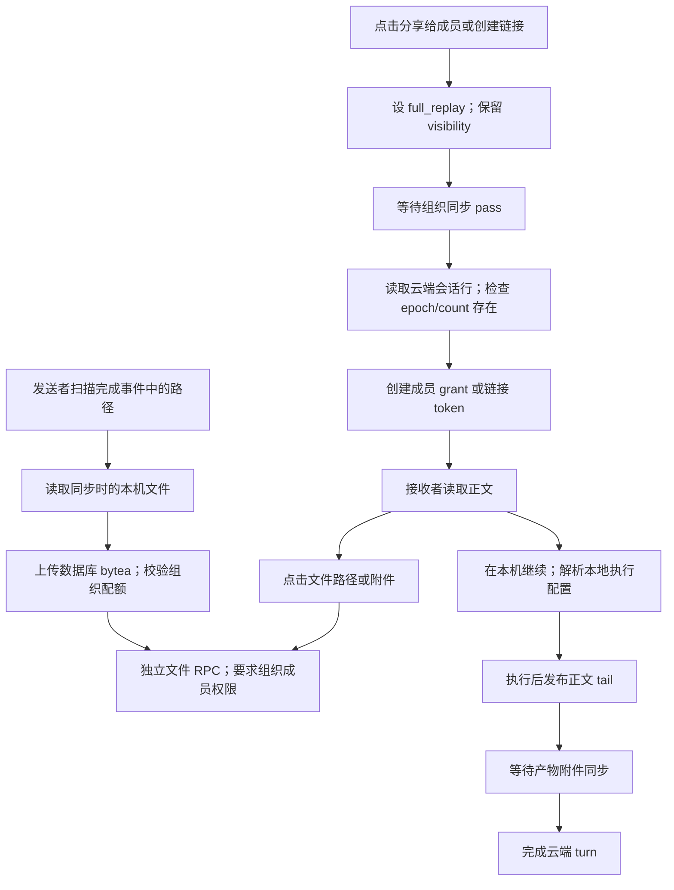

# Share Sessions 全链路设计审计

日期：2026-09-24（UTC）。本轮交付为中文审计和可复现反例，没有修改产品代码、生产数据或云端配置。

## 结论与证据边界

当前问题不只是附件额度偏小。分享受众、文件交付、历史附件版本、正文与附件的完成状态之间存在边界缺口，应先修正确性，再调整容量和交互。**Agent 回答中的文件必须继续自动共享，让队友可以直接读取；禁止 Markdown / `[file:…]` 上传不是本审计的解决方案。**

审计基线：ORG2 `990ad8af6a3af8bb996902b858994a5b1978ef92`；后端 ORGII-cloud-infra `9e58753f63282589b27ce47491f96c88d18c01db`。下文客户端路径相对 ORG2 根目录，SQL 路径相对 cloud-infra 根目录。结论针对这两个源码版本，不代表已核实线上运行版本。

证据分三类：**已复现**为本地生产函数/SQL 的受控反例；**调用链确认**为源码行为，尚未做完整 UI/网络实测；**待验证**为需要竞态或跨实例实验的风险。探针通过表示缺陷条件成立，绝不是产品验收通过。

本轮完成标准：覆盖发布、授权、正文读取、附件收集/上传/读取、续聊、撤销、配额和生命周期；每项结论附权威来源、触发条件及目标不变量；区分既有修复与新增发现；不以隐藏 UI 或吞错替代源头修复。

## 和已有 PR 的关系

| PR                                                                                                                     | 本轮对照结果                                                                                                        |
| ---------------------------------------------------------------------------------------------------------------------- | ------------------------------------------------------------------------------------------------------------------- |
| [#2111](https://github.com/org2AI/ORG2/pull/2111)                                                                      | 已合并的正文热修复纳入基线，不重复当作未修缺陷                                                                      |
| [#2114](https://github.com/org2AI/ORG2/pull/2114)                                                                      | 已合并中文附件设计；outbox、快照、引用和配额方向保留，补充本报告的自动交付与受众合同                                |
| [#2119](https://github.com/org2AI/ORG2/pull/2119)                                                                      | 已合并附件调度修复，覆盖 replay sender；没有覆盖本文 F5 的 SessionConversation 尾部发布链路                         |
| [#2121](https://github.com/org2AI/ORG2/pull/2121)                                                                      | 已合并 session loading 可见性修复；附件 lazy fallback 仍是另一入口                                                  |
| [#2122](https://github.com/org2AI/ORG2/pull/2122)                                                                      | 一致性读写修复已合并（44bd5fedbb）；仍未取得用户报错时的两份 164 项记录，不能据此宣称所有 transcript 一致性故障根治 |
| [#2123](https://github.com/org2AI/ORG2/pull/2123) + [infra #147](https://github.com/org2AI/ORGII-cloud-infra/pull/147) | F3 的客户端 capability 与服务端文件授权已开 PR；未合并、未部署，需服务端先具备新 RPC                                |
| [#2124](https://github.com/org2AI/ORG2/pull/2124)                                                                      | F10 的配置错误分类、身份分区及有界存储已开 PR；未合并                                                               |
| [#2125](https://github.com/org2AI/ORG2/pull/2125)                                                                      | 已关闭、未合并。禁止助手链接上传破坏正常文件交付，不能作为 F2 的修复                                                |
| [#2127](https://github.com/org2AI/ORG2/pull/2127)                                                                      | F9 的附件加载反馈、错误分类及原位重试已开 PR；未合并，基于 #2123                                                    |
| [#2128](https://github.com/org2AI/ORG2/pull/2128)                                                                      | F5 的续聊产物持久队列及该路径 F6 恢复已开 PR；未合并，不含不可变快照或 replay 队列迁移                              |

上述为本轮检查时状态；后续实施须重新核对合并状态和目标分支。 以下“当前流程”和发现描述保留审计基线行为，实施进展以上表及下文状态解释为准。

## 当前流程



这里至少有三个不同的“完成”：正文已持久化、附件已传输、Agent 执行已结束。它们必须分别表达，不能用一个成功/失败值代替。

## 主要发现

### F1 · P1 · 定向分享可能扩大全文受众【已复现】

**来源和写入路径：** `CloudSessionShareDialog/sharePreparation.ts:25` 的 `applyCloudReplaySharePolicy` 将 access mode 提升为 full replay，但保留 visibility；`org2CloudAccessSettings.ts:188` 的缺省 visibility 为 `org`；`useCloudShareOrgSectionModel.ts:282` 先发布，再创建 grant。以上路径均位于 `src/features/Org2Cloud/`。

**触发与影响：** 原先未共享全文、visibility 没有显式设置时，用户在“分享给成员”中只勾选一个人，也会得到 `full_replay + org`。其他组织成员因组织可见权限可以读全文。探针 1 直接证明这组最终策略；未实施真实生产分享。

**目标不变量：** 提升内容级别时必须明确最终全文受众。已向全组织公开全文的会话可以保留该策略，但界面必须说明；不能把“组织元数据可见”直接继承成“组织全文可见”。发布与授权应使用同一个明确 audience，避免先宽发布、后补窄 grant。

**历史处理：** 只读盘点曾从 off/metadata_only 升级且实际 audience 为 org 的分享，交由所有者确认收窄；不可静默批量撤销既有合法共享。

### F2 · P1 · 自动交付缺少真实文件与交付版本绑定【候选行为已复现、捕获设计缺口】

**来源和写入路径：** `sessionSharedFileCandidates.ts:54` 从完成事件的 Markdown 链接、`[file:...]` 和成功写入/编辑收集路径，未验证其属于用户选择的附件或可信产物清单；`syncSessionSharedFiles.ts:54` 读取本机字节并上传。两文件位于 `src/features/Org2Cloud/`。`src-tauri/capabilities/default.json` 的文件 open/stat scope 也不构成工作区内限制。

**触发与影响：** 探针 3 中助手输出 `[diagnostics](/outside-workspace/private-config.txt)` 即成为上传候选。成为候选本身符合自动交付要求，不能单凭这一断言把自动上传判成缺陷。探针没有读取任何真实私人文件，也没有证明发生泄漏。实际缺口是后续没有交付记录或捕获快照，只在同步时重新读取路径，无法证明上传的是当时交付的文件；引用不存在的路径也缺少持久失败状态。

**目标不变量：** 在已启用分享的会话中，Agent 回答里的 Markdown 文件链接和 `[file:…]` 都是自动交付入口，不要求用户再手动附加，也不要求必须出现 `write_file` 事件。shell、脚本或其他工具生成的文件同样支持。运行时把交付与源会话、回答事件、发送者身份、实际文件及捕获字节绑定，创建不可变 attachment ID；上传读取捕获对象，不再按任意文本在后台重新读当前磁盘。文件交付与访问范围沿用该会话的分享合同，不能扩大正文受众。不能只以工作区 containment 或文件名黑名单替代真实来源和版本记录。

**历史处理：** 只读盘点已上传对象的来源证据和受众；缺少证据不等于一定泄漏，不自动删除。旧回答没有捕获快照时可以继续自动尝试捕获当前可读文件，但必须记录首次捕获时间和“历史版本未验证”，不能声称它是回答当时的原件；已上传的不可变对象继续可读。

**决策纠正：** #2125 把助手 Markdown 与 `[file:…]` 全部排除，只保留部分写工具，既漏掉 shell 产物，也让队友打不开正常交付文件。该方案已撤回，禁止作为迁移步骤或防御措施重新引入。探针 3 在后续回归中应验证“保留自动候选 + 捕获真实内容 + 同一交付不可替换”，不能改成断言候选为空。

### F3 · P1 · 链接正文与附件使用不同权限模型【隔离 SQL 已复现】

**权威来源：** 正文入口通过 `org2CloudSharesClient.ts` / `org2CloudBackendAdapter.ts` 支持 share token；`sharedSessionFilesClient.ts` 的文件读取不携带该 capability。后端 `supabase/migrations/0033_shared_session_files.sql:31` 调用 discussion readable 校验，`0027_conversation_discussions.sql:30` 要求组织成员。

**触发与影响：** 隔离库中，已登录但不是组织成员的访客可以 resolve 有效 replay 分享 token，同一会话的附件读取报 `ORG2_MEMBER_REQUIRED`。不是单纯的网络或额度错误。

**目标不变量：** 正文与附件共享同一份服务端授权上下文。文件读取需验证 file 属于被授权的会话/快照、token scope、过期及撤销；不能改成公共对象 URL，也不应强迫访客加入组织。新增 capability 必须覆盖 list/find/get 各入口。

### F4 · P1 · 历史附件没有绑定历史字节【部分已复现、调用链确认】

**权威来源与变换：** `sessionSharedFileCandidates.ts` 的 Map 按 path 去重，只保留最后事件的 revision；`syncSessionSharedFiles.ts` 在同步时读磁盘；`SharedSessionFileViewer.tsx:73` 不传具体 revision；SQL 0033 查找路径时按最新 created_at 取一条。

**触发与影响：** 探针 4 证明同一路径多次写入只留下末次事件。历史链接可能打开后续内容；同步前被覆盖的文件甚至未捕获过原字节。服务端“同 revision 内容不可变”只能保护已捕获内容，不能倒推最初捕获正确。

**目标不变量：** 事件引用不可变 attachment ID，包含捕获时 hash、size、provenance；上传只能读取该快照。应在新写入入口先保证正确捕获，再迁移传输与旧引用，不能等所有存储迁移完成后才修快照语义。

**历史处理：** 无法恢复原始字节的附件明确标记不可用。允许用户另行分享当前版本，但不能把当前版本伪装成历史原件。

### F5 · P1 · 续聊产物附件仍耦合 turn 完成【调用链确认】

**权威来源：** `src/features/Org2Cloud/SessionConversation/cloudConversationQueueAdapter.plane.ts:260` 先推正文，再 await `syncSessionSharedFiles`，之后才 bump signal；`conversationTurnRunner.ts:314` 等待 publishTail；`cloudConversationQueueAdapter.ts:338` 随后才 `coordination.finish`。catch 将可重试错误送入 recovery pending，将其他确定错误送入失败终态。

**影响：** 正文和执行已成功时，补充产物的额度或网络错误仍可能阻止 turn 完成，或将结果记成失败。#2119 没有覆盖这条路径。本轮未做额度错误到云端终态的专门集成复现，现有 queue adapter 测试通过不证明此场景通过。

**目标不变量：** 正文持久化后可以完成本次执行；产物附件只改变附件状态，并进入独立、持久、幂等的 outbox。执行确实需要的输入附件是不同情况：缺失时可以在执行前明确阻断，并标出缺少的输入，不应一概吞掉。

### F6 · P2 · 本机读取失败被归入附件 pass ready【已复现】

**来源与写入路径：** `syncSessionSharedFiles.ts:54–62` 对所有本地读取异常 catch 后 continue，最终返回 true；`org2CloudSessionSync.ts:324–336` 据此写 `sharedFilesVersion=1`。

**影响：** 历史文件不存在与临时卷离线、权限异常、文件变化被同等处理。探针 5 中临时 read 失败依然返回 ready，且没有上传；缺少逐文件可恢复状态，后续恢复源文件不能依赖可靠的单文件重试记录。

**目标不变量：** 区分 `source_missing`、`source_changed`、`transient_read_error`、`ready` 等结果；可恢复失败有有界重试，终态缺失有明确记录。“扫描完成”不等于“所有附件可用”。历史重扫须先修 F2，避免扩大自动上传范围。

### F7 · P2 · 分享成功凭证未绑定当前正文版本【已复现及调用链确认】

**来源：** `sharePreparation.ts:71–88` 只检查 owner/fullReplay/epoch/count 字段存在，不比较本地期望 revision/hash/count；`org2CloudSyncEngine.sessionPushPass.ts:390–420` 可记录并吞掉单会话 push 失败；组织 pass drain 不等于这个会话的预期版本发布成功。

**影响：** 探针 2 中 epoch=1/count=0 的旧行可以通过断言。空会话并非本身非法，缺陷是断言无法区分合法空快照与过期云端行；界面可能报分享成功却漏掉本次期望正文。

**目标不变量：** 显式分享等待 `publishSessionAndWait(expectedRevision)` 的服务端持久化回执，再创建绑定该快照或明确 live cursor 的 grant。后台 best-effort pass 状态不能充当显式发布事务凭证。

### F8 · P2 · 配额有保护作用，但缺乏回收和解释闭环【SQL 与源码确认】

**权威来源：** SQL 0033 单文件上限 32 MiB、组织总量 1 GiB、累计记录数 1000；文件以 bytea 保存，RPC 使用 base64 JSON，组织锁内按所有记录 sum/count。历史版本、未关联评论/取消后的残留都会占额度。表未以 session 外键级联回收；本轮未找到附件 GC/显式删除回收链路。隔离 SQL 确认会话 tombstone 后文件行仍存在且属于额度统计范围。

**判断：** 单文件上限能限制请求体、解码内存和上传耗时；组织容量保护存储成本；对象数限制保护索引、查询和滥用。这些机制有必要，但数值不能替代预算设计。32 MiB 可以作为当前护栏，1 GiB 应可配置且有成本依据，1000 个累计版本不能当作用户理解的“1000 个文件”。base64 还会增加约三分之一传输体积，未计 JSON 和内存副本。

**目标不变量：** 独立附件预算展示 used/reserved/reclaimable；blob/ref/reservation 区分物理内容、有效引用和在途占位；按明确保留策略回收无引用对象并对账。拒绝新附件上传不能阻断正文读取或否定执行成功；已可读附件的权限、读取保留期和新增上传预算应分别定义。

**不可采用的捷径：** `supabase/seed/plan_entitlements.sql` 的 retention 是软读取窗口，升级后应能恢复；不能把超出当前套餐读取窗口的正文/附件直接物理删除。先完成引用盘点、宽限期、恢复方案，再做任何历史回收。

### F9 · P2 · 附件点击缺少即时反馈与可操作错误【调用链确认】

`SharedSessionFileLink.tsx:29` 和 `SharedSessionFilesContext.tsx` 使用 lazy viewer + `Suspense fallback={null}`，冷加载时没有可见反馈。`SharedSessionFileViewer.tsx:87` 将错误折成 boolean，失败统一提示检查账号、服务器和权限；窗口内没有重试按钮。尚未上传、缺失、超额、无权、断网因此不可区分。

目标是点击立即出现轻量外壳，保留文件名和来源；显示独立附件状态、恢复责任方及重试操作。正文一直可读。**附件暂停不应“点击没反应”**，应明确说明暂停原因。懒加载可以保留；无需为解决空白而预加载所有文件。

### F10 · P2 · 续聊失败恢复与记忆配置边界过宽【调用链确认】

`src/features/TeamCollaboration/forkSession.ts:209` 对复用记忆配置后的任意 `ForkOperationError` 清记忆并重开设置。快照/回放/后端类错误也可能进入此分支，误导用户改模型或目录。

`forkSetupMemory.ts:3–12` 以 repoScopeKey 为唯一键；无仓库时共用 `__no_repo__`。记录包含 savedAt，但没有读取时有效期、数量上限、身份/端点分区。这里只确认配置复用和无界增长风险，没有证明曾跨账号使用错误凭据。

目标是按本地 profile、cloud identity/endpoint 和 repo 绑定配置，使用有界保留及有效性校验；只有配置失效才打开设置，正文下载或快照错误应在当前操作原位重试。首次选择接收者自己的目录、Agent、账户和模型仍有必要，不能为了少弹窗而取消。

### F11 · P2 · live/snapshot、链接期限与撤销承诺不明确【设计缺口】

当前 full replay override 持续保留，后续事件可继续发布；链接创建不传 expiresAt，SQL 缺省 null。代码中的 one-shot 指 token 明文只展示一次，并非只能访问一次。撤销单个 grant 不撤销另外存在的 org 可见权限；guest 在打开、focus/visibility 返回时重验，前台静止阅读没有明确撤销可见性上限。

目标是明确“固定快照”或“持续更新”，展示最终受众、期限和有效权限来源。期限应有可调整的产品默认值，撤销定义服务端即时拒绝后续受保护读取及客户端重验策略。已下载的内容无法收回，不能承诺远程抹除。不能靠高频无限轮询解决撤销反馈。

## 弹窗具体是什么

| 触发                                              | 实际 UI                                                             | 当前判断                                         |
| ------------------------------------------------- | ------------------------------------------------------------------- | ------------------------------------------------ |
| 点击云会话文件链接                                | 标题“共享文件”的 Modal；内部加载或错误                              | 附件预览入口，不是助手发送消息                   |
| 首次在本机继续，或记忆配置后的 ForkOperationError | “在本机继续”，选择目录、Agent、账户、模型                           | 首次合理；无关错误触发重开设置是 F10             |
| 其他需要本地 checkout 的续聊入口                  | “选择你本机的 … 检出目录”                                           | 本地工作区选择                                   |
| 复用配置、接力完成、下载成功                      | “已按上次配置接续 …”“⑂ 接力自 …”“已保存到下载文件夹”等 Message 提示 | 短暂 toast，较符合“一闪而过”；可能随操作连续出现 |

附件下载路径直接写入 Downloads，现有测试还明确断言不弹系统保存选择器。没有当时画面或时间戳，无法断言用户看到的是表中哪一个；源码能确定这些入口，不应继续归因于 Codex 提问卡片。

## 尚需专门验证的风险

1. 分享 mutation 的 identity generation：`useCloudShareOrgSectionModel.ts` 刷新 auth 后未完整利用 commit 结果，跨 await 后再读 authRef/default endpoint；创建、撤销、rollback 是否可能将旧请求结果提交到新身份，需要挂起 RPC 后切账号/端点的测试。不能据此直接声称发生跨账号泄漏。
2. guest validation 的 busy/single-flight：忙时 active session 变化是否丢失下一次重验，需要多会话切换探针。
3. native/canonical 一致性：本轮没有重现用户那条第 94 项工具输出 11890/11899 的原始对比，不应将附件或 token 问题解释成该一致性故障的根因。#2122 的生产写入回归与真实历史修复要分别验收。

## 应保留的设计

| Element                                    | Verdict          | Reason                                               | Suggested change                          |
| ------------------------------------------ | ---------------- | ---------------------------------------------------- | ----------------------------------------- |
| 正文先持久化                               | keep with reason | 附件是补充资源，正文可用性应独立                     | 扩展至 F5 的续聊发布路径                  |
| 服务端 ACL 与 immutable revision/hash 校验 | keep with reason | 客户端状态不能替代服务端授权；重复写不能篡改已存版本 | 统一 capability，增加捕获时字节语义       |
| 多上传者同 path 模糊匹配时拒绝             | keep with reason | 避免把另一个上传者的文件当作当前附件                 | 用明确 ID 消除模糊匹配                    |
| Viewer 身份校验、abort、Blob URL 清理      | keep with reason | 避免身份变化后的旧结果和资源泄漏                     | 保留清理；添加可区分状态                  |
| 组织配额 admission 锁                      | keep with reason | 并发上传不能各自通过而总量超限                       | 以 reservation 优化计量，不能移除并发保护 |
| replay epoch/cursor/frozen hash            | keep with reason | 真实分叉不应靠忽略一致性检查掩盖                     | 明确 canonical writer 和 revision         |
| 大回放按需下载与 lazy viewer               | keep with reason | 避免未打开内容消耗网络和内存                         | 补加载壳而不是全部预取                    |
| 本地续聊设置                               | keep with reason | 接收者必须使用自己的目录和执行身份                   | 只在必要时打断，展示可修改的当前配置      |
| sync 事件驱动、hidden skip、有界 retryMap  | keep with reason | 已有资源所有权和退避边界有价值                       | 独立 outbox 复用生命周期，不增加无限扫描  |
| 套餐 retention 软窗口                      | keep with reason | 升级恢复是现有合同的一部分                           | GC 与软窗口分开                           |

## 目标设计和验收顺序

五个不变量：

1. **明确受众：** 发布内容级别、受众、更新模式和期限一起确认；服务端完成事务后返回对应 revision 的回执。
2. **正文独立：** 正文读取和执行终态不等待产物附件；输入附件的执行前依赖单独描述。
3. **自动交付且可追溯：** Agent 回答链接自动触发文件交付，涵盖 shell 产物；捕获不可变字节，事件引用稳定 ID，发送与读取不依赖当前同名文件。
4. **授权一致：** 正文和附件使用同一 capability，服务端校验会话/快照归属、撤销和期限。
5. **传输可恢复：** 持久 outbox 有逐项状态、幂等键、退避和限额；上传失败不伪装成 ready，也不反向污染执行结果。

实施建议按主题独立审查，审计文档不夹带生产修复：

| 顺序           | 范围                            | 源头验收                                                                                      |
| -------------- | ------------------------------- | --------------------------------------------------------------------------------------------- |
| 1              | F1/F2 受众与自动交付            | 定向分享不扩大全文受众；Markdown / `[file:…]` 自动交付包含 shell 产物；绑定真实文件和捕获版本 |
| 2              | F3/F4 附件 capability 与快照    | link guest 正常读授权文件；跨会话/过期/撤销被拒；同 path 两次写入读取各自 hash                |
| 3              | F5/F6/F7 发布与完成状态         | 产物额度失败不影响已成功正文/turn；源暂不可读可恢复；过期云端行不能证明本次发布成功           |
| 可并行产品主题 | F9/F10 加载、弹窗及错误恢复     | 点击立即反馈；仅配置失效弹设置；切身份清理正确；配置存储有数量上限                            |
| 后续容量主题   | F8/F11 预算、引用回收和分享合同 | 并发 reservation 不超卖、取消回收、宽限恢复、软 retention 升级恢复；有效权限解释清晰          |

旧记录须先盘点依赖和权限，再做窄范围恢复；不得重置全部历史、关闭一致性检查或批量删除来“修复”。任何新存储/引用格式上线都要保留可读路径和恢复方案；回滚暂停新写入，不丢弃已捕获快照。具体迁移需单独评审，不在本次执行。

### 自动文件交付的具体合同（F2/F4/F6）

这是完整目标设计，不代表当前客户端已经具备快照和完整 outbox。#2128 先实现续聊路径的持久候选队列；它仍读取当前源路径，尚不满足下文捕获快照后再上传的合同。

1. **识别交付。** 已分享会话中的助手回答链接、`[file:…]`、已有显式附件和工具产物都进入同一个交付入口。文件是否由 shell、Python、`write_file` 或其他工具生成不影响队友能否读取。仅有 read 工具输出或引用文档中的路径不等于助手已将该文件交付；解析应依据权威消息角色和结构化附件，而非对整份 transcript 任意扫字符串。相对路径使用发送端该事件的工作目录，接收端不尝试打开自己磁盘上的同名路径。
2. **先记录，再捕获。** 以源会话 ID、回答事件 ID、链接/附件位置生成稳定交付 ID；记录来源身份、源路径、捕获时刻、内容 hash 和 size。文件只在发送端运行时已获授权的访问范围内读取，不借后台同步扩大本机权限。权限足够时自动完成，不追加手动附加步骤；真实缺失或无权读取时保留该交付的明确失败状态。
3. **绑定实际字节。** 运行时在接纳交付事件时触发一次捕获，成功后持久化不可变本地 blob，再排入上传。工具已提供可信内容快照时可复用；shell 产物与已有文件链接走相同捕获入口，不依赖工具名白名单。捕获过程检测文件身份/长度/修改状态变化，失败标记 `source_changed`；不能拿稍后读到的内容冒充先前版本。无法取得文件一致快照的平台路径要明确失败，不能只读两次时间戳就宣称并发安全。正文持久化和执行完成不等待网络上传，也不因捕获失败变成失败。
4. **逐项上传。** outbox 只读捕获 blob，以交付 ID + hash 幂等重试。网络错误进入有界退避，配额错误进入 `paused_quota`，不在每个 sync pass 重扫全部历史。重启后恢复任务；账号或端点切换停止旧身份提交，之后仅由匹配身份恢复。重试不能重新读取原路径替换已捕获字节。
5. **接收与权限。** 回放投影将回答事件中的文件链接映射到交付 ID，正文消息和 provider-native transcript 保持原样，不为植入云 URL 改写 canonical 文本。成员/访客通过同一会话访问上下文读取 manifest 与 blob；授权、撤销、过期均在服务端判定。暂时拿不到文件时仍呈现原文和可点击的状态说明。
6. **状态与恢复责任。** `capturing / pending_upload / uploading / available / paused_quota / source_missing / source_changed / access_denied` 至少分别表达捕获、传输、缺失和权限。队友的“重试”是重新读取文件状态，不能暗示能替发送者解除配额或恢复源文件。发送者可恢复上传；若原件无法恢复，提供新版本会产生新交付记录，不悄悄改写旧附件。

新记录从启用捕获后保证版本语义；旧记录保留已上传内容和既有自动发现能力，首次捕获当前文件时明确历史版本未验证。历史迁移按范围、数量和用户已有分享策略执行，不能无界读取整机或悄悄全量重新上传。附件预算仍用于限制新增存储和传输，不阻止正文读取，也不作为已上传文件是否可读的权限开关。

| 验收场景                                     | 必须观察到的结果                                                        |
| -------------------------------------------- | ----------------------------------------------------------------------- |
| shell 生成报告，最终回答仅含 Markdown 链接   | 无手动附加步骤；产生交付记录、快照和上传任务；有权限的队友读取相同 hash |
| 最终回答仅含 `[file:…]`，没有写工具事件      | 与 Markdown 入口行为一致，不遗漏文件                                    |
| 同一路径先交付 A，再覆盖并交付 B             | 两个交付 ID；旧回答仍读 A，新回答读 B                                   |
| 捕获后改名、删除或改写本机文件               | 上传重试仍使用原快照；不把当前文件替换进历史记录                        |
| 文件在捕获中变化，或首次发现的历史原件已丢失 | 明确失败/历史版本未验证；不伪造当时内容，正文和执行终态不受影响         |
| 上传超额、离线、进程重启                     | 正文可读、已完成 turn 保持完成；附件状态持久且可恢复；没有无限重扫      |
| 分享撤销或账号/端点在请求中切换              | 后续受保护读取被拒；旧请求不进入新身份状态；不能 fallback 到接收者磁盘  |
| 附件投影和 canonical/native 记录共存         | 云链接映射不改写消息/工具输出文本，保持 transcript 一致性边界           |

### 实施状态的解释

已合并不等于已发布到用户正在运行的客户端；已开后端 PR 不等于已部署。#2122 一致性读写修复已合并，但用户原故障尚未用原始记录复现。F3、F9 与 F10 已有实现 PR，仍需对应集成验证。#2128 覆盖 F5 和续聊产物范围的 F6：正文发布并将候选持久交接后完成 turn，附件网络故障独立重试；本地 journal 写失败仍保持同一 turn 的发布恢复。该 PR 已通过前端 249 项与 Rust 8 项测试，尚未完成真实桌面性能、双机或 provider 全链验证。F2/F4 的不可变捕获与历史引用、replay 路径的 F6、F1/F7/F8/F11 仍待实施。本报告不把开 PR 写成已上线，也不把撤回 #2125 算作 F2 完成。

## 术语与十层架构检查

| Term              | 当前不同含义                                                   | 应明确区分                             |
| ----------------- | -------------------------------------------------------------- | -------------------------------------- |
| share             | full replay override、org visibility、member grant、link token | 内容发布策略、受众、访问凭证           |
| session           | owner 源会话、云回放、conversation root、本地 fork             | 稳定来源身份、云资源 ID、本机执行会话  |
| revision          | event 时间拼接、replay epoch、文件 hash                        | 事件 revision、发布快照、附件内容 hash |
| ready / success   | pass drained、正文已存、附件扫描结束、执行成功                 | 独立的持久状态和回执                   |
| quota / retention | 新增预算、可读窗口、物理对象寿命                               | admission、可见性、GC                  |
| one-shot          | 链接 token 明文展示一次                                        | 不表示一次访问；UI 不应混称            |

| Layer            | 覆盖与结论                                                                       | 边界                                                        |
| ---------------- | -------------------------------------------------------------------------------- | ----------------------------------------------------------- |
| 1 编译           | 运行相关 Vitest 和审计探针；没有改生产代码                                       | 未跑全仓 tsc/cargo/clippy，不声称零警告                     |
| 2 结构与重复     | 追踪 replay sender 与 conversation tail 的并行附件入口，F5                       | 非全仓死代码清理                                            |
| 3 命名           | ready、one-shot、share 的用户承诺与实际含义，F6/F11                              | 不做机械重命名                                              |
| 4 语义重载       | 上表六类术语                                                                     | 未审计无关 provider/account 全域命名                        |
| 5 默认分支       | org visibility、null expiry、read catch、ForkOperationError catch，F1/F6/F10/F11 | 依据实际入口而非正则命中                                    |
| 6 跨域边界       | 模型文本成为本机文件授权、附件错误成为执行失败，F2/F5                            | runtime provider 内核未重写                                 |
| 7 新开发者理解   | 发布成功、附件就绪、撤销和配额含义有误导                                         | 报告给出目标合同                                            |
| 8 Wire/SQL       | token 参数断层、base64/bytea、SQL ACL 和额度实测                                 | 未抓生产 HTTP、JWT 或真实网络序列化；不能冒充端到端协议验收 |
| 9 入口初始化     | 下表比较成员/链接/replay/续聊与探针入口                                          | helper 测试没有替代渲染后实际用户动作                       |
| 10 resolver 对称 | 下表比较权限、版本、端点和执行配置来源                                           | identity 切换竞态仍待专项验证                               |

### 入口与 fallback 对称矩阵

| 入口/字段                                | 初始化或首选源                                 | fallback/错误处理                                                    | 结论                                   |
| ---------------------------------------- | ---------------------------------------------- | -------------------------------------------------------------------- | -------------------------------------- |
| 成员定向分享                             | 安装全文 override → 等 pass → 云行校验 → grant | 保留 visibility；失败回滚 override                                   | F1/F7；回滚身份竞态待测                |
| 链接分享                                 | 同上 → token grant                             | expiry 缺省 null                                                     | F1/F7/F11                              |
| 成员正文                                 | 组织身份 + 会话 ACL                            | epoch/cursor 拉取回放                                                | 保留服务端授权                         |
| guest 正文                               | share token resolve → 分享上下文读取           | 打开/focus/visibility 重验                                           | 与文件不同，F3；重验并发待测           |
| 文件读取                                 | file ID 或 path；组织身份                      | 未带 token；path 默认 latest；无本机同路径回落                       | F3/F4；不读接收者本机同路径应保留      |
| replay 附件发布                          | event 候选 → revision 查重 → 本机 bytes        | read 错误 skip；传输错误向上                                         | F2/F4/F6；#2119 处理部分调度           |
| conversation tail                        | 正文 push → 附件同步 → signal                  | 错误参与执行终态处理                                                 | F5                                     |
| 续聊 workspace / Agent / account / model | 记忆的整个 setup，或用户本地选择               | ForkOperationError 后重新询问整个 setup；headless 必须显式 execution | 本地选择合理；分区、失效分类缺口见 F10 |
| 读取端点/身份                            | Viewer 绑定并校验当前 identity                 | abort/旧结果拒绝                                                     | keep；不推论 mutation 同样安全         |
| 分享 mutation 端点/身份                  | refresh、authRef、默认 endpoint                | 多次 await 与 rollback                                               | 待 identity generation 测试            |
| 本轮 TS/SQL 探针                         | mock 边界 / 隔离 schema + seed                 | 无 WebView、Realtime、provider 请求                                  | 只能证明对应函数或 SQL 边界            |

## 性能与生命周期审计

| Area               | Verdict | Evidence                                                     | Change or reason kept                 | Verification                                |
| ------------------ | ------- | ------------------------------------------------------------ | ------------------------------------- | ------------------------------------------- |
| Background work    | fix     | conversation tail await 产物附件                             | outbox 拥有上传生命周期；终态不等待它 | 调用链确认；专项终态测试未跑                |
| Background work    | keep    | 既有 sync 的事件驱动、hidden skip、reset 和有界 retryMap     | 保留；不新增常驻轮询                  | 源码检查；本轮无 CPU 测量                   |
| Memory             | fix     | fork setup 全量 localStorage registry，无条数上限/TTL        | 分区、上限、淘汰和有效性检查          | `forkSetupMemory.ts` 源码确认；增长实测未跑 |
| Scope/isolation    | fix     | guest file 与正文 capability 不一致；setup 未按身份/端点区分 | 统一授权与缓存键                      | SQL guest 反例通过；账号切换待测            |
| Rendering/hot path | fix     | lazy null fallback；附件错误折叠                             | 即时壳和独立状态；保留按需加载        | 源码检查；没有新渲染截图或耗时数据          |
| Retained storage   | fix     | deleted session 的文件仍进入累计 quota                       | ref/GC/恢复窗口，保护软 retention     | 隔离 SQL tombstone 反例通过                 |

| 生命周期维度                                         | 当前证据与要求                                      | 未执行项                             |
| ---------------------------------------------------- | --------------------------------------------------- | ------------------------------------ |
| start / idle / active / shutdown                     | 查阅 sync 与 Viewer 的资源所有权和清理              | 冷启动、退出后残留、CPU/RSS 实测     |
| visible / hidden / focus return                      | 既有 hidden skip；guest focus 重验                  | 高频切换、持续前台撤销上限           |
| online / offline / retry                             | read 异常探针确认错误 ready；现有 client/queue 测试 | 实网断连、持续超额、恢复后的传输计数 |
| sign-in / refresh / account / endpoint               | Viewer guard 保留；mutation 切换待验证              | auth/endpoint 竞态矩阵               |
| org / removed / revoked                              | 服务端 ACL；guest token 与文件不对称                | 组织移除、撤销推送和离线缓存重验     |
| unopened / active / deleted / forked                 | lazy、tombstone SQL、fork setup 路径已查            | 多次开关及 fork 后资源数稳定性       |
| primary / secondary                                  | 本轮只隔离函数和数据库                              | 直接启动与 launcher secondary、双机  |
| source discover / append / rewrite / rotate / delete | 事件候选路径反例；未测试原始 provider artifact      | 所有原始来源转换                     |
| UI clean / old active row / restart                  | 源码检查 loading 和 remembered setup                | 完整渲染与重启恢复                   |
| local ingest / upload / download / reconnect         | TS 函数边界和 SQL auth 边界                         | WebView HTTP、Realtime、云端 A→B     |

| Provider        | Raw transition                                                   | App/UI state                             | Topology/boundary       | Expected invariant                               | Observed evidence                    |
| --------------- | ---------------------------------------------------------------- | ---------------------------------------- | ----------------------- | ------------------------------------------------ | ------------------------------------ |
| ORG2 内置 Agent | create / append / delete                                         | cold / live / active row / restart       | 本地→云→接收端          | 正文、附件、执行终态独立且一致                   | not run；只审计共享 turn 调用链      |
| Claude Code     | append / large append / compact-rewrite / rotate / fork / delete | live / old active row / rescan / restart | 原始历史→本地→云→接收端 | 身份和 canonical revision 稳定，旧附件绑定原快照 | not run；无原始 artifact 变换证据    |
| Codex           | append / large append / compact-rewrite / rotate / fork / delete | live / old active row / rescan / restart | 原始历史→本地→云→接收端 | 同上；native/canonical 比对不被吞错绕过          | not run；没有用户 164 项故障原始记录 |

此表合并标记完全未执行的组合，不将一个 provider 的单元测试外推为其他 provider 或双机兼容证据。

**Performance verdict: fail**。配置 registry 没有应用层增长上限，附件与执行完成仍耦合；本轮没有性能改进实现或 CPU/RSS 测量，不能给绿色验收。其他未执行矩阵项也不能因 120 项单元测试通过而视为通过。

## 验证记录

在审计 worktree 执行以下命令：

```sh
pnpm exec vitest run --config config/vitest.config.ts \
  src/features/Org2Cloud/CloudSessionShareDialog/sharePreparation.test.ts \
  src/features/Org2Cloud/CloudSessionShareDialog/useCloudShareOrgSectionModel.test.ts \
  src/features/Org2Cloud/sessionSharedFileCandidates.test.ts \
  src/features/Org2Cloud/syncSessionSharedFiles.test.ts \
  src/features/Org2Cloud/sharedSessionFilesClient.test.ts \
  src/features/Org2Cloud/SharedSessionFileViewer.test.ts \
  src/features/Org2Cloud/org2CloudSharesClient.test.ts \
  src/features/Org2Cloud/SessionConversation/cloudConversationQueueAdapter.test.ts \
  src/features/TeamCollaboration/forkSession.test.ts \
  src/features/Org2Cloud/org2CloudSyncEngine.sharedFiles.test.ts \
  src/features/Org2Cloud/useOrg2CloudGuestShareAccess.test.ts

pnpm exec vitest run --config docs/architecture-audit-2026-09-24/share-session-probes/vitest.config.ts

docker exec -i org2-pg-test psql -U postgres \
  -d org2_share_design_audit_20260924 -v ON_ERROR_STOP=1 -q \
  < docs/architecture-audit-2026-09-24/share-session-probes/guest-files.sql
```

结果：既有 **11 files / 120 tests passed**；审计反例 **1 file / 5 passed**；隔离 SQL 确认 `ORG2_MEMBER_REQUIRED` 和 tombstone 后配额对象保留。

数据库使用本机既有测试 schema 的 schema-only 副本并加载 plan_entitlements seed，没有复制用户行数据。探针自带 BEGIN/ROLLBACK，只能在可丢弃的本地库运行；本轮新建的审计库在验证后清理，不删除原容器或其他测试库。首次探针配置误合并了全仓 include，已停止该测试进程并改成仅收集上述一个文件；不将被停止的测试记为通过。

没有执行生产写入、真实 GitHub/Supabase 登录变更、云 HTTP/JWT/Realtime 验证、大额度全量压力、完整桌面 E2E、跨机/全 provider 矩阵或历史清理。未启动额外桌面实例，因此也没有本轮新弹窗录像。没有新增或修改生产控件，不涉及 Button/Input 绕过。

复现材料位于同目录 `share-session-probes/`。这些是固定基线的审计反例，不应加入常规 CI 当作目标行为；修复时应在生产所属测试目录写相反的目标不变量回归测试。
