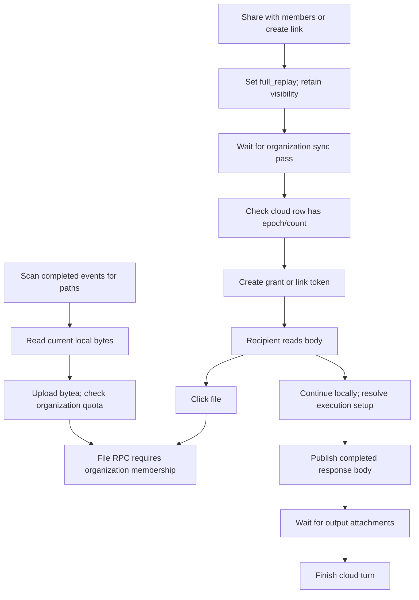

# Share Sessions: end-to-end design audit

Date: 2026-09-24 (UTC). This PR contains an audit and reproducible counterexamples, not product changes, production writes, or cloud configuration changes.

## Conclusions and evidence boundaries

The problem extends beyond a small attachment quota. Audience selection, file delivery, historical versions, body publication, and execution completion have inconsistent boundaries. Correctness comes before capacity tuning. **Files delivered in assistant answers must continue to upload automatically, including Markdown links, `[file:…]`, and shell-generated artifacts. Disabling those links is not a fix.**

Audit baseline: ORG2 `990ad8af6a3af8bb996902b858994a5b1978ef92`; cloud-infra `9e58753f63282589b27ce47491f96c88d18c01db`. Client paths below are relative to ORG2; SQL paths are relative to cloud-infra. These are source observations, not proof of the deployed version.

Evidence labels: **reproduced** means a controlled production-function or SQL counterexample; **call-chain confirmed** means source inspection without full UI/network execution; **unverified** requires a race or cross-instance experiment. A passing counterexample proves a defect condition, not product acceptance.

Completion criteria: cover publication, authorization, body reads, attachment discovery/upload/read, continuation, revocation, quotas, and lifecycle. Identify each authoritative source, trigger, and invariant. Keep historical remediation separate. Do not substitute UI hiding or swallowed errors for a source fix.

## Related implementation status

| PR                                                                                                                     | Status and scope                                                                                                                      |
| ---------------------------------------------------------------------------------------------------------------------- | ------------------------------------------------------------------------------------------------------------------------------------- |
| [#2111](https://github.com/org2AI/ORG2/pull/2111)                                                                      | Body hotfix merged; included in the audit baseline                                                                                    |
| [#2114](https://github.com/org2AI/ORG2/pull/2114)                                                                      | Independent attachment design merged; this audit adds the automatic-delivery and audience contracts                                   |
| [#2119](https://github.com/org2AI/ORG2/pull/2119)                                                                      | Replay attachment scheduling merged; does not cover the F5 continuation publisher                                                     |
| [#2121](https://github.com/org2AI/ORG2/pull/2121)                                                                      | Session loading feedback merged; attachment lazy loading is a separate entry                                                          |
| [#2122](https://github.com/org2AI/ORG2/pull/2122)                                                                      | Transcript round-trip fix merged; the two original 164-item records are still unavailable, so the reported incident is not reproduced |
| [#2123](https://github.com/org2AI/ORG2/pull/2123) / [infra #147](https://github.com/org2AI/ORGII-cloud-infra/pull/147) | F3 capability and server authorization implementations proposed; not deployed; server RPCs must be available first                    |
| [#2124](https://github.com/org2AI/ORG2/pull/2124)                                                                      | F10 error classification, identity partitioning, and bounded setup memory proposed                                                    |
| [#2125](https://github.com/org2AI/ORG2/pull/2125)                                                                      | Closed without merging: excluding assistant links breaks normal delivery and must not return as an F2 fix                             |
| [#2127](https://github.com/org2AI/ORG2/pull/2127)                                                                      | F9 loading shell, error classification, and in-place retry proposed; based on #2123                                                   |
| [#2128](https://github.com/org2AI/ORG2/pull/2128)                                                                      | F5 durable continuation queue and continuation-specific F6 recovery proposed; no immutable snapshots or replay migration              |

Recheck status before integration. The following current-flow and finding sections describe the audit baseline; implementation progress is tracked above. Merged does not mean released, and a backend PR does not mean deployed.

## Baseline flow



Body persistence, attachment availability, and agent completion are separate states. None can stand in for the others.

## Findings

### F1 · P1 · Targeted sharing can widen the full-text audience — reproduced

**Authority and writer:** `CloudSessionShareDialog/sharePreparation.ts:25` calls `applyCloudReplaySharePolicy`, raises access mode to full replay, and preserves visibility. `org2CloudAccessSettings.ts:188` defaults visibility to `org`. `useCloudShareOrgSectionModel.ts:282` publishes before creating the grant. Paths are under `src/features/Org2Cloud/`.

**Trigger:** sharing previously unshared content with one selected member can produce `full_replay + org`, granting other members full-text access through organization visibility. Probe 1 proves the policy result, without creating a production share.

**Invariant:** explicitly choose the final full-text audience when raising the content level. Existing organization-wide full replay may remain, but the UI must explain it. Organization-visible metadata must not silently become organization-visible body text. Publication and grant creation must use the same intended audience.

**Historical remediation:** inventory shares promoted from off/metadata-only to organization-wide full replay, then let owners confirm any narrowing. Do not silently revoke legitimate shares.

### F2 · P1 · Automatic delivery lacks a binding to captured file content — candidate reproduced; capture gap

**Writer:** `sessionSharedFileCandidates.ts:54` collects completed assistant links, `[file:…]`, and successful write/edit paths; `syncSessionSharedFiles.ts:54` reads local bytes during sync. Both are under `src/features/Org2Cloud/`. File open/stat capability scope in `src-tauri/capabilities/default.json` is not a workspace containment guarantee.

Probe 3 makes `[diagnostics](/outside-workspace/private-config.txt)` an upload candidate. Candidate discovery itself is required behavior, not evidence of leakage. The probe reads no private file. The missing boundary is a delivery record and immutable capture: sync later reopens a path without proving those bytes are the delivered version. Missing paths also lack durable per-delivery failure state.

**Invariant:** assistant Markdown and `[file:…]` links in shared sessions are automatic delivery entries. Shell and script artifacts work without a `write_file` allowlist or manual attachment. Bind source session, response event, sender identity, actual file, capture time, hash, and bytes to an immutable attachment ID. Upload the captured object rather than reopening the source path. Attachment access cannot exceed the session audience. Workspace containment or filename denylists cannot replace version provenance.

**History:** inventory provenance and audience without assuming missing evidence proves a leak. Existing uploaded immutable objects remain readable. Old links may attempt first capture of a readable current file, with capture time and an explicit unverified-history designation; never claim that it is the original historical version.

**Rejected approach:** #2125 removed assistant links and retained only selected write tools. It missed shell outputs and broke delivery. It is closed and must not be revived as a migration or defensive step. Regression tests must assert automatic candidate discovery plus captured immutable content, not an empty candidate list.

### F3 · P1 · Link bodies and files have different authorization — isolated SQL reproduction

Bodies support share tokens through `org2CloudSharesClient.ts` / `org2CloudBackendAdapter.ts`. `sharedSessionFilesClient.ts` omits that capability. Backend `0033_shared_session_files.sql:31` delegates to discussion readability; `0027_conversation_discussions.sql:30` requires membership.

A signed-in nonmember resolves a valid replay token but receives `ORG2_MEMBER_REQUIRED` for its attachment. This is an authorization mismatch, not simply quota or connectivity.

**Invariant:** body and file list/find/get operations use the same server-validated access context. Check attachment ownership by the authorized session/snapshot, token scope, expiry, and revocation. Do not publish public object URLs or require guests to join the organization.

### F4 · P1 · Historical links do not bind historical bytes — partially reproduced; call-chain confirmed

`sessionSharedFileCandidates.ts` deduplicates by path, retaining the last event revision. `syncSessionSharedFiles.ts` reads current disk content. `SharedSessionFileViewer.tsx:73` omits revision; SQL 0033 path lookup chooses the newest `created_at`.

Probe 4 shows multiple writes to one path collapse to the last event. Old links can open later content; overwritten pre-sync content may never have been captured. Server immutability for an uploaded revision does not prove the initial bytes were correct.

**Invariant:** event references resolve an immutable attachment ID with captured hash, size, and provenance. Fix capture at the producing boundary before migrating transport and readers. Unrecoverable historical bytes remain explicitly unavailable; a newly shared current version is a new delivery, never a replacement historical original.

### F5 · P1 · Output uploads remain coupled to turn completion — call-chain confirmed

`SessionConversation/cloudConversationQueueAdapter.plane.ts:260` pushes body, awaits `syncSessionSharedFiles`, then signals. `conversationTurnRunner.ts:314` awaits publication; `cloudConversationQueueAdapter.ts:338` subsequently calls `coordination.finish`. Retryable failures enter recovery; other failures may terminate the turn as failed.

An attachment outage can hold or fail an already successful execution. #2119 covers replay, not this chain. Baseline queue tests were not a quota-to-finality integration test.

**Invariant:** body persistence and durable output handoff permit completion; output transmission changes only file state. Persist idempotent jobs independently. Required execution inputs remain a separate dependency and can explicitly block a run before execution.

### F6 · P2 · Local read failure is treated as attachment-pass readiness — reproduced

`syncSessionSharedFiles.ts:54–62` catches local read errors and continues, eventually returning true; `org2CloudSessionSync.ts:324–336` sets `sharedFilesVersion=1` from that result. Probe 5 returns ready with no upload after a temporary read failure.

**Invariant:** distinguish missing, changed, transient-read-error, and available states. Persist bounded recovery for retryable failures and explicit terminal absence. Scan completion does not mean every attachment is available. Fix F2 before historical rescans so a recovery mechanism cannot expand path rereads silently.

### F7 · P2 · Share success is not bound to the intended body version — reproduced and call-chain confirmed

`sharePreparation.ts:71–88` checks owner/fullReplay/epoch/count presence, not expected revision/hash/count. `org2CloudSyncEngine.sessionPushPass.ts:390–420` may log and swallow a session push failure. An organization pass draining is not a session publication receipt.

Probe 2 accepts an old epoch=1/count=0 row. Empty sessions are valid; the failure is inability to distinguish valid emptiness from stale publication.

**Invariant:** explicit sharing awaits a server persistence receipt for `publishSessionAndWait(expectedRevision)` before granting access to that snapshot or an explicit live cursor. Best-effort background passes are not publication transactions.

### F8 · P2 · Quotas protect resources but lack reclamation and explanation — SQL/source confirmed

SQL 0033 limits one file to 32 MiB, organization bytes to 1 GiB, and cumulative records to 1,000. Storage is bytea with base64 JSON RPCs; quota checks aggregate count/bytes under an organization lock. Versions and unreferenced leftovers consume quota. There is no session foreign-key cascade or identified attachment GC path. Isolated SQL confirms tombstoning a session leaves files in quota usage.

File size bounds request/memory/time costs; byte budgets protect storage cost; object counts protect metadata and abuse. These are necessary, but 1,000 cumulative versions is not a user-understandable file allowance. Keep the initial size guard, make capacity configurable with cost evidence, and treat metadata count separately. Base64 adds about one-third transport overhead before JSON and memory copies.

**Invariant:** expose used/reserved/reclaimable storage; separate blob, reference, and upload reservation. Reclaim only unreferenced objects under a defined recovery policy and reconcile counters. Refusing new uploads cannot block bodies or negate completed execution. Existing-file access, retention visibility, and new-upload admission are distinct.

Plan retention in `supabase/seed/plan_entitlements.sql` is a soft read window that may reopen after an upgrade. Do not physically delete data merely because it falls outside the current plan window. Inventory references and define grace/recovery before cleanup.

### F9 · P2 · File clicks lack immediate feedback and actionable failures — call-chain confirmed

`SharedSessionFileLink.tsx:29` and `SharedSessionFilesContext.tsx` lazy-load the viewer under `Suspense fallback={null}`. `SharedSessionFileViewer.tsx:87` collapses errors into a boolean and gives generic account/server/permission guidance without retry.

**Invariant:** clicking opens a lightweight visible shell with filename/source immediately. Distinguish pending upload, missing source, quota, permission, and connectivity; identify who can recover and allow relevant retry. Paused attachments must explain the pause, not ignore clicks. Keep loading demand-driven and bodies readable.

### F10 · P2 · Continuation recovery and remembered setup have overly broad boundaries — call-chain confirmed

`TeamCollaboration/forkSession.ts:209` clears remembered setup and reopens configuration for any `ForkOperationError`, including snapshot/replay/backend errors unrelated to local configuration. `forkSetupMemory.ts:3–12` keys only by repository scope, sharing `__no_repo__` for repository-less sessions. `savedAt` is stored without an enforced TTL, capacity, or identity/endpoint partition.

**Invariant:** bind setup to local profile, cloud identity/endpoint, and repository with bounded retention and validity checks. Reopen setup only for invalid configuration; retry download/snapshot errors in place. Initial selection of the recipient's directory, agent, account, and model remains necessary. No credential crossover was proven by this audit.

### F11 · P2 · Live/snapshot, expiry, and revocation promises are unclear — design gap

Full-replay overrides persist and may publish future events. Link creation omits `expiresAt`; SQL defaults to null. “One-shot” means the token plaintext is shown once, not single-use access. Revoking one grant leaves independent organization access intact. Guests revalidate on opening/focus/visibility return, without a defined maximum delay while continuously foregrounded.

**Invariant:** choose fixed snapshot or live updates; display audience, expiry, and effective grant sources. Define adjustable defaults and server rejection of subsequent protected reads after revocation, plus a bounded client revalidation strategy. Downloaded content cannot be recalled. Do not use high-frequency polling as a substitute for a contract.

## What the popup is

| Trigger                                                    | Surface                          | Assessment                                                |
| ---------------------------------------------------------- | -------------------------------- | --------------------------------------------------------- |
| Cloud file link click                                      | Shared-file preview modal        | Attachment entry, not an assistant message                |
| First local continuation or broad remembered-setup failure | Local continuation configuration | First use is valid; unrelated errors reopening it are F10 |
| Continuation requiring a checkout                          | Local checkout chooser           | Legitimate workspace selection                            |
| Reused setup, completed handoff, completed download        | Status/toast feedback            | Separate from preview and setup dialogs                   |

The exact popup observed by the user was not recorded. These mappings identify source entry points without pretending to identify an unseen frame.

## Delivery plan and automatic-file contract

Prioritize audience/capability correctness (F1/F3), immutable automatic delivery (F2/F4/F6), output-finality isolation (F5), publication receipts (F7), explanatory UI/setup (F9/F10), and explicit quota/retention/live-sharing contracts (F8/F11). Inventory affected history before narrow recovery; never reset transcripts, bypass consistency, or bulk-delete data to make symptoms disappear.

The complete target below is not implemented by #2128: that PR persists continuation candidates and still reads current paths.

1. **Discover deliveries.** Shared assistant answers, Markdown links, `[file:…]`, explicit attachments, and tool artifacts enter one pipeline. Shell/Python output is supported without manual attachment or write-tool allowlists. Read-tool output and paths quoted inside documents are not automatically assistant delivery. Use authoritative roles and structured attachments, not arbitrary transcript string scans. Resolve relative paths against the source event's working directory, never the recipient's filesystem.
2. **Record provenance.** Derive stable delivery identity from source session, response event, and attachment/link position. Record sender identity, source path, capture time, content hash, and size. Reads stay within the sender runtime's authorized access. Missing/inaccessible files retain explicit failure state.
3. **Capture immutable bytes.** At delivery acceptance, capture an immutable local blob or reuse a trustworthy tool-provided snapshot. Detect concurrent source changes and reject unprovable captures; checking timestamps alone is not a concurrency proof. Capture failure must not rewrite execution success as failure. Body persistence does not await network upload.
4. **Upload captured objects.** Outbox jobs read only captured blobs and retry idempotently by delivery ID/hash. Back off transient errors and pause on quota. Recover after restart under matching endpoint/user identity. Retries never reopen a path to replace captured bytes.
5. **Authorize and resolve.** Replay presentation maps event links to delivery IDs without rewriting canonical or provider-native message/tool text. Member and guest manifests/blobs use the session's server-enforced access context, expiry, and revocation. Unavailable files retain visible explanatory links.
6. **Explain recovery.** Distinguish capturing, pending_upload, uploading, available, paused_quota, source_missing, source_changed, and access_denied. Recipient retry refreshes remote availability; it cannot fix sender quota or source loss. A replacement is a new delivery, never a silent old-version overwrite.

New capture-enabled deliveries get explicit version semantics. Old uploaded content remains readable; first capture of current historical files is marked history-unverified. Migration must be bounded by scope/count and existing sharing policy, never a silent whole-machine scan. Upload budgets do not gate bodies or serve as read permissions for existing files.

| Acceptance scenario                                             | Required result                                                                            |
| --------------------------------------------------------------- | ------------------------------------------------------------------------------------------ |
| Shell report delivered only through Markdown                    | Automatic delivery record, snapshot, and upload; authorized recipient reads identical hash |
| `[file:…]` with no write tool                                   | Same behavior as Markdown                                                                  |
| Deliver A, overwrite same path, deliver B                       | Separate delivery IDs; old answer resolves A and new answer B                              |
| Rename/delete/overwrite after capture                           | Upload retry still reads captured bytes                                                    |
| Source changes during capture or historical original is missing | Explicit failure/history-unverified; no invented original; body/finality intact            |
| Quota, offline, process restart                                 | Readable body, completed turn remains completed, durable bounded file recovery             |
| Revocation or identity/endpoint switch                          | Protected reads rejected, stale results isolated, no recipient-local path fallback         |
| Canonical/native history alongside file projection              | Original text remains unchanged                                                            |

Implementation status: F3/F9/F10 and continuation-specific F5/F6 have proposed PRs. #2128 has 249 frontend and 8 Rust passing tests, without real desktop performance, dual-instance, or raw provider acceptance. F2/F4 capture/history mapping, replay F6, and F1/F7/F8/F11 remain open. Closing #2125 is not completion of F2.

## Architecture coverage

| Term            | Overloaded meanings                                             | Required separation                                |
| --------------- | --------------------------------------------------------------- | -------------------------------------------------- |
| share           | replay override, visibility, member grant, token                | Publication, audience, credential                  |
| session         | source, cloud replay, conversation root, local fork             | Source identity, cloud resource, local execution   |
| revision        | event time, replay epoch, file hash                             | Event revision, publication snapshot, content hash |
| ready/success   | pass drained, body persisted, scan complete, execution complete | Independent receipts/states                        |
| quota/retention | admission budget, read window, object lifetime                  | Admission, visibility, GC                          |
| one-shot        | Plaintext token shown once                                      | Not single-use access                              |

| Layer                | Coverage                                                  | Limit                                      |
| -------------------- | --------------------------------------------------------- | ------------------------------------------ |
| 1 Compile            | Related Vitest and audit probes                           | No full-repository compilation claim       |
| 2 Structure          | Replay and continuation attachment owners                 | No repository-wide dead-code sweep         |
| 3 Naming             | ready, one-shot, share                                    | No mechanical rename                       |
| 4 Semantics          | Terminology table above                                   | No unrelated provider/account redesign     |
| 5 Defaults           | org visibility, null expiry, read catch, broad fork catch | Actual production entries                  |
| 6 Boundaries         | Path delivery, authorization, execution finality          | Runtime provider core not rewritten        |
| 7 Understandability  | Publication, availability, revocation, quota              | Target contract, not implemented UI        |
| 8 Wire/SQL           | Missing capability, base64/bytea, ACL/quota probes        | No production HTTP/JWT capture             |
| 9 Initialization     | Member/link/replay/continuation entries                   | Helpers do not replace rendered actions    |
| 10 Resolver symmetry | Permission/version/endpoint/setup                         | Identity races need dedicated verification |

| Entry                   | Primary authority                             | Fallback/defect                                                   |
| ----------------------- | --------------------------------------------- | ----------------------------------------------------------------- |
| Member share            | Install override, wait pass, cloud row, grant | Retains visibility; rollback race unverified; F1/F7               |
| Link share              | Same, then token                              | Null expiry; F1/F7/F11                                            |
| Member body             | Identity plus session ACL                     | Replay epoch/cursor; preserve server authority                    |
| Guest body              | Token resolve/access context                  | Open/focus revalidation; F3                                       |
| File read               | ID or path with organization auth             | No token, latest path version; no recipient-local fallback; F3/F4 |
| Replay upload           | Candidate revision, local bytes               | Read errors skipped; F2/F4/F6                                     |
| Continuation output     | Body push, file sync, signal                  | File errors affect finality; F5                                   |
| Local continuation      | Remembered setup or explicit selection        | Broad failure clears setup; F10                                   |
| Viewer identity         | Bound identity/generation                     | Abort/reject stale reads; keep                                    |
| Share mutation identity | Refresh/authRef/default endpoint              | Await and rollback races unverified                               |
| Audit probes            | Mocked boundary/isolated schema               | No WebView, Realtime, or provider requests                        |

## Performance and lifecycle

| Area               | Verdict | Evidence                                                  | Change or reason kept                | Verification                   |
| ------------------ | ------- | --------------------------------------------------------- | ------------------------------------ | ------------------------------ |
| Background work    | fix     | Continuation awaits attachments                           | Independent durable owner            | Baseline call-chain inspection |
| Background work    | keep    | Existing event-driven sync/hidden skip/reset/retry bounds | No new continuous polling            | No CPU measurement             |
| Memory             | fix     | Unbounded setup registry                                  | Identity partition, cap, TTL         | Source inspection              |
| Scope/isolation    | fix     | Guest capability mismatch and setup keys                  | Shared authorization context         | Isolated SQL counterexample    |
| Rendering/hot path | fix     | Null lazy fallback/generic failure                        | Immediate shell and actionable state | No rendered recording          |
| Retained storage   | fix     | Tombstoned session files count toward quota               | References, GC, recovery window      | Isolated SQL counterexample    |

Required lifecycle cells: start/idle/active/shutdown; visible/hidden/focus; online/offline/backoff; sign-in/refresh/account/endpoint; organization removal/revocation; unopened/active/deleted/forked sessions; primary/direct secondary/launcher secondary; source create/append/rewrite/rotate/delete; old active row and restart; ingest/upload/download/reconnect. This baseline audit inspected ownership and selected functions/SQL, not those real-machine cells.

| Provider      | Raw transition                                 | App/UI state                | Topology/boundary                | Expected invariant                                      | Observed evidence                          |
| ------------- | ---------------------------------------------- | --------------------------- | -------------------------------- | ------------------------------------------------------- | ------------------------------------------ |
| ORG2 built-in | create/append/delete                           | cold/live/active/restart    | local/cloud/recipient            | Independent body, file, and execution states            | not run; continuation call-chain only      |
| Claude Code   | append/large append/compact/rotate/fork/delete | live/old row/rescan/restart | raw source/local/cloud/recipient | Stable identity/canonical revision and historical bytes | not run                                    |
| Codex         | append/large append/compact/rotate/fork/delete | live/old row/rescan/restart | raw source/local/cloud/recipient | Same; native consistency never bypassed                 | not run; original 164-item records missing |

**Performance verdict: fail at the audit baseline.** Setup registry growth is unbounded and output uploads still gate completion. Proposed fixes have their own evidence; neither 120 baseline tests nor unexecuted topology/provider cells justify a green verdict.

## Verification record

Commands executed during the baseline audit:

```sh
pnpm exec vitest run --config config/vitest.config.ts \
  src/features/Org2Cloud/CloudSessionShareDialog/sharePreparation.test.ts \
  src/features/Org2Cloud/CloudSessionShareDialog/useCloudShareOrgSectionModel.test.ts \
  src/features/Org2Cloud/sessionSharedFileCandidates.test.ts \
  src/features/Org2Cloud/syncSessionSharedFiles.test.ts \
  src/features/Org2Cloud/sharedSessionFilesClient.test.ts \
  src/features/Org2Cloud/SharedSessionFileViewer.test.ts \
  src/features/Org2Cloud/org2CloudSharesClient.test.ts \
  src/features/Org2Cloud/SessionConversation/cloudConversationQueueAdapter.test.ts \
  src/features/TeamCollaboration/forkSession.test.ts \
  src/features/Org2Cloud/org2CloudSyncEngine.sharedFiles.test.ts \
  src/features/Org2Cloud/useOrg2CloudGuestShareAccess.test.ts
pnpm exec vitest run --config docs/architecture-audit-2026-09-24/share-session-probes/vitest.config.ts
docker exec -i org2-pg-test psql -U postgres \
  -d org2_share_design_audit_20260924 -v ON_ERROR_STOP=1 -q \
  < docs/architecture-audit-2026-09-24/share-session-probes/guest-files.sql
```

Results: existing **11 files / 120 tests passed**; counterexamples **1 file / 5 passed**; isolated SQL confirmed `ORG2_MEMBER_REQUIRED` and retained quota objects after tombstoning.

The isolated database used a schema-only copy plus entitlement seed, not user rows. SQL probes use BEGIN/ROLLBACK and require a disposable database. Only the audit database was removed after verification, not the original container/databases. An initial probe configuration accidentally inherited the global include; that process was stopped and the include narrowed. It is not counted as a passing run.

No production writes/deployment, account-login changes, real HTTP/JWT/Realtime verification, large quota load, desktop E2E, dual-instance/provider matrix, CPU/RSS measurement, or historical cleanup was performed. No extra desktop instance or popup recording was created. No production controls were modified.

The adjacent `share-session-probes/` files are fixed-baseline counterexamples, not desired-behavior CI tests. Source fixes must add opposite-invariant regressions at their producing boundaries. The English translation preserves these evidence limits; it does not rerun or extend the earlier acceptance record.
