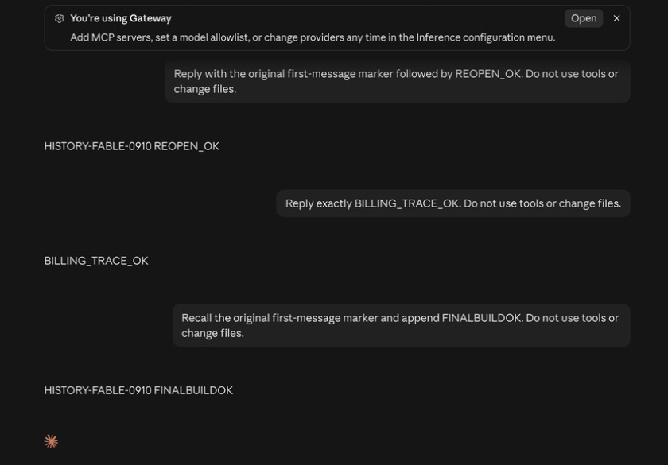

# Final local build acceptance — September 18, 2026

Runtime source: `3e41af7591883ae209b019b9f118bf513195efd1`, integrated with
`da9441a823`. The local macOS executable SHA-256 was
`c73756f867e3f96fa6e3cfbed014e78583b47a8833a1ddfc50b4d31bec5783c5`.
This was a local unsigned debug App, not an installer release or production deployment.

## Observed behavior

- After the user completed the macOS Keychain prompt, both existing packages
  loaded. Configuring Advanced Coding and Open app launched the isolated Claude
  gateway profile with the existing imported history and package-only turns.
- A real no-tool continuation in that history returned
  `HISTORY-FABLE-0910 FINALBUILDOK`, retaining the original first-message marker.
- Normal Quit followed by Restore original setup succeeded. Normal Claude
  reopened with its original Max account, and the original conversation still
  ended at message 18. Package-only messages were absent from the main history.
- All 93 original transcript hashes still matched the pre-import snapshot.
  The source index was not edited as part of this check.

The screenshot is cropped to the acceptance messages and gateway indicator;
private sidebar entries and account details are excluded. It records the real
UI, including its activity indicator. The completed receipt below establishes
completion of the main request.

## Billing

The transcript and completed receipt agree on time, model and usage: 27 input,
25 output, 93,273 five-minute cache-write tokens and zero cache-read tokens.
There is no direct gateway request-ID join in the transcript, so attribution is
based on those matching fields and the single positively billed request in the
window.

Frozen rate interpolation used buyer 7,500 and seller 5,500 basis points. An
independent sum-then-half-up recalculation produced buyer $0.875574, seller
$0.642088 and spread $0.233486. The four ledger legs reconcile:
$6.261060 hold = seller + spread + $5.385486 unused-hold return.
The local wallet moved from $6.568526 to $5.692952. The before balance was
reconstructed from immutable postings, not a complete pre-admission snapshot.
The window contained one positively billed request and 18 zero-charge requests;
no active request or extra positive auxiliary charge remained.

These are real model calls charged against previously authorized local test
credits, not evidence of real Stripe payment collection. The cache-write result
is not a cache-hit claim; earlier separate restart evidence covers cache reads.

## Source integration and limits

Production webpack, complete TypeScript checking, 205 targeted frontend tests,
scoped ESLint and the final Tauri build passed. The latest fetched develop
`8a4d5e0c6b` adds Git issue/PR timeline and menu changes plus the same Button-prop
fix already included here. `git merge-tree --write-tree HEAD origin/develop`
reported a clean merge. This runtime evidence remains pinned to the tested
source above; it does not claim a new binary of that later combined tree.

Earlier first-profile discovery still requires a normal Quit/Open on this
installed Desktop version. Windows runtime, long-duration/full-process resource
coverage, real Stripe flows and broader Codex acceptance remain separate gaps.
No PR was merged. Private transcripts, wallet identifiers and raw probes are not
included in this document.
