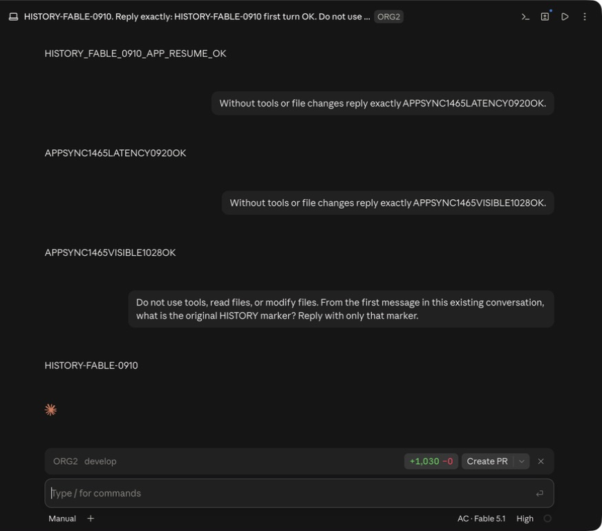

# Market Claude Desktop history on first launch

## Failure and source audit

On Claude Desktop 2.2553.1, an isolated Market profile loaded its Code roster at
22:10:24 with no catalog directory. ORG2 copied 93 rows at 22:10:25–22:10:28,
after Desktop had finished initializing. Desktop's session manager reads its
catalog during initialization; activating the existing process does not reload
it. The empty Code page was therefore compatible with complete files on disk.

The installed vendor source was inspected read-only, without executing bundled
code or calling private IPC. Relevant SHA-256 digests:

| Vendor bundle member                  | SHA-256                                                            |
| ------------------------------------- | ------------------------------------------------------------------ |
| `.vite/build/index.chunk-ChZ67Jhw.js` | `f707495cb51c99e7c74180278a1dd0798540136d1acde4a3ed3ce66d926038bf` |
| `.vite/build/index.chunk-l0PS_wmg.js` | `d7b669cc33878d3f660390397bb35a641fbe46b6a948ef11f2e31a2d129c0892` |

The local Gateway storage account is the installation UUID in `ant-did`, encoded
with standard Base64. The vendor reads an existing file or generates a random
UUID when absent. The local Gateway organization is
`00000000-0000-4000-8000-000000000001`. This is a local installation identity,
not an authenticated account or permission grant. The real profile's decoded
installation UUID matched the account directory used in Desktop's load log.

## Change and boundaries

For the audited release only, ORG2 creates the installation identity in its own
isolated profile if absent, then copies resumable history before dispatching
Desktop. Publication is atomic and does not replace an existing identity.
Existing `ant-did` must agree with vendor account metadata; a missing or
conflicting identity in an existing profile is rejected rather than replaced.
Existing organization metadata remains authoritative. Other
compatible releases retain the previous vendor-discovery path until their
namespace contract is verified. No credential, trust grant, permission mode,
or primary installation identity is inherited.

New discovery filenames use the Desktop session ID, which can differ from the
CLI transcript UUID. Desktop loads each discovered filename into memory using
the JSON session ID; opening/sending uses that in-memory record and the CLI
transcript ID. This is why existing mismatched filenames do not prevent the
initial list or continuation. Metadata saves, deletes, and exports use the
Desktop ID filename. Existing rows and transcripts are retained unchanged,
including older mismatched copies: a later vendor save can create the canonical
filename while leaving the legacy duplicate. Archive/delete behavior for those
old duplicate records remains unverified. The inspected user profile contained
46 rows with a legacy filename different from the Desktop session ID; those
records are not migrated by this fix. This change does not silently rename,
delete, or overwrite historical data.

A profile already running with an empty in-memory roster needs one normal quit
and reopen. ORG2 does not stop that process or interrupt current Code/Cowork
work. Subsequent cold starts see the prepared catalog. Pure terminal sessions
without a Desktop discovery row are outside this change.

## Lifecycle and verification

| Area            | Verdict | Evidence and decision                                                                          | Verification                                                                          |
| --------------- | ------- | ---------------------------------------------------------------------------------------------- | ------------------------------------------------------------------------------------- |
| Background work | keep    | Work remains in the explicit Open app action; no new timer or watcher                          | Source trace: prepare → import → dispatch                                             |
| Memory/I/O      | keep    | Existing 512-row, 1.5 GiB/pass, 128 MiB/transcript and 15-second copy bounds remain            | Existing boundary tests plus targeted regression suite                                |
| Scope/isolation | fix     | Identity and catalog are confined to the selected Market profile; primary catalog is read-only | First-open, invalid identity, link refusal, no-overwrite and repeated import fixtures |
| Rendering       | fix     | First roster is present before the vendor startup read                                         | Filesystem regression; existing-profile native cold start passed                      |

| Provider       | Raw transition                   | App state                                    | Boundary               | Expected invariant                                           | Evidence                                         |
| -------------- | -------------------------------- | -------------------------------------------- | ---------------------- | ------------------------------------------------------------ | ------------------------------------------------ |
| Claude Desktop | Initial history import           | First launch, no vendor config yet           | Local isolated profile | Discovery row and resumable transcript exist before dispatch | Regression fixture                               |
| Claude Desktop | Repeated import                  | Reopen                                       | Local isolated profile | Same identity, no duplicate row, no overwritten continuation | Regression fixture                               |
| Claude Desktop | Desktop ID differs from CLI UUID | Import                                       | Discovery writer       | Filename matches Desktop ID; transcript keeps CLI ID         | Regression fixture                               |
| Claude Desktop | Actual startup                   | Existing isolated profile, normal cold start | Vendor UI              | Existing history is visibly loaded and can be continued      | Combined-build native run passed; evidence below |

Performance verdict: native existing-profile cold start and continuation passed;
visible/hidden idle measurement remains pending. A completely empty profile's
first native launch has not been exercised in the GUI; its preparation is
covered by regression tests, not claimed as a separate GUI pass.

## Native acceptance — combined build

The debug acceptance build combines this PR commit `220aa7c002` with the
independent connection/model changes in #2055 (`4a4a4e7b4f`). The local
integration commit is `aff4fd02fa`; frontend assets were rebuilt from that tree.
Normal commit hooks, Clippy, the frontend build and the native app build passed.
The targeted native materializer suite passed 59 tests, with one existing ignored
test. The integration branch is a local acceptance artifact, not a merged release.

After the user authorized the new build's macOS Keychain access, the native
App connections page loaded Advanced Coding. The tester raised the ORG2 window
before using Open app, satisfying the launcher's foreground activation contract.
An earlier background invocation logged `caller_active=false`; it was not a
valid foreground activation acceptance run.

The existing isolated Claude Gateway profile was normally quit, then cold-started
through ORG2. Its UI showed the Gateway identity and daily Code history. Runtime
logs record 77 active sessions loaded at 23:29:43 local time, followed by 16
archived sessions at 23:29:44. The on-disk catalog had 93 records and 93 unique CLI
session IDs.

The tester opened the existing `HISTORY-FABLE-0910` conversation, read its 18
prior visible messages, and requested the original marker without using tools.
The next assistant response correctly returned `HISTORY-FABLE-0910`, with the
selected package model shown as `AC · Fable5.1`. Independent transcript inspection
found the new user/assistant pair only in the isolated profile; the primary
transcript did not contain either new message UUID. Primary configuration hashes
were first captured after this run, so this evidence does not claim they were
unchanged across the first launch.

After a second normal quit/reopen of both ORG2 and the isolated Claude, the
native UI still showed the historical conversation and the successful new
question/answer pair. The model remained `AC · Fable5.1`. At 23:42:19 the vendor
log again loaded 77 active and 16 archived records. The catalog remained at 93
files and 93 unique CLI IDs, with exactly one main Claude process for this
profile. Both target transcript hashes matched the first successful reply's
snapshot: the new pair stayed isolated and was not lost or imported twice.
Three primary configuration files also matched that post-reply baseline. This
proves stability over the second restart, not an unavailable before-first-run
baseline. ORG2 restored Advanced Coding without another Keychain block.

A repeated Open app from foreground ORG2 then reused the same Claude main
process and preserved the current conversation/input view. The profile still
had exactly one main process and 93 catalog files / 93 unique CLI IDs; no new
instance or duplicate catalog record was created.

The screenshot is a crop of the actual second-restart window, retaining the
conversation and package model while excluding unrelated sidebar history and
the account footer. No UI content was reconstructed. Visible/hidden idle
measurements and real billing reconciliation remain separate from the observed
completed response.

### First-launch and permission coverage

`isolated_market_first_launch_prepares_history_without_vendor_startup` calls the
production profile-preparation entry point with no vendor config. It checks
that the decoded installation identity selects the prepared catalog, the row
exists before vendor startup, inherited bypass mode becomes `default`, the
primary record stays unchanged, and repeated preparation preserves identity
without another record.

`first_open_has_resumable_rows_before_desktop_creates_its_account_config` also
checks pre-config transcript publication, stable repeated identity, mode 0600,
and rejection of missing or conflicting identity in an existing namespace.
Interrupted initialization, invalid/whitespace identities and symlink identity
files have dedicated rejection tests. The existing transcript-copy and catalog
backfill tests verify no credentials or stored permission grants cross profiles;
continuations and official records are not overwritten. These checks cover
initialization and grant inheritance statically, while a separate fresh empty
profile GUI run remains unperformed.

## Architecture review

The owning boundary is the native Open app dispatcher. Fresh and existing
profiles share the same transcript preparation and additive catalog writer;
only namespace discovery differs. Installation identity, authenticated identity,
Desktop session ID, and CLI transcript ID remain separate concepts. Unknown
Desktop releases use existing discovery behavior rather than assumed namespace
compatibility. Wire-shaped discovery rows retain only the existing descriptive
allowlist and reset permission fields. No core provider abstraction, network
protocol, retained cache, or frontend subscription changes. Compilation and
regression results are recorded in the pull request; native GUI evidence is
explicitly separate from filesystem publication evidence.
