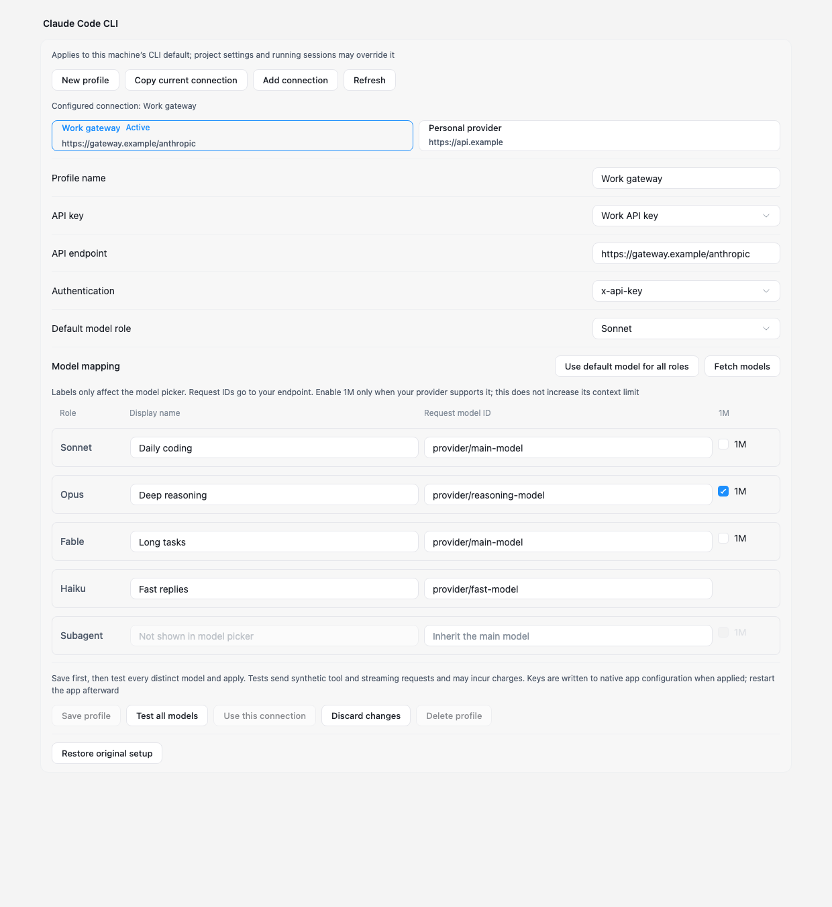
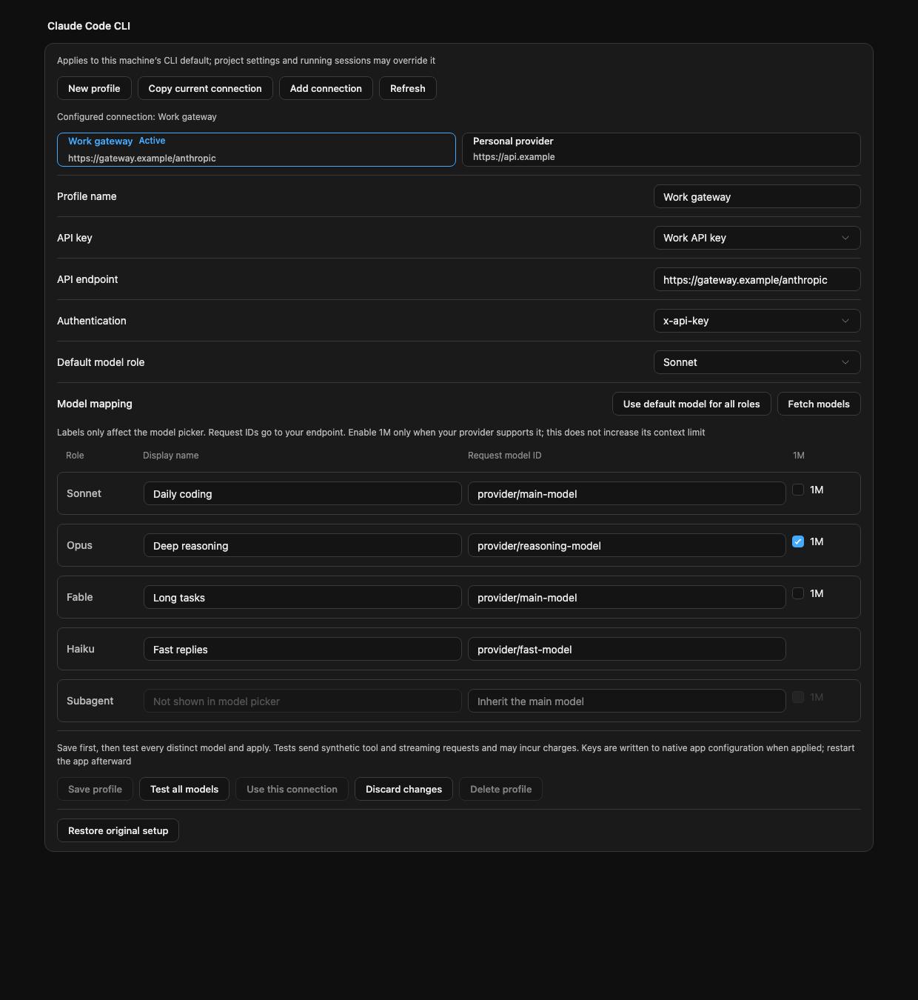
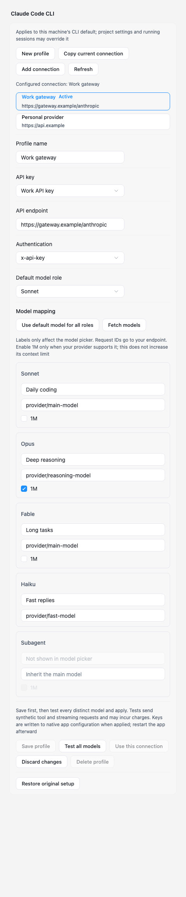

# Claude provider profiles

Settings → App connections has independent Claude Code CLI and Claude Desktop
profile catalogs. A saved profile references an existing Key Vault credential and
owns its endpoint, authentication scheme, default role, and model mappings.
Changing a profile never changes the shared key's endpoint or model catalog.

## Set up and switch

1. Choose the app and select **New profile**, or **Copy current connection**,
   which seeds a draft from the connection currently applied to that same app.
2. Name the profile, select an API key, and enter the Anthropic Messages endpoint.
   Select either Bearer or x-api-key authentication explicitly.
3. Set a request model ID for Sonnet, Opus, Fable, and Haiku. To use one model,
   fill the default role and select **Use default model for all roles**.
4. Optionally enter display names. Model IDs can always be entered manually;
   **Fetch models** reads the selected endpoint's `/v1/models` catalog on demand.
5. **Save profile**, **Test all models**, then **Use this connection**.
   Restart the target app. Saving alone does not change native configuration.

A CLI Subagent override is optional; leaving it empty lets Claude Code inherit
its main model. Desktop does not expose a separate Subagent control. Model
mapping uses native configuration and does not require ORGII to remain running.
Settings → App connections offers only profiles for Claude Code CLI and Claude
Desktop; the Codex editor stays there. The Claude Code single-model quick editor,
including its ORGII-managed proxy routing, remains in the agent detail view. An
existing quick connection applied to Claude Code still shows its key name in
Settings; editing it there means creating or copying a profile.

The selected editing card and the **Active** badge are separate. Saving edits to
an active profile shows **Saved changes pending** until those edits are tested
and applied. Unsaved edits block switching profile cards or app tabs; discard
explicitly to reload the last saved version. Active profiles cannot be deleted.

## Native compatibility

- CLI writes `ANTHROPIC_DEFAULT_{SONNET,OPUS,FABLE,HAIKU}_MODEL`, companion `_NAME`
  fields, and optional `CLAUDE_CODE_SUBAGENT_MODEL`. The main selection is a role
  alias, independent of the provider's actual request ID. Stale role descriptions
  and capability overrides are cleared on subsequent native switches.
- Desktop writes `inferenceModels` with exact request IDs, `labelOverride`,
  `anthropicFamilyTier`, and `isFamilyDefault`. The selected default role goes
  first; repeated IDs retain separate tier entries. Discovery is disabled in the
  generated native profile so the saved mapping is authoritative.
- The CLI's existing minimum version gate is 2.1.238; particular newer models can
  require a newer CLI. Desktop's local-profile gate remains 1.46388.1 on macOS and
  Windows. The installed macOS 1.46388.4 bundle contains the documented family-tier
  fields. Native Desktop sessions and Windows installation behavior were not
  exercised by this change.
- Native display behavior applies: CLI `_NAME` values affect gateways/third-party
  providers, not direct api.anthropic.com sessions. The label is never sent as the
  request ID.
- 1M is a user assertion, encoded as a CLI suffix or Desktop capability flag; it
  does not increase the provider's context window. The small connection test does
  not verify a million-token workload. Haiku has no 1M control.
- The selected key must support Anthropic Messages. This feature does not convert
  OpenAI Chat Completions or Responses into Anthropic Messages.
- Project, process-environment, and administrator policy can override user-level
  configuration. Nonempty CLI `modelOverrides` must be resolved before applying
  a profile, because they could rewrite its supposedly exact request IDs.

References: [Claude Code model configuration](https://code.claude.com/docs/en/model-config)
and [Claude Desktop configuration](https://claude.com/docs/third-party/claude-desktop/configuration).
The interaction follows CC-switch's role-mapping pattern; implementation uses
ORGII components and native adapters, without copied CC-switch code or an SDK.

## Tests, persistence, and recovery

Tests send synthetic tool and streaming requests for every distinct mapped model
and can incur provider charges. Identical IDs are tested once. Receipts expire
in 15 minutes and bind the entire profile revision, endpoint, auth method, and
credential. Editing a role, rotating the key, or changing apps requires retesting.
A profile test is cancellable and bounded to 225 seconds. Discovery has a separate
20-second bound, a 256 KiB response limit, and a maximum 1,000 IDs; unsupported or
paginated catalogs report an error and leave manual entry available. No redirects
are followed with credentials, and no workspace content is sent.

The version-1 `provider-profiles.json` catalog sits beside each app's existing
ORGII native-config manifest. It contains key references, never decrypted keys.
There are at most 64 profiles per app. Saving uses an atomic replacement and a
revision check; concurrent edits must reload. The applied profile snapshot is
stored in the existing transaction's manifest alongside the native file hashes.
Unknown fields in a version-1 catalog are tolerated on read (and dropped on the
next write) so an additive field from a newer ORGII does not hide existing
profiles after a downgrade; any other `version` is rejected.

Existing manifests without a profile snapshot continue to work. No database
migration is involved. **Restore original setup** uses the original transactional
backups; it leaves saved profiles available for future use. External native-file
edits still block apply/restore instead of being overwritten. Before downgrading
ORGII, restore the original setup; older versions do not understand the new
profile metadata. A malformed catalog is reported, never silently reset—recover
its file from a known backup before editing again.

## Visual evidence

These are headless static renders of the actual React settings components with
synthetic profiles, the shipped light/dark stylesheets, and compiled component
styles. They verify layout, not the running Tauri or Claude Desktop applications.
Rendered DOM tests additionally cover empty state, discovery failure, cancellation,
manual IDs, save/test/apply sequencing, and pending applied revisions.

