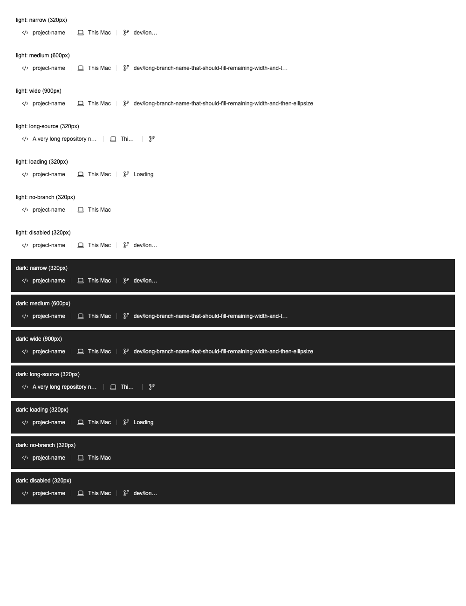

# SessionInfoLine UI audit

| Line                                                                                      | Element                            | Verdict          | Reason                                                                                                                                                                                                                                  | Suggested change |
| ----------------------------------------------------------------------------------------- | ---------------------------------- | ---------------- | --------------------------------------------------------------------------------------------------------------------------------------------------------------------------------------------------------------------------------------- | ---------------- |
| `src/components/PillGroup/index.tsx:146`                                                  | Flexible segment sizing            | keep with reason | Reuses the shared SelectorPill and standard flex/spacing utilities. The opt-in 48px minimum retains the 14px icon, 8px gap and 24px horizontal padding when labels compete for a narrow row. Other consumers keep their default sizing. | None.            |
| `src/features/SessionCreator/components/SessionInfoLine/SessionInfoPillGroup.tsx:10`      | Bounded row                        | keep with reason | The production wrapper owns the non-wrapping, maximum-width constraint and reuses PillGroup rather than duplicating controls or tooltip behavior. It is independently renderable for layout verification.                               | None.            |
| `src/features/SessionCreator/components/SessionInfoLine/buildSessionInfoSegments.tsx:183` | Branch width and existing controls | keep with reason | Only the branch opts into remaining-width sizing. Source/location retain their 180px caps; labels, keyboard controls, disabled states, tooltips and icons are preserved. No new colors or interactive primitives are introduced.        | None.            |

Verdict totals: **0 fix**, **3 keep with reason**, **0 abstract**.

## Rendered verification

The opt-in browser test renders the production segment builder, SessionInfoPillGroup, PillGroup and SelectorPill with the compiled production Tailwind stylesheet. Chromium verifies 14 cases: 320/600/900px widths, long source names, loading, no branch and disabled controls in light/dark token contexts. It asserts one row, bounded controls, narrow ellipsis and branch labels wider than 180px when space permits.

Temporarily restoring the wrapping row and removing the branch's flexible sizing makes the same browser test fail on `light-narrow`. Restoring the fix passes all 11 tests in the three targeted files. The default Node-only suite explicitly skips the browser case unless `ORGII_HEADLESS_CHROME` is supplied; missing rendered measurements fail once it is configured.

Set `ORGII_HEADLESS_CHROME` to an installed headless Chromium executable, and optionally set `ORGII_LAYOUT_ARTIFACT_DIR` to retain HTML/PNG evidence, then run:

```sh
node node_modules/vitest/vitest.mjs run --config config/vitest.config.ts src/components/PillGroup/index.test.ts src/features/SessionCreator/components/__tests__/buildSessionInfoSegments.test.ts src/features/SessionCreator/components/__tests__/SessionInfoPillGroup.test.ts
```



The screenshot is a rendered component fixture, not the full Tauri app. Packaged WebKit behavior and full-app keyboard/selector interactions were not rerun. This change introduces no production listener, timer, retained collection or background task and makes no runtime-performance claim.
