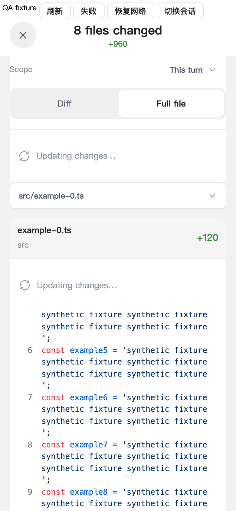
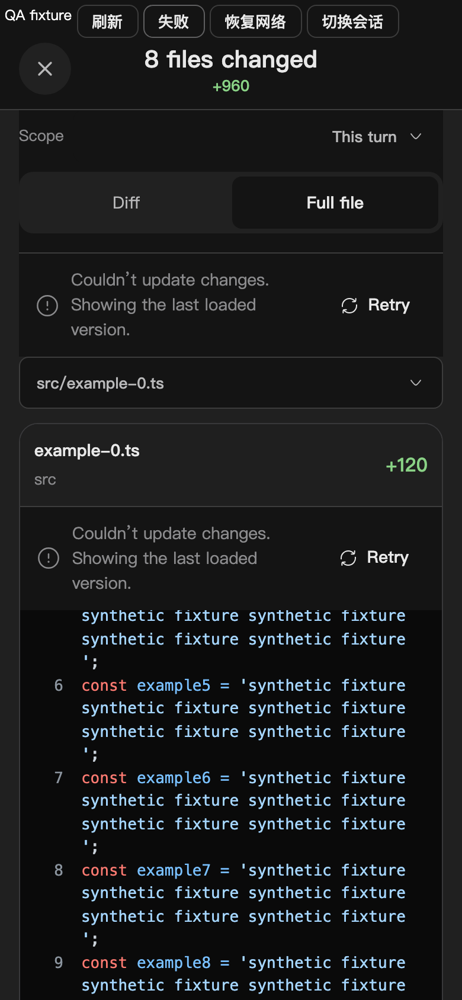

# MobileChangeReview refresh UI audit

| Line                             | Element                        | Verdict          | Reason                                                                                                                                               | Suggested change                                                           |
| -------------------------------- | ------------------------------ | ---------------- | ---------------------------------------------------------------------------------------------------------------------------------------------------- | -------------------------------------------------------------------------- |
| `MobileChangeReview.tsx:338`     | Manifest/detail render gates   | fix              | A revision is a request generation, not a different resource; replacing successful content with loading/error unmounted the reader                   | Retain the subtree for the same resource and show refresh status beside it |
| `MobileChangeReviewState.tsx:41` | Refresh/error notice and retry | keep with reason | Extends the existing localized, tokenized status component and shared Button; read-only previous content remains explicitly identified after failure | None                                                                       |
| `MobileChangeReview.tsx:455`     | Offscreen minimum height       | keep with reason | A measured geometry value cannot be a design token; only a number is retained when the heavy editor/snapshot is evicted                              | None                                                                       |

Verdict totals: **1 fix**, **2 keep with reason**, **0 abstract**.

No production raw button, substitute clickable element, or native form control was introduced. Existing shared Button presentation was inspected. Refresh notices use existing theme colors, type, spacing and touch-target tokens. New strings exist in English and Chinese.

## Rendered browser evidence

Synthetic QA fixture mounts the production MobileChangeReview and CodeMirror editor at 390 × 844 in Chromium. Both light and dark themes passed with no page errors. Pending, error and retry retain the same editor DOM node and scrollTop 340. An expanded section measured 1877.25px before and after viewport eviction; its heavy patch rows were absent offscreen and its min-height was 1877.25px. This is browser evidence, not a native iOS performance measurement.

