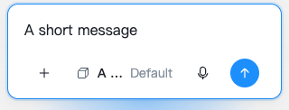
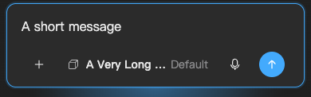

# Mobile token adoption — implementation follow-up

Implements the authorized sweep in `MobileRemoteTokenCoverage.md`. Three subagents handled page typography, chat/composer, and overlays; the primary agent integrated dropdown tokens, spacing and appearance synchronization. Existing unrelated worktree edits were preserved. No commit, PR or release was created.

| Line / source                                                                                                                                                                    | Element                                        | Verdict          | Reason                                                                    | Change                                                                                                                                                                                                            |
| -------------------------------------------------------------------------------------------------------------------------------------------------------------------------------- | ---------------------------------------------- | ---------------- | ------------------------------------------------------------------------- | ----------------------------------------------------------------------------------------------------------------------------------------------------------------------------------------------------------------- |
| `src/modules/MobileRemote/screens/ConnectionErrorScreen.tsx:34`                                                                                                                  | Connection error color                         | fix              | `text-error` had no theme mapping                                         | Use danger semantic color                                                                                                                                                                                         |
| `src/modules/MobileRemote/screens/settings/SettingsTab.tsx:160`; `src/components/Dropdown/tokens.ts:132`; `src/components/ChatBubble/index.tsx:108`                              | Page and shared-control typography             | fix              | Desktop inline/descendant font sizes defeated inherited mobile typography | Adapt page controls through supported style props; add optional typography/class props to shared components; Dropdown uses CSS variable fallbacks preserving Desktop defaults; Settings error uses mobile caption |
| `src/modules/MobileRemote/screens/QRScanScreen.tsx:133`                                                                                                                          | Pairing input                                  | fix              | Default Textarea font and focus behavior were Desktop-sized               | Mobile body font/leading at the textarea element and existing preventMobileFocusZoom option                                                                                                                       |
| `src/modules/MobileRemote/components/composer/mobileComposerResponsive.scss:30`                                                                                                  | Composer touch density                         | fix              | Attachment, voice and send controls retained 28px geometry                | 44px minimum targets, auto toolbar height, shrinking model trigger; glyph size unchanged                                                                                                                          |
| `src/modules/MobileRemote/mobileOverlays.scss:6`; `src/scaffold/ModalSystem/index.tsx:433`                                                                                       | Mobile overlays                                | fix              | Independent masks, shadow, radius and typography drifted                  | One Remote-entry presentation contract; preserve shared lifecycle and Desktop fallbacks. See MobileOverlayPresentation.md                                                                                         |
| `src/modules/MobileRemote/mobileDiscovery.scss:19`; `src/modules/MobileRemote/mobileChrome.scss:106`; `src/modules/MobileRemote/components/transcript/mobileToolPreview.scss:35` | Equivalent spacing consumers                   | fix              | Repeated values duplicated the existing scale                             | Replace equivalent 4/8/12/16px spacing/radius consumers with existing mobile spacing tokens; preserve special geometry                                                                                            |
| `public/mobile.html:53`; `src/modules/MobileRemote/platform/mobileAppearancePort.ts:11`                                                                                          | Browser chrome                                 | fix              | Static light theme-color diverged from resolved appearance                | Read the loaded semantic canvas; update metadata at startup, on appearance application and late stylesheet load                                                                                                   |
| `apps/remote-ios/src-tauri/src/lib.rs:120`; `apps/remote-ios/src-tauri/tauri.conf.json:22`                                                                                       | Native WebView canvas                          | fix              | Fixed dark native background could diverge from the page                  | Remove fixed background; forward the loaded RGB canvas to a caller-scoped native command. The pinned Wry iOS implementation supports the setter even though Tauri's JS plugin exposes it only on Desktop          |
| `_mobileUiTokens.scss`; `_mobileTypography.scss`                                                                                                                                 | Token definitions                              | keep with reason | Definitions own concrete defaults                                         | Keep numeric values at the owning scale                                                                                                                                                                           |
| `mobileChrome.scss:7`                                                                                                                                                            | Theme-derived glass/canvas aliases             | keep with reason | These derive from shared theme colors                                     | Preserve palette ownership                                                                                                                                                                                        |
| `components/transcript/mobileToolPreview.scss:69`                                                                                                                                | CodeMirror/diff bridge                         | keep with reason | Editor and diff colors have distinct semantic contracts                   | Preserve code syntax and editor bridge                                                                                                                                                                            |
| `mobileDiscovery.scss:334`                                                                                                                                                       | Round navigation typography                    | keep with reason | Explicit existing product choice to reuse Desktop round typography        | Preserve intentional shared treatment                                                                                                                                                                             |
| `screens/QRScanScreen.tsx:106`; `src/mobileRemoteNativeEntry.tsx:21`                                                                                                             | Camera canvas and startup fallback             | keep with reason | Media background and style-load failure fallback are deliberate           | Retain readable fallback colors                                                                                                                                                                                   |
| `mobileViewport.scss:75`                                                                                                                                                         | Safe areas, hairlines, media bounds and glyphs | keep with reason | Layout/content constraints are not duplicated UI palettes                 | Retain intentional geometry                                                                                                                                                                                       |
| `components/composer/MobileComposerAttachmentButton.tsx:39`                                                                                                                      | Native file input                              | keep with reason | Hidden browser file picker boundary                                       | Preserve; all new/modified React actions use shared controls                                                                                                                                                      |

Paths without `src/` above are relative to `src/modules/MobileRemote/`.

Verdict totals: **8 fix**, **7 keep with reason**, **0 outstanding abstract** within the approved audit findings. This is not a claim that every numeric literal in the application was removed.

## Rendered regression found during the sweep

Increasing model-menu text exposed two real narrow-screen defects: the consumer returned null until positioned, preventing the engine from measuring the actual panel on its first pass; fixed option height overlapped long model/account labels. The consumer now mounts hidden while positioning and uses intrinsic option height with token padding. Existing positioning ownership, observer cleanup, keyboard behavior and close lifecycle remain intact. A regression covers first opening, closing and reopening.

## Appearance lifecycle and ownership

- Persisted `theme` preference remains owned by MobileThemeProvider/runtime storage. The active global stylesheet owns palette values. Browser metadata and the native canvas are derived mirrors, not another stored palette.
- Startup resolves the existing preference, enables the stylesheet and applies its canvas when available. Before CSS is available, no RGB value is invented. The native launch storyboard retains its existing system-background behavior.
- Explicit and system-driven changes update root semantics and metadata. Native writes are serialized with one in-flight write plus one latest pending color; rapid changes cannot leave an older queued color as the final result.
- Late stylesheet load reads the **current root token**, not the scheme associated with the load event. Listeners are removed with the existing appearance subscription; pending work is cleared. One already-issued native write cannot be cancelled, but no follow-up queue survives cleanup.
- Failures from explicit/native apply reach existing theme error state; another application retries. A late startup failure cannot overwrite a newer successful preference. Persistence failure keeps the existing preference.
- No polling, timers or independent appearance observer was added. The existing system/visibility subscriptions remain the event owners; stylesheet load listeners are bounded by the two theme links.

## Architecture and performance review

Architecture layers 1–10 were considered: compilation (1), duplicate palette removal and actual callback wiring (2), names and canvas/appearance semantics (3–4), unchanged Desktop defaults and absent-token fallback (5), mobile adaptation boundaries (6), readable ownership (7), native IPC (8), browser/native startup parity (9), and consistent stylesheet→metadata/native resolution (10). Unrelated session, sync, database and provider architecture were not changed or re-audited.

Native IPC is `mobile_apply_canvas_color { color: [r,g,b] }`; Rust's `[u8; 3]` rejects malformed length/channel ranges and the injected Webview scopes the setter to the caller. No credentials, user content, extra native permissions, dependencies or persistence migrations are involved. Rollback consists of reverting this callback and its native command together. The implementation relies on the locked Tauri/Wry versions; a runtime upgrade should repeat iOS verification.

| Area            | Verdict | Evidence                                                                      | Change or reason kept                                           | Verification                                            |
| --------------- | ------- | ----------------------------------------------------------------------------- | --------------------------------------------------------------- | ------------------------------------------------------- |
| Background work | keep    | Two bounded stylesheet listeners, existing system/visibility lifecycle        | No polling or new timers                                        | Load/cleanup tests; source lifecycle review             |
| Memory          | keep    | One native promise and one pending RGB tuple                                  | Coalesce intermediate colors                                    | Rapid-write test                                        |
| Scope/isolation | fix     | Current root theme, caller-scoped Webview, generation-guarded provider status | Avoid stale load/startup results and out-of-order native writes | Late load, stale failure, native bridge and retry tests |
| Rendering       | fix     | Existing dropdown measurement requires a mounted panel                        | Hidden mount enables the existing first-pass measurement        | First-open/reopen regression and 320px rendered fixture |

Performance verdict: **pass for bounded ownership and cleanup**. No idle-CPU improvement or device performance measurement is claimed.

## Verification

- `pnpm test src/modules/MobileRemote src/components/Dropdown src/components/Placeholder src/components/PageNotice src/components/ComposerBar src/components/Voice src/components/ChatBubble src/components/ModelSelectorPill src/components/PermissionPrompt src/components/BottomSheet src/scaffold/ModalSystem`: **120 files / 918 tests passed**. Earlier failures identified an old literal-class assertion and two browser-dependent tests lacking DOM setup; these were corrected, not suppressed.
- The final test-only lint cleanup of MobileThemeContext.test.ts was rerun separately: **3 tests passed**.
- `pnpm exec tsc --noEmit --pretty false`: passed. Targeted ESLint on changed source/test files: passed. `git diff --check`: passed.
- `pnpm build:mobile-native`: production Webpack build passed.
- `cargo check --manifest-path apps/remote-ios/src-tauri/Cargo.toml --target aarch64-apple-ios-sim --lib --no-default-features`: passed. An earlier default-feature check required the frontend build output; no source error was reported.
- `../../../node_modules/.bin/tauri ios dev 'iPhone 17 Pro' --no-watch --config '{"build":{"beforeDevCommand":null}}'` from the native crate: rebuilt, installed and launched the real app in the existing iOS simulator. Sessions and Settings pages were observed; this was not a replacement preview app.
- Overlay rendered fixtures: **12 cases passed**, covering light/dark, Desktop/mobile defaults, and Profile/fullscreen exceptions at 320/390px. Representative capture: [light modal](assets/mobile-light-modal.png).
- Composer fixtures used actual bundled components/styles in an isolated browser, with microphone APIs stubbed. At 320px, attachment/voice/send/recording targets are 44×44px; the model panel stays within 24..312px, including dark mode with root font 20px. Body/input/menu font follows 16→20px; long labels do not overlap; document width remains 320px; zero page errors. Representative captures: [light composer](assets/mobile-light-composer-320.png), [dark model menu at 20px root font](assets/mobile-dark-model-menu-320.png).
- Inspected changed React controls for native-button/substitute-clickable bypasses; none introduced. Native hidden file input and test fixture buttons remain legitimate boundaries.

## Remaining limits

Physical-device keyboard/focus zoom, VoiceOver, OS launch-screen timing and screenshots of every page were not verified. Native compilation/install and bridge tests do not prove absence of every cold-launch color flash, especially while OS launch UI precedes the persisted in-app preference. Simulator UI automation became intermittently unavailable after observing Sessions/Settings; remaining interaction measurements used the isolated real-component fixtures. No account data, pairing, session records or distribution channel was changed.

## PR integration verification

The UI changes were isolated onto the current develop base for review. Session identity preparation and generated-prompt normalization are separate PRs and are not dependencies of this UI branch. The aggregate pre-integration evidence above describes the combined development worktree; after separation, the same listed Vitest command passed **119 files / 879 tests**. Changed-file ESLint also passed on this isolated branch. A second source review found no blocking appearance, shared-control compatibility, or navigation defect.

The committed screenshots are synthetic fixtures of the real components captured before isolation, not installed-app screenshots or a substitute app. They contain no account or session content. Physical-device checks and complete loading/empty/error visual coverage remain outstanding.

## Composer visual balance follow-up

The submit button retains a 44px hit target but paints a 32px circle using a transparent inset derived from the existing mobile spacing token. The model trigger uses the 14px secondary typography token; the textarea retains the 16px body token. Shared Desktop controls and model-menu text sizes are unchanged.

Rendered real-component fixtures confirmed the 44px hit target, 32px painted circle, 14px model label, and no horizontal overflow at 320px; light and dark captures were inspected, with an additional 390px dark capture. `pnpm test src/modules/MobileRemote/components/composer/MobileComposer.test.ts src/modules/MobileRemote/components/composer/MobileModelPicker.test.ts` passed 14 tests. Scoped ESLint, Prettier and diff checks passed. The actual installed simulator app was relaunched against the updated development bundle.

