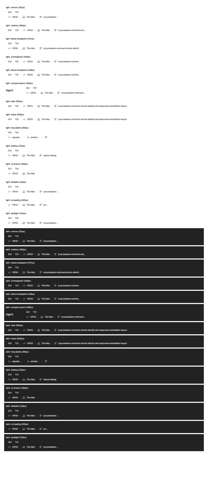

# SessionInfoLine UI audit

| Line                                                                                      | Element                           | Verdict          | Reason                                                                                                                                                                                                                                             | Suggested change |
| ----------------------------------------------------------------------------------------- | --------------------------------- | ---------------- | -------------------------------------------------------------------------------------------------------------------------------------------------------------------------------------------------------------------------------------------------- | ---------------- |
| `src/features/SessionCreator/components/SessionInfoLine/SessionInfoRow.tsx:29`            | Bounded information row           | keep with reason | Container width owns layout in both split and focused chat. Uses existing spacing utilities, no viewport or workstation-state duplication.                                                                                                         | None.            |
| `src/features/SessionCreator/components/SessionInfoLine/SessionInfoRow.tsx:31`            | 28rem container breakpoint        | keep with reason | Local composition threshold reserves space for the existing GUI/TUI switch and three selectors. Below it the switch moves above the selectors and the leading divider disappears. No shared breakpoint matches this composition contract.          | None.            |
| `src/features/SessionCreator/components/SessionInfoLine/SessionInfoPillGroup.tsx:15`      | Selector minimum width            | keep with reason | Uses existing `min-w-12` utility to retain icon/padding space while long labels shrink. Existing PillGroup → SelectorPill → Button owns native button semantics, refs and keyboard behavior.                                                       | None.            |
| `src/features/SessionCreator/components/SessionInfoLine/buildSessionInfoSegments.tsx:136` | Full-value tooltip above shortcut | keep with reason | Reuses Tooltip and KeyboardShortcutTooltipContent. Bounded width and wrapping expose complete values after ellipsis without clipping the composer. Three short local value/shortcut compositions do not justify a new cross-module control family. | None.            |

Verdict totals: **0 fix**, **4 keep with reason**, **0 abstract**.

Scope: session-information composition only. Shared PillGroup, SelectorPill, Button, inputs, workstation state, and domain selection commands are unchanged. The changed production files introduce no native buttons, clickable substitutes, or form primitives. The existing SelectorPill custom Button layout remains appropriate for its icon/chevron swap and compound label geometry.

## Ownership and lifecycle

Repository, location, and branch names are valid input props. The original overflow was a presentation constraint defect; no persisted records or producing write paths require remediation. The row wrapper now owns the width constraint.

Narrow/wide presentation is derived directly from CSS container width. Workstation visibility and splitter dragging change that width without introducing listeners, timers, caches, or a second state owner. CSS rearranges the same controls. Existing selection, disabled/loading, dropdown refs, and composer draft ownership remain unchanged.

Architecture review covers compilation, live helper wiring, naming, optional-leading fallback, and local ownership (layers 1–7). Wire serialization, session initialization, and resolver precedence (layers 8–10) are unchanged and require no additional checks for this presentation change. No background-work change triggers a performance lifecycle audit; no runtime performance improvement is claimed.

## Verification

- `pnpm exec tsgo --noEmit --pretty false` — passed on the final production/test files
- `pnpm exec vitest run --config config/vitest.config.ts src/features/SessionCreator/components/__tests__/buildSessionInfoSegments.test.ts` — 4 tests passed
- `ORGII_HEADLESS_CHROME='/Applications/Google Chrome.app/Contents/MacOS/Google Chrome' ORGII_LAYOUT_ARTIFACT_DIR=/tmp/orgii-session-info-after pnpm test -- src/features/SessionCreator/components/__tests__/SessionInfoLine.test.ts src/features/SessionCreator/components/__tests__/SessionInfoPillGroup.test.ts` — 6 tests passed without skips; 56 full-row layout measurements plus 14 inner-group scenarios
- Production-file ESLint and formatting — passed; TypeScript AST inspection found no native action/form controls or clickable substitutes in the four production files
- `git diff --check` for the scoped files — passed
- Visually reviewed Chrome screenshot of light/dark narrow, wide, compact, long-label, loading, disabled, no-leading and no-branch fixtures

Browser coverage includes the production full information line and GUI/TUI switch, constrained regular and compact hosts, 447/448/449px transitions, and 14 successive widths returning to 900px. Controls, rendered icons, and separators stay contained; no horizontal scroll appears and the final branch width matches the initial width. The fixture exports client-rendered React markup to Chrome for geometry; it does not test React event handlers in Chrome.

Isolated baseline comparison reconstructed the original HEAD wrapper around the same rendered controls without reverting production files. It produced overflow in 44 of 56 measurements (including the 320px narrow case); the pre-existing bounded working-tree wrapper avoided overflow but retained 48 wrapping/divider assertion failures. The fixed layout passes all 56 measurements. The original-HEAD Chrome process timed out after emitting its measurement DOM; these baseline measurements are diagnostic evidence, not a passing test run.

Full application verification is currently unavailable: the running development host serves its HTML but returns HTTP 404 for `main.js`. Component width allocation tests are not evidence of a native workstation-toggle E2E run.

## Visual evidence

PR isolation verification: all 10 tests across the three scoped suites passed again on the latest `origin/develop` base with Chrome enabled and `ORGII_LAYOUT_ARTIFACT_DIR=/tmp/orgii-session-info-pr`. Typecheck, scoped ESLint/Prettier, diff whitespace checks, and `node scripts/quality/check-test-placement.mjs` passed in the isolated worktree. The screenshot above is from that run.
