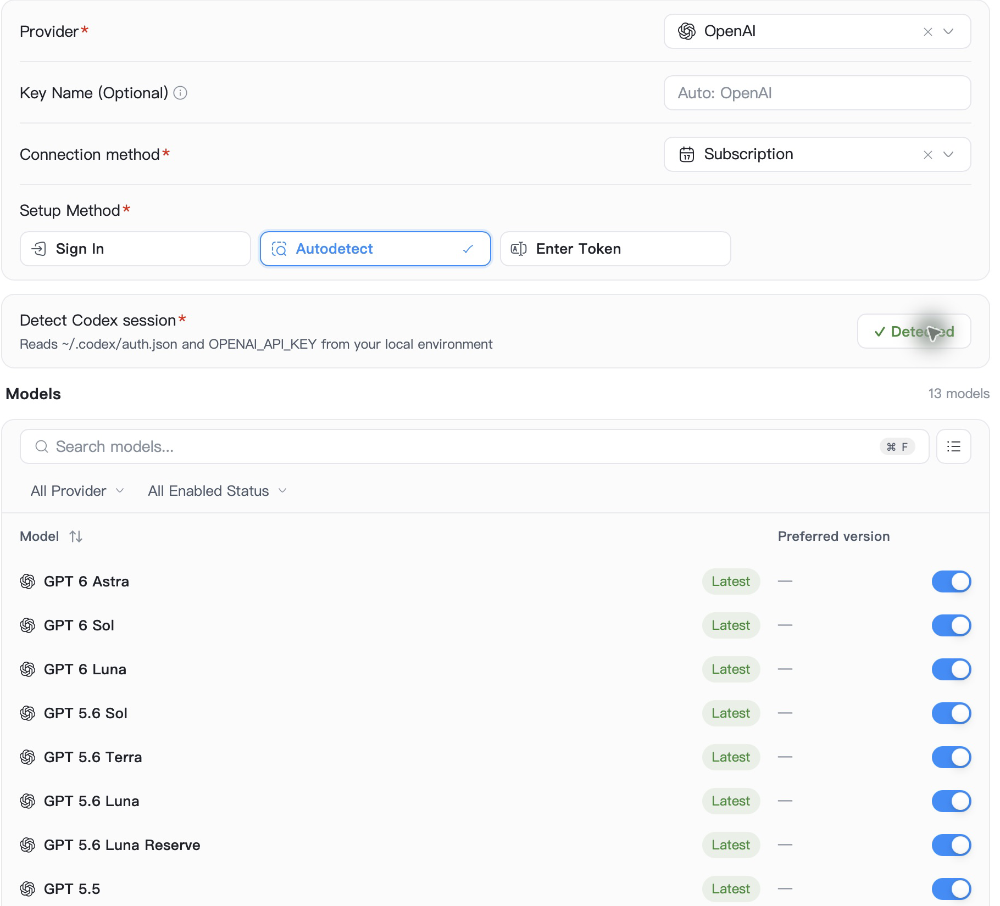
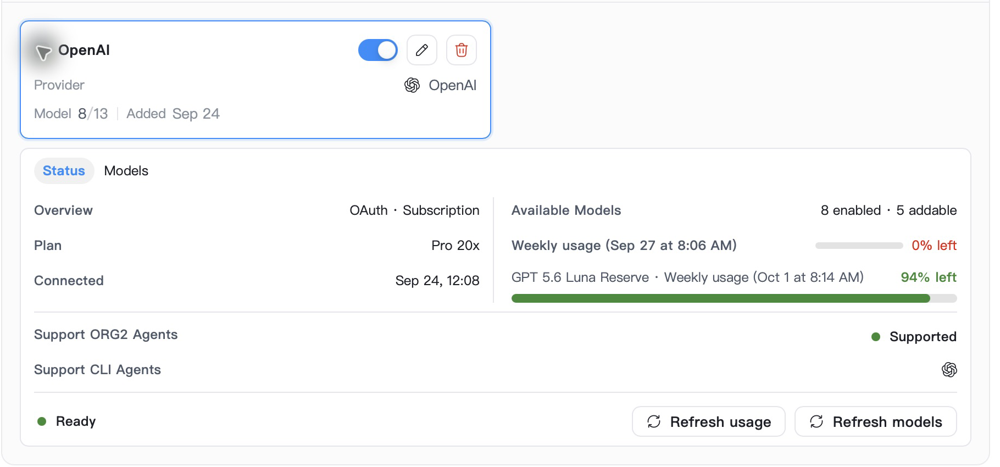
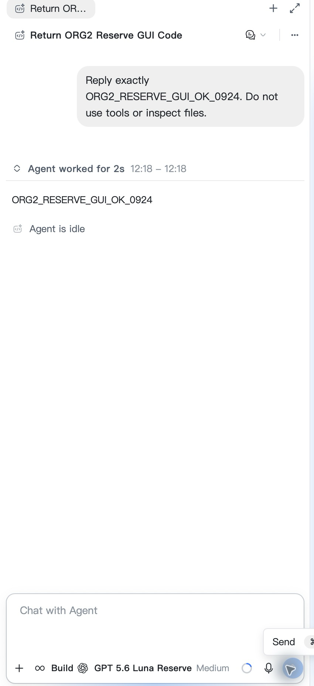

# Luna reserve UI audit

| Line                                                                          | Element                    | Verdict          | Reason                                                                                                 | Suggested change |
| ----------------------------------------------------------------------------- | -------------------------- | ---------------- | ------------------------------------------------------------------------------------------------------ | ---------------- |
| `src/components/ModelQuotaDisplay/index.tsx:22`                               | Reserve quota meter        | keep with reason | Reuses shared QuotaBar; token-based gap and flex layout; visible model/window label and reset time     | None             |
| `src/features/KeyVault/AccountInlineDetails.tsx:335`                          | Model quota section        | keep with reason | Embeds the shared model-pool display alongside ordinary account rows, without duplicating meter markup | None             |
| `src/scaffold/WizardSystem/variants/KeyVault/components/QuotaDisplay.tsx:106` | Wizard model quota section | keep with reason | Uses the same component and source projection; unknown pools are not fabricated                        | None             |
| `src/hooks/keyVault/accountQuotaDisplay.ts:545`                               | Start-page pool metrics    | keep with reason | Existing account-card renderer consumes labeled metrics; ordinary percentage remains untouched         | None             |

Verdict totals: **0 fix**, **4 keep with reason**, **0 abstract**.

The changed TSX adds no action controls or form fields. Source inspection found
no new raw button, native button creation, clickable replacement or input bypass.
Existing controls and their event behavior are unchanged. Runtime screenshots
and their build identity are recorded with the final verification evidence.

## Runtime screenshots

Final instance 94 build from `72f4fd456ad27e56c579f1e300ec4cac3ae245bc`, macOS,
light theme. The product Autodetect flow imports ordinary Luna and Luna Reserve
as separate enabled selections. Account details display independent ordinary
0% and reserve 94% weekly meters. Full build identity and measurement limits are
recorded in the [performance evidence](../org2-performance-guard-2026-09-24/codex-reserve-direct.md).
Dark/narrow layouts and loading/error visual states have not been captured;
unknown and unavailable pool behavior is covered by the display regressions.

