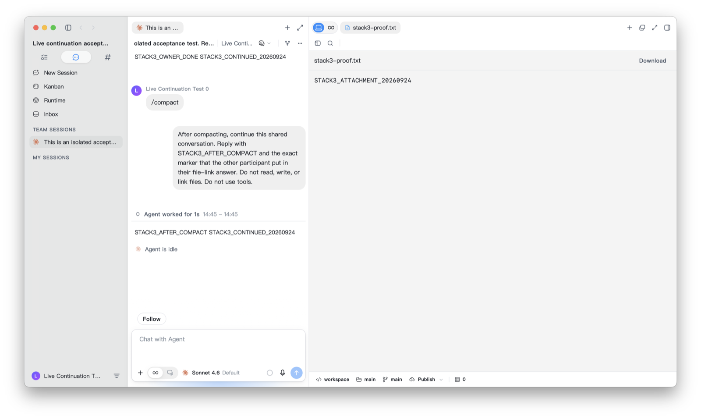
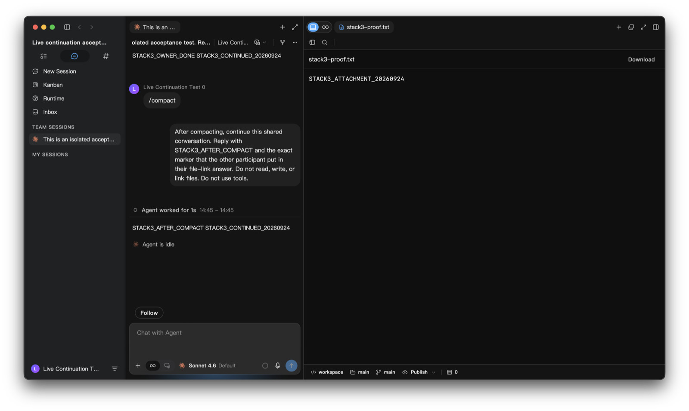
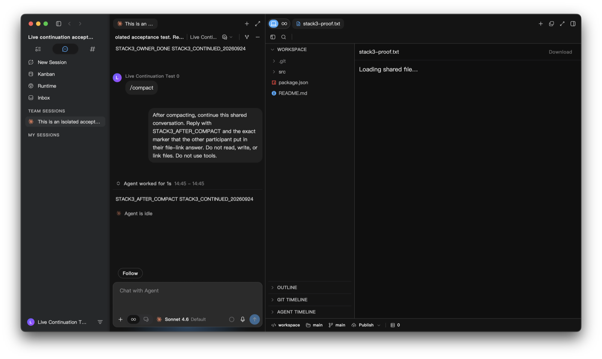

# Shared file preview UI audit

| Line                                      | Element                                                  | Verdict          | Reason                                                                                                                                                                            | Suggested change                                                             |
| ----------------------------------------- | -------------------------------------------------------- | ---------------- | --------------------------------------------------------------------------------------------------------------------------------------------------------------------------------- | ---------------------------------------------------------------------------- |
| `SharedSessionFileViewer.tsx:198`         | Centered modal replaced by a workstation content section | fix              | The requested experience keeps chat visible and opens the attachment on the right. Both portable and sender-path links now use one tab opener.                                    | Implemented; removed the unused dialog and its dialog-only tests.            |
| `useCodeEditorPrimarySidebarConfig.ts:25` | Receiver-local file tree beside a cloud snapshot         | fix              | This tree is unrelated to the shared immutable file and consumes preview width.                                                                                                   | Hide it for shared-file tabs without changing the user's sidebar preference. |
| `SharedSessionFileViewer.tsx:213`         | Optional download action                                 | keep with reason | Shared Button, tertiary importance, small toolbar size, disabled before bytes arrive, loading while saving. Existing download-to-Downloads behavior remains optional.             | None.                                                                        |
| `SharedSessionFileViewer.tsx:232`         | Inline retry                                             | keep with reason | Shared Button with existing localization; error remains in the preview and does not replace chat.                                                                                 | None.                                                                        |
| `SharedSessionFileViewer.tsx:246`         | Image, PDF and text surfaces                             | keep with reason | Native image/iframe/pre are content, not substitute action controls. Named media, sandboxed PDF, escaped text, theme tokens and flexible height are preserved.                    | None.                                                                        |
| `sharedFile.tsx:30`                       | Origin loading and unavailable states                    | keep with reason | Status/alert semantics are inline; no toast/modal is needed. A known event origin updates the existing preview without focus changes. An abandoned unresolved event fails closed. | None.                                                                        |

Verdict totals: **2 fix**, **4 keep with reason**, **0 abstract**.

D1–D5 covered. Changed production controls were inspected: no raw React buttons, clickable div/span substitutes, new form fields, literal colors, or new arbitrary Tailwind sizes. The tab strip and close control reuse the existing workstation components. No new repeated visual pattern met the abstraction threshold.

## Native desktop evidence

These screenshots use an isolated macOS Tauri desktop, the existing real Claude test conversation and real cloud attachment bytes. The source file had already been overwritten; the original shared snapshot still renders. Loading/error screenshots deliberately hold/reject the file request; recovery returns to the real endpoint. Screenshots were captured from the native window because the debug WebDriver screenshot was mostly transparent.

Loading/error captures precede the final file-tree suppression; final light/dark captures include it. The existing real-agent dual-instance spec now requires a visible side preview and chat, no dialog, one shared-file tab after repeated clicking, and removal after tab close. That entire provider-driven spec was not rerun for this UI change; the native verification used its existing real-provider fixture with a focused external driver.
