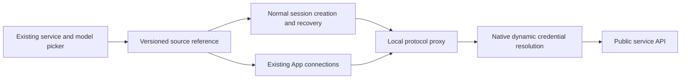

# Managed Model Services: ORG2 Client Implementation Plan

Date: 2026-09-16. Status: client implementation submitted; consolidated acceptance testing pending. As requested at the time, that implementation pass included source review and formatting but no tests, type checks, builds, or Computer Use. The acceptance checkboxes remain open. See the [client handoff](managed-model-services-client-handoff.md) for the actual protocol, migration scope, and test matrix.

The goal is to let users choose a managed service and model in ORG2, start a normal session, and use the same authorization in compatible native applications through App connections.

## 1. Client acceptance criteria

- [ ] A new user with no existing service or workspace record can sign in, discover services, and use one for the first time.
- [ ] The existing model picker shows the service, model, public availability, and required user action, without adding a second picker.
- [ ] Service and model lists come from the server's public capability contract; adding a compatible service does not require a desktop release.
- [ ] Activating a Package once covers all its models. Switching models requires no separate activation, and all activated packages draw directly from the wallet balance.
- [ ] Each service source has a stable, secret-free reference that survives startup, continuation, restart recovery, and error recovery.
- [ ] An invalid managed source gives a clear recovery action and never silently switches to a personal account.
- [ ] Short-lived authorization refreshes on demand. Long-lived credentials stay in OS credential storage and never enter renderer state, IPC responses, or client config files.
- [ ] The normal ORG2 session path sends and receives real content, invokes local tools, saves conversations, and reopens them.
- [ ] Configuration, launch, real requests, conflict detection, and restoration are verified separately for compatible Claude Code, Claude Desktop, and Codex entry points.
- [ ] Local routes end on full process exit and recover after restart. Window close and process exit have distinct, tested behavior.
- [ ] Connecting a managed service does not automatically install remote Skills or MCP servers. User-configured local tools and MCP continue to work.
- [ ] Existing accounts, published protocols, and historical configurations remain readable with their original meaning; new capabilities use explicit version negotiation.

## 2. Public code inspected

The baseline was `develop@11b74e27e0dcf0162f573410973c033fd4b9750d`. The fixed head of [PR #1846](https://github.com/org2AI/ORG2/pull/1846), `d6643ab39059a7cc89f3381529c7562f57c65c63`, was used as a reference; it had 185 changed files when inspected. The new branch starts from develop and takes only required dependencies instead of merging the old branch wholesale.

| Public code location | Observation and treatment |
| --- | --- |
| `src/features/MarketConnect/` | Existing authorization events, deep links, RPC, discovery, and selection. Keep the authorization base and rebuild the service/model projection. |
| `src-tauri/crates/market-connect/` | Existing browser authorization, connection recovery, and workspace credential client. Keep secure storage and refresh, and support first use with no existing record. |
| `src-tauri/src/market_connection/source.rs` | Existing selection and discovery are tied to the old authorization object. Use an explicitly versioned client source reference with strict parsing and ownership checks. |
| `src-tauri/src/dynamic_credentials.rs` | Reuse the generic dynamic credential interface without introducing service management or billing policy into the generic layer. |
| `src-tauri/src/cli_managed_proxy.rs` and submodules | Reuse protocol proxying, dynamic authentication, session routing, and lifecycle management. Omit the remote MCP bridge that this feature does not need. |
| `src-tauri/crates/agent-cli/src/managed_config/` | Reuse configuration transactions, backups, conflict checks, restoration, and isolated launch profiles. |
| Normal model palette, SessionCore, and CLI session paths | Carry the same source reference through creation, continuation, recovery, and history reads; a picker-only change is insufficient. |

Checks and past runs for #1846 do not establish acceptance of the new client. Success in one native target does not establish support for the others.

## 3. User flows

### Within ORG2

1. The user opens the existing model picker and chooses a managed service and a model advertised by it.
2. If first-time login is needed, browser authorization returns to ORG2. A successful authorization callback and model availability are separate states; opening a link alone must not show “connected.”
3. First activation shows public price ranges for every model in the Package and explains direct wallet billing. One confirmation activates the whole Package; there is no per-model purchase. Model selection controls only the current request. If the server requires renewed authorization, confirmation still covers the whole Package, then returns to the original task.
4. After server authorization, normal session creation persists the source reference and selected model. The local proxy resolves short-lived credentials when needed.
5. Later messages, reopened conversations, and app restarts recover the source from the persisted session. Changing the source for a new session does not rewrite an active one.

A managed service is not a fabricated personal Key Vault account. Personal accounts keep their existing management flow; a dedicated source adapter makes managed connections available in the same picker.

### Native applications

App connections reuses the existing connection cards and edit/restore components. It shows the selected service, compatible models, and actual target-app state. Ordinary users need not enter endpoints, copy tokens, or download credential files.

- Configure only the application the user selected, using existing transaction and isolated-profile behavior.
- Claude Code opens the relevant terminal. Verify Claude Desktop and Codex launch behavior separately.
- Dynamic authorization is used only through the local proxy, so ORG2 must remain running. Exit and restoration guidance must be accurate.
- Disconnecting one application restores its previous configuration; it does not sign out of the managed account or delete conversation history.
- When an external edit creates a config conflict, retain recovery and inspection paths. Do not overwrite the external edit or misreport the conflict as an unsupported version.

## 4. Public protocol and responsibilities

| Information or action | Client responsibility |
| --- | --- |
| Service catalog | Read stable service IDs, names, public models, availability, and public prices; do not construct a catalog locally. |
| Usage authorization | Confirm the whole Package once, share one access, read service-level confirmation state, and omit `model` from the activation request. |
| Models and capabilities | Represent model ID, request protocol, target client, and capabilities separately; do not infer compatibility from name prefixes. |
| Source persistence | Store the version, connection reference, service/access references, model, and execution target; never store upstream credentials. |
| Authentication | The native credential module manages long-lived authorization; dynamic sources provide short-lived credentials on demand only to the native proxy. |
| Usage and recovery results | Read structured states and actionable operations instead of inferring account state from error strings. |

The proposed source structure includes `kind`, `schema_version`, `connection_ref`, `service_id`, and `access_ref`. The model, protocol, and target are stored at their existing session layers. Finalize fields and public API schema together with the first contract fixtures, updating Rust and TypeScript in the same batch. A reference is an identifier, not authority to make requests.

New APIs and IPC should provide catalog pagination, unknown-version handling, and explicit capability lists. Unknown models, protocols, and unsupported clients fail closed. The client may display public prices and confirmation actions supplied by the server; it must not implement server pricing policy.

Preserve the meaning of published v1 messages. Do not loosen the old workspace scope validation to accommodate new login/catalog scopes; negotiate and validate capabilities separately. Deep links carry only validated routing and one-time flow identifiers, never long-lived credentials through URLs or the renderer.

## 5. Migration checklist from #1846

| Part | Decision | Reason or implementation |
| --- | --- | --- |
| `deepLink.ts`, `events.ts`, `urlPolicy.ts`, ConnectionHost | Keep and adapt | Reuse one-time authorization, origin/state checks, and cancellation; distinguish old and new messages. |
| market-connect connection/client/environment/process lock | Keep required parts | Native storage, recovery, and concurrency safety are dependencies; remove obsolete business parsing. |
| Workspace discovery, `marketProfiles.ts`, `marketSelection.ts`, RPC schema | Redefine semantics | Separate catalog from usage authorization; service/model choice must not require a prior purchase record. |
| `dynamic_credentials.rs` | Keep generic core | Enforce credential ownership and reject unknown sources without adding service management. |
| `market_connection/source.rs`, `prepare_session` | Rewrite adapter | Validate public authorization, produce a stable versioned source, and never fall back to a personal account. |
| Managed proxy, `session_routes.rs`, execution profile outside MCP | Keep and simplify | Give each session route its own lifecycle so a source switch cannot affect an older session. |
| `managed_config` launch, operations, desktop adapters | Migrate per target | Native launch, conflicts, and restoration require more than a UI copy. |
| Market automatic Skill/MCP endpoint, proxy, and injection | Omit from new flow | This feature connects model services, without remote tool installation; ordinary local MCP remains. |
| Sequence/display handling for old duplicate purchases | Omit from new catalog | Use public stable service IDs; retain only compatibility needed to read published history. |
| History scan/import and native materializer changes | Evaluate individually | Migrate required read adapters if isolated profiles change history location; exclude unrelated refactors. |
| Localized copy and checks | Rewrite for new behavior | Do not reuse obsolete flow descriptions; track language status by repository convention. |

Migrate an executable call path with its tests, rather than mechanically cherry-picking an entire large commit. Check whether the target develop branch already contains each capability.

## 6. Session and lifecycle invariants

Only one source owns authentication for a session. Verify the mutual exclusion of `account_id` and a dynamic source at production creation and recovery boundaries. Every continuation path carries the reference; keeping it only in a frontend atom is insufficient.

Restore route, model, target, and auth scope in this order from one source: explicit current input → current session → persisted session → actionable recovery error. Do not fill a missing field with an unrelated personal-account default.

Coalesce concurrent credential refreshes; bound caches by size and expiry. Refresh catalog data only when relevant screens or events need it, without continuous polling while hidden. Startup, cancellation, revocation, and exit are bounded. Late results from retired connections cannot make them active again.

Once a request has produced output or invoked a tool, do not automatically replay the whole request on the client. Keep conversation history in normal history storage. Do not promise generic recovery through upstream-specific caches, files, or response handles. Test continuity and state capabilities separately for each native application.

## 7. Implementation batches

Keep each batch near 20 logical files where possible. Update shared Rust and TypeScript wire types together. Each batch should have a real consumer rather than an unconnected abstraction.

| Batch | Work | Acceptance exit |
| --- | --- | --- |
| C0 | Define public protocol, completion criteria, old-data read boundary, and excluded migration items. | Reviewable shared fixtures, entry-point matrix, and reuse list. |
| C1 | Authorization module, source reference, RPC, dynamic credential registration/exit, and error states. | Login without prior records; replay, cross-connection, and unknown-version rejection; no secrets in IPC. |
| C2 | Service catalog, first activation/account-action recovery, existing model picker. | Selection survives login/recovery; catalog failures can be retried and never look like a successful empty list. |
| C3 | Normal session creation, execution, continuation, persistence recovery, and route ownership. | Real conversation/tools work; a source switch does not rewrite old sessions; continuation works after restart. |
| C4 | Native configuration, launch, conflicts/restoration, and required history-location adapters. | Each supported target works in reality, and restoration preserves external edits. |
| C5 | Platform/protocol/exit/revocation acceptance, copy, and release capability claims. | Record actual supported OS versions, client versions, and limitations in the implementation PR. |

## 8. Verification requirements

| Scenario | Expected result |
| --- | --- |
| New user without old records | Discover and use a service without first creating an old purchase object. |
| Catalog pagination/empty/load failure | Accurate state and retry; saved selection persists. |
| Incompatible model or target | Enforce public capabilities; reject unknown values. |
| Login cancellation, duplicate callback, late old callback | Do not activate twice or overwrite a newer connection. |
| Concurrent credential refresh requests | Share one valid refresh; reject expired or revoked results. |
| Persisted source recovery | Creation, continuation, reopening, and restart read the same fields without personal-account fallback. |
| Normal conversation and local tools | Real output enters normal history; no extra remote MCP is injected. |
| Config conflict/client uninstall/reinstall | Accurate state and recovery without overwriting user changes. |
| Window close/full exit/restart | Distinct background and exit behavior, with real local-route and recovery results. |
| Old protocol/unknown new version | Published behavior is preserved and new features require explicit client support. |

During implementation, run checks appropriate to the final diff: `pnpm typecheck:fast`, `pnpm test -- <changed test paths>`, and `cargo test`/`cargo clippy` for affected crates under `src-tauri`. Verify init and exit with the Market module enabled and disabled. New E2E tests must enter through the real UI; helpers may prepare state or read assertions only.

Native acceptance needs an actual build, client, and request. Record macOS/Windows, client name, and version for each result. A successful compile, deep-link callback, or visible card cannot substitute for a working conversation and recovery.

## 9. Architecture review scope

The repository's `architecture-audit` method was used for planning. This table separates source-level conclusions from runtime checks still pending.

| Layer | Current conclusion | Check during implementation |
| --- | --- | --- |
| 1 Compile correctness | A docs PR does not run a full project build. | Run relevant TS/Rust checks after code changes and record warnings or failures. |
| 2 Duplicate/disconnected code | Reuse registration, proxy, and managed config; omit a remote-tool bridge with no consumer. | Trace UI → IPC → source → proxy → runner. |
| 3 Naming consistency | Distinguish service, access, connection, and project. | Update production consumers and Rust/TS types, not just labels. |
| 4 Terminology | Provider, protocol, and client are separate dimensions; a source reference is not a credential. | Keep the public contract consistent and define errors for unknown enum values. |
| 5 Default branches | Managed auth failure cannot fall back to a personal account. | Test each unknown or invalid branch at its owning boundary. |
| 6 Module boundaries | The generic proxy consumes registered dynamic sources only. | Ensure core does not depend on service-management code. |
| 7 Comprehensibility | One normal session path; App connections only configures applications. | Confirm a new developer can trace the whole call chain. |
| 8 Wire protocol | Versioning, strict parsing, public DTOs, and secret separation are required. | Inspect serialized HTTP/IPC, not just type definitions. |
| 9 Initialization parity | Create/continue/native launch/restart must use the same registration and validation. | Test feature switches and entry points without helper shortcuts. |
| 10 Recovery symmetry | Restore source, model, target, and scope together. | Test missing data combinations across input, memory, and persistence. |

No runtime performance, UI consistency, or native E2E audit was done in that planning pass because it changed no code or UI. Use the relevant methods and actual measurements in implementation batches. This plan does not claim that existing or future runtime behavior passes.

## 10. Delivery boundary

This PR reviews a client plan. Open decisions include public contract versions and fields, compatibility with published data, and each client's supported capabilities. Resolve them before implementation.

The public repository stores only necessary client code, public protocols, and synthetic test data. The client does not implement server business policy or management systems. The PR description, commits, fixtures, and logs follow the same boundary.

Start the new implementation from current develop. Keep #1846 as a reference until a replacement is complete. Before release, test on real platforms and expose only supported capabilities. This planning pass does not change the old PR state or publish a client version.

## Wallet-mode protocol update

Activation submits `billing_mode: wallet` without a Package budget. The access budget field is null in this mode, while historical limited-budget parsing remains. Catalog requests declare `wallet_billing=1` and read the public capability list; if the service has not updated, new activation is disabled. After Market confirmation, ORG2 opens directly, and the real workspace allows reuse of an authorized connection. First login still follows normal authorization. This adds no polling and does not rewrite historical access automatically. See the client handoff for compatibility details and pending tests.
