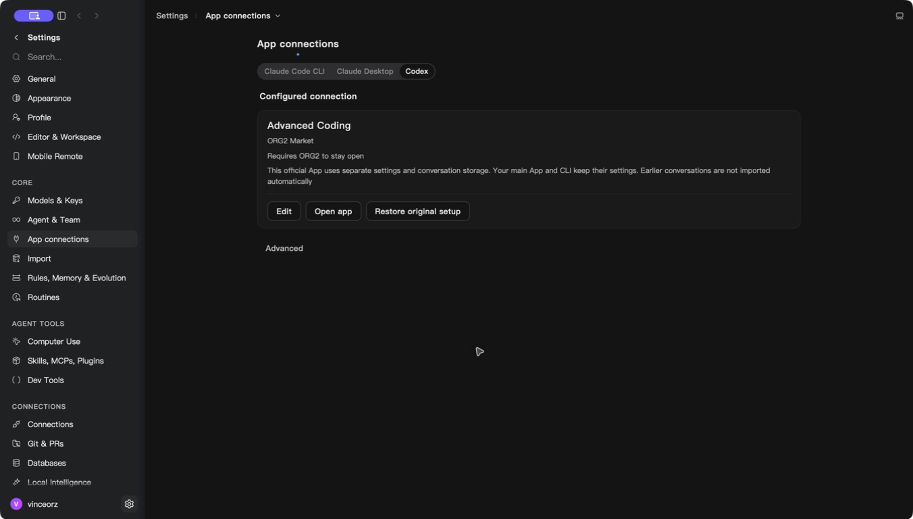
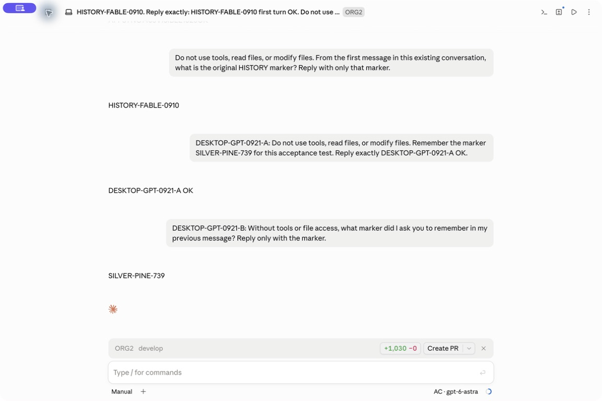
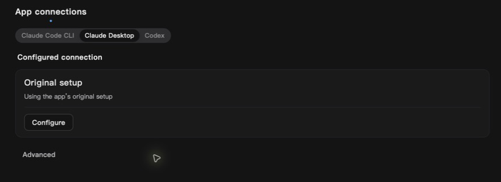
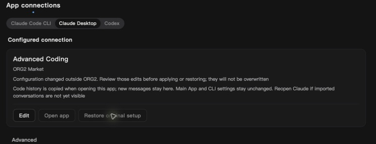

# Market app compatibility and model selection

## Behavior

Codex Desktop 26.915.31945 is accepted alongside the previously verified
26.908.70816. Bundle identity checks remain mandatory, and unknown releases
remain blocked. An unsupported release now produces a localized update message
instead of the generic connection error. Arbitrary native error text is never
shown to the user.

Managed model compatibility follows the server's `clients` capabilities rather
than inferring client support from the provider wire protocol. GPT can appear
for Claude clients only after the companion Cloud protocol bridge advertises
that support. Older servers retain their existing model availability. The companion bridge is [Cloud PR #126](https://github.com/org2AI/ORGII-cloud-infra/pull/126) and must deploy before relying on GPT compatibility. This PR does not implement or deploy the gateway bridge.

Selecting a model previously fetched the whole package catalog again after the
picker had loaded it. Session preparation now reuses its native-validated
snapshot for at most 30 seconds. Explicit catalog refresh still fetches current
data. Refresh failure, activation and reauthorization invalidate the snapshot.
This snapshot supplies selection metadata only: token issuance and gateway
requests continue to enforce access, terms, funds and availability.

## Executed verification

The following historical checks ran before the latest integration rebase.
Updated checks after rebasing onto `cc26b4729a` are recorded in the gateway
routing follow-up below:

- `pnpm test src/features/MarketConnect/externalAppBridge.test.ts src/features/MarketConnect/nativeModelSelection.test.ts src/modules/MainApp/Settings/sections/HarnessConnections/AppConnectionPage.test.ts`: 25 tests passed.
- `pnpm typecheck:fast`: passed.
- Changed-file ESLint and `pnpm check:i18n-keys`: passed.
- `pnpm run build --no-cache`: passed.
- `cargo test --manifest-path src-tauri/Cargo.toml -p org2 --lib market_connection::native_app_launch::tests -- --nocapture`: 4 passed.
- `cargo test --manifest-path src-tauri/Cargo.toml -p market-connect workspace::tests -- --nocapture`: 3 passed.
- `cargo test --manifest-path src-tauri/Cargo.toml -p org2 --lib market_connection::source::tests -- --nocapture`: 21 passed. The new loopback HTTP test verifies concurrent selections issue one request, explicit refresh reaches the server, a failed refresh cannot revive an earlier snapshot, and expiry triggers a new fetch. Separate tests verify logout, late responses and owner isolation.
- An earlier build with the same compatibility implementation started a separate Codex Desktop 26.915.31945 process. The final combined build `aff4fd0` completed Advanced Coding configuration using the actual ORG2 **Use connection** control and the **Restore** UI operation; it did not launch a separate Codex process during that final check. SHA-256 hashes of all four monitored primary Codex configuration/authentication files remained unchanged. The screenshot below comes from this final build and records the configured state; it does not prove a model inference call from the official Codex UI.

The installed release's bootstrap and main sources were audited for
`CODEX_ELECTRON_USER_DATA_PATH`, `CODEX_HOME` and isolated single-instance
behavior. Relevant source SHA-256 values:

- Bootstrap: `5787d416ccbd7be549251d2c691f9c2579d6960f3ccd470037d97486c93fdf0f`
- Main: `9e8a3bd79c817064f28693ca26aa1378895e07ab2108c78c42d0ea20dac9d66e`

## Limits and lifecycle

Claude Desktop's final-build GPT menu, real inference, context and receipt
verification are recorded in the follow-up below. The earlier combined build
described in this section did not establish those results. Cloud acceptance
and native acceptance remain separate evidence.
The integration acceptance build combined the fixes at commit `aff4fd0` (native
binary SHA-256 prefix `332c077`). Keychain access initially blocked cold package
loading; a process sample identified `enabled::status →
keyring::Entry::get_password → Security decrypt`. The user then authorized
Keychain access and the native picker loaded. In the SDE Advanced Coding picker,
warm Fable → GPT6 Astra selection and confirmation took 464 ms; returning to
Fable took 455 ms. These are observed automation round-trip upper bounds for two
actions, not a p95 measurement or a before/after performance comparison.
Official Codex UI model inference remains unverified.

Resource samples used changes in cumulative process CPU time over measured
monotonic intervals, not the instantaneous `ps %cpu` field. CPU percentages below
are fractions of one core. RSS is end-of-interval residency; sums can include
shared pages. ORG2 had no direct child processes; launchd-owned WebKit processes
could not be attributed and are excluded.

| State (UTC, 2026-09-21)     | Interval | ORG2 CPU / RSS    | Isolated Claude process tree CPU / RSS |
| --------------------------- | -------- | ----------------- | -------------------------------------- |
| Foreground idle, 06:32:21   | 12.050 s | 0.50% / 167.7 MiB | 0.83% / 1035.3 MiB                     |
| After AX minimize, 06:37:47 | 12.043 s | 0.25% / 454.2 MiB | 0.66% / 886.8 MiB                      |

Model selection and other interactions occurred between the samples. These RSS
values do not establish a memory regression or improvement caused by hiding.
Claude's sampled process was independently identified as using the isolated
native-app profile. Both observations show low CPU during those short idle
intervals; they do not measure sustained or whole-system idle overhead.

Normal Quit required confirmation in ORG2's native quit dialog. Before the
confirmation, ORG2 correctly remained alive with its loopback listeners; this
was not treated as a shutdown failure. After confirmation, the original ORG2
process and the entire previously recorded Claude process tree were absent at
both ends of a 10.028-second observation starting 06:41:18 UTC. The former package
proxy port 17888 had no listener. ORG2 was reopened during that observation and
the new process owned port 13847 at the end, so an empty interval on that port
was not captured. No claim is made that reopening and resource sampling proved
all external service or WebKit cleanup.
The localized unsupported-version error has regression coverage but no rendered
error-state screenshot. No layout or control presentation was changed.

| Area            | Evidence                                                                                              | Decision                                             |
| --------------- | ----------------------------------------------------------------------------------------------------- | ---------------------------------------------------- |
| Background work | No timer, polling or new subscription                                                                 | Check freshness only on user-driven reads            |
| Memory          | One snapshot per existing connection; registry cap 32; catalog cap 100 packages                       | Bounded retention; reauthorization clears state      |
| Scope           | Existing instance-local source, owner/workspace identity and lease barriers; fixed build-time origins | Cached data cannot cross owner changes               |
| Hot path        | Three concurrent reads issue one HTTP request; explicit refresh remains fresh                         | Reuse only recent native-verified selection metadata |

**Performance verdict: targeted warm selection and visible/hidden idle checks
completed, with the measurement limits above.** Unit and HTTP request-count
checks passed. No statistically established latency improvement is claimed. Cold loading still
requires authorization and the remote catalog; this change does not claim to
remove that necessary work. Debug logs expose only `cache_hit` and `elapsed_us`
for catalog timing, with no buyer identity, selected model or credential.

Rollback uses the prior native build; this change has no schema migration or
new persistent profile format. Rolling back the companion Cloud capability
advertisement causes native validation to hide or reject unsupported models.
No installer was published and no production service was deployed by this PR.

## Claude Desktop gateway model routing follow-up

Native acceptance exposed two separate configuration failures. ORG2's direct
account model-family guard rejected a trusted helper catalog before writing it.
After allowing capability-validated helper catalogs, the installed Desktop
rejected GPT-bearing gateway route names while retaining the Claude entry.

The final writer validates helper token ownership, catalog membership and route
syntax separately from direct-account provider constraints. Desktop catalogs
now assign non-Claude models an opaque gateway route bound to the real model,
identity, authorization workspace and purchased entitlement. The first 80 bits
of the digest use fixed-width decimal bytes: a hexadecimal suffix can randomly
contain `abab`, which the observed Desktop provider-name predicate rejects.
Labels continue to show the real GPT model, and request selection, authorization
and accounting use the unchanged real model and purchase. This is ORG2 gateway
compatibility, not a claim of official native GPT support. No vendor executable,
policy or authorization setting was modified.

Existing Claude/Fable aliases and canonical saved catalogs remain readable;
reapplying a GPT Desktop connection writes the new route. Existing Claude aliases
retain their previous naming behavior, including the vendor's rare hexadecimal
name-filter edge case. A later vendor validator change can require revalidation.
Restoring a saved profile remains independent of route naming. For rollback,
restore or reapply a prior supported model before returning to an older build.

Source `f1efec1cd3070125bd0405c873d5318b94e25f14` passed 82
`cargo test --manifest-path src-tauri/Cargo.toml -p org2 --lib market_connection:: -- --nocapture` tests, including
an observed vendor-predicate fixture, legacy catalog parsing, multiple purchases
sharing a model, immutable real-model routing and alias rebinding rejection.
After rebasing onto `develop` commit `cc26b4729a`, the following frontend
command passed all 45 tests in four files:

`pnpm test src/features/MarketConnect/externalAppBridge.test.ts src/features/MarketConnect/nativeModelSelection.test.ts src/features/MarketConnect/marketProfiles.cache.test.ts src/modules/MainApp/Settings/sections/HarnessConnections/AppConnectionPage.test.ts`

`pnpm build` also passed on that rebased frontend. Subsequent commits only
changed Rust catalog generation and validation, so the frontend output is
unchanged. Normal Husky hooks ran lint-staged and
`cargo clippy --lib -p org2` successfully.
The native debug bundle built successfully; its binary SHA-256 is
`bce6517cb53021cd41321f8c954d00b541e0aedeaaf3e5f0d0d8f3fde07f1ebd`.
It reuses the frontend output already built and verified at `7bdc48a225` because
this follow-up changes only Rust catalog generation and validation.

The replacement build initially waited on macOS credential access. A process
sample located the wait at `enabled::status → keyring::Entry::get_password →
SecKeychainFindGenericPassword → Security decrypt`. After the user authorized
this binary, the actual **Use this connection** action succeeded with Advanced
Coding / GPT selected. Rebuilding an ad-hoc signed binary can require a new
system authorization; this is separate from gateway inference.

## Final-build Desktop acceptance, 2026-09-21

The official Desktop gateway window displayed `AC · gpt-6-astra` and retained
its imported Code history. In the existing synthetic acceptance conversation:

- The initial model selection happened during session initialization; the first
  completed response actually used Fable. A preceding GPT request was cancelled
  without a debit or remaining hold. This first response is **not GPT evidence**.
- Once the session was ready, the official **Switch model** confirmation selected
  GPT and reported restarting its CLI to apply the change. The next response
  correctly recalled `SILVER-PINE-739` from the preceding Fable message.
- The resulting transcript and production receipt independently identify
  `gpt-6-astra`: 57,853 input tokens and 11 output tokens. The buyer debit was
  $0.434310, exactly once, with no remaining hold. Private accounting evidence
  retains the request correlation; no supplier economics are published here.
- The visible wait before that response was several minutes. Desktop submitted
  the message at 16:17:57 UTC, the CLI wrote its user record at 16:20:51 UTC,
  and the answer followed at 16:21:09 UTC. The approximately 18-second execution
  interval does not represent the user's total wait. Production database
  connection timeouts occurred in the same window; root-cause investigation
  continues. Credential helper calls were only 9–44 ms.
- Normal Quit removed the old isolated process. Reopening through ORG2 loaded
  the GPT choice and both new messages. A post-restart GPT response again
  recalled the marker: 187 new input tokens, 57,728 cached input tokens and
  11 output tokens, buyer debit $0.045111 and no remaining hold. A separate
  request following that reply is under source investigation; it is not yet
  classified as a title request or duplicate inference.
- With the isolated app normally quit, **Restore original setup** displayed
  **Original setup** and confirmed the previous setup was restored. All six
  primary configuration/authentication file baselines matched immediately
  before and after Restore. The managed profile, catalog and credential helper
  were removed; the saved manifest returned to default mode. Launching the main
  app afterward showed the original Max account and Fable 5.1 model, without a
  gateway footer or a new login prompt. No inference was sent from the main app.
- An automation-driven attempt to foreground the already-running isolated app
  returned an activation error. The process and its messages were retained;
  logs show the caller was inactive. After focusing ORG2 with a window click,
  a subsequent Open app action completed without an error. No new activation
  rejection was logged. This distinguishes the automation foreground condition
  from the successful cold launch; it is not a claim of an activation code fix.

Primary-profile comparison across this interval found four monitored files
unchanged (including a credential file remaining absent) and two hashes changed.
The user also used the main app between snapshots; hash-only evidence cannot
attribute those changes. The immediate Restore comparison did match all six files; this does not
retroactively explain the earlier two changes.

This evidence does not establish bidirectional history synchronization. New
messages remain in the isolated history. That separate implementation is not
included in this PR. No ORG2 installer has been published.

## Integration with latest develop

The branch was rebased without conflicts onto `77989525e6` after the native
acceptance above, retaining the colleague's settings card/filter UI and Cursor
model labels. `git diff f1efec1cd3070125bd0405c873d5318b94e25f14 HEAD -- src-tauri`
was empty: the tested native runtime is unchanged. The newer frontend passed
101 tests across the four Market connection suites plus model-name, model-tier,
settings-card and settings-filter suites. `pnpm build` passed in 31.7 seconds.
The screenshots above document that earlier frontend. A subsequent current
build and its separately scoped verification are recorded below.

## Isolated diagnostic follow-up

A separate, temporary loopback observer forwarded the same production-backed
gateway requests after the original acceptance. It recorded request metadata
and usage, without storing prompts or credentials. One new GUI message received
the expected GPT response. Accounting identified three actual inference calls:
the reply ($0.299370), an initial title request ($0.007005), and its fallback
($0.008730), for a total buyer debit of $0.315105. Each settled once with no
remaining hold. Official Desktop logs show that the initial title request hit
its approximately 15-second client timeout; the server nevertheless completed
it, and Desktop then made a separate fallback request. These were two model
executions, not duplicate ledger postings. This does not identify the purpose
of the earlier post-restart request.

Desktop also emitted 27 token-count HTTP attempts, including retries: ten
succeeded, seven returned 503, eight 429 and two 409. All ten successful counts
had zero charges and no ledger postings. The first burst contained 16 concurrent
counts; some successful counts took 55–61 seconds. The exact causes of the two
409 responses were not captured. No pending request or hold remained afterward.
The observed backend contention remains a separate performance issue.

The observer was stopped and its configuration removed. The official settings
editor also reserialized defaults, so the initial Restore safely rejected the
changed profile. After preserving that diagnostic copy and restoring the exact
pre-diagnostic managed profile, normal Restore succeeded. All six primary
configuration/authentication files matched their immediate baselines. This
cleanup is distinct from the unmodified Restore acceptance above.

The connection page now recognizes only the known native Restore-conflict
error and displays its existing translated conflict explanation, refreshing
the state without forcing an overwrite. Unknown errors remain generic so their
contents cannot expose credentials. The focused component suite passed all
19 tests, including conflict refresh and unrecognized-error privacy cases;
native visual verification also passed as recorded below.

## Final UI integration and Restore conflict acceptance

Rebased without conflicts onto `develop` `400f7f652c`, retaining the new settings
search/table controls. The final runtime source is
`a0df9336d0fcf12f491d1aef83a9e32513691990`; locally signed debug binary SHA-256:
`4acc32cf6daa0037e247c0a504e37197660a920db5a469d696aac019f999c4b2`.
No installer was published.

- `pnpm test src/modules/MainApp/Settings/sections/HarnessConnections src/features/MarketConnect src/components/SettingsTable src/scaffold/NavigationSidebar/variants/SettingsSearchDropdown src/config/settingsSearch.test.ts`: **212 passed in 25 files**.
- `pnpm test src/hooks/keyboard/__tests__/useSearchShortcut.test.ts src/features/ExternalSessionSources/SourceScanningSettings.test.ts`: **6 passed in 2 files**.
- `pnpm build`: passed in 25.0 seconds. The incremental native debug bundle and
  local signature verification also passed.
- Actual native UI opened App connections, loaded the production Advanced Coding
  package, selected `gpt-6-astra`, and completed **Use this connection**.
- With Claude closed, the test appended JSON whitespace to the isolated managed
  profile, retaining a private copy of its original bytes. **Restore** rejected
  the external change, showed the localized explanation, and disabled launch and
  restore. A byte comparison proved the attempted Restore preserved the edit.
- After restoring only those exact original test-profile bytes (no manifest
  modification), switching the app tab re-read the configuration; normal
  **Restore original setup** succeeded. All six primary configuration/authentication
  hashes matched the immediate baseline.

This final UI check does not repeat the earlier production inference, nor prove
Codex official UI inference, eliminate server preflight contention, or implement
bidirectional history writeback. Those boundaries remain as described above.
