> Handoff update: The user authorized merging this verified source-code version after organizing changes by feature and passing CI. “Cannot merge yet” in the historical reports below describes their status at the time. The remaining acceptance gaps stay in the README; no ORG2 installer is being published.

> Latest `2a048d9e0b`: All 2,101 frontend test files passed. A real ninth continuation turn, nine navigation rounds, and single-charge reconciliation passed. There was no cache hit in this run; cache and configuration recovery still refer to the observations from `91725`. See the [latest screenshots and report](evidence/2a048-final-source-regression.md). Interpret older status notes against their own builds.

> Latest September 18 acceptance: `91725d650d` passed eight rounds of history/navigation, continuation after restart, cache accounting, and Codex configuration restoration. See the [final regression report](evidence/91725-final-regression.md). Official Codex switching between two Packages and calling after restoration, plus primary-conversation import, were still open; the PR was not yet claimed mergeable at that point. Each historical screenshot belongs to its labeled build.

> Latest `3efe`: Two consecutive real retries of the original message passed request, context, and single-charge checks. The second successful reply was dropped from the UI by a message-identity collision, while stale failure diagnosis was assigned to the previous turn. That was still being fixed, so the PR was not yet mergeable at that point. See [this acceptance run](evidence/3efe-retry-chain.md). Historical reports and screenshots refer to their labeled builds.

# Package feature UI handoff: Harry

The following paragraph records historical `b02d` acceptance. For the latest state, use the acceptance matrix linked above. Real Package calls and Market cache billing passed, but local Codex CLI usage counted cached tokens twice, failed local conversations lacked Retry on the original message (an earlier Cloud attribution was corrected), and normal official Codex model/preference edits still caused configuration conflicts. These required fixes at their source boundaries and acceptance on a new build. Do not treat a timeline “Replay turn” as a new call, or remove configuration protection merely to enable a Restore button. Claude Code CLI configuration and disconnection were confirmed not to modify the original account files. See the [regression evidence from that run](evidence/b02d-regression.md).

This handoff covers [ORG2 #1937](https://github.com/org2AI/ORG2/pull/1937), [Cloud #117](https://github.com/org2AI/ORGII-cloud-infra/pull/117), and [Cloud #118](https://github.com/org2AI/ORGII-cloud-infra/pull/118). #1899 and Cloud #104/#105 are earlier work. Do not copy entire pages from old branches over teammates’ later UI work.

Screenshots were taken on the evening of 2026-09-17 in Vancouver from a local acceptance instance. The ORG2 binary in them was built from `8b0543aee38373a49674e803c00ca416310423e0`; later fixes for Retry, cached usage, and identity renewal were not in that binary. They document actual UI and behavior, not complete acceptance of the final version. Only dark-theme screenshots exist here. Recheck light theme, narrow windows, and loading/empty states after UI changes.

## Ownership and change scope

| PR | UI for Harry to review | Functional boundary |
| --- | --- | --- |
| ORG2 #1937, base `develop` | Chat model/Package sources; Settings → App connections; Package display names and error/recovery guidance | Packages become selectable sources. Each external App can configure up to eight Packages and one default model. CLI and official Apps use different isolation mechanisms. |
| Cloud #117, base `main` | Existing Marketplace/Usage status semantics | This PR has backend functionality and a handoff, without new pages. The UI must not infer remaining capacity, Reserve, rotation, or reserved-funds state. |
| Cloud #118, base `main` | `/admin` login, denial, missing configuration, and current identity | Access requires both the company Feishu tenant and explicit admin allowlist. It is not open to every company member. |

The Cloud PRs have separate screenshots and Chinese handoffs. Marketplace/Usage screenshots for #117 came from an older acceptance Console and are references for business state only. Current `main` has a teammate’s newer navigation and `PackageModelsTable`. #118 screenshots include the integrated navigation. Use current `develop`/`main` components and design conventions as the styling baseline.

## 1. Chat: choose a Package source like an account key

Entry: chat composer model button → Switch model → choose a model → choose its source. The same Sonnet model can come from two Packages. Recent choices should make both Package and model clear. Switching the chat source must not silently alter external App configuration.

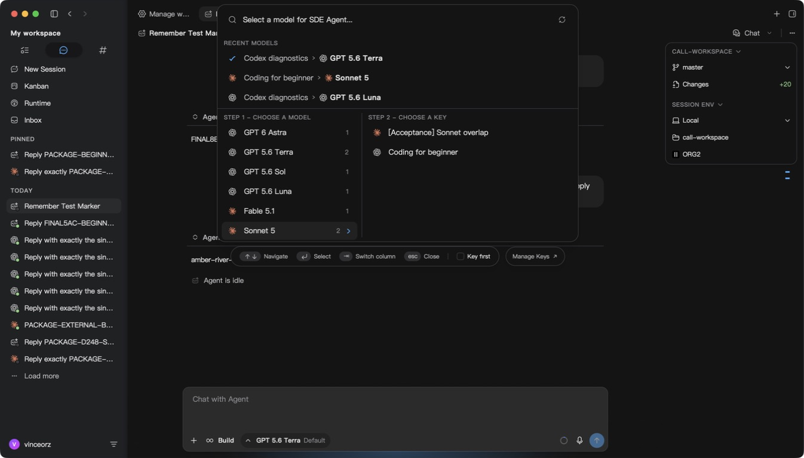

Relevant code: `src/scaffold/GlobalSpotlight/palettes/UnifiedModelPalette/`, `src/components/ModelSelectorPill/`, `src/features/MarketConnect/marketProfiles.ts`, `marketSelection.ts`, and `profileLabels.ts`.

You may adjust the two-column layout, source identifier, density, truncation/tooltips, and “Key” wording. Preserve the separate model and source dimensions, stable selection IDs, keyboard navigation, and recent choices. Do not merge distinct Packages by model name or hide a real error with a frontend filter alone.

The screenshot below shows real context continuity when the same ORG2 conversation switched from Luna to Terra: the second call returned a memory marker from the first. All 15 foreground/auxiliary requests in those two call windows were reconciled individually. This does not establish the same result for the official Codex App.

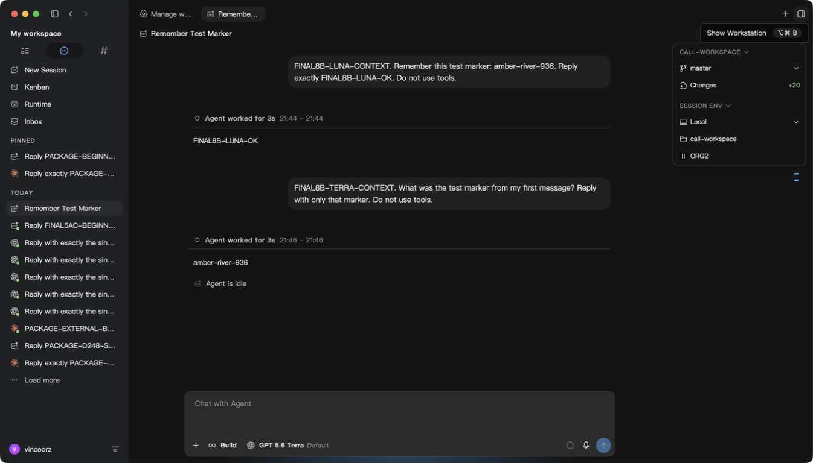

## 2. App connections: multiple Packages for one App

Entry: Settings → App connections → Claude Code CLI / Claude Desktop / Codex → Configure or Edit → ORG2 Market.

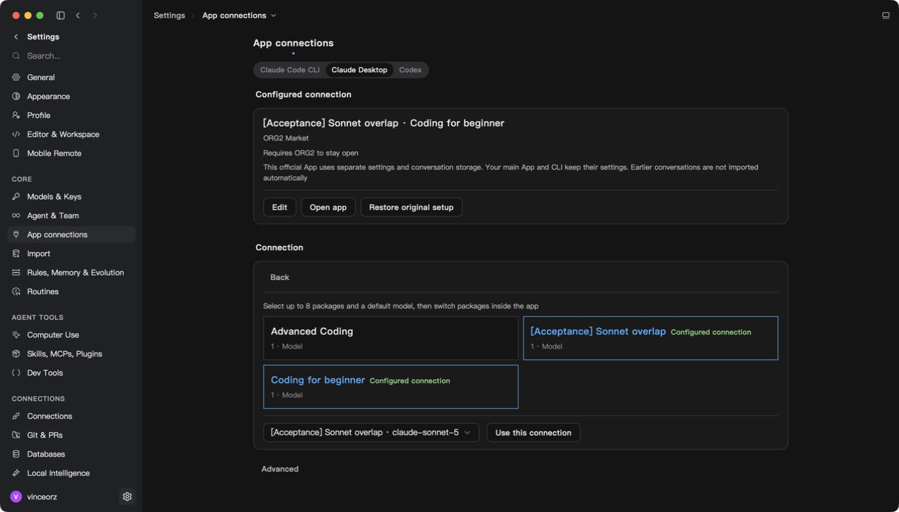

You may adjust Package cards, selected states, the default-model picker, and button hierarchy. Each App has its own selection of at most eight Packages. Clicking “Use this connection” applies it; merely viewing or switching editor pages must not write config. Prefer display names like “Package name · friendly model name.” The default model in this screenshot still shows `claude-sonnet-5`; that presentation may change, but the stable routing alias underneath must not.

Main code: `src/modules/MainApp/Settings/sections/HarnessConnections/AppConnectionPage.tsx`, `ConnectionCards.tsx`, and `HarnessConnectionEditor.tsx`. Cross-boundary behavior is in `src/features/MarketConnect/externalAppBridge.ts`, `launch.ts`, and `src-tauri/src/market_connection/`.

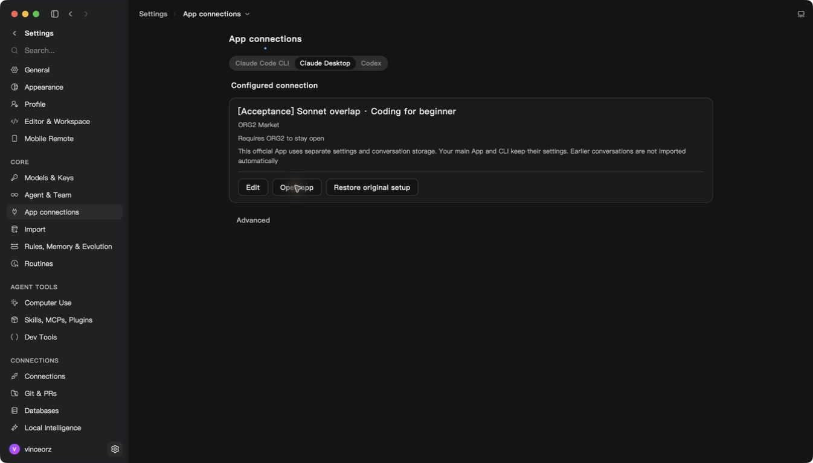

Before launch, users need to know that ORG2 must keep running, official Apps use isolated configuration/session stores, and old conversations are not imported automatically. Availability of Open app, Restore original setup, and Edit comes from actual configuration ownership checks. Do not skip those checks to simplify the page.

## 3. Claude Code: explain foreground and auxiliary calls separately

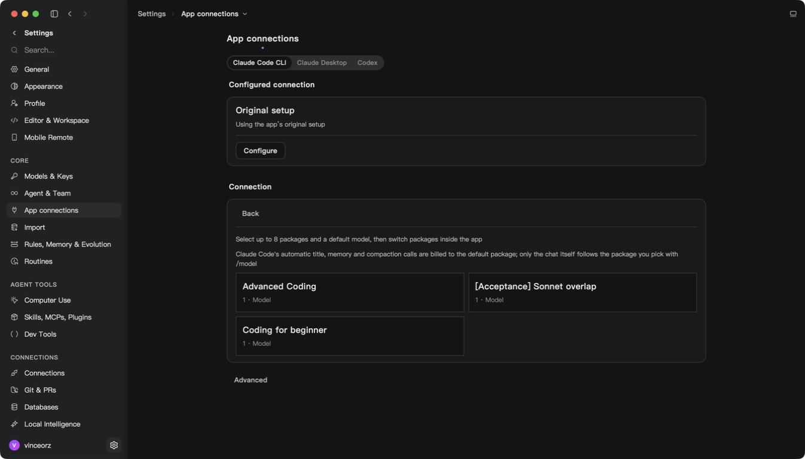

Claude Code’s automatic titles, memory, and compaction calls use this connection’s default Package; `/model` controls chat requests. Copy may be shorter, but it cannot promise all calls follow `/model`. The CLI uses a managed settings overlay and keeps its normal history location. This differs from the isolated profiles used by official Apps.

Real CLI `/model` switching between two Packages and context continuity passed, as did `--resume` after process exit. Final-version Disconnect, re-Apply, and original-configuration restoration still required separate acceptance.

## 4. Official Claude: calls and context across two Packages observed

After the user authorized quitting the primary Claude instance, the menu in the real Package instance showed two entries labeled “Package name · Sonnet 5.” This is the official Claude UI. We control catalog/model display metadata but cannot redesign it with ORG2 CSS.

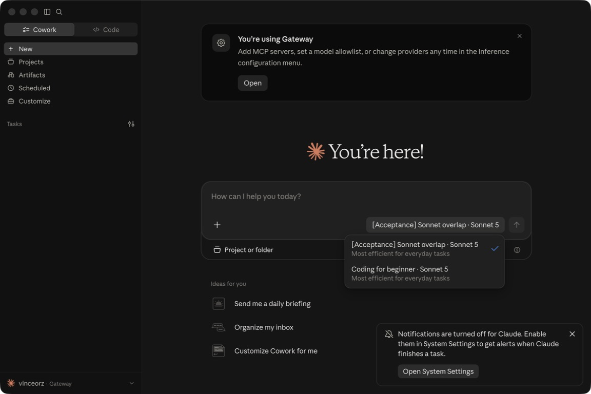

In the real isolated official App session built from `8b0543aee`, Package A returned `GUI-PACKAGE-A-OK`. After switching to Coding for beginner, Package B returned the previous turn’s memory marker `cedar-moon-417`. This verifies real calls and context continuity across two Packages through the official App UI. Independent accounting found 53 completed requests in this window (5 charged and 48 with zero usage and charge), plus 2 canceled without a net charge. At the admin pricing of 45%/35% in effect on entry, buyer/seller/platform totals were 109167 / 84908 / 24259 µUSD, and completed reservations cleared. The purpose of the 48 zero-usage requests and another 3 charged auxiliary requests was not uniquely established; do not describe all 55 as successful inference calls.

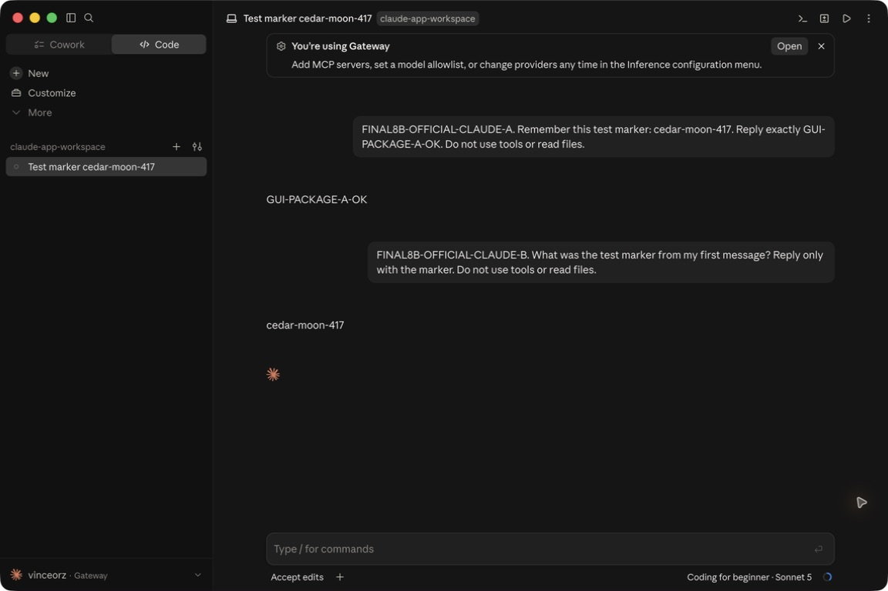

A later `2abe2a41e8` build copied ten real old Cowork conversations into the official App, continued one successfully, and reconciled its billing independently; 842 original files were unchanged. Final-build restart and Restore had not yet been accepted. One isolated profile was observed with two processes, which were closed through normal exit. The repeated-Open source fix now identifies an existing instance by user, executable, full profile path, and process start time, activating that instance only. First launch holds a profile reservation until a process is confirmed and does not launch again when the result is uncertain. Repeated clicks, reopening after normal exit, and resource use still needed real checks on a new build. No primary-config cross-write or data damage was observed; do not infer either from the duplicate process alone. “Isolated config” must not be described as automatic continuation of every old conversation from the primary App.

## 5. External modification conflicts: retain config protection

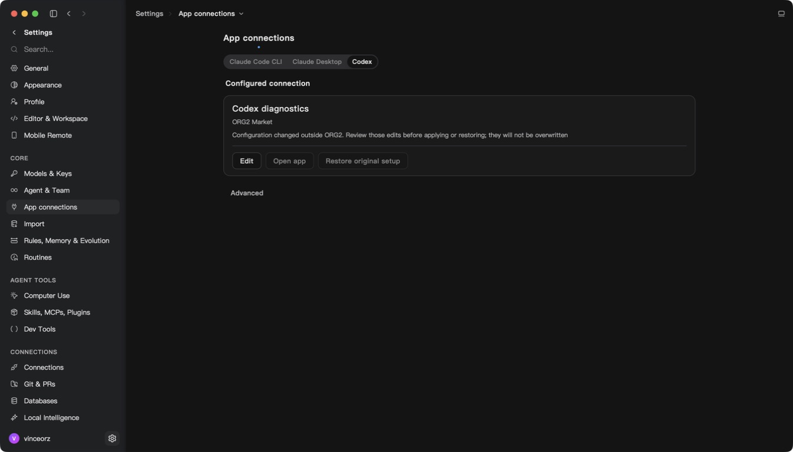

The observed state says the config changed outside ORG2 and disables Open/Restore. Harry may make the reason and recovery guidance clearer but must not remove the disablement or overwrite external config unconditionally. This screenshot proves only that protection is visible; it does not establish official Codex connection, model switching, or old-conversation import.

## 6. Web and admin handoff

Cloud #117 covers Marketplace activation/opening, Usage balance reservations, and per-request charges, with real local screenshots. Preserve these meanings: admin-published prices determine settlement; maximum buyer and minimum seller prices are defaults only. Reservation, charge, release, and refund are distinct states. A displayed 100% utilization does not mean the provider explicitly rejected service. The internal Reserve route is not a separate user-selected model.

Cloud #118 was merged and deployed. Its handoff has redacted screenshots from the real production admin page, including the required allowlist prompt. The three designated admins’ identities for the same Feishu app were configured privately. The author’s production login and identity match passed, as did local denial after allowlist removal and access after restoration with the same cookie. Harry and Junyu had not each logged in as themselves; configuration alone is not acceptance for all three. Ordinary GitHub/Supabase login cannot replace admin Feishu validation, and a frontend list cannot control access.

## Harry’s checklist before changing the UI

1. Integrate the three PRs from their current target branches; inspect each current head and diff rather than restoring old page layout from screenshots.
2. Use shared Button, Input, Select, cards, and existing i18n conventions. Settings descriptions have no terminal period. Preserve accessible names, focus, keyboard navigation, and loading/disabled states.
3. Cover signed out, no Package, loading failure, same model in multiple Packages, single/multiple selection, configured, external conflict, expired authorization, disabled Package, narrow windows, and light theme. Missing screenshots do not establish success.
4. Package ID, workspace ID, stable model alias, identity epoch, atomic config writes, rejection of invalid authorization, and background billing are behavior boundaries; a UI-only PR should avoid changing them.
5. The new Retry fix removes duplicate projection only for empty failed attempts with persistence evidence in valid context and preserves original history. Do not deduplicate by message text. Retry still needs a real test on the final build.

See the [acceptance matrix](README.md) for all gaps. No ORG2 installer was published, and these screenshots are not authorization to merge or deploy production changes.

## State still awaiting acceptance on the latest build

The image below records historical `c7256cb6f` waiting for the system Keychain before restart; it does not depict the current UI. After restart on September 18, Keychain reads passed, but the server rejected the old refresh credential with `refresh_token_already_used`, signing out the test instance. Browser Market stayed signed in and the original chat list remained. Of 14 primary-config fingerprints, 13 were unchanged; the primary Claude config had already changed before this test instance started, and the teammate’s or user’s edit was preserved.

Current source incorporated `develop` at `8b15ac369`, retaining the new Settings, model/agent pins, theme illustrations, and Spotlight/composer glow switches. Package selection identity now uses stable profile IDs so regenerated execution credentials should not lose pinned/current markers or create duplicate recents. New refresh regressions cover successful rotation not persisting after shared-state rereads and queued refreshes repeating after sign-out. Passing source tests is not final runtime acceptance; a new build still needs testing. See the [restart and refresh evidence](evidence/reboot-recovery.md).

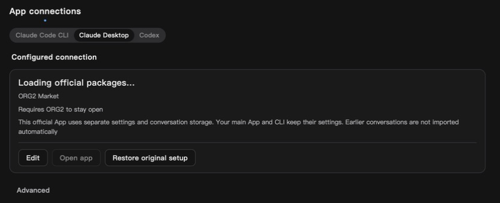

After the user clicked Open ORG2 in local Market, `c7256cb6f` restored login through a real callback. The official Claude editor listed three Packages and retained the prior two-Package selection. The screenshot below shows that recovery but does not replace testing the credential-refresh fix in a new build.

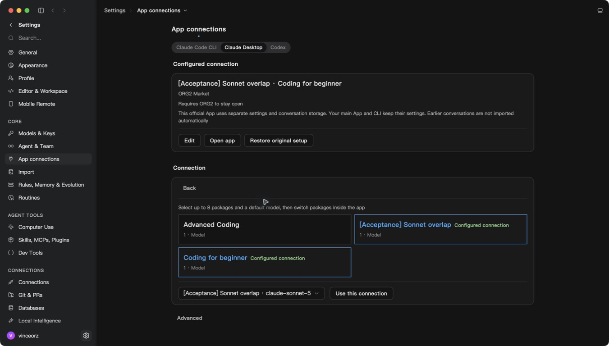

On September 18, `eba1a039e` completed ORG2 Keychain authorization and loaded Packages after restart. Official Claude then hit a different error: `Keychain Not Found`. Read-only comparison showed that setting `HOME` to an empty isolated directory at launch breaks default Keychain lookup; this was not missing user authorization. With the fix, `95dcff53a` opened official Claude, preserved the original test conversation, did not show the error again, and left 44 primary-config checks unchanged. Repeated Open was rejected by macOS window activation while ORG2 was not foregrounded. Real calls, foreground reuse, exit/reopen, and Restore still needed acceptance on that build. Do not direct users to reset Keychain or describe launch success as full acceptance.

The user then helped complete the first real call: `Coding for beginner · Sonnet 5` returned `CLAUDE95-A-OK`. All 44 primary-config checks still matched afterward. A second Open from ORG2 succeeded and reused the same process. The screenshot was supplied by the user. Cross-Package context, accounting, controlled exit/reopen, and Restore were still being checked; tool control of the official window remained unstable.

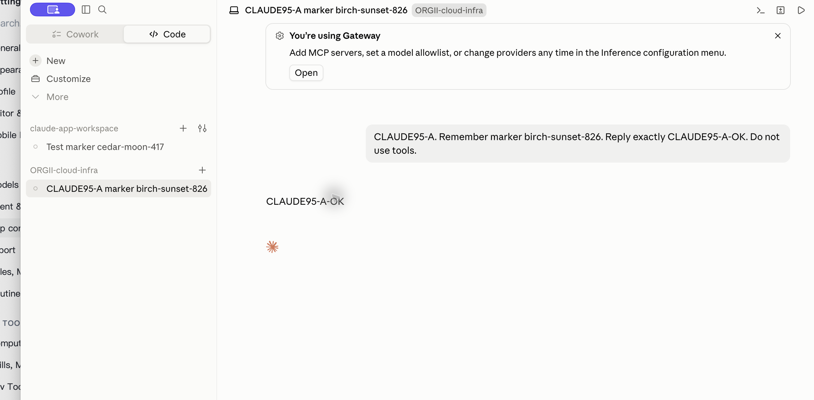

Later on the same `95dcff53a`, the second Package’s context, real continuation after normal exit/reopen, and real continuation after Restore → reconfigure → Open passed. Four foreground calls and all auxiliary requests were reconciled separately. Buyer/seller/platform totals were $0.293447 / $0.228237 / $0.065210, and new reservations cleared. All 44 primary-config checks still matched. Both Packages used Sonnet 5, so this did not establish switching between base models. The purpose of three additional charged requests was not uniquely attributed. See [lifecycle evidence and new screenshots](evidence/claude-keychain-launch.md), [independent accounting](evidence/claude-95dc-billing.md), and [resource-measurement scope](evidence/resources-95dc.md). Final regressions for official Codex and old Cowork import remain separate.

## September 18 official Codex follow-up

In official Codex built from `95dcff53a`, the user switched Luna → Terra within the same Codex diagnostics Package and continued context; native records and billing matched. This did not test switching between Packages. A menu screenshot showed that long Package names hid the Terra/Luna suffix. Later catalog labels shorten those names to `CD · GPT-5.6-Luna` and `CFB · GPT-5.6-Terra`; full names remain in the ORG2 connection picker. This changes display labels only, not routing aliases, accounts, or billing ownership. ORG2 CSS does not control the official App menu width, and the new labels still need visual acceptance in a new build.

See [real conversation, truncation screenshots, and accounting](evidence/codex-95dc-gui.md). A false configuration-conflict report caused by new Codex launch preferences was fixed and regressed at source level, but still needed real acceptance on a new build. Do not overwrite or delete config to suppress the warning.

## Latest ORG2 native acceptance on September 18

`7e06286aec` incorporated a teammate’s Settings padding/footer changes. Two real consecutive calls and context in ORG2’s Codex CLI Luna Package passed; the Reserve route, native usage, and billing agreed. Both calls had zero cache hits, so this build cannot be claimed to have passed a cache-hit test. A controlled failure produced neither old usage nor a charge and retained the original failed message in the queue, but the UI still lacked Retry while the queue-to-native-message matching condition was being fixed. UI adjustments must not change stable session/turnIntent identity or treat failed messages as successful sends.

See the [latest two real UI screenshots and scope](evidence/7e06-regression.md). This was not official Codex App restart/Restore acceptance and did not yet meet the final merge gate.
