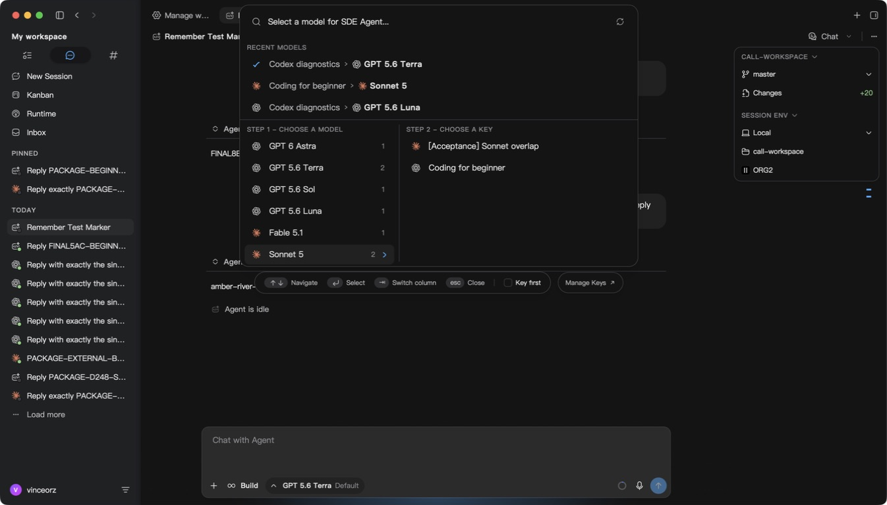
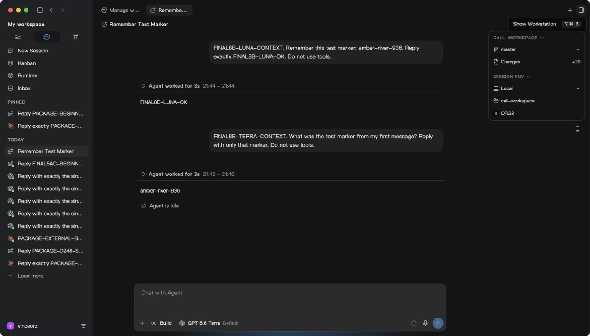
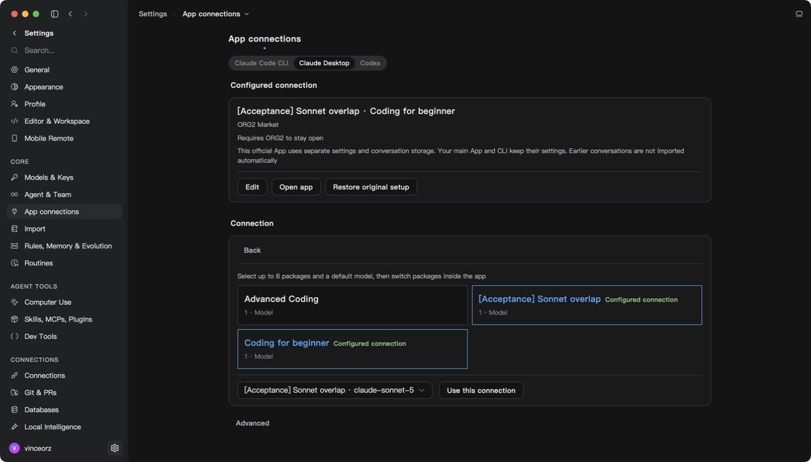
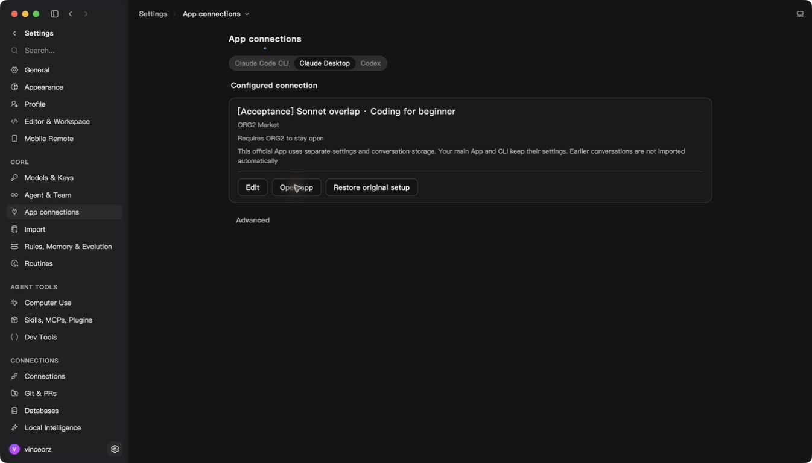
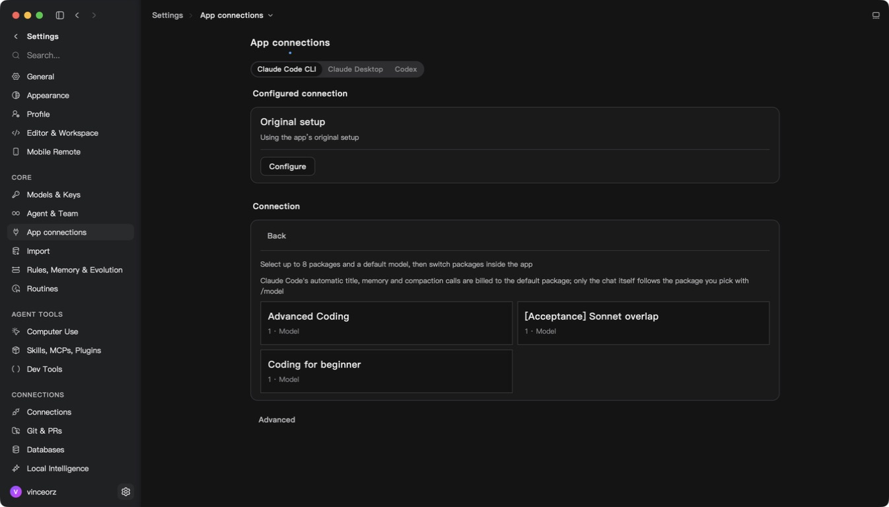
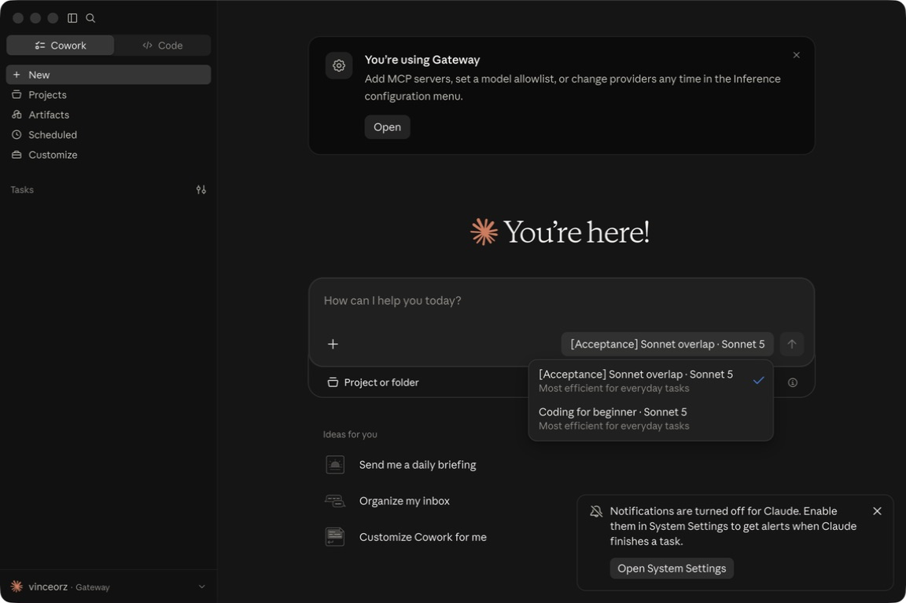
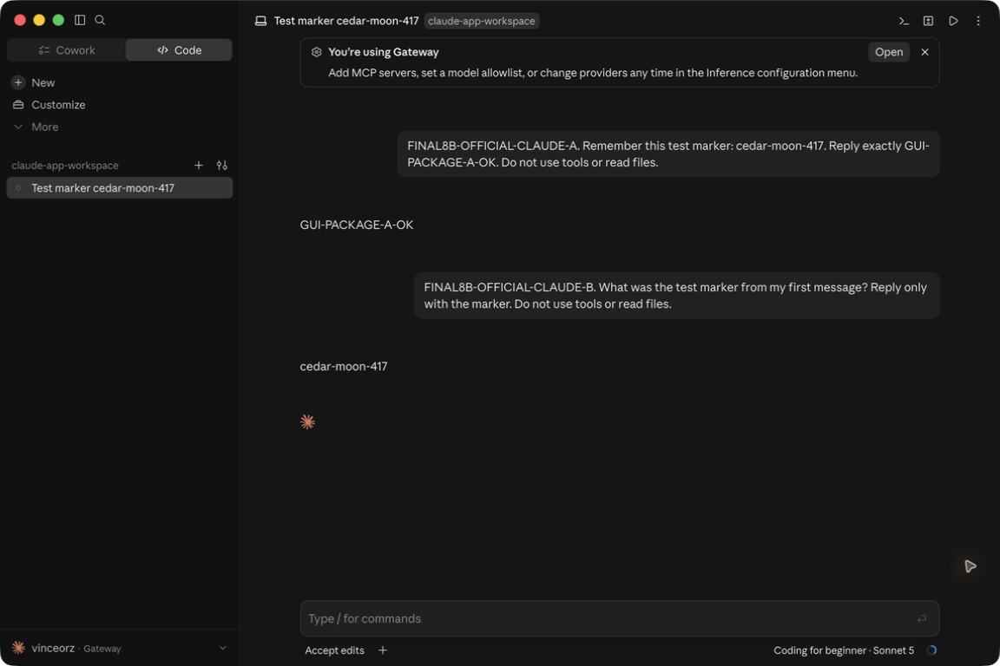
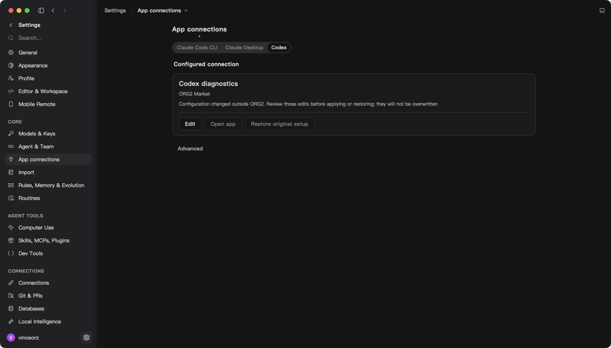

> 交接更新：用户已授权先合入这版已验证的源代码，前提是按功能整理后 CI 通过。以下历史报告中的“暂不能合并”是当时的状态；未完验收仍按 README 保留，不发布 ORG2 安装包。

> 最新 `2a048d9e0b`：完整前端 2,101 个测试文件通过；真实第九轮续聊、九轮导航及单次结算核对通过。本次无缓存命中，缓存与配置恢复仍引用 `91725` 的实测，不混写构建。见[最新截图与报告](evidence/2a048-final-source-regression.md)。旧状态说明按其构建理解。

> 9 月 18 日最新验收：`91725d650d` 已通过八轮历史/导航、重启续聊、缓存核账和 Codex 配置恢复。新截图见 [最终回归报告](evidence/91725-final-regression.md)。官方 Codex 双套餐切换与恢复后调用、主对话导入仍未通过，PR 暂不宣称可合并。以下历史截图严格按各自构建理解。

> 最新 `3efe`：连续两次原消息 Retry 的真实调用、上下文和单次计费已核对；第二次成功回复在 UI 被消息身份碰撞丢弃，旧失败诊断还误归到了前一轮，仍在修复，暂不能合并。详见 [本轮验收](evidence/3efe-retry-chain.md)。以下截图和历史报告以各自标注的构建为准。

# Package 功能 UI 交接：Harry

以下一段为 `b02d` 的历史验收说明，最新状态以上方链接的验收矩阵为准：真实套餐调用与 Market 缓存计费通过，但 Codex CLI 本地用量统计重复计入缓存，本地对话失败后缺少原消息 Retry 状态（早先 Cloud 归因已更正），官方 Codex 正常修改模型/偏好仍触发配置冲突。这三处正在补源边界修复与新构建验收；不要把时间线 `Replay turn` 当成重新调用，也不要为了恢复按钮可点而去掉配置保护。Claude Code CLI 的配置/断开已确认不修改原账号文件。详见[当前回归证据](evidence/b02d-regression.md)。

这份交接对应 [ORG2 #1937](https://github.com/org2AI/ORG2/pull/1937)、[Cloud #117](https://github.com/org2AI/ORGII-cloud-infra/pull/117)、[Cloud #118](https://github.com/org2AI/ORGII-cloud-infra/pull/118)。#1899 和 Cloud #104 / #105 是前序功能，不要从旧分支复制整页覆盖同事后续 UI。

截图拍摄于 2026-09-17 晚（温哥华），来自本地验收实例。ORG2 截图运行的是 `8b0543aee38373a49674e803c00ca416310423e0`；随后提交的 Retry、缓存用量、身份续期修复尚未进入该二进制。这是实际界面与行为交接，不是最终版本全部验收通过的声明。当前截图只有深色主题，浅色、窄窗口、加载/空状态需在 UI 调整后回归。

## 分工与改动范围

| PR                         | Harry 需要关注的界面                                                     | 功能边界                                                                                            |
| -------------------------- | ------------------------------------------------------------------------ | --------------------------------------------------------------------------------------------------- |
| ORG2 #1937，base `develop` | 聊天模型/套餐来源；Settings → App connections；套餐显示名、错误/恢复提示 | 套餐成为可选来源；每个外部 App 可同时配置最多 8 个套餐与一个默认模型；CLI 和官方 App 的隔离方式不同 |
| Cloud #117，base `main`    | 现有 Marketplace / Usage 的状态语义                                      | 本 PR 只有后端功能与交接文档，没有新增页面。余量判断、Reserve、轮换、预留款状态不能由 UI 猜测       |
| Cloud #118，base `main`    | `/admin` 登录、拒绝、未配置、本人身份展示                                | 公司飞书租户与显式管理员名单同时满足才可进入；不是所有公司成员都能进入                              |

Cloud 各 PR 附有独立截图及中文交接。#117 的 Marketplace/Usage 截图来自旧验收 Console，只作业务状态参考；最新 `main` 已有同事的新导航和 `PackageModelsTable`。#118 截图包含已整合的新导航。请以最新 `develop` / `main` 的组件和设计规范为样式基线。

## 1. 聊天：像账号 Key 一样选择套餐来源

入口：聊天输入框模型按钮 → Switch model → 选择模型 → 选择来源。相同 Sonnet 模型可以来自两个不同套餐；最近使用项应同时让人看清套餐与模型。切换聊天来源不会悄悄修改外部 App 的配置。

涉及：`src/scaffold/GlobalSpotlight/palettes/UnifiedModelPalette/`、`src/components/ModelSelectorPill/`、`src/features/MarketConnect/marketProfiles.ts`、`marketSelection.ts`、`profileLabels.ts`。

可以调整两栏布局、来源标识、密度、截断/tooltip 和“Key”文案。保留模型与来源两个维度、稳定选择 ID、键盘导航和近期选择；不能按模型名合并掉不同套餐，也不能把真实错误仅用前端过滤掉。

以下是同一 ORG2 对话 Luna → Terra 的真实上下文延续：第二次调用返回第一次的记忆标记。两次调用所属窗口的 15 笔前台/辅助请求已逐笔核算；这不代表官方 Codex App 已完成相同验收。

## 2. App connections：一个 App 同时接入多个套餐

入口：Settings → App connections → Claude Code CLI / Claude Desktop / Codex → Configure 或 Edit → ORG2 Market。

可以调整套餐卡片、已选状态、默认模型选择器和主次按钮。最多 8 个套餐，每个 App 保留自己的选择。点击 Use this connection 才应用；查看/切换编辑页不应写入配置。显示名称建议统一“套餐名 · 友好模型名”；此图默认模型还显示 `claude-sonnet-5`，是可改的呈现项，不能同时改变底层稳定路由别名。

主要源码：`src/modules/MainApp/Settings/sections/HarnessConnections/AppConnectionPage.tsx`、`ConnectionCards.tsx`、`HarnessConnectionEditor.tsx`；跨边界逻辑位于 `src/features/MarketConnect/externalAppBridge.ts`、`launch.ts` 与 `src-tauri/src/market_connection/`。

“ORG2 需要保持运行”“官方 App 使用独立配置/会话存储”“旧对话不会自动导入”必须让用户在启动前知道。Open app、Restore original setup、Edit 的可用性来自实际配置所有权，不能为了简化页面跳过检查。

## 3. Claude Code：前台模型和辅助调用分别说明

Claude Code 的自动标题、记忆、压缩调用走此连接的默认套餐；`/model` 选择控制聊天请求。UI 可以精简文案，但不能承诺所有请求都跟随 `/model`。CLI 使用受管 settings overlay，保留正常历史位置；这和官方 App 的独立 profile 不是同一种隔离。

真实 CLI `/model` 双套餐与上下文已验证；进程退出后的 `--resume` 已验证。最终版本的 Disconnect / re-Apply / 原配置恢复仍需单独验收。

## 4. 官方 Claude：双套餐调用与上下文已实测

用户授权退出主 Claude 后，实际套餐实例的菜单显示两项“套餐名 · Sonnet 5”。此截图是官方 Claude 的界面，我们控制目录/模型显示元数据，不能通过改 ORG2 CSS 改造它。

在 `8b0543aee` 的真实隔离官方 App 同一会话中，套餐 A 完成调用并返回 `GUI-PACKAGE-A-OK`；切换至 Coding for beginner 后，套餐 B 正确返回前一轮的记忆标记 `cedar-moon-417`。这是通过官方 App 界面完成的双套餐真实调用与上下文验收；独立核算本窗口共 53 笔 completed（5 笔有费、48 笔零用量零费），另 2 笔 canceled 无净扣费；按入场时管理员 45%/35% 定价，买家/卖家/平台合计 109167 / 84908 / 24259 µUSD，completed 的预留已清零。48 笔零用量请求及另外 3 笔辅助收费请求的目的尚未唯一证明；不能写成 55 次推理全部通过。

在后续 `2abe2a41e8` 运行版本中，官方导入功能已复制 10 条真实旧 Cowork 对话，其中一条续聊成功并独立核对计费；842 个原始文件未变。最终构建的重启和 Restore 尚未验收。观察到同一隔离 profile 曾出现两个进程，已通过正常退出关掉重复实例。重复 Open 的源码修复现在按用户、可执行文件、完整 profile 路径和进程启动时间识别已有实例，命中后仅激活该实例；首次启动在确认进程前保留 profile 启动占位，结果不确定时不再次启动。新构建的重复点击、正常退出后重开和资源占用仍须实测。尚未发现主配置串写或数据损坏，不应从重复进程直接推断这些后果。不要把“独立配置”写成“自动续聊主 App 的所有旧对话”。

## 5. 外部修改冲突：保留配置保护状态

当前真实状态显示“配置在 ORG2 之外发生修改”，Open / Restore 禁用。Harry 可以提升原因和恢复指引的清晰度，但不能把禁用移除或无条件覆盖外部配置。这里只证明保护状态可见，不证明官方 Codex 已完成接入、模型切换或旧对话导入。

## 6. Web 与管理员交接

Cloud #117 的交接覆盖 Marketplace 启用/打开、Usage 余额预留和逐笔收费，附本地真实截图。保留以下语义：管理员发布价格为结算依据，最高买价/最低卖价只是默认值；预留、已扣费、释放预留和退款是不同状态；显示 100% 使用率不等于供应商明确拒绝。不能把内部 Reserve 路由当成用户另选的模型。

Cloud #118 已合并上线，交接包含真实生产管理员页面与必填名单提示的脱敏截图。三位指定管理员的同一飞书应用身份已私下配置；本人生产登录与身份匹配已验收，本地同一 cookie 的撤销名单后拒绝、恢复后放行也已通过。Harry 和 Junyu 尚未各自真人登录，不能把配置完成写成三人验收完成。普通 GitHub/Supabase 登录不能代替管理员飞书校验，也不能由前端名单控制访问。

## Harry 开始改 UI 时的检查清单

1. 从对应最新目标分支整合这三项 PR；先看 PR 当前 head 和 diff，不以截图中的旧外壳恢复布局。
2. 沿用共享 Button / Input / Select / 卡片及现有 i18n 约定；设置描述末尾不加句号。保留无障碍名、焦点、键盘导航、loading/disabled 状态。
3. 覆盖未登录、无套餐、加载失败、同模型多套餐、单/多选、已配置、外部冲突、授权过期、已停用套餐，以及窄窗口/浅色主题。未拍到的状态不等于通过。
4. 套餐 ID、workspace ID、稳定模型 alias、身份 epoch、原子配置写入、失效授权拒绝、后台计费都属于行为边界；纯 UI PR 应避免改动。
5. Retry 新修复只删除有持久化证据的空失败尝试在有效上下文中的重复投影，保留原始历史；不能做“同文本去重”。最终新构建 Retry 仍要实测。

完整验收缺口以[验收矩阵](README.md)为准。当前没有发布 ORG2 安装包，也没有把这些截图当作合并或生产部署的许可依据。

## 最新构建仍待验收的状态

下图记录 `c7256cb6f` 在重启之前等待系统钥匙串的历史状态，不能代表当前界面。9 月 18 日重启后，钥匙串读取已通过，但旧刷新凭据被服务端以 `refresh_token_already_used` 拒绝，测试实例退出登录；浏览器 Market 保持登录。原聊天列表保留。14 项主配置指纹中有 13 项不变，另一项主 Claude 配置在本次测试实例启动前就已改变，已保留同事或用户的修改。

当前源码已整合 `develop` 的 `8b15ac369`，保留新 Settings、模型/agent 固定、主题插画与 Spotlight/输入框光效开关。套餐选择身份改用稳定的 profile ID，同一套餐重新生成执行凭据后，不应丢失固定/当前标记或产生重复最近使用项。新的刷新回归覆盖共享状态重读导致成功旋转未持久化，以及退出登录后排队刷新重复发送的问题。源码测试通过不等于最终运行验收通过；新构建仍需实测。详见[重启与刷新证据](evidence/reboot-recovery.md)。

用户在本地 Market 点击 Open ORG2 后，`c7256cb6f` 已通过真实回调恢复登录，官方 Claude 编辑页读到三个套餐，原有双套餐选择保留。下面是这次恢复后的实际截图；仍不能代替新凭据刷新修复的构建验收。

9 月 18 日的 `eba1a039e` 已完成 ORG2 钥匙串授权，重启后套餐加载成功。随后官方 Claude 出现另一种错误：`Keychain Not Found`。只读对照确认启动时把 `HOME` 指向空隔离目录会导致默认钥匙串查找失败；这不是用户未授权。修复后的 `95dcff53a` 已实际打开官方 Claude，原测试对话仍在，没有再出现该错误，44 项主配置文件检查未变。重复 Open 被 macOS 窗口激活拒绝，当时 ORG2 不在前台；这一版的真实调用、前台复用、退出重开与 Restore 仍待验收。不要引导用户重置钥匙串，也不能把启动成功写成完整验收通过。

随后用户协助完成第一笔真实调用，`Coding for beginner · Sonnet 5` 返回 `CLAUDE95-A-OK`，调用后 44 项主配置检查仍一致。再次从 ORG2 Open 成功并复用同一进程。以下为用户提供的实际截图；跨套餐上下文、对账、受控退出重开与 Restore 仍在验收，工具操作官方窗口仍不稳定。

补充：同一 `95dcff53a` 已完成第二套餐上下文、正常退出重开后的真实续聊，以及 Restore → 重新配置 → Open 后的真实续聊。四次前台调用与全部附加请求分别对账，总买家 $0.293447、卖家 $0.228237、平台 $0.065210，新增预留清零。44 项主配置检查仍一致。两套餐本次都使用 Sonnet 5，不代表不同基础模型切换已通过。额外三笔有费请求的具体用途仍未唯一归因。详见[生命周期与新截图](evidence/claude-keychain-launch.md)、[独立对账](evidence/claude-95dc-billing.md)、[资源测量范围](evidence/resources-95dc.md)。官方 Codex 及旧 Cowork 导入历史的最终回归仍单列。

## 9 月 18 日官方 Codex 补充

用户在 `95dcff53a` 官方 Codex 中完成同一 Codex diagnostics 套餐内 Luna → Terra 切换及上下文续聊，原生记录和账单匹配；这还不是双套餐切换。菜单截图证实长套餐名遮住了 Terra/Luna 后缀。后续目录标签将长套餐名缩写为 `CD · GPT-5.6-Luna`、`CFB · GPT-5.6-Terra`，完整套餐名保留在 ORG2 连接选择界面。此改动只改变显示标签，不改变路由别名、账号或计费归属。官方 App 的菜单宽度不由 ORG2 CSS 控制，新标签仍须新版实际视觉验收。

[真实对话、截断问题截图与核账结果](evidence/codex-95dc-gui.md)。Codex 启动新增运行偏好导致的误判冲突已在源码修复并通过回归，仍待新构建真实验收；不能强制覆盖或删除配置来消除提示。

## 9 月 18 日最新 ORG2 原生验收

`7e06286aec` 已整合同事的 Settings padding/footer 改动。ORG2 内 Codex CLI 的 Luna 套餐连续两次真实调用与上下文通过，Reserve 路由、原生用量和账单一致；两次缓存均为零，不能声明新构建缓存命中通过。受控故障没有产生旧用量或收费，队列已保留原失败消息，但界面仍漏掉 Retry，正在修复队列到原生消息的匹配条件。UI 调整不要改变稳定 session/turnIntent 身份或把失败消息当作普通发送完成。

[最新两张真实界面截图及范围](evidence/7e06-regression.md)。这不是官方 Codex App 的重启/Restore 验收，也尚未通过最终合并门槛。
