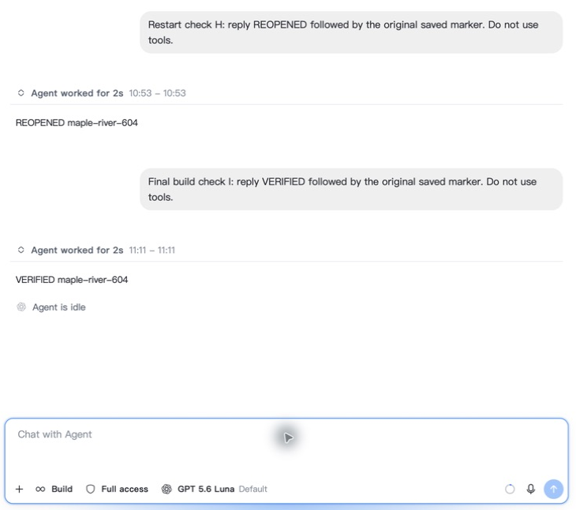

# 2a048 final source regression — September 18

Immutable source `2a048d9e0bd24a104a89b9a0c003b9879d9e571e` includes develop
`785402f812`; a fresh fetch confirmed that base is current. The only production
change since `91725` is unchanged helper extraction to satisfy the 700-line
source gate. Pipeline identity helpers and Cloud refresh-scope helpers now live
in small owning modules; locking, network refresh and persistence remain intact.

## Actual latest-build continuation

The private signed debug build opened the existing eight-turn conversation with
all A–H prompts and replies and exactly eight navigation entries. One new I
request returned VERIFIED with the original saved marker, then became idle with
exactly nine navigation entries. No transcript cleanup was performed.

This actual capture is cropped to the conversation and composer. H belongs to
`91725`; I is the new request executed on `2a048`.

## Independent accounting

I added exactly one request, one attempt and four postings. Provider/native usage
matched at 15,758 fresh input, zero cached input and 11 output tokens, total
15,769. Frozen admin 55%/35% pricing settled buyer 1,741, seller 1,108 and platform
633 microUSD. New holds and supplier load returned to zero. Protected historical
rows, prior native usage and auxiliary usage remained unchanged.

A–I total nine requests/attempts and 36 postings, settling buyer 8,795, seller
5,597 and platform 3,198 microUSD across four builds. I has no cache hit; positive
cache evidence remains C/E/G/H. The three controlled failure phases added zero
usage or charges. This remains the same healthy Luna-to-Reserve supplier route,
not evidence of distinct-seller rotation or a production adapter deployment.

## Local source verification

- `pnpm test`: 2,101 test files passed; 15,831 tests passed, three expected failures
  and two skipped, in 278.63 seconds.
- Focused pipeline/caller tests: 236 passed; Cloud refresh tests: 71 passed.
- Fast typecheck, scoped ESLint and normal commit hooks passed.
- Full PR changed-file checks: 44 TypeScript source files within the length gate,
  77 files passed ESLint, test placement passed across 606 directories and 27
  i18n checker tests passed.
- Private debug build and strict signature verification passed. No installer,
  Beta, tag or release was produced.

The earlier `1e7` remote Frontend check stopped at two file-length violations.
This extraction fixes those violations locally; new-head GitHub checks remain
independent and required after push. Exact source commands are in
[verification commands](final-verification-commands.md).

## Scope and remaining gates

The explicit Codex Configure/Restore and bounded resource measurements were made
on `91725`, as recorded in [that report](91725-final-regression.md). They were not
repeated on `2a048`; this report establishes final-source startup, restored history
and a real continuation. Official Codex GUI dual-Package/reopen inference, primary
chat import, production adapter delivery and the other open matrix items remain
unverified or unimplemented. Under the owner’s subsequent first-version merge authorization, current-head CI
and an unchanged reviewed production tree gate source merge; the remaining
acceptance items gate the broader rollout claims, not this bounded source merge.
Main accounts and historical billing were preserved.
