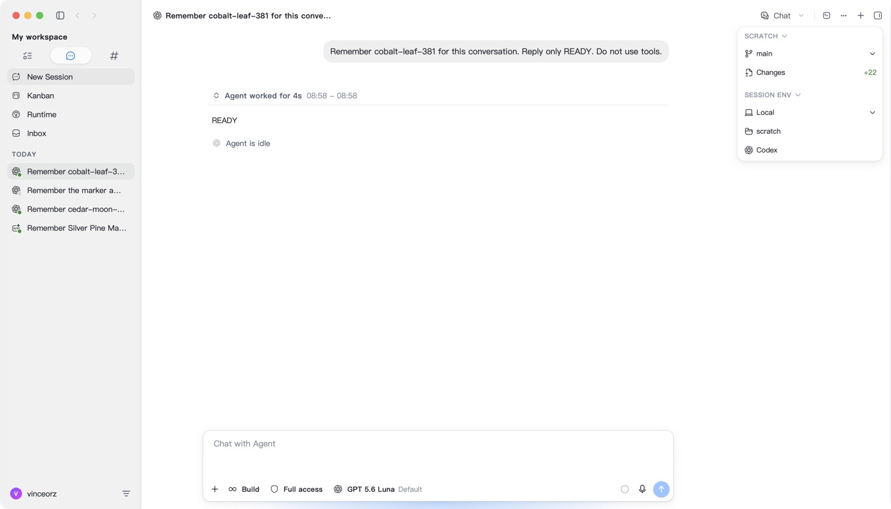
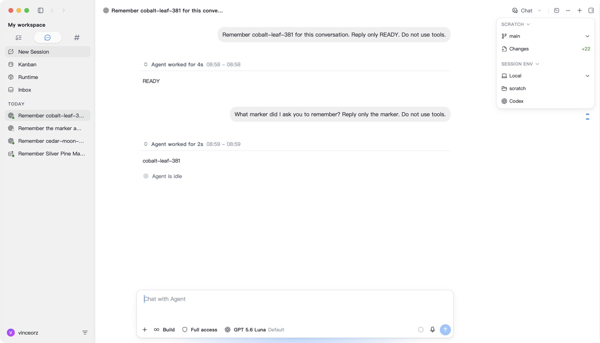

# 7e06 real native regression — 2026-09-18

Measured immutable source: `7e06286aecb1daa6c62d2a180c56677a3e19eb5a`,
including develop through `ca26083221`. The same isolated test root was
preserved across normal Quit/relaunch. No credentials were copied. No installer,
Beta, tag or release was published.

## Passed: actual Luna Reserve, context and settlement

The latest ORG2 Codex CLI GUI selected Codex diagnostics / Luna. At 15:58 UTC,
a fresh conversation returned READY; the second prompt omitted the marker
and correctly recalled it at 15:59 UTC. This is ORG2's Codex CLI GUI, not the
official Codex App.

| Call | Upstream input | Cache read | Output | Buyer / seller / platform (micro-USD) |
| ---- | -------------: | ---------: | -----: | ------------------------------------: |
| A    |           8117 |          0 |      5 |                       896 / 570 / 326 |
| B    |           8187 |          0 |     22 |                       915 / 582 / 333 |

Native persisted usage, actual terminal events, archived journal and PostgreSQL
settlement agree. Gateway traces prove both calls used the same supplier's
Reserve through local adapter s4 after ordinary quota was exhausted. This is
Reserve fallback, not a test of switching supplier accounts. All new holds
returned to zero, with frozen administrator pricing applied.

The local test CPA was upgraded to the previously audited Reserve implementation;
this was not a production rollout. Authenticated model registration alone was
not treated as inference evidence. Both actual calls had zero cache reads, so
this does not replace the earlier 2441 positive-cache acceptance or prove a
positive cache hit on this build.

## Passed: failed turn creates no stale usage or charge

After B completed, the local gateway alone was gracefully stopped. C failed
with a real connection 502. Market remained at 348 requests, 280 attempts and
743 postings; native usage remained at 13 rows with identical contents.
No old usage was reinserted, and no charge or new hold was created. Gateway
restart restored HTTP 200 health/readiness. Protected historical records
including the 9252-micro-USD hold and unresolved 2306-micro-USD request were
unchanged. All 44 protected primary-file checks remained unchanged.

## Pending: visible original-message Retry and restart/Restore

The failed intent and original queue owner now remain persisted with explicit
dispatch required and a durable failed lineage. The native terminal diagnostic
has no assistant output or usage. However, the live UI still did not expose
Retry after settlement. The queue-to-visible-message projection is under
investigation; no Retry was clicked and no historical state was repaired.

Successful final-build Retry, normal restart/resume and official Codex
reopen/Restore are still required. The successful calls above do not close
those acceptance gaps or authorize a claim of complete final regression.

## Follow-up source correction

The actual Codex imported user record has no `backendPersisted` field. The
queue projection used that field to decide whether to overlay the retained
failed owner; the native same-intent row then suppressed the fallback row.
The correction recognizes the strict native user structure within the same
session and intent, without fabricating persistence metadata or overriding an
explicit sent state. Existing assistant/tool/reasoning rows remain intact.

The shared raw JSON fixture is checked by the Rust parser and then exercises
the actual session-scoped chat atom, failed-header guard and rendered enabled
Retry control. The existing double-click retry test now consumes that real
record shape and verifies one queue owner and one newly minted intent.
All three new UI regression cases fail against the previous production
implementation and pass with the correction. Eight related frontend suites /
113 tests, the Rust parser fixture, fast typecheck and changed-file ESLint
passed. Independent review found no added scan, cache or polling loop: the
existing projection remains O(events + queue).

These source checks do not claim the next binary's actual Retry or settlement
has passed. The measured `7e06` records and history were not rewritten.
