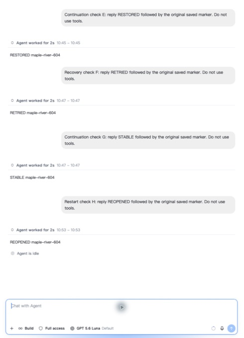
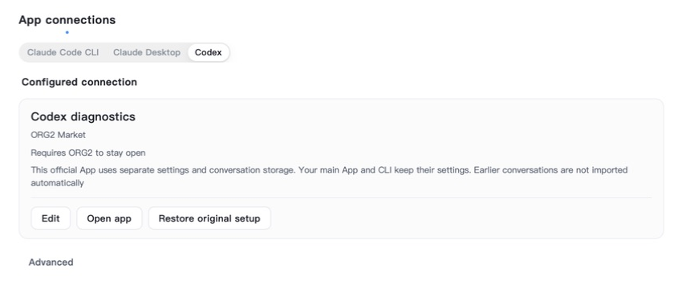
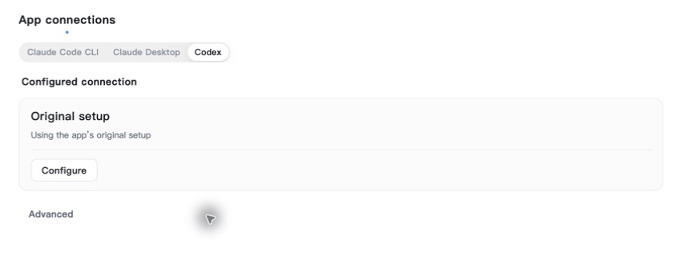

# 91725 final native regression — September 18

Immutable source `91725d650d` includes develop `785402f812`. This report covers
ORG2's Codex Package conversation and configuration surfaces. It does not claim
new official Codex GUI inference or a production CPA adapter deployment.

## Preserved history and repeat restart

The App opened the existing A–G conversation and showed all seven real user turns,
including A's READY and D's RECOVERED response. The navigator showed exactly seven
entries. The retained failed-attempt audit stayed visible without becoming another
turn. No raw history was rewritten to obtain this result.

A real H request then returned REOPENED with the original marker, proving context
survived the restart and prior three Retry execution links. Navigation updated to
exactly eight turns. A second normal Quit/reopen of the same immutable binary
retained all eight prompts and replies, with no new inference, charge or usage.

The screenshot is cropped to the actual conversation and composer for readability.
E–G were originally executed on `300203`; H was executed on `91725`. Their display
in the final build does not change those execution origins.

## Billing and cache

H used one Luna-to-Reserve request and one attempt, settling buyer 263, seller 168
and platform 95 microUSD at frozen admin 55%/35% settings. Its fresh 837 + cached
14,848 + output 12 = 15,697 native tokens matched provider accounting without
counting cache twice. New holds returned to zero and protected historical records
remained unchanged.

Across A–H, eight requests/attempts and 32 postings settled buyer 7,054, seller 4,489
and platform 2,565 microUSD. The B/D/F failed phases each added zero billing/usage.
A–D ran on `3efe`, E–G on `300203`, and H on `91725`. This is a multi-build evidence
chain, not eight fresh final-build requests. Cache was positive in C/E/G/H.

## Resources

Five short visible-idle samples after the call measured 0.04–0.38% CPU after the
first sample, with summed tracked physical footprint 604.64–836.85 MiB. Five samples
after the hide shortcut measured 0.11–0.13% and 708.58–709.27 MiB. Three samples after
normal Quit found zero remaining CPU/footprint for the exact tracked app/WebKit
process identities. The same binary then reopened successfully.

These measurements exclude external CLI/tool processes and do not establish
sustained active-load, long-term memory, or whole-machine performance. The hide
shortcut sample is not an independent assertion of document visibility state.

## Explicit Codex configuration restoration

On `91725`, App connections selected the existing Codex diagnostics/Luna Package
and applied it to the owned isolated official-App profile. The product then used
normal Restore original setup, without Force or launching the official App.
Independent before/managed/after snapshots established that the config returned
to its exact original hash, the generated catalog returned to its prior absence,
and route metadata cleared. The isolated official conversation file and file set,
plus both primary configuration files checked, retained their exact hashes.

Both screenshots are cropped to the settings surface. No content was reconstructed.

Only expected managed-manifest bookkeeping changed. Standalone Codex was closed;
its existing updater and a Chrome extension host remained, so this does not claim
complete shutdown of every ancillary profile process. This proves final-build
Configure/Restore, not official-App reopen or inference.

## Boundaries

The official Codex App still needs user-operated dual-Package/reopen inference;
computer-use tooling does not permit operating it. Primary-chat import remains
unimplemented. Ordinary supplier quotas constrain model-switch repetition; no
quota gate was bypassed. The local Reserve adapter remains unpublished. Earlier
Claude/CLI acceptance is separately build-scoped. No ORG2 installer, Beta, tag or
release is published, and merge remains gated on current-head CI and outstanding
required acceptance.
