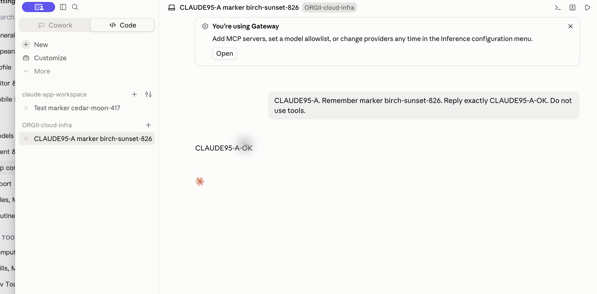
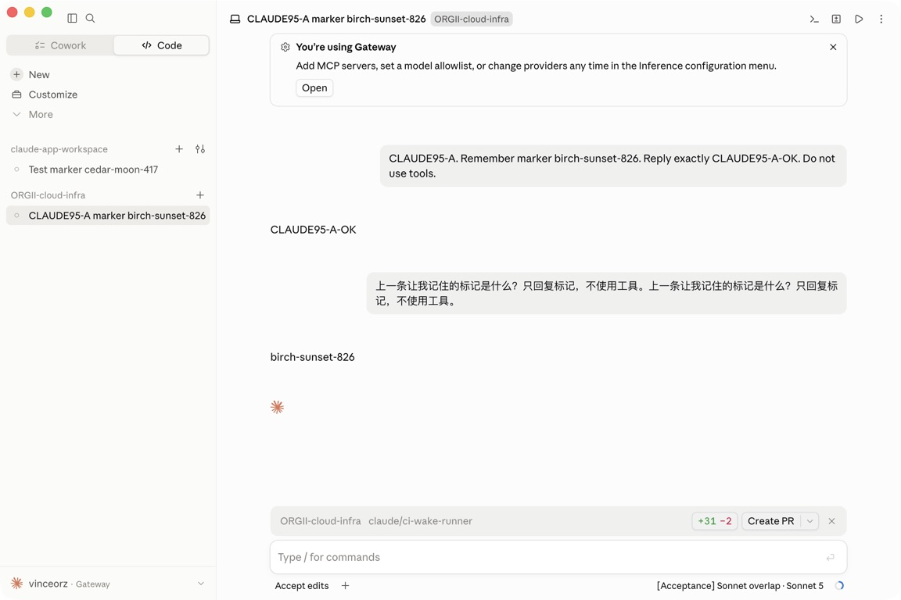
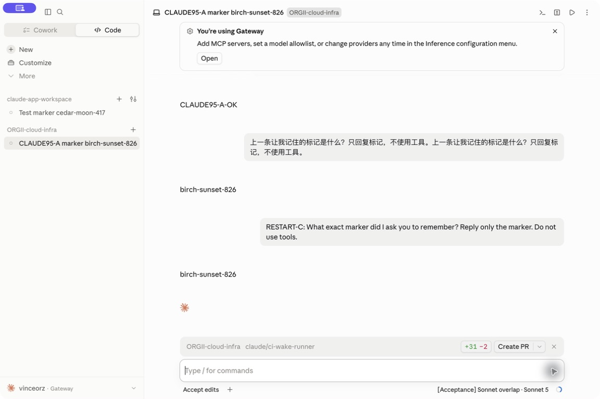
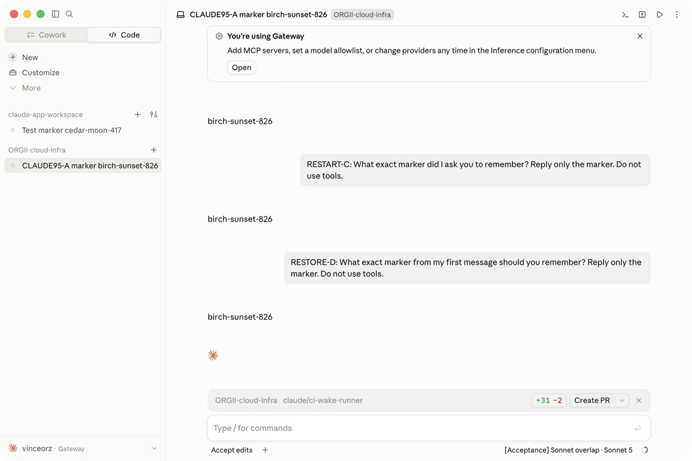

# macOS official App Keychain launch correction

## Problem and boundary evidence

On the local `eba1a039e` build, ORG2 authorization completed and the configured
Packages loaded. The isolated official Claude App then repeatedly displayed
`Keychain Not Found` while storing `Claude Key`. This is a separate failure from
ORG2 waiting for permission to read its saved credential.

Read-only subprocess comparisons reproduced the macOS boundary:

| Child environment                       | Default-keychain lookup | Foundation home |
| --------------------------------------- | ----------------------- | --------------- |
| Normal HOME                             | Succeeds                | Account home    |
| Isolated HOME                           | Fails                   | Account home    |
| Isolated CFFIXED_USER_HOME only         | Succeeds                | Isolated home   |
| Both isolated, as the previous launcher | Fails                   | Isolated home   |

The command was `/usr/bin/security default-keychain -d user`, with no setter
flags and no keychain-item reads. Foundation's `NSHomeDirectory` and Node's
`os.homedir` were inspected independently. Node follows HOME; therefore restoring
HOME also requires checking vendor-specific configuration paths at runtime.
Installed Claude 2.2553.1 honors its explicit Electron user-data directory and
`CLAUDE_CONFIG_DIR`; its encrypted local files use Electron safeStorage.

## Change and limits

The macOS launcher resolves the effective OS account home with bounded
`getpwuid_r` and supplies it as HOME. It refuses to launch if the account lookup
fails instead of trusting inherited HOME. `CFFIXED_USER_HOME`,
`CLAUDE_CONFIG_DIR`, Electron user-data and Codex-specific paths remain scoped to
the managed profile. The existing profile identity and history path are retained.

This preserves access to the normal macOS encryption vault. It does not promise
a separate cryptographic Keychain namespace. No keychain reset, credential copy,
encryption override or global default-keychain change is part of the fix.
Vendor helpers that ignore dedicated configuration roots remain a runtime risk;
primary-profile fingerprints and real calls must verify the supported release.

## Verification status

The inherited-HOME regression passed. The first parallel launcher run had
22 passing tests and one old immediate-lock-release assertion failure. That
assertion passed alone and the unmodified suite passed five subsequent parallel
runs. A separate temporary-file experiment confirmed that a fork child can
retain a flock until exec even with `O_CLOEXEC`; the first failure was not uniquely
attributed to a specific child. The assertion now waits at most one second for
release; held-lock rejection and symlink/hardlink protection remain unchanged.
Final post-change launcher tests passed 23/23; managed native-profile tests
passed 9/9. Clippy (including tests, warnings denied), rustfmt and diff checks
also passed. Commands ran from the repository root using the local build cache:

```sh
cargo test --manifest-path src-tauri/Cargo.toml -p org2 --lib market_connection::native_app_launch:: -- --nocapture
cargo test --manifest-path src-tauri/Cargo.toml -p agent_cli --lib managed_config::native_app:: -- --nocapture
cargo clippy --manifest-path src-tauri/Cargo.toml -p org2 --lib --tests -- -D warnings
```

The separate CI fixture correction preserves real Jotai exports while mocking
only the Project panel hooks. The old fixture reproduced the missing `atom`
error before test collection; this command passed four files / 59 tests after
correction, with full fast typecheck and targeted ESLint passing:

```sh
pnpm exec vitest run --config config/vitest.config.ts --maxWorkers=2 \
  src/engines/ChatPanel/panels/ProjectPanelView.test.ts \
  src/features/Org2Cloud/org2CloudProjectOrgAlias.test.ts \
  src/features/Org2Cloud/org2CloudAuthAtom.test.ts \
  src/features/Org2Cloud/org2CloudAuthAtom.refreshGeneration.test.ts
pnpm typecheck:fast
pnpm exec eslint src/engines/ChatPanel/panels/ProjectPanelView.test.ts \
  --max-warnings 0 --report-unused-disable-directives
```

The old
blocked Claude process was stopped without submitting an inference. The local
services remained healthy, and the original 14 primary configuration fingerprints
were unchanged. The expanded private baseline covers 44 configuration and
credential-adjacent file paths by existence and hash only; it does not inspect
Keychain items.

At 13:33:56 UTC on September 18, the immutable `95dcff53a` build opened the
official Claude App after the user completed ORG2 authorization. The App rendered
its Gateway/Code home and retained the prior test conversation without the
`Keychain Not Found` dialog. The process used the effective account HOME with
the expected isolated Foundation, Claude config and Electron user-data paths.
All 44 primary file existence/hash checks remained unchanged after launch.

Repeated Open at 13:36:33 UTC found the same process, passed ownership/profile
checks, and failed when AppKit refused activation: ORG2 and Claude were both
inactive, and Claude had finished launching. This does not prove failed login or
configuration mutation. The desktop tool could capture the rendered window but
could not click its contents at that point.

After the user brought the App forward, the verified isolated profile was running
in a new process. Its first real message returned `CLAUDE95-A-OK`, confirmed both
by the user-provided screenshot and the current App accessibility tree. The model
selector showed `Coding for beginner · Sonnet 5`. The earlier timed-out tool input
is not counted as proof of submission; user-assisted completion is recorded here.
All 44 primary file checks still matched after the response. Subsequent Open from
ORG2 returned `App opened` and retained the same process; this confirms an accepted
activation request, not reliable automation of the vendor window.



The second Package, `[Acceptance] Sonnet overlap · Sonnet 5`, subsequently returned
`birch-sunset-826` in the same conversation without the second user prompt repeating
that marker. The first two turns were user-assisted; later tool interaction worked.
Both Packages use the same foundation model.



The official App was then closed through its Quit menu and reopened through ORG2.
The same conversation and Package selection reappeared. A third real message,
`RESTART-C`, returned the original marker. Repeated Open also returned success
without starting a second writer.



After another normal Quit, product Restore returned `Original setup`. It removed
ORG2's desktop deployment mode and the three originally absent managed files;
vendor preference fields remained. The saved conversation's hash was unchanged.
Normal Configure selected the original two Packages again, and Open reused the
same profile/history. A fourth real message, `RESTORE-D`, returned the same marker.
All 44 primary file existence/hash checks still matched after this final call.



[Independent billing](claude-95dc-billing.md) reconciles all four foreground calls
and all additional requests in their separate frozen windows: buyer **293447**,
seller **228237**, platform **65210 µUSD**, with all new reserves cleared. Actual
admin percentages were 45%/35%; range endpoints are defaults, not forced prices.
The three additional charged requests have reconciled amounts but unproven helper
purposes. Historical records, including the 9252 hold and 2306 charge, are unchanged.

[Resource samples](resources-95dc.md) cover short visible/menu-hidden idle and
normal process shutdown. They are not full performance acceptance. These results
apply to immutable `95dcff53a`; the later Open-error wording change is unit-tested
separately. File checks do not establish Keychain-item isolation. Official Codex
and reimport/resume of the older Cowork histories remain separate gates.

## Performance guard

| Area               | Verdict | Evidence                                                           | Decision                                    | Verification                                            |
| ------------------ | ------- | ------------------------------------------------------------------ | ------------------------------------------- | ------------------------------------------------------- |
| Background work    | keep    | Account lookup runs only during Open on the existing blocking path | No timer or watcher added                   | Source inspection                                       |
| Memory             | keep    | One 64 KiB lookup buffer                                           | Fixed bound; released after resolution      | Source inspection                                       |
| Scope/isolation    | fix     | Isolated HOME broke default-keychain lookup                        | OS-account HOME plus explicit profile roots | App launch and 44 file checks passed; lifecycle pending |
| Rendering/hot path | keep    | Launch-only change                                                 | No rendering subscription or stream change  | Source diff                                             |

Performance verdict: blocked for final native lifecycle/resource measurement.
