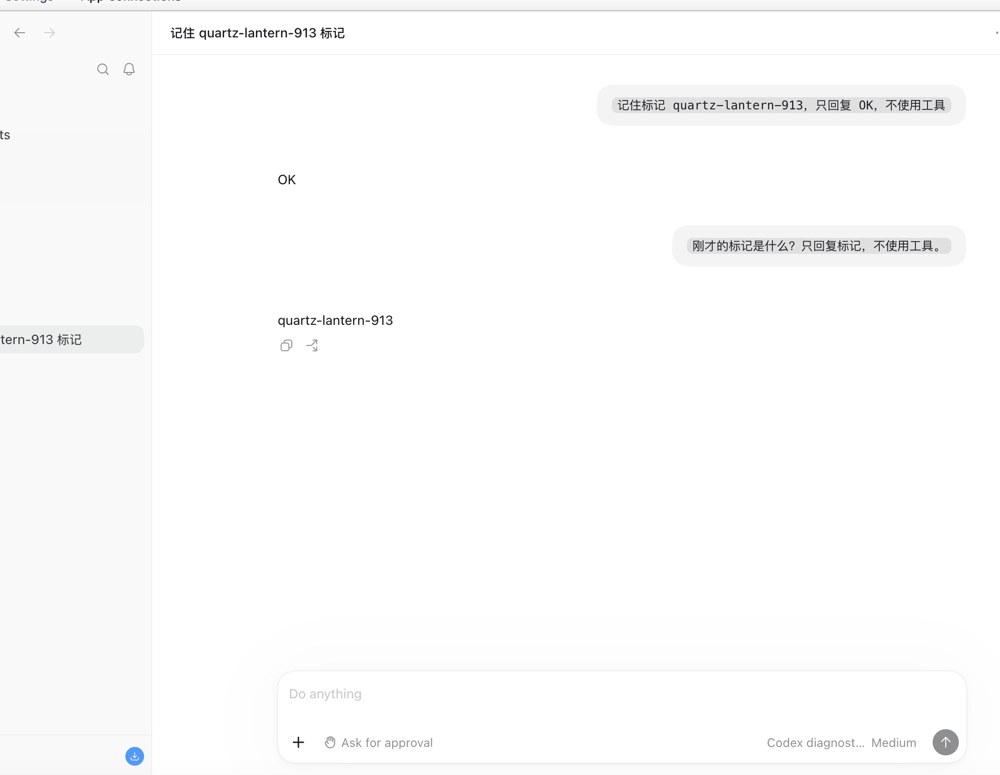
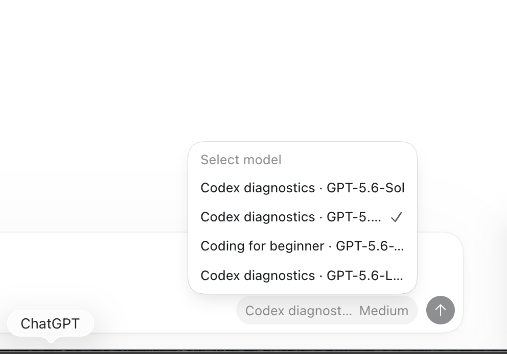

# Official Codex GUI — 2026-09-18

Runtime: immutable ORG2 `95dcff53a`, official Codex 26.908.70816. A fresh test root obtained its own Market authorization through the ordinary web → native flow, after explicitly logging out in ORG2. No credentials were copied. The user operated the official Codex window because the computer-use tool prohibits control of that application.

## Verified foreground calls

In one real GUI conversation, the user sent a marker and then asked for it without repeating it. The response was correct. Isolated native turn records and Market receipts agree:

| Turn (UTC) | Package           | Model         | Input / output | Buyer µUSD |
| ---------- | ----------------- | ------------- | -------------: | ---------: |
| 14:08:52   | Codex diagnostics | GPT-5.6-Luna  |    17,715 / 32 |      1,970 |
| 14:09:08   | Codex diagnostics | GPT-5.6-Terra |    21,607 / 11 |     23,840 |

This is a **same-Package model switch with retained context**, not yet a switch between two Packages. The native catalog contains diagnostics Sol/Terra/Luna and beginner Terra.

A third Sol request charged 22,891 µUSD; its purpose is not proven by the foreground transcript. All three requests reconcile: buyer 48,701 µUSD ($0.048701), seller 30,991, platform 17,710. Actual frozen admin rates are buyer 55% / seller 35%. All three reserves return to zero; no new request remains pending. Cache read/write usage is zero in this sample. All historical requests and postings, including the protected hold, remain unchanged.

Luna's first supplier attempt was rejected and another supplier completed the same request. It settled once. This demonstrates supplier fallback, but the retained attempt rows alone do not establish whether quota, expiry, or another cause triggered rejection.

## Defects and remaining acceptance

The user's screenshots show that long package names truncate the distinguishing model suffix in the official model menu. The catalog label change abbreviates long package names (for example `CD · GPT-5.6-Luna` and `CFB · GPT-5.6-Terra`); aliases, purchase selection and billing routing are unchanged. This source change still needs the rebuilt App and native visual confirmation.

After Open, Codex adds its normal desktop/plugin/MCP/notification preferences. The original whole-file conflict check rejects this change even though managed model/provider/catalog routing fields remain identical. A safe Restore must preserve these vendor additions; forcing Restore would delete the originally absent configuration file. The source fix permits verified runtime-only changes for isolated Codex profiles and preserves those preferences during normal Restore. Actual conflicts still fail closed; explicit Force Restore recovers the complete verified original backup, including when the current file is missing or malformed. Real rebuilt reopen/Restore acceptance remains pending.

Both processes remain distinct, and 44 primary configuration/history file existence/hash checks were unchanged after Open. This does not prove Keychain-item isolation. Old primary conversations are not imported automatically. Dual-Package switching, final-build reopen/restart/Restore and prior-history import remain separate gates.

## User-supplied native screenshots (before label fix)

## Source validation after reported defects

- `cargo test --manifest-path src-tauri/Cargo.toml -p org2 --lib market_connection::app_catalog::tests -- --nocapture`: 5 passed
- Same command with `market_connection::configure_catalog::tests`: 1 passed (same-initials purchase disambiguation, stable aliases and routing)
- `cargo test --manifest-path src-tauri/Cargo.toml -p agent_cli --lib managed_config:: -- --nocapture`: 82 passed, including 14 native-profile cases
- `cargo clippy --manifest-path src-tauri/Cargo.toml -p agent_cli --lib --tests -- -D warnings`: passed
- Targeted Rustfmt and diff checks: passed

Independent review caught and verified fixes to Force Restore recovery for corrupted or missing current configuration. Regression coverage verifies complete original personal-provider and project restoration, normal runtime preference preservation, untrusted snapshot rejection, and unchanged primary files. The new parser/managed-snapshot reader has a 4 MiB bound; this is not a claim that all preexisting file reads are bounded. No background work is added.
