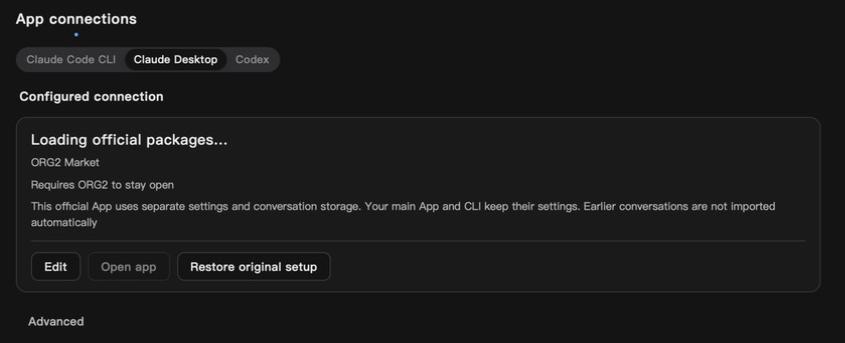

# Concurrent database initialization regression

The Linux workspace test in CI run `35317366720` failed in
`dev_shared_sessions`: two processes opened the shared session database while
learning-schema initialization separately dropped and recreated
`idx_learnings_active`. The statements could interleave and report
`index idx_learnings_active already exists`. The failing step was the workspace
test command, not Clippy.

The index replacement now acquires an immediate transaction when it owns the
transaction boundary. A local savepoint protects the replacement when called
inside an existing transaction. Failed creation restores the original index;
only a transaction created by this function is committed. Existing caller
snapshots retain SQLite's normal isolation and error semantics. The index still
upgrades its predicate to exclude both deprecated and abandoned learnings.
No table data, historical records or production database was altered for testing.

A deterministic regression pauses the first connection between DROP and CREATE
and starts a second independent connection. The test observes actual SQLite
writer-lock contention, including the case where the old index is absent.
The test-only authorizer and busy-handler controls do not change production
initialization, introduce dependencies or serialize the existing process test.

- Old production code: two of four tests failed, reproducing the exact duplicate
  index error and loss of the original index after rejected CREATE.
- Fixed code: four of four tests passed, covering concurrent initialization,
  CREATE failure recovery, outer transaction ownership and legacy schema upgrade.
- Command: `cargo test --manifest-path src-tauri/Cargo.toml -p agent_core --lib specialization::memory::learnings::schema::tests -- --nocapture`.
- `cargo test --manifest-path src-tauri/Cargo.toml -p org2 --test dev_shared_sessions -- --nocapture`: all eight tests passed, including the unmodified dual-process persistence and numbered-instance isolation fixture.
- `cargo clippy --manifest-path src-tauri/Cargo.toml -p agent_core --lib --tests -- -D warnings`: passed. Rust formatting and `git diff --check` passed. New-head CI is assessed separately; local test success alone is not full CI.

| Area               | Verdict | Evidence                                       | Change or reason kept                                                                     | Verification                        |
| ------------------ | ------- | ---------------------------------------------- | ----------------------------------------------------------------------------------------- | ----------------------------------- |
| Background work    | fix     | Cross-process startup DDL race                 | One atomic replacement; existing connection busy policy bounds waiting; no new retry loop | Deterministic competing connections |
| Memory             | keep    | Initialization-local transaction/savepoint     | No retained cache, task or process                                                        | Source ownership review             |
| Scope/isolation    | fix     | Nested caller transaction and legacy predicate | Commit only an owned transaction; rollback only local replacement                         | Failure and outer rollback tests    |
| Rendering/hot path | keep    | No frontend or streaming changes in this fix   | Startup-only schema boundary                                                              | Source call-chain review            |

Performance verdict: blocked for final desktop delivery. This scoped startup
fix passes its source and concurrency checks; final-build visible, hidden,
closed and restarted resource measurements still require the protected
keychain authorization and real App acceptance described in the main matrix.

## Build and observed runtime

Source `c7256cb6fad7ed7c456df266874d56cdeac4d16e` completed the debug
no-bundle build and signed, verified local staging. Binary SHA256:
`3d6c5f8b502163ff4e9b61232aaf7c180f4b009ef8a5fa679227c350455e2850`.
The prior test instance exited normally; the new isolated instance retained the
displayed login state and session list. Settings reported `v2.0.4 · Local`.

Claude Desktop Package loading still stopped with Open disabled. A fresh process
sample located the credential wait at `keyring::Entry::get_password` and
`SecKeychainFindGenericPassword`; the protected authorization boundary was not
bypassed. All 14 sampled primary configuration fingerprints stayed unchanged.
This is successful build/startup evidence, not completed Package Open, official
App lifecycle, inference, billing or resource acceptance. No installer or release
was published.

