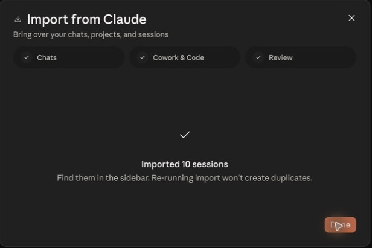
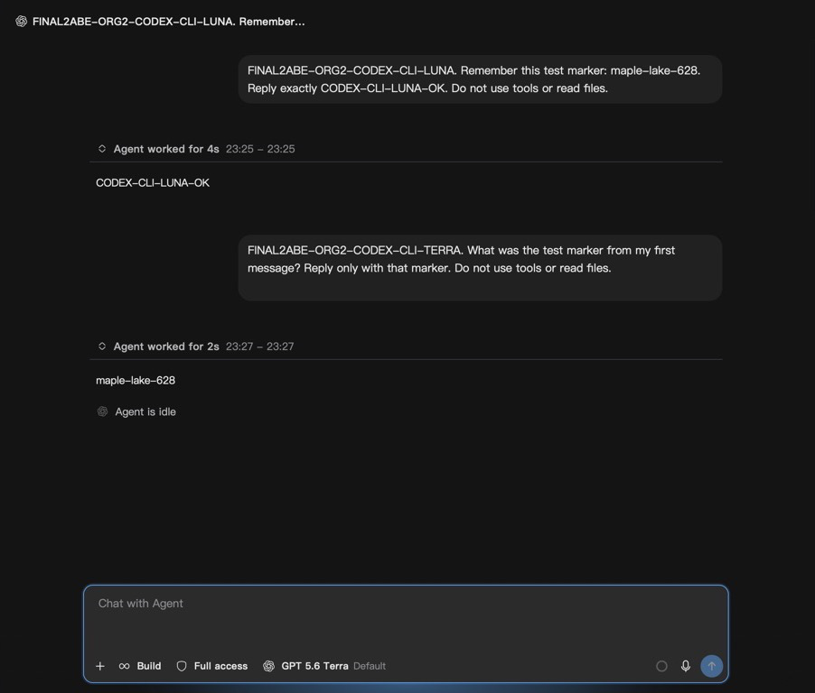

# Imported-history continuation and native activation

Updated 2026-09-18. These observations supplement the [acceptance matrix](../README.md); each remains scoped to its named build.

## Official Claude import and continuation

Using the `2abe2a41e8` native proxy/runtime, Claude's official importer reported **10 imported real Cowork conversations**. One imported conversation completed its Trust/resume flow, answered using the earlier conversation context, and returned the requested `IMPORT-CONTEXT-OK` marker. This is a copy in Claude's third-party history store; it does not establish in-place continuation in the primary store or bidirectional synchronization.

An independent post-resume read of all **842** original snapshot paths found **zero changed or missing files**, comparing file sizes and streamed SHA256 values. The original private history is excluded from this repository.

The corresponding ledger delta contained exactly one new completed request with a completed attempt and upstream 200. Independent reconciliation honored the admin buyer **45%** / seller **35%** setting within the **35–80%** range:

| Item              | Amount (µUSD) |
| ----------------- | ------------: |
| Buyer charge      |        119515 |
| Seller credit     |         92956 |
| Platform spread   |         26559 |
| Remaining reserve |             0 |

Input was 1447 tokens, output 61, and one-hour cache creation 65521. At the frozen per-million rates, buyer arithmetic was `(1447 × 900000 + 61 × 4500000 + 65521 × 1800000) / 1000000 = 119514.6`, rounded half-up to 119515 µUSD; seller arithmetic was `(1447 × 700000 + 61 × 3500000 + 65521 × 1400000) / 1000000 = 92955.8`, rounded to 92956 µUSD. The hold was 627048 and release 507533 µUSD. All postings balanced; the protected historical request remained unchanged. Private request identifiers, receipts and account details are excluded.

This real vendor screenshot is cropped to the import outcome, removing unrelated history and account areas:

## Native Codex CLI context

This real `2abe2a41e8` screenshot shows the native ORG2 Codex CLI conversation after Luna then Terra, with the earlier test marker recalled. The image is cropped to the test conversation and model selector. It is not an official Codex Desktop screenshot, a cross-profile import result, or acceptance of a later build. Billing acceptance requires its separately correlated receipts.

For official Codex, changing the default provider alone did not change an existing thread's provider in a confined synthetic same-profile probe. An explicit App Server resume override reached the new mock provider with prior context; official GUI switching and real billing remain unverified. No supported current paginated cross-profile importer is implemented.

## Cooperative activation and remaining final-build gate

Source `72032657bcb909ba4a1005757ac2b4e2596e066b` passed 22 native launch tests plus the nested reservation fixture, scoped macOS Clippy, formatting and normal commit hooks. Its debug, no-bundle build completed and started normally; Settings was usable. Package loading then waited on the system keychain authorization boundary. Automated desktop control could not operate that protected system dialog. No bypass was attempted and successful final Open/activation/restart acceptance is not claimed.

The activation change rechecks the original owner and exact process identity on the main thread, uses cooperative macOS activation, and cancels a callback that has not started before its deadline. An activation request already submitted to macOS cannot be recalled. Test success is separate from foreground-window readiness.

The subsequent `073b88a600` integration completed a debug no-bundle build and started with the preserved login state; Settings remained usable, while Package loading still waited at the protected keychain boundary. Its Linux CI exposed an existing concurrent learning-index migration race during the workspace tests. Any source fix and later integration require a new build and CI assessment. Final GUI repeated Open, Quit/reopen, Restore, Retry/cache receipts and visible/hidden/closed resource checks remain pending on the final integrated binary. No installer, release, tag or production deployment is included.
