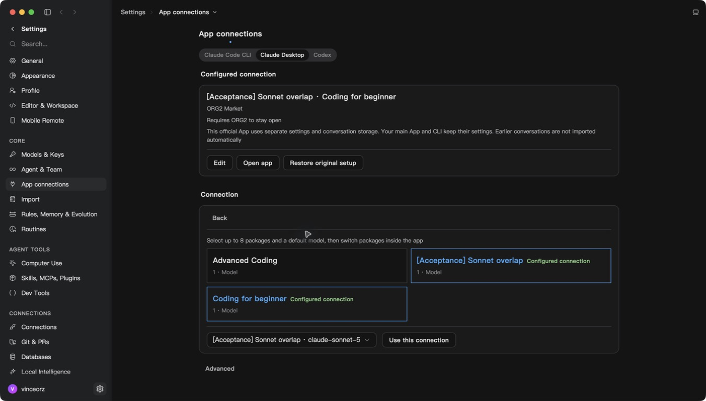

# Reboot recovery and refresh lifecycle

Observed on 2026-09-18. These results distinguish the existing `c7256cb6f`
runtime from the subsequent source fixes.

## Existing runtime after reboot

The persisted local PostgreSQL database, control service, gateway and Console
were restored. Control and gateway health/readiness endpoints and the Console
returned HTTP 200. No migration, fixture reset or supplier call was performed.
The protected historical request and its 9,252 micro-USD reserve were unchanged
before and after service recovery.

The isolated native App started and retained its old conversation list. Its
previous login failed to refresh with HTTP 400 and was cleared locally. The
Market browser recovered its signed-in session and displayed enabled Packages.
The native Package picker therefore showed the signed-out empty state; this is
not successful native authentication or Package acceptance.

Thirteen of fourteen primary configuration fingerprints matched the previous
checkpoint. The remaining primary Claude configuration had changed before this
test App was launched; it was preserved, not restored from an old backup.

At 12:56–12:58 UTC, after the user clicked the local Market's Open ORG2 link,
the same `c7256cb6f` runtime displayed signed-in status again. The official
Claude editor loaded three available Packages and retained its two configured
selections. This establishes recovery through the real callback and Package
read path; it does not verify the subsequent refresh fixes or natural expiry.
Native state and credential-generation hashes were captured privately for the
next build/restart comparison. No credential values are included here.



## Confirmed refresh defect and source fix

The native log records only HTTP status. A subsequent read-only inspection of
Supabase Auth logs identified `refresh_token_already_used` on the earliest
request at 12:37:21 UTC. Read-only refresh-record metadata shows that this
credential had been revoked at 09:47 UTC, followed by successful rotations at
09:47 and 10:47. Replaying the older credential at reboot also revoked the newest
generation. No token values were queried. The logs establish the rejection
reason, but do not uniquely identify which local write stranded the old value.

A separate, reproducible defect caused concurrent consumers to repeat the
same rejected exchange while waiting on a serial Web Lock. Seven consumers
made seven requests, including requests after local sign-out. The fix shares
the complete in-flight lock wait and exchange, and retires queued work when
readable persisted credentials change during the wait. It adds no timer,
subscription or retained credential cache. Each caller retains its profile.

Tests cover sign-out, account/endpoint/OAuth-client changes, newer rotations,
failed storage reads, initial unpersisted auth and retry after transient errors.
They do not prove universal rejection deduplication between separate webviews,
or explain why the first request carried an obsolete credential. The existing
status classification remains unchanged.

Validation of commit `8003009a8`:

- Before the fix, six of the initial eleven regression cases failed.
- Eight targeted files / 139 tests passed after the fix, including fourteen
  serial-lock lifecycle cases, using the following command:

  ```sh
  node node_modules/vitest/vitest.mjs run --config config/vitest.config.ts \
    src/features/Org2Cloud/org2CloudClient.refreshLifecycle.test.ts \
    src/features/Org2Cloud/org2CloudClient.test.ts \
    src/features/Org2Cloud/org2CloudAuthAction.test.ts \
    src/features/Org2Cloud/org2CloudAuthAtom.test.ts \
    src/api/http/auth/sharedAuthStorage.test.ts \
    src/features/MarketConnect/ownerRefresh.test.ts \
    src/features/MarketConnect/rpc.auth.test.ts \
    src/features/MarketConnect/backgroundAuthorization.test.ts
  ```

- Targeted ESLint, normal commit hooks, test placement and full
  `tsgo --noEmit --pretty false` passed.
- Standard `tsc` exhausted its default Node heap; it did not pass. The full
  `tsgo` check above completed without diagnostics.

The patched native build still needs real login, natural credential expiry,
Package calls and visible/hidden/quit/restart measurements. Unit tests and
restored service health do not replace these gates.

## Rotation persistence across shared-state hydration

Commit `cb9591670` fixes a separately reproduced persistence defect. The shared
auth event re-parses storage into a new object even when credentials are equal.
The previous object-reference comparison then rejected a successful in-flight
refresh and left the already-spent credential stored. Foreground rejection
cleanup had the same reference-equality defect.

The regression mounts the real Jotai auth atom, starts an HTTP refresh, dispatches
the shared synchronization event, and checks both the atom and localStorage
after completion. Before the fix, 10 of 12 cases failed. Commit/clear now compare
endpoint, user, public key, OAuth client and access/refresh/expiry generation,
while preserving newer profile enrichment and refusing changed credentials.
This is a proven failure mechanism; it is not unique attribution of the
historical 09:47 event. No token authority crossing was found in the separate
Supabase service auth, Realtime or native Market owner paths.

The follow-up `10091f5dd` removes an inherited fresh-token shortcut that returned
ready after logout or endpoint replacement during an async action. A small
writable atom delegates to the existing storage atom and skips identical-object
updates, so this validation performs zero storage writes. Explicit new objects,
RESET and mounted hydration retain their existing behavior. Independent review
reran three auth files / 42 tests successfully.

After both fixes and the latest upstream merge, ten targeted files / 158 tests
passed:

```sh
pnpm exec vitest run --config config/vitest.config.ts \
  src/features/Org2Cloud/org2CloudClient.refreshLifecycle.test.ts \
  src/features/Org2Cloud/org2CloudClient.test.ts \
  src/features/Org2Cloud/org2CloudAuthAction.test.ts \
  src/features/Org2Cloud/org2CloudAuthAtom.test.ts \
  src/features/Org2Cloud/org2CloudAuthAtom.refreshGeneration.test.ts \
  src/features/Org2Cloud/completeSignIn.test.ts \
  src/api/http/auth/sharedAuthStorage.test.ts \
  src/features/MarketConnect/ownerRefresh.test.ts \
  src/features/MarketConnect/rpc.auth.test.ts \
  src/features/MarketConnect/backgroundAuthorization.test.ts
```

Complete `tsgo --noEmit --pretty false`, targeted ESLint, diff check, test
placement and normal commit hooks passed. No timer, listener or retained state
was added by this comparison change. Native refresh and restart acceptance
remain separate.

## Integration with the latest model pinning UI

Develop `23fdfe996` was incorporated through a normal merge, retaining the
new model/agent pinning and Settings UI. Its pin comparator used Market's
per-call credential source as selection identity. Preparing the same Package
again therefore lost the pin/current indicator and could create duplicate
Recent or pinned entries.

Commit `9662523d1` uses the existing validated stable Market profile ID and
execution agent for UI identity, together with the existing model-family
comparison. The current-item fallback also retains that ID when the selection
has fallen out of Recent. Old records keep exact-source compatibility. Package
labels never establish identity; execution still checks the current owner and
prepares fresh credentials.

The following command passed six files / 35 tests. Running the corresponding
regressions against the pre-fix production files produced four failures:

```sh
pnpm test src/store/session/__tests__/recentModelEntriesAtom.test.ts \
  src/scaffold/GlobalSpotlight/pinning/modelPins.test.ts \
  src/scaffold/GlobalSpotlight/palettes/UnifiedModelPalette/__tests__/modelSection.test.ts \
  src/scaffold/GlobalSpotlight/palettes/UnifiedModelPalette/__tests__/useUnifiedModelPaletteItems.test.ts \
  src/scaffold/GlobalSpotlight/palettes/UnifiedModelPalette/__tests__/useUnifiedModelPaletteSelection.test.ts \
  src/features/MarketConnect/identity.test.ts
```

Typecheck, targeted ESLint/Oxlint, test placement and normal commit hooks
passed. Rendered native model pinning and Package calls still require the
new binary and restored native authentication.

Develop was subsequently integrated through `8b15ac369`, preserving the new
theme-aware illustrations and Spotlight/composer-glow preferences. The following
upstream integration command passed eight files / 65 tests, and full
`pnpm typecheck:fast` passed:

```sh
pnpm exec vitest run --config config/vitest.config.ts --maxWorkers=2 \
  src/components/Illustration/Illustration.test.ts \
  src/config/settingsDevelopment.test.ts \
  src/engines/ChatPanel/InputArea/components/InputAreaChrome.test.ts \
  src/engines/ChatPanel/components/NewChatHeaderActionsMenu.test.ts \
  src/engines/ChatPanel/components/SessionHeaderActionsMenu.test.ts \
  src/modules/MainApp/Settings/sections/__tests__/DevelopmentSection.test.ts \
  src/store/session/__tests__/composerGlowVisibleAtom.test.ts \
  src/store/session/__tests__/creatorLaunchpadSearchVisibleAtom.test.ts
```

Additional integration coverage passed seven files / 61 tests:

```sh
pnpm exec vitest run --config config/vitest.config.ts --maxWorkers=2 \
  src/scaffold/GlobalSpotlight/palettes/UnifiedModelPalette/__tests__/TwoColumnModelBody.test.ts \
  src/components/ModelSelectorPill/ModelSelectorPill.test.ts \
  src/modules/MainApp/Settings/sections/HarnessConnections/AppConnectionPage.test.ts \
  src/features/MarketConnect/ownerRefresh.test.ts \
  src/app/root/__tests__/useMarketCloudOwnerRefresh.test.ts \
  src/engines/SessionCore/conversations/queuedRetryLineage.test.ts \
  src/scaffold/GlobalSpotlight/components/SpotlightSettingsMenu.test.ts
```

## Performance guard

| Area               | Verdict | Evidence                                                          | Change or reason kept                                 | Verification                                                 |
| ------------------ | ------- | ----------------------------------------------------------------- | ----------------------------------------------------- | ------------------------------------------------------------ |
| Background work    | fix     | Rejected requests repeated after a serial lock                    | Share the whole in-flight operation; no added polling | Concurrent-consumer and transient-retry regressions          |
| Memory             | keep    | One pending operation, released on settlement                     | No retained credential/result cache                   | Settlement and subsequent retry cases                        |
| Scope/isolation    | fix     | Hydration replaced equal objects; queued work retained stale auth | Credential generation and endpoint/client checks      | Hydration, logout, account/endpoint/client replacement cases |
| Rendering/hot path | keep    | Pin identity used ephemeral execution credentials                 | Reuse validated stable Package identity               | Pin, Recent and selection regressions                        |

Performance verdict: blocked for final native measurements. Source lifecycle
checks pass; visible, hidden, quit and restart measurements still require the
new binary. Earlier binary measurements do not close these cells.
