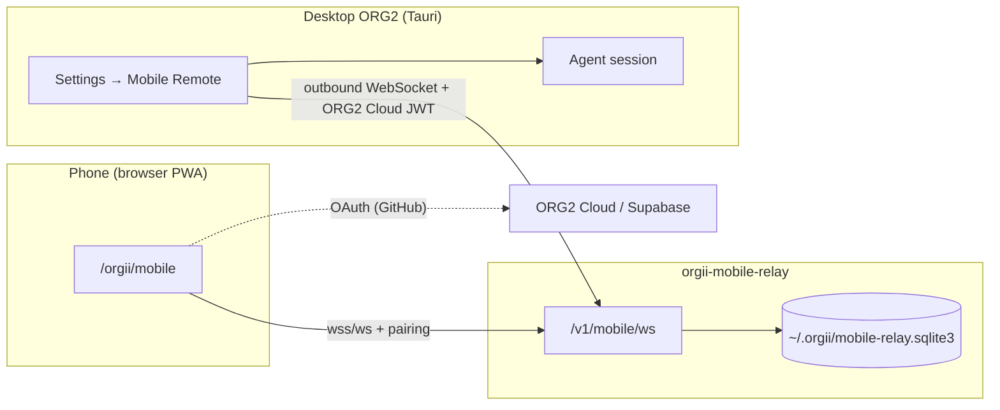

# Mobile Remote Development and Production Guide

> **For everyday production use (production PWA + public Relay):** Read the [Colleague Guide](./mobile-remote-colleague-guide.md) first.
>
> This guide covers **local development, Relay deployment, and troubleshooting**.
>
> Related PR: [#1150](https://github.com/org2AI/ORG2/pull/1150) (branch `junyu/mobile-remote-control`)

Mobile Remote lets a phone control Agent sessions on a desktop ORG2 through a PWA. The desktop connects to the Relay over an **outbound WebSocket**; the phone communicates with the desktop through the Relay. No inbound router port needs to be opened.

---

## Architecture Overview



**Responsibilities by component:**

| Component | Role |
| --- | --- |
| **Frontend dev server** (:1998) | Serves the desktop UI and Mobile PWA (`/orgii/mobile`) |
| **orgii-mobile-relay** (:8787) | Pairing, device authorization, and opaque-payload message forwarding between phone and desktop |
| **Tauri desktop** | Connects to the Relay, generates pairing codes, and performs Agent actions |

**Authentication:**

| Scenario | Desktop authentication | Phone authentication |
| --- | --- | --- |
| **Production/public Relay** | ORG2 Cloud sign-in (per-user JWT) | GitHub OAuth sign-in |
| **Local Relay development** | ORG2 Cloud sign-in (per-user JWT) | GitHub OAuth sign-in |

The “Local” and “Production” presets change only the Relay address, not the identity system. The Rust Relay still supports an explicitly enabled shared-secret fallback, but only for protocol tests or older clients. The ORG2 Desktop settings page does not offer that authentication path.

Older versions may have written `mobileRemote.desktopToken` to `settings.jsonc`. This value is retained but no longer read; upgrading does not automatically delete this historical setting.

---

## Prerequisites

| Tool | Notes |
| --- | --- |
| [pnpm](https://pnpm.io/) 9.15 | Install with `npm install -g pnpm@9.15` |
| [Rust](https://rustup.rs/) 1.85+ | Install with `rustup toolchain install stable` |
| Node.js 20+ | Matches [CONTRIBUTING](../.github/CONTRIBUTING.md) |
| **Xcode is not required** | Mobile Remote is a browser PWA, not a native iOS app |

```bash
# From the repository root
pnpm install
```

---

## Local Development

### Option A: Start Everything at Once (Recommended for a First Look)

```bash
pnpm run tauri:dev
```

`tauri:dev` starts the frontend dev server and opens the Tauri desktop app. macOS and Linux use **rspack** by default; Windows uses webpack. Use `pnpm run tauri:dev:webpack` to force webpack.

### Option B: Start Components in Separate Terminals (Clearer Relay Debugging)

Use this when you want to observe Relay logs separately or avoid Tauri starting the dev server again.

**Terminal 1 — frontend dev server:**

```bash
pnpm run dev:frontend
# Or use rspack:
pnpm run dev:frontend:rspack
```

**Terminal 2 — local Relay:**

```bash
cd src-tauri
cargo run -p orgii-mobile-relay
```

By default, the local Relay validates ORG2 Cloud JWTs, just like production. Enable the server-side shared-secret fallback explicitly only for protocol testing or compatibility with older clients:

```bash
ORGII_RELAY_DESKTOP_TOKEN_FALLBACK=true \
ORGII_RELAY_DESKTOP_TOKEN=123456789012345678901234 \
cargo run -p orgii-mobile-relay
```

> ORG2 Desktop does not read this shared secret. Normal local integration testing still requires signing in to ORG2 Cloud first.

The Relay listens on `127.0.0.1:8787` by default and writes its database to `~/.orgii/mobile-relay.sqlite3`. Keeping the database outside `src-tauri/` prevents Tauri's dev file watcher from exiting the desktop app; this issue was fixed in the PR.

**Terminal 3 — Tauri desktop only (with `beforeDevCommand` disabled):**

```bash
pnpm run tauri:dev:only
```

`tauri:dev:only` does not start webpack/rspack again. Make sure the dev server in Terminal 1 is already running.

### URLs

| Purpose | URL |
| --- | --- |
| Desktop Web UI | http://localhost:1998/ |
| Mobile PWA (browser on this computer) | http://localhost:1998/orgii/mobile |
| Mobile PWA (phone on the same Wi-Fi) | http://&lt;mac-ip&gt;:1998/orgii/mobile |

Find your Mac's LAN IP:

```bash
ipconfig getifaddr en0   # Wi-Fi
# Or: System Settings → Network
```

> **Tip:** The dev server binds to `localhost` by default. If the phone cannot reach the Mac IP, try binding the frontend server to a host address (for example, webpack-dev-server's `--host 0.0.0.0`) and confirm that the Mac firewall allows inbound traffic on port 1998.

---

## Desktop Settings (Settings → Mobile Remote)

### Local Relay Development (the “Local” Preset)

1. In **Settings → General**, sign in to **ORG2 Cloud**.
2. Open **Settings → Mobile Remote** and enable **Mobile Remote**.
3. In the **Remote connection** section:
   - Enable **Connect to Relay** (local development also uses the Relay for the full pairing flow).
   - Select the **“Local”** preset. The Relay address should be:
     ```
     ws://127.0.0.1:8787/v1/mobile/ws
     ```
4. Confirm the **ORG2 Cloud sign-in** row shows your account and **Relay status** is **Connected** or **Connecting**.
5. Click **Generate remote pairing code**. A QR code and pairing payload text will appear.

Preset URLs are defined in `src/config/mobileRemoteRelay.ts`.

### Production / Custom Public Relay

1. In **Settings → General**, sign in to **ORG2 Cloud** (the same flow used for cloud sync and invitations).
2. Open **Settings → Mobile Remote** and enable Mobile Remote and **Connect to public Relay**.
3. Select the **“Production”** preset or enter a custom `wss://` Relay address.
4. Confirm the **ORG2 Cloud sign-in** row shows a signed-in account. If it does not, sign in first.
5. After **Relay status** shows Connected, click **Generate remote pairing code**.

The Local, Production, and custom presets all identify the user through the ORG2 Cloud JWT carried over the desktop's outbound connection.

---

## Phone Flow

### 1. Open the PWA

In a phone browser (Safari or Chrome), open:

```
http://<mac-ip>:1998/orgii/mobile
```

For debugging on this computer, use `http://localhost:1998/orgii/mobile`.

### 2. Sign In with GitHub

The first time you open the PWA, it asks you to **Continue with GitHub** (ORG2 Cloud / Supabase OAuth).

During local development, `scripts/dev/webpack-server.js` (and `rspack-server.js`) includes a stub for `/v1/mobile/auth/session` that returns `204` for `POST` and `DELETE`. This lets you debug the sign-in flow without a real backend.

### 3. Pair

1. On the welcome page, tap **Scan or paste pairing code**.
2. Scan the QR code shown in desktop settings or paste the **pairing payload** text.
3. Confirm that the **security phrase** (SAS) matches the desktop phrase, then have the desktop user click **The phrase matches — confirm pairing**.
4. Once paired, the phone can view the session list and send messages.

---

## Quick Start Checklist

### Local Relay

- [ ] `pnpm install` completed
- [ ] Frontend dev server is running on **:1998** (`pnpm run dev:frontend` or `pnpm run tauri:dev`)
- [ ] Relay is running and listening on **:8787**
- [ ] Signed in to ORG2 Cloud on desktop under **Settings → General**
- [ ] Desktop **Settings → Mobile Remote**: enabled, “Local” preset selected, Relay connected
- [ ] Generated a pairing code on desktop
- [ ] Opened `http://<host>:1998/orgii/mobile` on the phone and signed in with GitHub
- [ ] Scanned/pasted the pairing code on the phone and confirmed the SAS phrase on desktop
- [ ] The desktop session is visible in the phone's session list

### Production Relay

- [ ] Signed in to ORG2 Cloud on desktop under **Settings → General**
- [ ] Desktop **Settings → Mobile Remote**: “Production” preset selected, Relay connected
- [ ] Opened the Workers PWA URL on the phone and signed in with GitHub
- [ ] Paired → confirmed SAS → opened the session list → sent a message

---

## Troubleshooting

| Symptom | Possible cause | What to do |
| --- | --- | --- |
| `Connection refused` / cannot connect to Relay | Dev server or Relay is not running | Confirm Terminal 1 (:1998) and Terminal 2 (:8787) are both running |
| Relay 401 / `auth_required` (any preset) | Not signed in to ORG2 Cloud or the session expired | Sign in to ORG2 Cloud in **Settings → General**, then return to Mobile Remote and refresh Relay status |
| Connection fails after changing Relay preset | Relay is unreachable or ORG2 Cloud session is invalid | Confirm the preset address and that you are signed in under General settings |
| Desktop unexpectedly exits after pairing | Older Relay DB was written under `src-tauri/`, triggering the file watcher | Fixed: DB defaults to `~/.orgii/mobile-relay.sqlite3`; pull the latest branch |
| `/orgii/mobile` displays the desktop UI | Dev bundler did not load the mobile entry | Use the webpack/rspack configuration (with the `mobile` entry and `/orgii/mobile` → `mobile.html` rewrite); do not use a simplified config that compiles only `main` |
| Phone cannot open Mac IP:1998 | Dev server listens only on localhost | Try binding to `0.0.0.0`; check the firewall and that both devices are on the same Wi-Fi |
| OAuth sign-in hangs | Dev stub is not active | Start through `webpack-server.js` / `rspack-server.js`, not a static file server |

---

## Production

### Currently Deployed Instance (Cloudflare Workers)

The team has deployed `orgii-mobile-relay` on Cloudflare Workers. It hosts both the **Mobile PWA** static assets and the **Relay WebSocket**.

| Purpose | URL |
| --- | --- |
| Health check | https://orgii-mobile-relay.superficial-jasper.workers.dev/healthz |
| Mobile PWA (phone browser) | https://orgii-mobile-relay.superficial-jasper.workers.dev/orgii/mobile |
| Relay WebSocket (desktop “Production” preset) | `wss://orgii-mobile-relay.superficial-jasper.workers.dev/v1/mobile/ws` |

Probe results (for reference):

- `/healthz` returns `{"ok":true,"protocolVersion":1}`.
- `/orgii/mobile` returns **200 `text/html`**, the bundled Mobile PWA shell (`ORG2 Mobile Remote`), without a redirect.
- `/v1/mobile/ws` returns **401** `auth_required` when no session is present. This confirms the WebSocket path is correct; a connection requires an ORG2 Cloud JWT / phone OAuth session.

> **`relay.orgii.ai`** is a planned custom domain and is not the default preset today. The default production host in code is `MOBILE_REMOTE_RELAY_PRODUCTION_HOST` in `src/config/mobileRemoteRelay.ts`.

### Use the “Production” Preset on Desktop

1. Sign in to ORG2 Cloud in **Settings → General**.
2. Open **Settings → Mobile Remote**, enable Mobile Remote and **Connect to public Relay**.
3. Select the **“Production”** preset. The Relay address should be:
   ```
   wss://orgii-mobile-relay.superficial-jasper.workers.dev/v1/mobile/ws
   ```
4. Confirm that **ORG2 Cloud sign-in** shows as signed in.
5. Click **Generate remote pairing code**. On the phone, open the **Mobile PWA** URL above, sign in with GitHub, then scan or paste the pairing code.

For local integration, use the **“Local”** preset and the local Relay instead of Workers.

### Release / Update Production Workers (Maintainers)

> **Important:** Production Relay + Mobile PWA are **not released from this repository (ORG2)**.
>
> They are deployed with **Wrangler** from the `mobile-relay-worker/` subdirectory of the separate infrastructure repository [ORGII-cloud-infra](https://github.com/org2AI/ORGII-cloud-infra).
>
> `src-tauri/crates/mobile-relay-server/` in this repository is the Rust Relay for local development, **not** the production Workers implementation.

This repository has no `wrangler.toml`, `stage-mobile-assets` script, or GitHub Actions workflow that automatically publishes mobile-relay. Follow these steps to update production manually.

#### Prerequisites

| Item | Notes |
| --- | --- |
| Cloudflare account | Logged in with `npx wrangler login` (the current instance is under the **Superficial Jasper** account's `workers.dev` domain) |
| Wrangler | ≥ 4.102 (installed by `npm install` inside `mobile-relay-worker`) |
| Supabase Auth | Callback URL must include `https://orgii-mobile-relay.superficial-jasper.workers.dev/orgii/mobile/auth/callback` (update it too when changing domains) |
| Cookie signing (optional) | **`MOBILE_AUTH_SECRET`**; a separate production value is recommended |

> Desktop authentication for the production Relay has migrated to **ORG2 Cloud JWTs** (per user). `DESKTOP_TOKEN` / Wrangler secrets remain only for historical local development or transitional deployments; they are no longer configuration for the desktop “Production” preset.

#### Standard Release Process

```bash
# 1. Build the frontend (including the mobile entry) in the ORG2 repository
cd /path/to/ORG2
pnpm build

# 2. Copy the PWA static assets to the Worker's public/ directory
cd /path/to/ORGII-cloud-infra/mobile-relay-worker
npm install
npm run stage:mobile -- /path/to/ORG2/build

# 3. Deploy to Cloudflare Workers
npx wrangler deploy
```

`stage:mobile` resolves `mobile.html` and its referenced JS/CSS from `build/` and writes them to `mobile-relay-worker/public/` (about 20+ files). **The deployment uses the local build output and does not depend on whether a PR has been merged to main**—but maintainers should ensure the build came from a verified branch/commit.

#### First Deployment (Optional Secret)

```bash
cd /path/to/ORGII-cloud-infra/mobile-relay-worker

# Optional: phone OAuth cookie signing
npx wrangler secret put MOBILE_AUTH_SECRET
```

You can also create **`.deploy-secrets.json`** under `mobile-relay-worker/` (using the field names in `.env.example`) for a first deployment from a temporary account:

```bash
npx wrangler deploy --temporary --secrets-file .deploy-secrets.json
```

A temporary deployment prints a `workers.dev` URL and claim link. Claim the account within **60 minutes**, or the deployment and pairing data will be deleted.

#### Verify After Release

```bash
curl https://orgii-mobile-relay.superficial-jasper.workers.dev/healthz
# Expected: {"ok":true,"protocolVersion":1}

curl -sI https://orgii-mobile-relay.superficial-jasper.workers.dev/orgii/mobile | head -5
# Expected: HTTP 200, Content-Type is text/html
```

On desktop, sign in to ORG2 Cloud under **Settings → General**. In **Settings → Mobile Remote**, choose the “Production” preset and confirm that Relay is connected. Then complete pairing → SAS confirmation → session list → send a message.

Local integration test (requires a valid Supabase access token):

```bash
cd /path/to/ORGII-cloud-infra/mobile-relay-worker
SUPABASE_ACCESS_TOKEN=... \
  npm run test:integration -- https://orgii-mobile-relay.superficial-jasper.workers.dev
```

For more on the Worker lifecycle, see **`ORGII-cloud-infra/mobile-relay-worker/README.md`**.

### Self-Hosted Relay

The Relay implementation is in `src-tauri/crates/mobile-relay-server/` (crate name `orgii-mobile-relay`).

**1. Build and run (requires TLS termination; production uses wss://):**

```bash
cd src-tauri

# Optional
export ORGII_RELAY_LISTEN="0.0.0.0:8787"
export ORGII_RELAY_PUBLIC_WS_URL="wss://relay.example.com/v1/mobile/ws"
export ORGII_RELAY_PUBLIC_APP_URL="https://relay.example.com/orgii/mobile"

cargo run -p orgii-mobile-relay --release
```

TLS is usually terminated at a reverse proxy such as Caddy or nginx, with `wss://` exposed publicly.

**2. Deploy the Mobile PWA**

Deploy a frontend build that includes the `mobile` entry to an HTTPS domain. The path must support `/orgii/mobile`, consistent with `public/mobile.html` plus history fallback.

**3. Connect the Desktop**

- **Public/per-user Relay (recommended):** Sign in to ORG2 Cloud in desktop **Settings → General**, then set the Relay address to `wss://<host>/v1/mobile/ws`.
- **Local Rust Relay:** Still sign in to ORG2 Cloud first, then select the “Local” preset on desktop.

**4. Override the Default Production Relay URL (at build time)**

To use another Relay host instead of the default Workers instance, set this when building the frontend:

```bash
REACT_APP_MOBILE_RELAY_PRODUCTION_URL=wss://your-relay.example.com/v1/mobile/ws pnpm build
```

The value is defined in `src/config/mobileRemoteRelay.ts`; both rspack and webpack pass through this environment variable.

### Production Launch Checklist (Workers Path)

- [ ] `pnpm build` (ORG2) → `npm run stage:mobile` → `npx wrangler deploy` (`ORGII-cloud-infra/mobile-relay-worker`)
- [ ] (Recommended) Configure a dedicated **`MOBILE_AUTH_SECRET`**
- [ ] Register the Supabase Auth callback URL (see the `auth/callback` path above)
- [ ] `/healthz` and `/orgii/mobile` return successfully
- [ ] (Optional) CNAME a custom domain to Workers (for example, a future `relay.orgii.ai`)
- [ ] Configure `REACT_APP_MOBILE_RELAY_PRODUCTION_URL` only if overriding the default Workers URL (see `config/rspack.config.js` / `config/webpack.config.js`)
- [ ] End-to-end check: desktop ORG2 Cloud sign-in → Relay connection → pairing → SAS confirmation → session list → send a message / stop a session

### Self-Hosted Rust Relay Checklist (Not Workers)

If you are not using Cloudflare Workers and are self-hosting with `cargo run -p orgii-mobile-relay`:

- [ ] TLS termination (Caddy / nginx) and persistent `~/.orgii/` storage or `ORGII_RELAY_DATABASE`
- [ ] Relay can reach the same ORG2 Cloud / Supabase authentication service as Desktop
- [ ] Desktop is signed in to ORG2 Cloud and configured with this Relay address
- [ ] Deploy an HTTPS version of the Mobile PWA separately (`/orgii/mobile`)

---

## Related Code Paths

| Path | Description |
| --- | --- |
| `src/modules/MobileRemote/` | Mobile PWA UI |
| `src/mobileRemoteEntry.tsx` | PWA entry point (separate from desktop `src/index.tsx`) |
| `src/config/mobileRemoteRelay.ts` | Local/production Relay URL presets |
| `src/modules/MainApp/Settings/sections/MobileRemoteSettingsSection.tsx` | Desktop settings UI |
| `src/features/Org2Cloud/` | ORG2 Cloud sign-in and session |
| `src-tauri/crates/mobile-relay-server/` | Local Relay service |
| `config/webpack.config.js` / `config/rspack.config.js` | `mobile` entry and `/orgii/mobile` rewrite |
| `scripts/dev/webpack-server.js` | Dev auth session stub |

---

## References

- PR: [#1150 — Mobile Remote control](https://github.com/org2AI/ORG2/pull/1150)
- Production Workers deployment: [ORGII-cloud-infra/mobile-relay-worker](https://github.com/org2AI/ORGII-cloud-infra/tree/main/mobile-relay-worker) (`README.md`, `wrangler.toml`)
- General development environment: [CONTRIBUTING.md](../.github/CONTRIBUTING.md)
