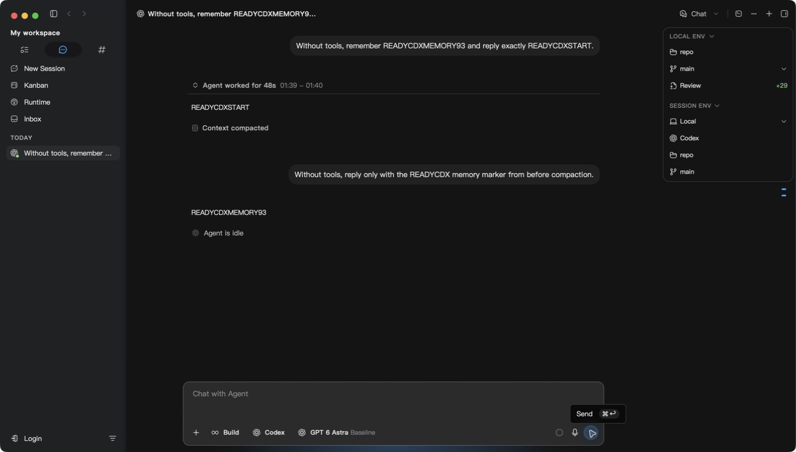
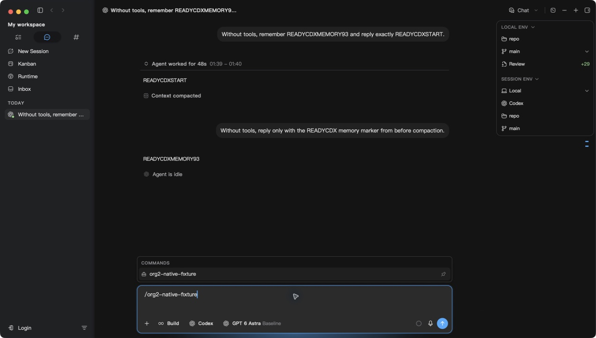
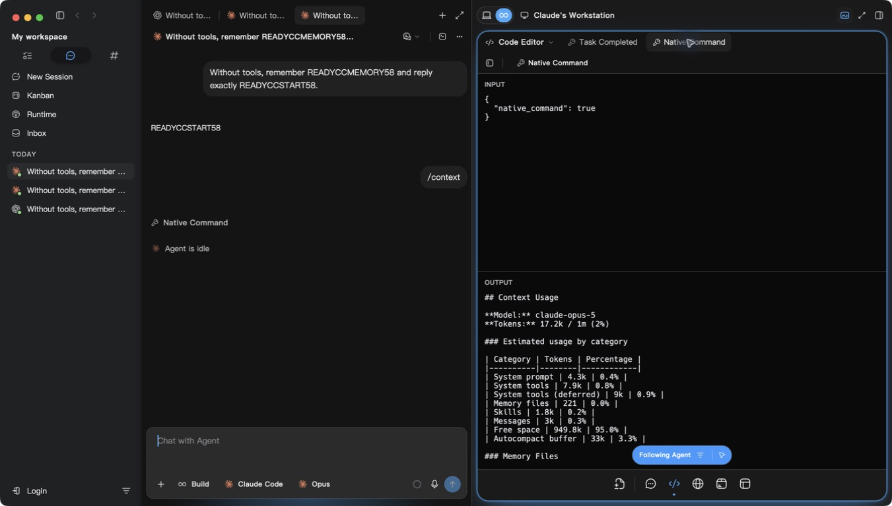
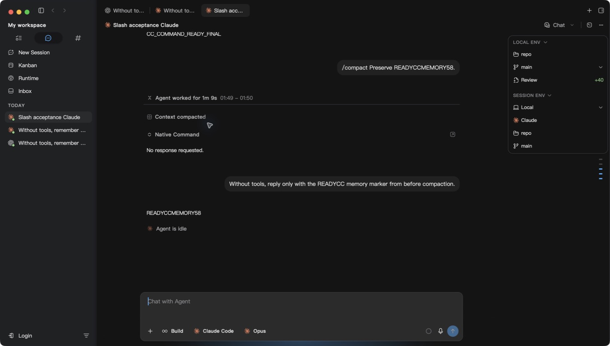
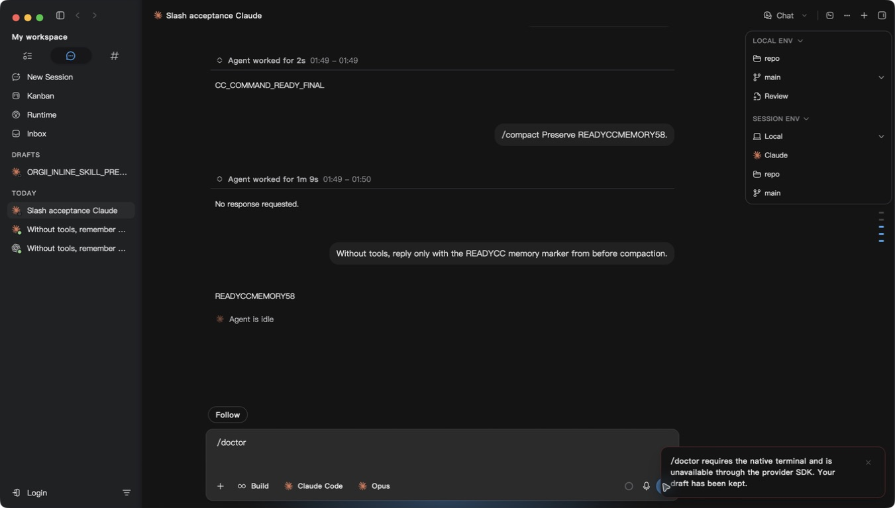
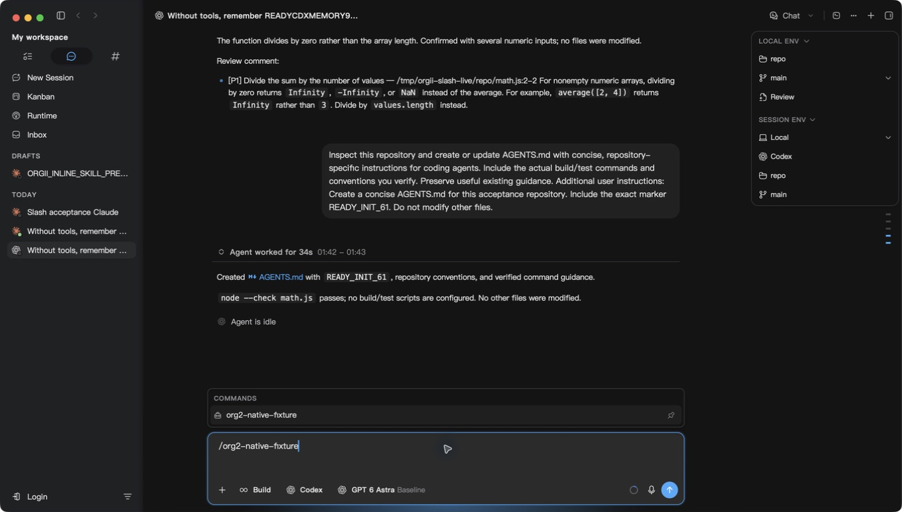

# Native slash commands in ORG2

The Chat composer now distinguishes ORG2 controls, provider operations, and provider-reported skills. The native transcript remains authoritative; the command catalog is disposable metadata. This change does not emulate every interactive terminal screen.

## Command behavior

| Surface                         | Command                                                   | Behavior                                                                                                                                                       |
| ------------------------------- | --------------------------------------------------------- | -------------------------------------------------------------------------------------------------------------------------------------------------------------- |
| Chat and single-session creator | `/model`, `/effort`, `/fast`                              | Open ORG2's model/variant selector. These are selector shortcuts, not automatic fast-mode toggles. Arguments are rejected rather than silently ignored.        |
| Chat and single-session creator | `/plan`                                                   | Save planning mode before the next message. An existing session also accepts `/plan <prompt>`; a creator requires selecting the mode first.                    |
| Existing chat                   | `/rename <name>`, `/status`                               | Persist the session name; show its current name/model/mode/repository.                                                                                         |
| Chat and single-session creator | `/new`, `/clear`, `/resume`                               | Open a fresh session composer or the existing session search. Clearing starts a new conversation and does not delete history.                                  |
| Chat and single-session creator | `/settings`, `/config`, `/mcp`, `/login`, `/diff`         | Open ORG2's existing settings, integrations, accounts or source-control surface.                                                                               |
| Codex                           | `/compact`                                                | `thread/compact/start` on the same native thread, with normal interruption and completion handling. The installed protocol does not accept focus instructions. |
| Codex                           | `/review [instructions]`                                  | Native inline review: uncommitted changes by default, custom review when instructions are supplied.                                                            |
| Codex                           | `/init [instructions]`                                    | Start the repository-specific AGENTS.md initialization task.                                                                                                   |
| Codex                           | `/<enabled native skill> [arguments]`                     | Discover via `skills/list` for the actual working directory, then send an explicit native skill input with the provider's path.                                |
| Claude Code                     | Runtime-reported SDK commands and project/plugin commands | Pass the literal command to the selected account's native SDK process. Preserve command output even when no model turn occurs.                                 |

Claude commands reported in `terminal_slash_commands` are excluded from the menu and rejected before dispatch if typed manually; the draft is retained. Codex commands unsupported by the app-server fail explicitly instead of becoming model prompts. Native terminal-only screens, keybindings, and every third-party plugin's behavior are not asserted to be equivalent. `/compact`, `/context`, and `/init` are available before Claude's first init; the installed catalog appears after the first native run. Codex skills likewise become discoverable after a native run.

Commands with image attachments remain ordinary messages. Human-note and batch-creation editors do not advertise the single-session controls. Existing ORG2 skills and MCP tools remain in the menu.

## Resource ownership

| Area               | Verdict | Evidence                                                                                                                  | Change or reason kept                                                                                                                                           | Verification                                                                     |
| ------------------ | ------- | ------------------------------------------------------------------------------------------------------------------------- | --------------------------------------------------------------------------------------------------------------------------------------------------------------- | -------------------------------------------------------------------------------- |
| Background work    | keep    | Codex requests its catalog once during active turn setup; Claude provides it in its existing init event                   | No new timer, watcher, polling process or idle scan. Codex catalog wait is bounded at 15 seconds. Native command operations use the existing turn/process owner | Protocol tests cover compact/review/skill dispatch and unknown command rejection |
| Memory             | keep    | Catalog names capped at 512 and 256 characters; Codex paths capped at 8192 bytes                                          | Menu snapshots are component-local. One upserted metadata row per managed session, deleted by the existing session FK cascade                                   | Parser bounds and repeated upsert/cascade tests                                  |
| Scope/isolation    | keep    | Catalog chunks checked against current session and provider; skill discovery uses the turn's actual working directory     | No arbitrary user-supplied file path resolution; no cross-session/global catalog cache                                                                          | Current-session/provider isolation tests                                         |
| Rendering/hot path | keep    | Menu snapshots `eventsAtom` only when opening a query; normal delta handling only performs a short metadata discriminator | No new subscription to streaming events. Replay reads the existing file stream and adds local-command records at their original position                        | Catalog filtering tests; local-command replay fixture                            |

## Source invariant and compatibility

Claude SDK local controls write an exact command envelope followed by `system/local_command` in the native JSONL. Previously the input appeared as XML and the result was dropped because it has no `message` member. The reader now normalizes the complete provider envelope, emits the actual stdout/stderr as a command result, and emits a terminal lifecycle marker. The SDK result parser similarly preserves zero-model-turn output without duplicating ordinary assistant answers.

Native commands dispatch through the existing user-intent transport and atomic turn-lifecycle reservation. They are accepted only while idle. Conversation-tail recovery remains for ordinary messages: it cannot own protocol commands because Codex compact/review and Claude local controls may complete without an ordinary native user-message echo. Native command errors retain the draft. Menu selection preserves the literal native command; legacy Compact pills normalize before routing.

The full reader and the byte-offset turn index use the same command-envelope parser. Claude SDK compaction can put stdout in a `user` row: it becomes a command result only when it follows a recognized native command. Unrelated user text containing the same tags stays user text. A raw JSONL regression checks both full replay and the paged window, including the unloaded header.

The Claude parser fingerprint advances from 15 to 16 so existing cached history can be reprojected. Raw native files are never rewritten or cleaned up. The catalog reuses the existing `code_session_chunks` table and requires no schema migration. Rolling back ignores the disposable catalog and returns to the previous replay behavior; no user content is removed.

## Verification

- `pnpm test src/engines/ChatPanel/hooks/useInputArea/__tests__ src/components/ComposerInput/__tests__ src/engines/ChatPanel/InputArea/components/SlashCommandPortal/useEntries.test.ts src/features/SessionCreator src/engines/SessionCore/ingestion`: 449 passed, one pre-existing skip (59 files).
- `pnpm test src/engines/ChatPanel/InputArea/components/InputAreaPortals.test.ts`: passed; verifies native action entries survive the rendered portal boundary.
- `pnpm typecheck:fast` and ESLint on changed TypeScript files: passed.
- `cargo test --lib agent_sessions::cli::parsers -- --test-threads=2`: 204 passed, three existing live tests ignored.
- `cargo test --lib native_commands::tests`: passed, including production schema and FK cascade.
- `cargo test -p orgtrack_core sources::claude_code -- --test-threads=2`: 45 passed, one existing ignored test.
- `cargo clippy -p org2 -p orgtrack_core --all-targets -- -D warnings`: passed after develop integration; latest history changes additionally passed the staged `orgtrack_core` Clippy gate.
- `pnpm exec wdio run wdio.conf.mjs --spec specs/core/composer-skills-ui.spec.mjs` against packaged instance 6: 4 passed. The E2E fixture mocks model responses, but drives the actual editor/menu/submit handlers; native provider acceptance is separate.
- `git diff --check`: passed.

## Packaged application acceptance

The initial instance-6 functional package used source `27a47772e`, launched with separate data/native-history homes, bundle identity, ports, and access-only fixture accounts. Installed providers were Codex CLI 0.153.4 (GPT-6 Astra) and Claude Code 2.1.263 (Opus 5). No provider upgrade was performed.

| Provider / surface | Raw transition / operation                                     | App state and boundary                                | Observed evidence                                                                                                                                                                   |
| ------------------ | -------------------------------------------------------------- | ----------------------------------------------------- | ----------------------------------------------------------------------------------------------------------------------------------------------------------------------------------- |
| Codex              | Create, menu-selected `/compact`, ordinary continuation        | Live same native thread in packaged ORG2              | Menu kept literal `/compact`; native JSONL gained one `compacted` record; continuation returned `READYCDXMEMORY93`; idle with empty queue                                           |
| Codex              | Enabled repository skill                                       | Actual `skills/list` catalog, rendered menu selection | `org2-native-fixture` appeared and explicit native skill invocation returned `CODEX_SKILL_APP_OK`                                                                                   |
| Codex              | `/review` with custom instructions                             | Native review protocol, live ORG2                     | Detected the intentional divide-by-zero fixture; no file change                                                                                                                     |
| Codex              | `/init`                                                        | Actual repository write through the native turn       | Created AGENTS.md containing `READY_INIT_61`, verified project commands; no other fixture changed                                                                                   |
| Claude Code        | Create and menu-selected `/context`                            | Live SDK and native JSONL                             | Native Command output showed actual context/model/token categories; settled idle without a model-answer requirement                                                                 |
| Claude Code        | Repository command with arguments                              | Live SDK custom-command expansion                     | `/org2-native-fixture READY_FINAL` returned `CC_COMMAND_READY_FINAL`                                                                                                                |
| Claude Code        | `/compact` with focus instructions, then ordinary continuation | Same native UUID, active/open session                 | Native file gained one `compact_boundary` and SDK user-stdout envelope; UI presented the command result, and continuation returned `READYCCMEMORY58`; no XML user row in paged Chat |
| ORG2 control       | `/rename Slash acceptance Claude`                              | Actual input and persistence                          | Updated the session title without dispatching a native turn                                                                                                                         |

The first final-instance Claude request used an expired test access token and was cancelled. The installed primary CLI performed its normal refresh through a no-session-persistence smoke request (`AUTH_READY_32`); only the resulting access token was copied into the fixture account. No refresh token was cloned or manually rotated. The subsequent real ORG2 acceptance above passed.

### Limits

This PR does not emulate all interactive terminal screens or prove every third-party plugin. `/model`, `/effort`, and `/fast` open ORG2 selectors; they do not parse native model arguments or automatically toggle fast mode. Codex review expansion can remain visible as verbose provider history blocks, and Claude can produce its own “No response requested” entry on a subsequent turn. Native command stdout currently uses the existing tool-output viewer rather than a new rich terminal renderer.

Manual visual evidence covers the existing dark theme at the captured desktop size. Light-theme and localization layouts were not separately exercised; commands reuse existing menu and output components. Cloud transport, dual physical machines, and native App hot reload are not changed or claimed here. No long-duration provider soak was performed.

## Final activation and replay corrections

The live restart check exposed two authoritative boundaries. A warm SQLite cache could contain only streaming assistant events. Session activation previously accepted any nonempty cache and skipped native history, so the native catalog and user turns were absent until a later refresh. An idle native CLI cache hit now performs one existing bounded preview read during activation, certifies the native revision, and hydrates the canonical event store. Cancellation, session generation, and active/completed-turn guards prevent a late read from overwriting newer work. Live or legacy caches retain their existing behavior. This adds no polling or retained cache.

Separately, a real Codex skill invocation persisted `skills.selected_skill_instructions` as provider-owned user-role context after the visible UserMessage. The full parser treated it as an injected user turn, while the byte-offset catalog correctly identified only the visible command. A bounded turn read therefore stopped before the answer. The parser now classifies this explicit provider kind with the existing provider context kinds. It does not filter XML text or discard real user/injected messages. Full replay, bounded preview, and streaming visitation share the corrected parser; native files remain untouched and re-reading repairs the projection.

Additional verification:

- Session synchronization suite: 18 files, 172 passed; the final activation-specific suite passed 15 tests after adding the completed-turn race case.
- Input hooks including the terminal-only guard: 18 files, 107 passed.
- `cargo test -p orgtrack_core sources::codex --lib`: 84 passed, one existing ignored test. Includes real-shape skill context followed by its answer through full, bounded, and streaming readers.
- Full workspace Rust CI at `27a47772e`: 7,813 passed, 47 ignored, 98 suites; all-target Clippy and frontend CI passed. All checks also passed on the merged `066b8a92d` feature head.
- Packaged warm-cache first activation at `51fa25461`: previously cached assistant-only data immediately restored native user turns and the COMMANDS skill entry. Claude restart retained its renamed title, history, and command catalog. Manually entering `/doctor` produced the terminal-only error, retained the draft, and did not launch a turn; a supported repository command then completed successfully.

## Resource measurements

Measurements include the isolated app backend and its owned WebKit processes; compiler and unrelated app processes are excluded. CPU percentages use one core as 100%, with libproc counters converted using the machine timebase. Samples are one second apart. Active rows are operation windows and include time after completion, not pure busy-time benchmarks.

| Phase                                        | Window                 | Mean CPU | End RSS   | Peak RSS  |
| -------------------------------------------- | ---------------------- | -------- | --------- | --------- |
| Codex compact                                | 40 s                   | 8.86%    | 445.5 MiB | 697.3 MiB |
| Codex review                                 | 45 s                   | 9.64%    | 437.7 MiB | 843.6 MiB |
| Claude compact                               | 40 s                   | 9.36%    | 724.5 MiB | 923.0 MiB |
| Visible idle before menu cycles              | 45 s                   | 5.96%    | 445.4 MiB | 445.5 MiB |
| Twelve menu open/escape cycles               | 40 s                   | 7.85%    | 614.3 MiB | 698.6 MiB |
| Visible idle after cycles                    | 45 s                   | 6.13%    | 309.5 MiB | 626.3 MiB |
| Hidden settled command chat                  | 45 s                   | 3.04%    | 113.6 MiB | —         |
| Hidden empty creator control                 | 45 s, first 3 excluded | 1.44%    | 48.4 MiB  | —         |
| Hidden ordinary one-turn Claude chat control | 45 s, first 3 excluded | 1.25%    | 87.9 MiB  | 290.2 MiB |

These are short acceptance windows, not a long-duration soak or a claim of zero idle CPU. The ordinary one-turn control and populated command chat have different transcript/rendering loads; their difference is not attributed entirely to slash handling. Menu cycles did not retain monotonic memory growth, native workers exited on completion, and quitting the first acceptance package removed all four owned processes. The new activation read has no background owner.

Performance verdict: pass for the added command/catalog/activation lifecycle in these short acceptance windows. No new idle loop, listener, worker owner, or unbounded catalog is introduced. A second ordinary-chat hidden sample was 1.03% of one core (not a separate command-chat control). All four owned processes also exited when quitting the warm-cache acceptance package. Longer soak and the remaining topology/provider transitions listed above are unverified.
