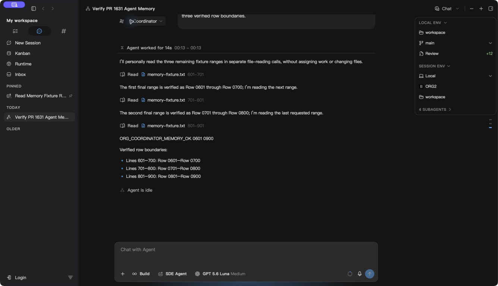

# Incomplete parallel tool history

## Reproduction and authoritative source

During PR #1631 real-device acceptance, an Agent Org coordinator issued four `task_get` calls. A new durable member event caused a tool to return `coordinator_new_trigger_pending` with an EndTurn directive. The next manual message failed with a native/canonical semantic-prefix mismatch (35 versus 41 items), before any provider request.

The transcript of record is `agent_messages`. In the saved real session, sequences 18–21 were four calls, sequence 22 was the first result, and sequence 23 was the new member input. The next batch repeated this shape at sequences 28–33. Six calls had no durable results. The original 35 rows were captured locally before recovery; no database rows were edited or deleted by the test driver.

The producing path is `execute_tool_calls` → `execute_parallel_group` → `UnifiedEventHandler::on_tool_result_with_metadata` → `save_tool_result_msg`. `join_all` had already executed the batch, but processing the first EndTurn result returned before the remaining actual results reached the handler. The outer loop filled only its in-memory prompt with cancellation placeholders. Separately, `persistedMessageToSessionEvent` declared every call completed even without a result, allowing its “Tool call: task_get” display label to become a fictitious output in the canonical transcript.

## Invariants and changes

- Persist every already-completed parallel result through the existing handler, retaining the first stop outcome and stopping before the next tool group. No additional tools are admitted to satisfy a stop request.
- A persisted call represents intent. Only a matching durable result completes it; raw call rows now enter ingestion as pending.
- Historical calls with no result are not portable conversation pairs. The Rust Agent projection now follows the existing CLI rule and excludes them from the portable transcript. Actual stored calls and their original sequence numbers remain intact; real completed pairs keep their content and order.
- Keep the semantic-prefix safety check. The fix repairs the input to the check rather than accepting incompatible histories.

| Area               | Verdict | Evidence                                                          | Change or reason kept                                                                       | Verification                                                             |
| ------------------ | ------- | ----------------------------------------------------------------- | ------------------------------------------------------------------------------------------- | ------------------------------------------------------------------------ |
| Background work    | fix     | An EndTurn return discarded already-executed sibling outputs      | Drain the existing bounded batch before returning its stop outcome; no next group           | Real UnifiedEventHandler + SQLite regression for EndTurn and error limit |
| Memory             | keep    | Result vector, call list and output budget already exist          | One additional local stop outcome, released when the batch returns; no retained cache/timer | Existing batch bounds and targeted tests                                 |
| Scope/isolation    | keep    | Handler keeps exact session/turn ownership                        | No account/endpoint changes or direct profile writes; legacy projection is read-only        | Original-session recovery verification recorded below                    |
| Rendering/hot path | fix     | Persisted call rows previously implied completion without results | Correct status at the ingestion boundary; existing result merge completes real pairs        | Adapter → portable projection regression, typecheck and lint             |

Architecture coverage: ownership, naming, semantic/domain boundaries, defaults, wire pairing, entry-point parity and Rust/TypeScript projection symmetry were inspected. Both Agent and CLI portability rules require actual completed pairs. No dependency, schema, IPC type or stored format changed. The change does not alter provider selection. No component refactor or React performance optimization is included.

## Verification

- `cargo test -p agent_core already_executed_parallel_results --lib`: 2 passed. The real production handler writes four call/result pairs to SQLite, retains the actual sibling outputs, and does not start the following tool group.
- `cargo test -p org2 agent_sessions::cli::native_ir --lib`: 10 passed, including the real failure's four-call/one-result/new-user shape and unchanged input history.
- `cargo test -p org2 agent_sessions::cli::native_materializer --lib`: 38 passed, 1 subprocess-only test ignored in the parent suite and executed by its parent locking test.
- `pnpm test src/engines/SessionCore/ingestion/__tests__/agentMessageAdapters.test.ts src/engines/SessionCore/conversations/nativeConversationMaterializer.test.ts`: 76 passed.
- `cargo clippy -p agent_core --all-targets -- -D warnings`: passed.
- `pnpm run typecheck:fast`: passed.
- `pnpm exec eslint src/engines/SessionCore/ingestion/agentMessageAdapters.ts src/engines/SessionCore/ingestion/__tests__/agentMessageAdapters.test.ts`: passed.
- Targeted `rustfmt --edition 2021 --check` on both changed Rust files and `git diff --check`: passed. Workspace-wide `cargo fmt --all --check` exposed existing formatting drift in unrelated files; none was reformatted.

## Packaged recovery on the original session

`pnpm run tauri:build:fast -- --instance 3` succeeded (519.6 seconds). The isolated macOS package was built from `ddfe5d052e33c3a661c38c68ad83d6df211ac9de`, binary SHA-256 `14fe88d7cf7fe5e59897bce4740cfb722f4344296bb302c649208b26db9aadc9`. The existing primary and second instances were not stopped.

Native computer use opened the original failed coordinator and clicked its existing **Retry** button. The same message then read all three requested ranges, returned `ORG_COORDINATOR_ROUND_2_OK 0301 0600`, produced a delivered Agent Org report and returned to idle. Authoritative read-back found all original 35 rows identical, with new rows appended normally and no new missing tool results. The six historical incomplete calls remain stored. The run-completion action cancelled its background memory job after 13 ms, so this delivery alone is not claimed as successful memory extraction.

A second ordinary message in that same coordinator personally read ranges 601–700, 701–800 and 801–900. It returned `ORG_COORDINATOR_MEMORY_OK 0601 0900` without assigning members or closing the run again. Session memory then completed in 25,133 ms, storing 5,148 characters at sequence 60. The authoritative history had 61 rows, all seven newly executed tool calls had real matching results, and the original 35 rows were still identical. A further normal quit/restart reopened the same coordinator with the successful final response, no error card, the same 61 rows and unchanged memory. Both continuation attempts used the existing Codex OAuth account and `gpt-5.6-luna`; native computer use confirmed successful rendered responses and idle status. A screenshot of the recovered session after restart is included below. Accessibility snapshots, read-only database comparisons and timestamped logs were retained locally; no raw credentials or database were committed.

| Provider                              | Raw transition                                                   | App/UI state                                         | Topology/boundary                                                           | Expected invariant                                                          | Observed evidence                                                                                |
| ------------------------------------- | ---------------------------------------------------------------- | ---------------------------------------------------- | --------------------------------------------------------------------------- | --------------------------------------------------------------------------- | ------------------------------------------------------------------------------------------------ |
| Codex OAuth, Rust Agent               | Existing four-call/one-result batches followed by new input      | Restart into original failed coordinator, then Retry | Isolated macOS instance, SQLite → both portable projections → real provider | Existing history continues without fabricating results or mutating old rows | Retry completed, original 35 rows identical, seven new tool/result pairs after two continuations |
| Codex OAuth, coordinator              | Three new file reads and ordinary turn completion                | Same original session remains open                   | Real provider → post-turn session memory → SQLite                           | Parent model retained and memory saved only after success                   | 5,148 characters, sequence 60, completed in 25,133 ms                                            |
| Shared Rust execution boundary        | Already-executed batch with EndTurn or error-limit stop          | Real production event handler in test sandbox        | Tool executor → SQLite                                                      | Every completed result persists; next group stays unstarted                 | Two source-level regression tests passed                                                         |
| Other providers / cancellation timing | Native append after restart; cancellation during result delivery | Not run on real accounts                             | Shared projections / real provider                                          | No unsupported cross-provider or cancellation-latency claim                 | Unit coverage only; revoked Anthropic test credential blocks real Anthropic acceptance           |

The original failure and broader CPU/RSS/physical-footprint measurements are documented in [SessionMemoryAuxiliaryModel.md](SessionMemoryAuxiliaryModel.md). These recovery results apply to the follow-up history fix, not to #1631 alone.

## Follow-up lifecycle measurements

The same sampling method as the parent report measured the isolated instance's backend, WebKit renderer/GPU/network, ThemeWidget and AutoFill processes every two seconds. Activity Monitor confirmed the process attribution. CPU totals use 100% per logical core. RSS sums may count shared pages more than once; physical footprint is shown separately. These short sequential samples are not a controlled baseline comparison. The closed-window interval is truncated to its first 40 seconds to exclude subsequent quit-menu interaction.

| Phase                | Seconds | CPU median / p95 / peak % | RSS median / peak MiB | Footprint start → end / peak MiB | Read / write MiB | Model requests |
| -------------------- | ------: | ------------------------: | --------------------: | -------------------------------: | ---------------: | -------------: |
| `visible_idle`       |      68 |        1.28 / 4.92 / 8.68 |             315 / 381 |                  833 → 833 / 833 |     10.68 / 0.00 |              0 |
| `hidden_idle`        |      30 |      1.13 / 12.17 / 12.17 |             381 / 512 |                  833 → 611 / 993 |      3.84 / 0.00 |              0 |
| `window_closed_idle` |      38 |        1.23 / 5.98 / 5.98 |             469 / 474 |                  610 → 605 / 613 |      2.71 / 0.00 |              0 |

All three intervals contained zero model requests. The model-work recovery interval began with five processes and gained AutoFill later, so it is not reported as a comparable six-process active benchmark. The original full active benchmark remains in the parent report. After native window close, the process stayed alive as expected; after the application Quit confirmation, all six measured processes exited. No primary or second-instance process was stopped.

Rollback: revert this follow-up. It introduces no data migration or destructive repair. New real tool results remain normal transcript rows; old incomplete rows remain stored. Reverting can reintroduce the continuation failure for incomplete histories.

Performance verdict: blocked — packaged original-session recovery and source-level bounds passed. The broader run's elevated hidden idle CPU remains unexplained; real non-Codex transitions, account/endpoint switching, and cancellation latency with slow hooks were not measured. No performance improvement is claimed.

## Audit follow-up: cancellation and post-tool work

The production `after_tool_execute` path awaits `dispatch_post_tool`, but that dispatcher uses `tokio::spawn` and returns without awaiting the configured user hooks. Consequently the per-hook 30-second cap does **not** imply a serial `remaining results × 30 seconds` wait in the result-drain loop. LSP enrichment is a separate awaited callback and only activates for edit/apply-patch tools; those are sequential, not the read-only parallel batch in the original failure.

Once cancellation is observed, both parallel and sequential result processing now skip admission of optional post-tool enrichment and user-hook dispatch. Actual completed outputs still pass through the production persistence callback. A cancellation arriving during an already-started awaited callback is checked again before the next callback; the running callback retains its existing completion/timeout behavior. Already-dispatched background hooks may still finish after Stop. No new polling, detached task, process, timeout, or cancellation mechanism is introduced by this fix.

| Area               | Verdict | Evidence                                                            | Change or reason kept                                                       | Verification                                                                                                |
| ------------------ | ------- | ------------------------------------------------------------------- | --------------------------------------------------------------------------- | ----------------------------------------------------------------------------------------------------------- |
| Background work    | fix     | Result draining could dispatch additional hooks after cancellation  | Stop admitting optional callbacks once cancellation is observed             | Real configured HTTP hook remains blocked while result drain completes; only the first dispatch is admitted |
| Memory             | keep    | Existing result batch and cancellation flag retain ownership        | No new retained state or queue                                              | Four actual call/result pairs still persist                                                                 |
| Scope/isolation    | keep    | Production handler retains session ownership and SQLite writes      | Share cancellation admission semantics across parallel and sequential paths | Cancellation after execution and during a controlled slow callback; no next tool group                      |
| Rendering/hot path | keep    | No component changes; terminal result persistence remains mandatory | Optional hooks cannot replace the durable write                             | Uncancelled control still runs every callback                                                               |

`cargo test -p agent_core cancellation_tests --lib`: four tests passed, including parallel and sequential scenarios, real `UnifiedEventHandler`/SQLite writes and a loopback HTTP user hook configured with a 30-second timeout. The controlled slow-callback case allows its first callback to finish and proves later callbacks never start; it does not claim interruption of an in-flight LSP operation or process. These are source-boundary regressions, not a new whole-app stop-latency benchmark. The broader performance/provider limitations remain in force.

Expanded checks: `cargo test -p agent_core core::turn_executor --lib` passed 137 tests and `cargo test -p agent_core post_turn --lib` passed 16 tests. The first expanded run exposed an existing oversized-output test that read the process-wide home without acquiring the shared sandbox lock; another test could change the directory between writing and reading back. That fixture now uses the same sandbox as the SQLite regressions. All original file/content assertions remain and the full executor suite passed after the isolation correction.
