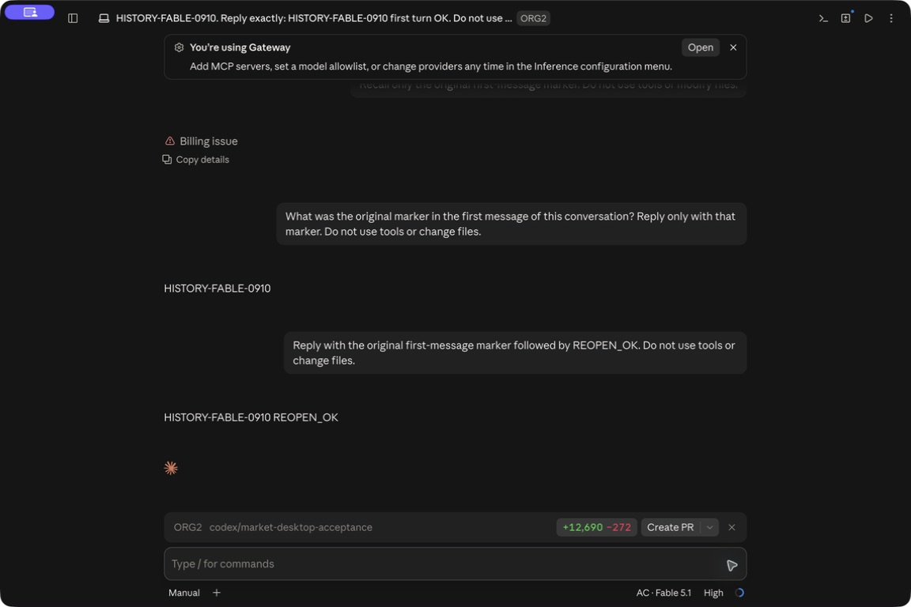

# Claude Desktop gateway catalog audit

Scope: PR #1985; the startup backfill and the added gateway publication path.
No real provider profile or transcript was modified by the automated audit.
The isolated fixture tests do not establish Desktop UI, routing or billing behavior.

## Findings and corrections

| Line / element                                     | Verdict                         | Reason                                                                                               | Change                                                                                                                                                       |
| -------------------------------------------------- | ------------------------------- | ---------------------------------------------------------------------------------------------------- | ------------------------------------------------------------------------------------------------------------------------------------------------------------ |
| `refresh_bound_native_catalog` gateway publication | fix                             | The original extension reused the official updater, overwriting Desktop-owned title/model/turn count | Distinguish official refresh from gateway insert-only publication; every existing gateway row remains byte-identical, including previously ORG2-created rows |
| Backfill `exists` then atomic replacement          | fix                             | Desktop does not take ORG2's lock and could create a row between inspection and rename               | Stage and fsync a complete file, then atomically create the destination via a file hard link; an existing name wins; no profile directories are linked       |
| Catalog JSON parsing                               | fix                             | Entry-count bounds alone did not bound allocation for an unexpectedly large file                     | Read at most 256 KiB plus one byte; reject oversized or non-regular metadata, including symlinked rows                                                       |
| Startup insertion limit                            | keep                            | The 512 limit counts successful new inserts, not already-listed rows                                 | A 513-row fixture must advance 512 → 1 → 0 over three starts                                                                                                 |
| First gateway profile registration                 | keep with documented limitation | Backfill runs once at ORG2 startup; a profile first created later is not immediately picked up       | Open gateway mode once, then restart ORG2; no polling or new entry point added                                                                               |
| Discovery scan horizon                             | keep with documented limitation | At most 2,048 project entries / 10,000 metadata entries are scanned; no persistent scan cursor       | Histories beyond the scanned prefix are not guaranteed to appear on repeated starts                                                                          |

## Performance and lifecycle

| Area               | Verdict | Evidence                                                                                                 | Change or reason kept                                                                         | Verification                                                                          |
| ------------------ | ------- | -------------------------------------------------------------------------------------------------------- | --------------------------------------------------------------------------------------------- | ------------------------------------------------------------------------------------- |
| Background work    | keep    | One `spawn_blocking` task after startup reconciliation                                                   | No timer, watcher or retained worker; no added steady-state work while visible/hidden/offline | Source call-chain inspection; real cold-start/idle measurement remains pending        |
| Memory             | fix     | `listed` set bounded by 10,000 valid UUID entries; 512 insertions; transient JSON now bounded to 256 KiB | Large/corrupt provider metadata cannot force allocation of its entire size                    | Oversized-row regression and scan-budget fixture                                      |
| Scope/isolation    | keep    | `native_transcript_home_dir`, active UUID account and provider-created local org marker                  | Missing profile is a no-op; permissions use an explicit allowlist and safe defaults           | Isolated profile / grant stripping / no-profile tests; runtime account switch not run |
| Rendering/hot path | keep    | No UI change; completed-session publication gains one existing gateway catalog                           | Gateway rows are discovery metadata only; no startup transcript parsing                       | Unit evidence only; Desktop Code tab is a separate manual gate                        |
| Concurrent writers | fix     | Advisory locks protect ORG2 peers but cannot exclude Desktop                                             | Atomic create-if-absent, complete staged bytes, temporary-file cleanup                        | Desktop write during staging and competing-writer tests                               |

## Provider coverage

| Provider                | Raw transition                              | App/UI state                        | Boundary                          | Expected invariant                                               | Evidence                                          |
| ----------------------- | ------------------------------------------- | ----------------------------------- | --------------------------------- | ---------------------------------------------------------------- | ------------------------------------------------- |
| Claude Desktop gateway  | Missing catalog                             | Isolated cold start                 | Local discovery                   | No profile created                                               | Unit test                                         |
| Claude Desktop gateway  | Existing/absent transcript                  | Isolated cold start, repeated start | Source catalog to gateway catalog | Only present transcripts registered; no duplicate or grants      | Unit test                                         |
| Claude Desktop gateway  | Existing native row                         | Completed ORG2 session publication  | Local writer                      | Title/model/grants and all bytes preserved                       | Regression test                                   |
| Claude Desktop gateway  | Concurrent row creation                     | Staged publication                  | Filesystem commit                 | Existing Desktop row wins without partial file                   | Regression test                                   |
| Claude Desktop gateway  | 513 eligible sessions                       | Three isolated starts               | Scan/insertion budget             | 512 then 1 then 0 inserted                                       | Regression test                                   |
| Claude Desktop gateway  | Append/continue history, live index refresh | Real Desktop                        | UI → provider → billing           | History resumes through gateway; restart requirement established | Not run by this audit; separate manual acceptance |
| Claude Desktop official | Restore normal mode                         | Real Desktop                        | Config → original account/catalog | Original sessions and login intact                               | Not run by this audit; separate manual acceptance |
| Claude Desktop Windows  | Same file publication                       | Native Windows                      | NTFS/profile discovery            | Equivalent safe create and correct profile path                  | Not run; Windows runtime remains unverified       |

## Architecture checklist

1. Compilation: targeted Rust tests and clippy are the local gates; record results below.
2. Ownership/deduplication: filesystem staging belongs to `native_store`; both gateway producers call the same insert-only primitive.
3. Naming: `RefreshOfficial` and `InsertGateway` distinguish the existing and new semantics.
4. Terms: Desktop catalog is discovery metadata; native transcript is conversation content; gateway here means Desktop's third-party deployment profile, not Market daemon identity.
5. Defaults: unknown/missing account UUID, origin, transcript or malformed JSON is skipped; permissions are never inherited.
6. Boundaries: Desktop knowledge remains in native materialization; generic storage owner knows only files.
7. Discoverability: documentation no longer claims that all official catalog paths are read-only; only the new backfill is read-only.
8. Serialized data: fixture assertions inspect stored JSON and grant stripping. No network schema changed; real provider calls are a separate acceptance gate.
9. Init parity: production startup invokes the tested backfill; first-use after profile creation requires another ORG2 start. Tests use isolated native homes, not real users' profiles.
10. Resolver symmetry: official refresh keeps previous behavior; gateway new rows require its own active account and registered local project. No identifiers are invented.

## Validation

Baseline before changes: `cargo test -p org2 --lib native_materializer` passed 44 tests, 1 intentional child-process helper ignored.
Updated local validation:

- `cargo test -p org2 --lib native_materializer`: 47 passed, 0 failed, 1 intentional child-process helper ignored; 8.34 seconds (final source recheck). Includes the 513-row continuation, oversized JSON and gateway preservation regressions.
- `cargo test -p org2 --lib native_store`: 5 passed, 0 failed, 1 intentional child-process helper ignored; 0.13 seconds. Includes external Desktop write and competing no-replace writers.
- `git diff --check`: passed.
- `cargo clippy -p org2 --lib --tests -- -D warnings`: passed (1m 51s). No Desktop runtime result is inferred from these tests.

Performance verdict: blocked for full runtime acceptance. Unit and source evidence cover bounded discovery and additive writes; real Desktop cold start, idle/hidden resource measurements, hot index discovery, history continuation, restore and Windows runtime were not performed by this audit.

## Isolated Market App follow-up

The real product launch exposed a separate boundary: Market uses a scoped
Electron profile and `CLAUDE_CONFIG_DIR`, so standard `Claude-3p` backfill alone
cannot make its history resumable. The Open app entry point now prepares missing
transcript snapshots and then publishes discovery rows into that exact managed
profile. The source account/catalog remains read-only; destination history is
insert-only and credentials/settings are excluded. First resume drops the old
provider model and uses the package's configured default. Source changes during
copy or a partial trailing JSONL record prevent publication.

Resource ownership: this is one explicit user action in `spawn_blocking`, under
the existing owner/config barriers. It creates no idle watcher, timer, global
cache, or repeated background scan. First-profile registration retries terminate
within five seconds. Snapshot copying has a 15-second budget, 64 KiB buffer,
128 MiB per-transcript cap and 1536 MiB per-pass cap; metadata and insertion bounds
remain those of the shared catalog importer. Previously imported conversations
are durable user data and are retained on Restore. There is no automatic merge
of later source/destination edits and no deletion of source history.

Architecture follow-up (all ten layers): compilation/tests below; shared catalog
selection and insert writer reused; snapshot import named separately from shared
catalog backfill; gateway versus isolated profile explicitly distinguished;
missing registration skips without fabricating identity; provider format logic
stays in native materialization; UI/docs describe one-way snapshots; serialized
rows strip grants/model; both cold and warm Open app invoke the same importer;
source/destination resolution follows the same cwd/UUID mapping with separate
roots. No public RPC schema, credentials, or official-index writers changed.

Additional runtime gates: first registration, existing profile, already-running
profile, repeated open, imported history display and continuation, billing and
Restore. Regression fixtures cover content-before-discovery, missing/partial/
oversized transcripts, byte/time caps, forbidden links, credential exclusion,
existing destination preservation, and recovery after content commit before row
publication. Final command results and actual UI evidence are recorded separately;
these implementation statements do not claim the runtime gates passed.

Runtime follow-up found a cold-process gap: the isolated profile survived an
ORG2 restart but its local proxy listener did not start. Market Open app now
awaits the existing bounded proxy readiness gate after validating the selection
and taking the owner barrier. It reuses the existing two-worker proxy supervisor;
no new listener, retry policy or idle poll is introduced by history import.

### Measured follow-up (macOS, isolated Market profile)

- A real Open app imported 93 discovery rows and 93 transcript snapshots
  (1,179,519,890 bytes). All 93 source transcript SHA-256 hashes stayed unchanged.
- The package window displayed Gateway / AC · Fable 5.1, and the selected
  imported acceptance conversation rendered its 18 original messages.
- A continuation was submitted after explicit workspace trust. Credential helper
  succeeded, but the old build had no proxy listener after ORG2 restart; no new
  Market request or ledger posting resulted. This is not a successful model call.
- With the follow-up build, a cold ORG2 process had no listener before Open app;
  Open app started the loopback listener in that process. All 93 isolated
  transcripts survived the repeated import byte-for-byte, including the pending
  continuation. The vendor log loaded the persisted catalog after restart.
- Desktop automation then could not address the content window (menus remained
  available). UI continuation, billing, live discovery without restarting, and
  final Restore remain unverified; source/port/file checks do not replace them.
- Final materializer regression: 53 passed, 1 intentionally ignored child helper.
  Frontend production build, 8 GiB Node typecheck, changed-file ESLint and native
  debug App build passed. The default-heap typecheck initially exhausted memory;
  the larger-heap retry passed.

No frontend action controls changed. The existing settings description is the
only UI change; its screenshot is in `docs/claude-desktop-history/`.

### Restart and Restore follow-up

After quitting and reopening the package App through ORG2, the desktop tool
recovered and the imported conversation still displayed its original history.
The resumed request reached the proxy but received HTTP 402 `wallet_insufficient`
from the local Market wallet. The chat did not produce a successful model reply
or a charge. Zero-priced request records were present; they are not evidence of
a successful chat. This funding blocker was resolved by the authorized local test credits described below.

The package App was then quit normally and **Restore original setup** returned
ORG2 to **Original setup** with its success message. All 93 isolated transcript
hashes survived Restore, and all 93 source hashes still matched the pre-import
baseline. Opening the normal Claude App showed its existing Max account and the
original acceptance conversation through message 18, without the package-only
continuation or the Gateway model alias. This verifies isolated-to-original
configuration recovery and retention, not successful paid continuation.

Hot discovery probe: temporarily moved one untouched, ORG2-materialized row out
of the isolated catalog while Desktop ran, then restored the exact bytes. The
sidebar kept its cached row. The official catalog was not edited. This does not
establish that every addition requires a process restart; live list invalidation
remains unproven, so reopening remains the reliable fallback used in acceptance.

Remote CI exposed two omissions: missing translations in 13 locales and unused
macOS-only import code in Windows production builds. Added all translations and
gated the import module to macOS Market builds or tests. `check:i18n-keys` now
reports zero new findings; Windows CI must validate the final head separately.

### Successful continuation, cache billing and final Restore

The user approved local ledger test credits ($5, then $2); these are not real
Stripe collection. The real Desktop request used a 64,000-token output limit
and about 255 KB of JSON, so the existing conservative admission quote exceeded
$6.22. Admission correctly refused the earlier $5.527101 balance. Cloud PRs
#120/#121 now return available balance, required reservation and shortfall for
that 402; the balance check itself is unchanged.

With $7.527101 available, the isolated package App resumed the imported
`HISTORY-FABLE-0910` conversation and answered its original marker correctly.
After a normal Quit and another ORG2 Open app, the successful turn remained and
a second request answered `HISTORY-FABLE-0910 REOPEN_OK`. No workspace trust was
requested again. A third diagnostic turn replied `BILLING_TRACE_OK`.

| Verified request                    | Buyer charge | Seller payable | Evidence                                                                |
| ----------------------------------- | -----------: | -------------: | ----------------------------------------------------------------------- |
| Original-history continuation       |    $0.874541 |      $0.641330 | 73 input, 56 output, 93,002 cache-write tokens                          |
| Quit/reopen continuation            |    $0.019665 |      $0.014421 | 27 input, 24 output, 120 cache-write and 93,002 cache-read tokens       |
| Diagnostic chat                     |    $0.018488 |      $0.013558 | 27 input, 14 output, 31 cache-write and 93,170 cache-read tokens        |
| Captured automatic input suggestion |    $0.023126 |      $0.016959 | Request hash matched a separate `SUGGESTION MODE` prompt to its receipt |

There was also an earlier $0.022755 receipt ($0.016687 seller payable) without a
corresponding chat transcript turn. It resembles the subsequently captured
suggestion request, but its purpose was not captured at dispatch time and is
not asserted as proven. The older, pre-existing $0.002306 receipt is likewise
not resolved by this new evidence.

All five paid receipts were independently recalculated using the snapshotted
buyer/seller rates and the documented sum-then-half-up settlement rounding.
Each request had exactly one hold, seller leg, spread leg and unused-hold return;
all five request reserves closed to zero. There were 36 additional zero-charge
records. Total usage charge was $0.958575 and remaining local wallet $6.568526.
The temporary diagnostic probes were removed and were never committed.

After quitting the package App, Restore returned ORG2 to Original setup. The
normal Claude App reopened with the existing Max account, standard Fable model
label and the original history ending at message 18. Package turns did not leak
into it; all 93 source transcript hashes still matched the pre-import baseline.

Still unverified: hot discovery of newly added rows without restarting, fresh
profile first-registration runtime behavior, Windows runtime, and final resource
sampling. Reopening is a verified discovery fallback, not proof that Desktop
always requires a restart. No installer release or PR merge was performed.

### Additional lifecycle acceptance (2026-09-18 evening)

A synthetic discovery row and two-message transcript were created only in the
isolated package profile while Claude was running. The running sidebar did not
show the new row. After normal Quit and ORG2 Open app, the sidebar displayed
`PR1985 HOT DISCOVERY 0919 synthetic fixture`; opening it displayed both fixture
messages and the configured package model. No prompt was submitted. This proves
restart discovery for this build and fixture, not that every Desktop version
always requires restarting. The fixture was moved into a private evidence archive
after Quit. Official discovery files were not edited.

Repeated Open app focused the same Claude root process rather than creating a
second one. Normal Quit removed Claude and its descendants. Restore then returned
ORG2 to **Original setup** with the restore-success message. Imported real
conversations were retained; only the synthetic fixture was archived.

Twenty-second process samples used CPU-time deltas, with RSS at interval end:

| State                         | ORG2 root CPU | ORG2 root RSS |      Claude family CPU |
| ----------------------------- | ------------: | ------------: | ---------------------: |
| Visible idle                  |         0.15% |     121.1 MiB |            about 4.85% |
| Hidden/minimized idle         |         0.05% |     121.8 MiB |            about 2.45% |
| Immediately after Claude Quit |         2.84% |     184.0 MiB | no remaining processes |
| After Restore, later sample   |         1.00% |     200.4 MiB | no remaining processes |

These are observations, not a performance improvement claim. The visible and
hidden samples used different screens; the latter included a resumed-history
CLI process. Descendant tracking excludes launchd-owned WebKit and other system
processes. Document visibility was not instrumented. The later ORG2 RSS increase
has not been attributed to this feature; long-duration and full process-family
measurements remain open, so these samples do not establish a memory-leak pass.

The rebased feature on develop `2f60797d3d` passed 112 frontend tests, complete
TypeScript checking with an 8 GiB heap, changed-page ESLint and the standard
production webpack build. The four-commit feature patch was byte-identical after
rebase. These compile checks do not imply that the running native artifact
contains the newly merged upstream UI.

Remaining acceptance: fresh unregistered-profile first launch, Windows runtime,
long-duration memory/whole-process lifecycle, and native runtime rebuilt against
the final upstream UI. Real payment collection is outside this local test ledger
acceptance. No merge, production deployment or installer release was performed.

Performance verdict: blocked — long-duration/full-process measurements and fresh
profile registration are not yet evidenced; the bounded import tests, observed
short samples and successful process cleanup remain valid partial evidence.

### Fresh isolated-profile registration

With Claude stopped and ORG2 showing Original setup, the existing test profile
was moved intact to a private backup. Normal App connections configuration and
Open app created a fresh profile. Desktop registered its own identity; ORG2
imported 93 discovery rows and 93 transcripts without inventing account IDs.
The first Code tab still showed an empty list. Normal Quit followed by ORG2 Open
app populated the list, and opening the acceptance conversation displayed its
original 18 messages with the package model. No new prompt was submitted.

After the test, normal Quit and Restore original setup succeeded. The fresh
profile was archived intact and the previous managed profile restored, retaining
all previously verified package-only turns. Official catalogs and source
transcripts were not modified. This closes the fresh-registration acceptance
cell with an explicit first-launch limitation: users may need to reopen Claude
to see imported history. The existing settings text describes that fallback.

Performance verdict: blocked — fresh registration is now tested, but full process
coverage, long-duration resource measurements and final upstream native runtime
remain open. This does not invalidate the completed import, restart and Restore
checks above.
