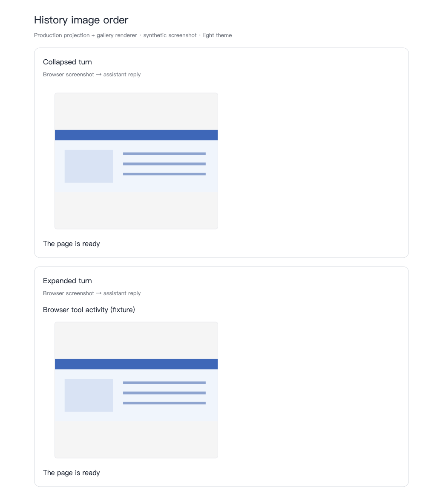
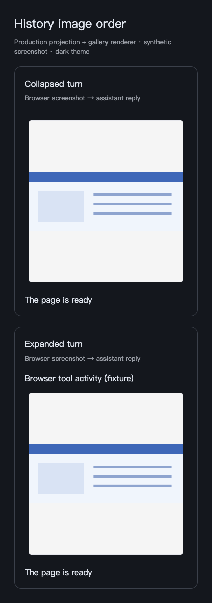

# History image ownership and ordering

## Authoritative source and cause

Read-only inspection of the reported Claude Code JSONL found the screenshot inside a browser tool result, before the following assistant text. The parser already attaches those images to the correct tool chunk. The persisted data is valid; this is a presentation projection defect, not polluted domain history.

`projectChatGroups` previously collected every non-user image in a turn and attached a single gallery to its last surviving row. `RecipeRenderer` suppressed nested galleries, so both expanded and collapsed histories moved earlier screenshots below later assistant text.

The projection now attaches galleries to their producing items before collapse. Collapsed image-bearing items retain a gallery-only row at the original position; the usual final reply, errors and compact boundaries keep their existing visibility. Compact tool stacks keep their gallery at the stack position. Repeated image references at different producing items remain separate chronological occurrences; duplicates within one item are still deduplicated. User attachments remain on their user messages. No transcript or database write, filtering of malformed data, or historical cleanup is needed.

## Verification

- `pnpm test src/engines/ChatPanel/ChatHistory src/engines/ChatPanel/rendering`: 74 files, 668 tests passed
- `pnpm typecheck:fast`: passed
- Changed-file ESLint with `--max-warnings 0`: passed; exact paths are in the PR verification section
- `pnpm check:circular`: passed, 8,166 modules
- `pnpm check:test-placement`: passed, 634 directories
- `git diff --check`: passed
- Production projection and gallery renderer regression: a Claude browser screenshot precedes the following reply, exactly one gallery, in expanded and collapsed states
- Fixtures also cover screenshots after a reply, multiple image producers, repeated refs, image-only turns, unloaded previews, compact stacks, user attachment exclusion and input immutability
- Playwright component evidence at 1040×980 light and 420×900 dark framing: images loaded, gallery precedes reply, no horizontal overflow, both expanded and collapsed states inspected

The screenshots below use actual server-rendered `GroupItemRenderer`/`OutputImageGallery` markup from the test fixture and existing built application CSS. The synthetic screenshot, page framing and tool/reply body stubs contain no private transcript data. They verify component placement; they are not full Tauri screenshots or provider ingestion E2E. Image loading/error behavior is unchanged and covered by existing gallery/thumbnail tests; no new loading/error UI was added.

## Architecture and UI scope

| Layer                | Verdict / evidence                                                                                    |
| -------------------- | ----------------------------------------------------------------------------------------------------- |
| 1 Compilation        | Full typecheck, changed-file lint and affected tests pass                                             |
| 2 Ownership          | Image collection now belongs to each projected item; nested renderer remains suppressed               |
| 3 Naming             | Rename `outputImagesAtEnd` to `outputImagesOwnedByProjection` and collector to `chatItemOutputImages` |
| 4 Semantics          | Turn collapse changes text visibility, never media chronology                                         |
| 5 Defaults           | Standard collapsed/expanded and image-only paths tested                                               |
| 6 Boundaries         | Valid provider data is retained; fix at the UI projection that caused the move                        |
| 7 Discoverability    | Types/comments document item-owned galleries                                                          |
| 8 Wire               | No external wire/schema changes; shared projection result retains existing field shapes               |
| 9 Init parity        | Main and worker consume the same pure projection; no initialization changes                           |
| 10 Resolver symmetry | No account/provider/config resolver changes; intentionally out of scope                               |

The TSX edits only rename the existing ownership flag. No action control, input, size, color or component family is added or restyled. Source/AST and diff inspection found no new native-button or clickable-element bypass. A design-system audit/refactor is not needed for this correctness fix.

## Lifecycle review

| Area               | Verdict | Evidence                                                       | Change or reason kept                                                        | Verification                                                 |
| ------------------ | ------- | -------------------------------------------------------------- | ---------------------------------------------------------------------------- | ------------------------------------------------------------ |
| Background work    | keep    | Pure existing history projection                               | No timers, subscriptions, workers or requests added                          | Source trace                                                 |
| Memory             | keep    | Temporary per-item set and image refs, bounded by loaded items | No app-lifetime cache or copied transcript                                   | Input-immutability and projection tests                      |
| Scope/isolation    | keep    | Items retain session/event identity                            | No provider/root/account rewriting                                           | Multiple-turn and renderer tests                             |
| Rendering/hot path | fix     | End-of-turn collection moved screenshots                       | One pass assigns images before collapse; gallery-only rows preserve position | 668 tests and component screenshots; no measured speed claim |

| Provider          | Raw transition                                     | App/UI state            | Topology/boundary                                       | Expected invariant                                            | Observed evidence                                  |
| ----------------- | -------------------------------------------------- | ----------------------- | ------------------------------------------------------- | ------------------------------------------------------------- | -------------------------------------------------- |
| Claude Code       | Existing browser tool result, then assistant reply | Reported loaded history | Read-only raw JSONL                                     | Screenshot belongs to tool before reply                       | Raw source inspected; parser ownership confirmed   |
| Shared projection | Loaded tool media, collapse/expand, multiple turns | Unit/component fixtures | Canonical events → flat items → actual gallery renderer | Preserve chronology, visibility and user attachment ownership | Regression tests and light/narrow-dark screenshots |
| Claude Code       | Actual app reload/restart/append                   | Fixed desktop           | Native ingestion and virtualized GUI                    | No movement on hydration/reload                               | Not run                                            |
| Other providers   | Native append/compaction/rotation                  | Fixed desktop           | Adapter/runtime                                         | No adapter compatibility claim                                | Not run; adapters unchanged                        |
| All               | Visible/hidden idle and close/delete               | Runtime                 | CPU/RSS                                                 | No added background resource                                  | Source inspection; measurements not run            |

Performance verdict: blocked for full native runtime acceptance: fixed-build Tauri reload/restart and runtime CPU/RSS were not measured. The implemented path creates no new persistent/background resource.

## Risks and rollback

Collapsed turns with multiple image-producing items retain more rows than the old single end gallery. This is intentional to preserve chronology; existing virtualization counts and index mappings are calculated from those retained rows. Actual desktop scroll anchoring after lazy hydration remains unverified. No dependency, storage, schema or provider protocol changes. Rollback is a code revert; all original transcript data remains intact.
