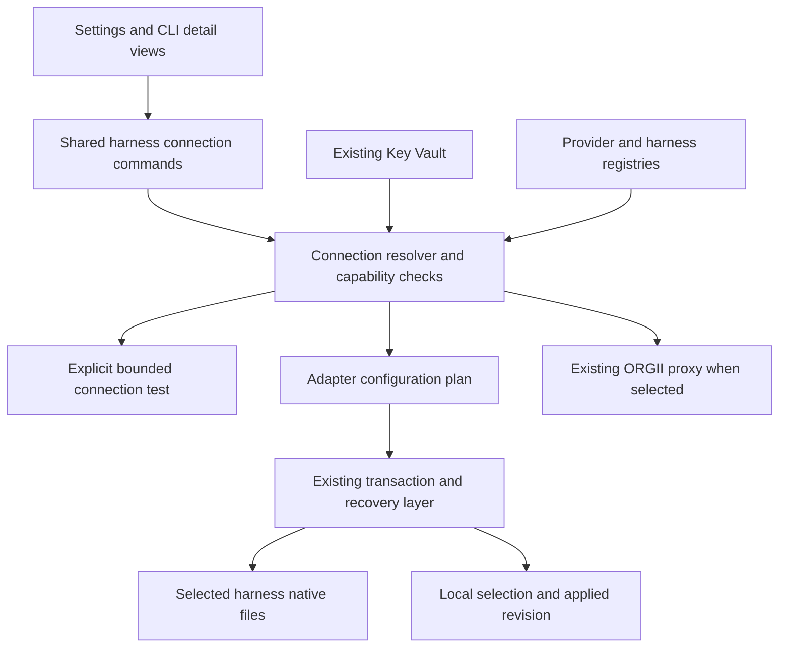

# Harness connections in Settings

Status: original design proposal, 2026-09-06. The initial Claude Code/Codex implementation is now included in this branch. See [the delivered behavior and validation limits](../harness-connections.md) for the final scope; unchecked items below are the original design checklist, not claims of completed verification.

## Outcome and scope

Let a user choose a harness, select a saved API connection, and apply it without editing configuration files. Start with Claude Code and Codex CLI, including compatible third-party gateways and custom endpoints. Direct connections keep working after ORGII exits. Existing ORGII proxy connections remain available with their dependency on the running app clearly stated.

Build on ORGII's Key Vault and CLI configuration transaction layer. Selectively adapt cc-switch configuration handling and regression fixtures when they fill a demonstrated gap; retain MIT notices and pin the upstream source revision. Do not add the cc-switch desktop app, its database, or the third-party Node binding as a runtime dependency.

The initial scope is local CLI configuration on the user's machine. It does not claim to configure Codex cloud, every IDE/desktop surface, project overrides, or every running session. Gemini and OpenCode are subsequent adapter milestones, each with its own compatibility evidence. Automatic failover, new protocol translators, OAuth account rotation, and live mid-turn switching are outside the first release.

## Completion checklist

- [ ] Settings exposes a searchable, addressable Harness connections section using the existing settings manifest and navigation system
- [ ] Claude Code and Codex can each select an existing key, add a connection, import a cc-switch connection, test it, apply it, and restore the original setup
- [ ] Compatibility is evaluated at the backend against the selected endpoint, protocol, auth method, model, and installed harness version; provider branding alone neither grants nor rejects support
- [ ] A Chat Completions-only endpoint is never advertised as Responses-compatible
- [ ] Applying a connection writes only the selected harness's owned configuration fields and preserves unrelated settings, tools, permissions, and saved subscription credentials
- [ ] A failed or interrupted multi-file switch restores the previous configuration and selection, or reports a recoverable conflict without overwriting external edits
- [ ] Direct mode remains usable after a clean ORGII exit; proxy mode retains its documented restore-on-exit behavior
- [ ] Settings and existing CLI detail views share one resolver, mutation path, and status model
- [ ] A removed, disabled, changed, or incompatible selected key never silently falls back to another account
- [ ] UI distinguishes saved configuration, test evidence, and activation/restart status
- [ ] Each supported harness passes real CLI execution against an isolated protocol fixture, including streaming and tool-call round trips
- [ ] Each named third-party compatibility claim records endpoint/model/harness version and actual verification evidence
- [ ] No continuous endpoint probes or filesystem scans are added for direct mode

## Existing foundations and gaps

Paths in this document are relative to the repository root.

| Existing owner                                                               | Reuse and change                                                                                                                              |
| ---------------------------------------------------------------------------- | --------------------------------------------------------------------------------------------------------------------------------------------- |
| `src-tauri/crates/key-vault/src/provider_config.rs` and `commands/registry/` | Reuse provider, endpoint, model, and auth metadata; add precise protocol capabilities rather than duplicating a provider catalog              |
| `src-tauri/src/cli_managed_proxy.rs`                                         | Existing production validation and apply command; extract a shared connection resolver so compatibility does not depend on starting the proxy |
| `src-tauri/crates/agent-cli/src/managed_config/`                             | Reuse registry, adapters, snapshots, atomic file writes, transactions, conflict checks, and restore; add direct mode and field ownership      |
| `src/modules/MainApp/AgentOrgs/components/CliConfigSwitchCard.tsx`           | Existing UI mutation path; replace its private selection/status logic with the shared feature implementation                                  |
| `src-tauri/crates/key-vault/src/auto_detect/suggestions/cc_switch.rs`        | Existing read-only cc-switch importer; route its records through the same connection normalization and validation                             |
| `src/config/settingsUiManifest/`, `src/config/mainAppPaths/settings.ts`      | Register the new settings destination, rendering slot, labels, and route                                                                      |
| `src-tauri/src/agent_sessions/cli/session_runner/`                           | Preserve explicit per-session credentials and isolated profiles; global switching must not overwrite them                                     |

Concrete gap: `resolve_proxy_context_for_selection` rejects non-OpenAI providers when the harness requires Responses, even when the central compatibility registry allows a third-party provider. Remove that brand restriction only after the replacement resolver proves protocol support; simply deleting the check is insufficient.

Current managed mode writes local proxy URLs and restores managed files on shutdown. A direct connection is a distinct persistence/lifecycle mode, not another proxy URL choice. The current operation mutex is process-local; add coordination for independent ORGII instances targeting the same files.

## Settings experience

Add **Settings → Harness connections**, with route segment `harness-connections`. Use `buildSettingsPath`, the central segment/icon registry, settings section manifest, slot registry, sidebar search, and spotlight destination definitions. Render the same section in the full Settings page and compact SettingsSlot.

Use a short list of installed harnesses, with unsupported/not-installed harnesses shown separately on demand. Each row shows the harness, configured connection, and an explicit state. Selecting a row expands its setup controls.

```text
Harness connections                         [Import from cc-switch]
Choose which connection each coding tool uses

Claude Code     Work gateway       Direct       [Change]
Codex           Personal OpenAI    Direct       [Change]

Codex
Connection      [Personal OpenAI                       v]
                [+ Add connection]
Model           [Saved compatible model                v]
                Advanced: endpoint, authentication, routing

Applies to this machine's Codex CLI default
Works when ORGII is closed

[Test connection]              [Use this connection]
[Restore original setup]
```

### Setup flow

1. Select a harness. Read its actual target paths/configuration and installed version without changing them.
2. Select a saved Key Vault connection. Prefer the currently configured key; never silently select a different key after a refresh. Show incompatible connections in an explanatory disabled group, including the precise reason.
3. Add connection reuses the Key Vault wizard. Required inputs are name, provider/preset or custom endpoint, and API key. Ask for endpoint/protocol only when the preset cannot supply them. Model selection is required when no unambiguous saved choice exists.
4. Test connection is explicit and cancellable. Explain that it sends a small request to the selected provider and may incur usage. It must not write harness configuration or send workspace content.
5. Use this connection performs local validation, generates a redacted summary, and applies the selected configuration with one click. Do not add a second confirmation for the normal reversible switch. Only an actual config conflict opens a review flow.
6. Read back the files and show Configuration saved, plus Start a new session / Restart required as reported by the adapter. Do not label an already-running process as switched without evidence.
7. Restore original setup removes ORGII-owned configuration and restores the captured original state. If unrelated edits happened meanwhile, preserve them through owned-field restoration or stop for conflict review.

Advanced routing choices are **Direct** (default for eligible connections) and **Through ORGII** (only for supported proxy routes). Explain the latter with “Requires ORGII to stay open”. Do not silently introduce a local proxy after a failed direct test.

Useful states: Not configured, Configured, Restart required, Test passed with timestamp, Untested, Test failed, Connection changed, Configuration changed externally, Missing key, Unsupported version, and Proxy unavailable. These describe independent facts: a test failure must not falsely clear a saved configuration.

Use existing SectionContainer/SectionRow, Select, Button, Input, Message, Placeholder, and status primitives. Provide accessible labels, keyboard navigation, focus restoration, and screen-reader status announcements. Support light/dark themes, narrow SettingsSlot width, loading/empty/error/conflict states, and every locale. Settings-row descriptions have no sentence-ending punctuation.

## Compatibility contract

“Compatible” means a supported harness/protocol/auth combination with evidence for the selected connection. A successful model list or text response alone does not prove a coding harness's tool and streaming behavior.

| Harness/endpoint combination                        | First-release decision                                                                                                                                      |
| --------------------------------------------------- | ----------------------------------------------------------------------------------------------------------------------------------------------------------- |
| Claude Code → Anthropic Messages-compatible gateway | Eligible when auth, streaming, model mapping, and required tool behavior are supported                                                                      |
| Claude Code → Chat Completions-only endpoint        | Unavailable in direct mode; no new translator in this scope                                                                                                 |
| Codex → OpenAI or third-party Responses endpoint    | Eligible when the actual endpoint supports the required Responses behavior, auth, streaming, and tools                                                      |
| Codex → Chat Completions-only endpoint              | Unavailable for the initial adapter, even if advertised as OpenAI-compatible                                                                                |
| Existing ORGII proxy-supported connection           | Retain existing behavior and evaluate through the same compatibility service; proxy availability does not imply protocol conversion                         |
| Saved native subscription login                     | Preserve and restore; do not reinterpret OAuth tokens as third-party API keys                                                                               |
| Custom endpoint with unknown capabilities           | Allow setup and testing; clearly mark unverified capability and block structurally unsupported combinations                                                 |
| Gemini / OpenCode                                   | Add after the initial release with native config/auth/model semantics and separate fixtures; existing managed support is not evidence of new direct support |

Separate static support from test evidence. Return a typed verdict with reasons: compatible, requires-test, incompatible, unsupported-version. Keep test states distinct: untested, passed, failed, expired. A first-use custom endpoint requires a passing targeted probe before activation; known supported presets may be applied offline after local validation with an explicit Untested state. Expired evidence must not stop an already-configured harness or reroute its traffic.

Capability records should identify protocol (`anthropic_messages`, `openai_responses`, `openai_chat_completions`), auth strategy, streaming/tools support, routing mode, harness version bounds, and provenance of evidence. Registry-backed support and user-supplied assertions must remain distinguishable. Revalidate affected evidence when endpoint, secret revision, model, protocol, or harness version changes.

For third-party Claude model mappings, distinguish ORGII-tested behavior from Anthropic-supported behavior; do not present non-Claude model routing as vendor-certified. Model aliases and optional features require per-adapter handling, not brand-name inference.

## Architecture and ownership



Define the following concepts once and update Rust DTOs and TypeScript schemas together:

- **Harness:** executable/config adapter, identified by the existing CLI registry ID
- **Connection:** existing vault key reference plus selected endpoint/auth/protocol metadata; no second secret store
- **Selection:** harness + key ID + model + routing mode + target scope; persist locally for the exact machine/config root
- **Resolved connection:** validated immutable snapshot of the selection and credential revision, held only for the operation
- **Apply plan:** target paths, owned-field edits, expected file hashes, prior selection, and required activation action; UI form is redacted
- **Observed status:** configured selection, actual config match, test evidence, and activation guidance; never inferred only from the last button click

Keep vault/network resolution in the owning backend service. `agent_cli` receives resolved adapter inputs and owns native file operations; it must not grow a second vault or depend on the root app. Direct and proxy paths share resolution but have separate execution adapters.

Resolve endpoint, auth, model, and protocol from one coherent selection. The precedence is explicit selection → saved connection metadata → compatible preset defaults. Missing or incompatible fields produce actionable errors. A model/key pair from one connection must never combine with another connection's endpoint fallback.

Proposed commands: list harness connection status, list eligible connections, test connection, apply connection, and restore original. The existing managed apply entry point delegates to the shared service until its callers are converted, then remove the duplicate command path if no compatibility consumer needs it. Status queries are read-only and must not start the proxy.

### Native configuration adapters

Claude Code: merge only owned env/model/auth fields in its native settings; handle API-key versus bearer-token conventions explicitly. Detect conflicting auth variables/helpers and higher-precedence settings. Do not delete unrelated settings or saved OAuth credentials. Show effective-configuration limitations when external shells or project settings override the user default.

Codex: write a distinct ORGII-owned custom provider using version-supported auth configuration. Preserve the native OpenAI login and unrelated profiles/settings. Do not assume setting `OPENAI_API_KEY` in the ORGII process configures independently launched terminals. Phase 1 must fixture-test the chosen native persisted bearer/auth mechanism and select a supported version range before enabling direct mode. Prefer a native provider credential field/store that works without a running ORGII process; require a separate design review if a helper executable becomes necessary. Avoid reserved built-in provider IDs, double `/v1` path suffixes, and conflicting `requires_openai_auth`/provider-specific auth settings.

Use syntax-preserving edits for TOML/JSONC where supported; preserve unknown keys and comments where the format/tooling permits. Invalid input is an error, not an invitation to overwrite with an empty default. Do not overwrite an existing provider entry merely because its name resembles ORGII's.

### Transactions, credentials, and coexistence

Serialize mutations by canonical target root with an OS-visible lock across ORGII instances, plus expected-hash/revision checks. cc-switch does not participate in that lock: detect external edits immediately before writes and during read-back, stop on conflict, and never auto-fight an external writer. Exact arbitrary external-writer atomicity cannot be guaranteed without cooperation; record this limitation.

Extend the existing transaction journal to cover native files and applied selection. On failure restore both; on crash reconcile before the next mutation. Recovery must check that files still match this transaction's written content before undoing them. Never roll back over subsequent external edits. Retain immutable original snapshots and one previous-apply snapshot per target; incomplete recovery blocks further writes for that target. Expired nonessential snapshots are pruned only after a committed transaction.

Vault stays authoritative for secrets. Native harness credential files necessarily contain harness-usable secrets where no native secure store exists; use owner-only permissions/Windows ACL handling from the first write, including backups/journals/temp files. Raw keys never enter status DTOs, settings search, telemetry, ordinary logs, redacted diffs, URLs, or cloud-synced settings. Reuse the existing secure create/import RPC only at the secret-ingestion boundary.

Key edits invalidate prior evidence and mark direct exports as needing reapplication; do not silently rewrite global settings on every vault edit. Disabling/deleting a vault entry cannot revoke a secret already copied into a CLI's native config. Show dependent harnesses and offer explicit restore/reapply actions; preserve their protected rollback state and do not switch to another key. Provider-side revocation remains separate.

Existing `default` and `orgii_managed` records retain their meanings; introduce a direct mode without reinterpreting old profiles. Startup and shutdown understand the mode explicitly: direct persists, managed proxy follows existing restore behavior. Before rolling back to an older app version, restore new direct profiles using the newer version so old shutdown/recovery code cannot misinterpret them. Keep sufficient journal/backup data until restoration succeeds.

cc-switch import is read-only, explicit, and one-way. Preview source, harness, name, endpoint, model, and masked credential; revalidate at ingestion. Detect duplicates using the existing vault identity rules plus source references without exposing key fingerprints publicly. Skip or explain unsupported OAuth/proxy-placeholder profiles and unknown fields; never execute imported scripts, commands, or arbitrary configuration payloads. Applying an imported connection uses ORGII's adapters and transaction service. Do not write back to cc-switch's database.

## Delivery phases

Each phase should remain reviewable and scoped; split further if it grows beyond approximately 20 implementation files. Supporting tests belong with the behavior they prove. Existing unrelated workspace edits must remain untouched; implement from an isolated checkout when needed.

| Phase                                  | Concrete work                                                                                                                                                                                                | Exit evidence                                                                                                                                           |
| -------------------------------------- | ------------------------------------------------------------------------------------------------------------------------------------------------------------------------------------------------------------ | ------------------------------------------------------------------------------------------------------------------------------------------------------- |
| 1. Compatibility and shared resolution | Define exact capabilities/auth strategies; replace contradictory brand checks; wire shared resolver into the existing managed path; verify current harness configuration contracts with fixtures             | Backend tests reject Chat-only endpoints, accept fixture-proven third-party Responses, preserve invalid-key errors, and resolve all fields consistently |
| 2. Direct Claude and Codex switching   | Extend modes, adapters, journal/selection transactions, permissions, cross-process locking, restoration, and lifecycle handling                                                                              | Actual CLI processes use distinct synthetic keys/endpoints from generated configs; streaming/tools pass; crash/conflict/exit tests preserve invariants  |
| 3. Settings setup UI                   | Add route/manifest/slot/search integration, harness rows, shared editor, add-key handoff, test/apply/restore controls, full status handling, and locales; make old CLI detail surface reuse the same feature | Route and component tests plus backend read-back through production commands; UI consistency audit and any explicitly authorized visual validation      |
| 4. cc-switch onboarding                | Expose existing importer in the new flow; normalize endpoints/models/auth, deduplicate and report unsupported profiles; add source fixture provenance                                                        | Read-only import tests and import → vault → apply → native harness tests; no changes to cc-switch source database                                       |
| 5. Broader harness adapters            | Gemini native env/settings and OpenCode additive provider/default-model semantics; reuse shared service and settings rows                                                                                    | Separate adapter fixtures and real CLI tests per claimed combination; no inherited compatibility claims from Claude/Codex                               |

Release the initial feature after phases 1–4. Phase 5 is explicitly subsequent scope. Feature access should be gated by adapter capability/version, not hidden UI checks. Do not make unrelated cleanup, a proxy rewrite, or an SDK integration part of these changes.

## Verification plan

Tests must exercise the producing boundary: vault import/normalization, resolved connection, generated native config, transaction, and actual harness request. Selector tests alone cannot prove compatibility.

| Boundary               | Required cases                                                                                                                                                                                      |
| ---------------------- | --------------------------------------------------------------------------------------------------------------------------------------------------------------------------------------------------- |
| Resolver               | Official and third-party endpoint; disabled/deleted key; unknown protocol; endpoint/model mismatch; unsupported version; auth conflicts; changed credential revision                                |
| Native config          | Missing/valid/malformed files; custom config roots; existing subscription login; unrelated MCP/tools/permissions; comments; provider-name collisions; env/project precedence                        |
| Transaction            | Failure on each write; manifest failure; crash before/after commit; exact recovery; repeat apply; external edit; two ORGII processes; read-back mismatch                                            |
| Direct/proxy lifecycle | Direct survives app exit; proxy shutdown restores only owned managed files; crash leaves recoverable state; no status-triggered proxy startup; session-scoped profiles remain unchanged             |
| Protocol execution     | Real CLI spawn with fake keys and local fixture server: text, streaming, tool request/result, second turn, 401, 429, malformed/error stream, wrong API format                                       |
| Named providers        | Real opted-in endpoint smoke test with recorded harness version, model, endpoint, date, outcome and limitations; no workspace data in test prompts                                                  |
| Import                 | Realistic cc-switch Claude/Codex fixtures, auth-token/API-key forms, custom endpoints, duplicates, unavailable/changed schema, unsupported OAuth, proxy placeholders, and malicious extra fields    |
| UI                     | Navigation/search/SettingsSlot parity; no keys; no harness; incompatible key reason; add-key return; cancellation; stale response after changing selection; apply failure; conflict review; restore |
| Platforms              | macOS/Linux file permissions and locks; Windows replace/ACL/locked-file behavior; overridden roots and secondary-instance isolation                                                                 |

Use isolated HOME/config roots and synthetic secrets for automation. Real provider calls belong to explicit Test connection or authorized smoke testing; no live keys are necessary to create the plan or run protocol fixtures.

Follow `.github/CONTRIBUTING.md`: new frontend tests are colocated `.test.ts`; existing directories retain their current convention. Rust tests live at their owning crate boundary. Root `cargo:test:lib` alone does not cover `agent_cli` or `key_vault`.

Planned commands, narrowed to each phase's changes:

```sh
pnpm typecheck
pnpm lint
pnpm check:test-placement
pnpm check:circular
pnpm test -- <changed-test-paths>
cargo test --manifest-path src-tauri/Cargo.toml -p agent_cli managed_config
cargo test --manifest-path src-tauri/Cargo.toml -p key_vault
pnpm cargo:test:lib -- cli_managed_proxy
pnpm cargo:check
pnpm cargo:clippy
git diff --check
```

Select or add protocol/CLI integration test commands during phase 2 and record their exact invocations. Do not run desktop UI-control tools, WebDriver, or other local GUI automation without explicit user opt-in. Source tests, DOM tests without desktop control, and headless CLI fixtures remain available. Missing screenshots/runtime UI evidence is disclosed rather than treated as a reason to ask again or abandon implementation.

## Lifecycle and performance review

| Area            | Planned decision                                                                                                                                                               | Required evidence                                                                       |
| --------------- | ------------------------------------------------------------------------------------------------------------------------------------------------------------------------------ | --------------------------------------------------------------------------------------- |
| Background work | Direct mode has no daemon, health poller, or file scan; read once on view/focus and after apply/import/vault invalidation; proxy starts only on explicit enable/runtime demand | Start/visible idle/hidden idle/exit counters; zero direct-mode recurring endpoint calls |
| Memory          | Share one active probe per connection revision; bound diagnostic payloads and test evidence; cancel on unmount/selection change                                                | Repeated open/close, cancellation, bounded request/result retention tests               |
| Scope/isolation | Key state by instance/config root/harness/connection revision; generation-check late results; serialize target writers across processes                                        | Endpoint/key switches during test and two-instance collision fixtures                   |
| Rendering       | Subscribe to the selected harness and relevant vault metadata; reuse one controller across settings/detail views                                                               | No duplicate requests with both surfaces mounted; hidden view does not poll             |
| Offline/retry   | One explicit test with a finite timeout; no automatic unbounded retries; static direct configuration may be applied under the policy above                                     | Offline, timeout, repeated 429, cancellation and reconnect fixtures                     |
| Filesystem      | Blocking I/O off async/render threads; bound retained snapshots; recovery precedes mutation and respects later edits                                                           | Failure injection, snapshot retention, recovery and contention tests                    |

Planning verdict: the design specifies bounded ownership and lifecycle rules. Runtime performance verdict is not yet established; CPU/RSS and resource-count measurements are implementation exit evidence, not claims made by this plan.

## Architecture checklist coverage

| Layer                      | Planning coverage and implementation gate                                                                                                                     |
| -------------------------- | ------------------------------------------------------------------------------------------------------------------------------------------------------------- |
| 1. Compilation             | No application change in this plan; compile/typecheck gates defined for implementation                                                                        |
| 2. Structure/deduplication | Traced settings/detail → RPC → resolver → config/proxy owners; shared service replaces duplicated compatibility logic                                         |
| 3. Naming                  | Harness, connection, selection, routing mode, configured status and test evidence have distinct meanings                                                      |
| 4. Semantic overload       | Separate provider brand from protocol; native login from API key; direct configuration from proxy routing; user default from session override                 |
| 5. Defaults                | Unknown protocol/version/key never falls through to another provider; direct preference applies only to eligible connections                                  |
| 6. Boundaries              | Vault owns secrets/capabilities; root service resolves; agent_cli owns native files; React renders typed verdicts                                             |
| 7. Discoverability         | One settings destination and shared editor; routing mechanisms stay in Advanced with meaningful availability copy                                             |
| 8. Wire payloads           | Redacted RPC status and actual outbound protocol fixture assertions required; no runtime payloads captured for this document                                  |
| 9. Init parity             | Settings/detail/import use the same commands; secondary roots and CLI launch profiles are explicit; helper-only tests cannot substitute for production writes |
| 10. Resolver symmetry      | Endpoint/auth/model/protocol resolve from one immutable selection and revision; all errors retain the same no-fallback invariant                              |

This is a scoped feature design review, not a whole-repository audit. Compilation, live payload inspection, platform execution, UI visual QA, and measured performance are intentionally pending implementation. Run frontend-ui-audit on implemented/refactored components and save its required report then; do not fabricate verdict counts before a UI diff exists.

## Sources and reuse

- [cc-switch source](https://github.com/farion1231/cc-switch/tree/5a04034816e63e034d5ba9031eb10cec2190e8d1), version 3.20.1 at the inspected revision; [switching documentation](https://github.com/farion1231/cc-switch/blob/5a04034816e63e034d5ba9031eb10cec2190e8d1/docs/user-manual/en/2-providers/2.2-switch.md) describes native file switching and harness-specific activation
- [cc-switch MIT license](https://github.com/farion1231/cc-switch/blob/5a04034816e63e034d5ba9031eb10cec2190e8d1/LICENSE); copied code/fixtures require retained notices and source provenance
- [Third-party Node binding](https://www.npmjs.com/package/@botiverse/cc-switch); evaluated previously, not selected as an ORGII dependency
- [Official Codex advanced configuration](https://learn.chatgpt.com/docs/config-file/config-advanced) and [authentication](https://learn.chatgpt.com/docs/auth): custom provider/auth settings, native credential storage, and subscription/API-key distinction
- [Claude Code gateway documentation](https://code.claude.com/docs/en/llm-gateway): gateway configuration, protocol compatibility boundaries, and subscription/auth interaction

Recheck exact installed CLI contracts during adapter implementation. A preset, cc-switch import, or upstream marketing claim is input to verification, not proof of compatibility.
