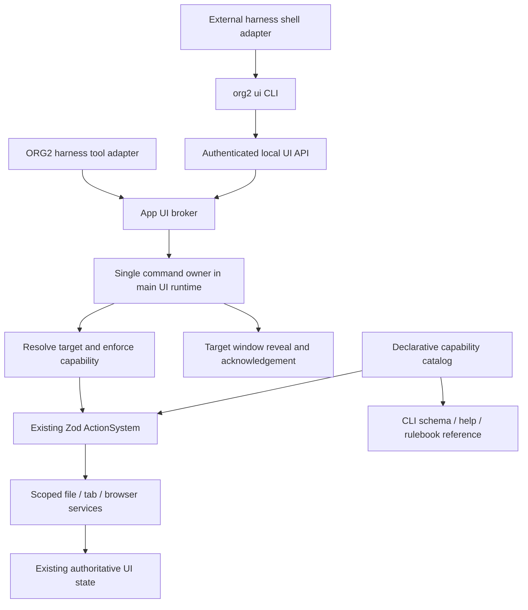

# ORG2 UI commands CLI 与 App Rulebook

状态：已开始实施，第一轮公共 CLI、共享 broker、十四个命令（含终端读写）、短 rulebook 与按需 docs 已接线。当前使用方式和准确限制以 [实现说明](../agent/ui/README.md) 和 [已发布 rulebook](../agent/ui/rulebook.md) 为准。下文保留完整目标架构与验收清单；独立窗口、渲染完成确认、全量旧 bridge 迁移和托管 harness 专属授权尚未完成。原有 `.draft.md` 文件是设计历史，不是当前命令契约。

## 目标与完成条件

让 ORG2 harness、ORG2 启动的外部 harness，以及用户独立启动的 Codex 等 harness，通过同一套语义命令操作 ORG2：查看当前状态，在 MyStation 打开文件、网页、内置 tab，定位已有 tab。Rulebook 解释使用规则，CLI 提供可发现、可验证的能力。具体 harness 只是适配器。

首版实现的验收清单：

- [ ] `org2 ui` 的发现、状态、schema、执行入口不要求创建 ORG2 agent session，也不要求打开 Code Editor
- [ ] 同一命令经内置工具、外部 CLI 到达同一 dispatcher、权限检查和 ActionSystem handler
- [ ] 请求在开始执行前固定 app instance、窗口、station、workspace 和 repo；异步完成不得改写后来选中的 session
- [ ] 可以打开精确文件路径并定位行号、打开 MyStation Browser 网页、打开 Explorer / Source Control、聚焦已有 tab
- [ ] 返回稳定的 tab 引用和结果状态；文件不可读、目标不存在、权限关闭、窗口未就绪不能报成功
- [ ] 同一 request ID 的传输重试不重复执行；窗口关闭、调用方取消、超时和 app 重启的行为有测试
- [ ] Rulebook、CLI help、schema 的参数来自同一 capability catalog；运行时可用性单独查询
- [ ] 常用能力直接可用；长尾能力通过 docs index → topic → schema 按需加载，不把全量 action 列表注入每轮 prompt
- [ ] 无新常驻轮询；pending、回执缓存、结果大小均有上限；双实例和窗口生命周期验证通过

原始首版不包含聊天发送、session 创建/删除、文件写入、命令执行、任意 DOM 点击、网页自动化、远程控制或创建新窗口。后续用户已明确批准终端执行、输入和中断；当前公共契约增加了有界、显式 terminal ID 的 PTY 输入，详见 `docs terminals`。这些能力不能借通用 `exec` 绕过边界。终端执行、browser automation 和 session management 保持各自领域接口。

## 术语边界

| 名词             | 当前不同含义                                     | 本设计约定                                                                  |
| ---------------- | ------------------------------------------------ | --------------------------------------------------------------------------- |
| app instance     | 不同数据目录下的 ORG2 进程                       | `instanceId` 标识一次运行，`ORGII_HOME` 决定发现范围                        |
| window           | 主窗口、独立 station 窗口、浏览器 webview        | `windowId` 是注册的 ORG2 UI 窗口；不是网页 tab                              |
| station          | MyStation、AgentStation                          | `station` 是展示模式；首版执行目标为 `my-station`                           |
| workspace        | repo 路径、session 的 tab 工作区                 | `workspace` 使用现有 `global` / `session` 判别联合；`repoPath` 独立解析     |
| session          | agent session、browser session、PTY、IPC channel | 参数明确写 `sessionId`、`browserSessionId` 等；调用者身份不等于目标 session |
| tab              | WorkStation tab、browser resource、chat tab      | 首版 `tab` 指 WorkStation tab 引用，保留 `partition`；browser ID 单独返回   |
| action / command | Zod action、agent tool、shell command            | `command` 是对外语义契约；`action` 是现有前端执行单元                       |
| rulebook         | app 能力说明、用户规则配置                       | 本文只定义 app 使用说明；不改 policies、AGENTS.md 或用户个人规则            |

## 已有基础与实际调用链

当前主路径：

```text
control_orgii / spotlight / manage_session / coding dispatch
  → agent-core 中的 ActionBridge
  → agent:ade_action（global UI channel）
  → useAgentADEActions
  → zodActionRegistry.execute
  → 领域 Service / Jotai tabs state
  → agent_ade_action_result → pending oneshot
```

| 基础                               | 源码证据                                                                                                                                                                                                           | 复用决策                                                                                  |
| ---------------------------------- | ------------------------------------------------------------------------------------------------------------------------------------------------------------------------------------------------------------------ | ----------------------------------------------------------------------------------------- |
| action 定义、Zod 校验、manifest    | [defineZodAction.ts](../../src/ActionSystem/schema/defineZodAction.ts)、[zodRegistry.ts](../../src/ActionSystem/schema/zodRegistry.ts)                                                                             | 保留；补明确的外部暴露元数据，不能把默认 `layer=gui` 当授权                               |
| 请求关联和等待                     | [control_orgii.rs](../../src-tauri/crates/agent-core/src/core/tools/impls/web/control_orgii.rs)                                                                                                                    | 抽出 app 级 broker；现有 pending 上限 50、默认超时 10 秒可以作为初始预算参考              |
| 前端 bridge 和权限                 | [useAgentADEActions.ts](../../src/engines/SessionCore/hooks/useAgentADEActions.ts)                                                                                                                                 | 分离通用 UI runtime 和 session 特殊流程；共享执行授权入口                                 |
| UI snapshot、发现、执行            | [appUiSnapshot.ts](../../src/services/context/appUiSnapshot.ts)、[guiControlActions.zod.ts](../../src/ActionSystem/actions/guiControlActions.zod.ts)                                                               | 状态投影可复用；首版不导出 DOM 控件列表和 DOM execute                                     |
| 精确文件和行号                     | [fileOpenActions.zod.ts](../../src/modules/WorkStation/ActionSystem/registration/actions/file/fileOpenActions.zod.ts)                                                                                              | 复用 `file.openDirect` / `file.openAtLine` 所属能力，补 scoped service 和真实结果         |
| tab 状态与 service                 | [types.ts](../../src/store/workstation/tabs/types.ts)、[EditorTabService.ts](../../src/services/workStation/EditorTabService.ts)                                                                                   | 保留 workspace/partition 模型；扩充显式 workspace 参数，不另建 CLI tab store              |
| 页面导航和内置 tab                 | [WorkStationViewService.ts](../../src/services/workStation/WorkStationViewService.ts)                                                                                                                              | 提取显式 reveal/activate 操作；CLI 不使用快捷键的 toggle 行为                             |
| 两种 URL 路径                      | [urlPreviewActions.zod.ts](../../src/modules/WorkStation/ActionSystem/registration/actions/urlPreviewActions.zod.ts)、[useOpenUrlInBrowser.ts](../../src/modules/useOpenUrlInBrowser.ts)                           | editor preview 与 Browser 必须区分；首版网页命令固定使用 Browser                          |
| HTTP listener、endpoint descriptor | [server.rs](../../src-tauri/src/api/server.rs)、[agent_status_ingest.rs](../../src-tauri/src/api/agent_status_ingest.rs)、[data_root.rs](../../src-tauri/crates/app-paths/src/data_root.rs)                        | 复用 listener 和 `ORGII_HOME` 路径规则；UI 使用独立凭据，不共用 provenance hook token     |
| CLI 启动及 harness 接入            | [main.rs](../../src-tauri/src/main.rs)、[command.rs](../../src-tauri/src/agent_sessions/cli/session_runner/command.rs)、[harness_hooks.rs](../../src-tauri/src/agent_sessions/cli/session_runner/harness_hooks.rs) | UI CLI 必须在 Tauri 启动前分流；harness 注入只承担接入信息和短说明                        |
| 按请求检索的提示卡                 | [gui_control_retrieval.rs](../../src-tauri/crates/agent-core/src/core/session/prompt/gui_control_retrieval.rs)                                                                                                     | 当前限定 `ADE_MANAGER_ID` 且手写工具调用；改为从公共 catalog 派生，权限按 capability 决定 |

独立 station 窗口来自本次读取时已有的未提交改动：[StationWindow](../../src/modules/StationWindow/index.tsx)、[useStationWindowBridge.ts](../../src/modules/useStationWindowBridge.ts)。它们跟随主窗口记住的 session，刻意不挂 ADE bridge。这里不把多窗口误记为已发生的广播重复执行，也不假定窗口能独立选择任意 session；实现前需按这些改动的最终版本重新核对。

## 为什么不能只包一层 CLI

| Line                                              | Element                        | Verdict          | Reason                                                                                              | Suggested change                                                            |
| ------------------------------------------------- | ------------------------------ | ---------------- | --------------------------------------------------------------------------------------------------- | --------------------------------------------------------------------------- |
| `registerCoreActions`                             | 单个 refcount + 首次 repo 闭包 | fix              | 第二个 provider 只加计数，不按 repo 区分；`createFileZodActions(repoPath)` 捕获注册时路径           | metadata 不捕获 repo；执行前解析并传入完整 context                          |
| `useAgentADEActions`                              | 初始化和 policy                | abstract         | repo 条件注册、session proposal、工具层权限和 transport 都在一个 hook；初始化调用未被 dispatch 等待 | runtime 显式 ready barrier；session 特殊流程回到 session adapter            |
| `FileService.open` → `FileOperationsService.open` | 读取失败后的成功回执           | fix              | 底层 catch 写 error atom 却不向上传播，后者继续创建 tab 并返回成功                                  | 在生产文件读取边界返回 typed result / error，添加 unreadable-file 回归      |
| `FileOperationsService.open/openAtLine`           | 异步目标解析与行号事件         | fix              | 等待读取后才使用默认当前 workspace；行号事件延迟 100ms 且无 file/tab 标识                           | 读取前固定 workspace；行号请求携带 target、generation，等待目标 editor 确认 |
| `gui.execute`                                     | 嵌套通用 action 执行           | fix              | 当前只特判少数 ID 后直接调用 registry；外层分类检查不能证明内层动作已授权                           | 外部首版拒绝此元命令；内部嵌套执行也经共享 policy，检查最终 action          |
| `gui.context` / `gui.inspect`                     | 只读权限不对称                 | fix              | 当前 toggle 豁免只有 `GUI_INSPECT`，context 仍走通用限制                                            | catalog 声明 `ui.read`；不从 action 字符串推断权限                          |
| `ActionBridge`                                    | agent-core 所有权、取消和回执  | abstract         | broker 在工具实现内；正常/超时有移除，future 被取消无显式 drop 清理；超量 FIFO 驱逐已有请求         | app 级 broker + cancellation guard + busy 拒绝；结构化错误不先转文本        |
| `EditorTabService.openTab`                        | 显式 workspace 支持            | keep with reason | 已有传入 frozen workspace 的入口，能够作为范围固定的基础                                            | 贯通查询、focus、文件和 Browser service，不复制 store                       |
| `orgtrack` CLI                                    | 分析历史而非 app 控制          | keep with reason | 可独立运行，有自己的扫描和数据库职责                                                                | 不往 orgtrack 添加 UI 子命令                                                |

这些是源码审查结果，尚未通过运行中的 UI 复现。相关 sweep 已检查 bridge 的 `spotlight`、`manage_session`、coding dispatch、comment reply 调用点，以及 app/core 注册、文件/tab/URL service；没有据 grep 宣称某个 live bridge 是死代码。

## 建议结构：catalog、broker、runtime、adapter



拟新增模块边界（目录名是提案）：

- `src/scaffold/ActionSystem/publicUi/`：无 React/DOM 初始化依赖的 Zod capability 定义、对外命令到 action 的绑定、生成器。action 参数引用同一个 schema，禁止 CLI 再手写一份。
- `src/services/uiCommands/`：`resolveTarget`、执行 context、scoped service adapter、应用结果投影。`useUiCommandRuntime` 只负责挂载、ready、接收及清理。
- `src-tauri/crates/app-ui/`：versioned envelope、broker、pending 生命周期、target window registration；不依赖 agent-core，也不执行 agent tool。通过 transport trait 注入发送能力。
- `src-tauri/src/api/ui_commands/`：认证、JSON 解码、body limit、deadline、broker 调用。API 不复制前端业务逻辑。
- `src-tauri/crates/org2-ui-cli/`：参数解析、endpoint discovery、HTTP client、JSON 输出、help/rulebook 资源；不依赖 Tauri、数据库、provider 或 session runner。

Rust 定义 transport envelope，按仓库契约校验方式生成或验证对应 TS 类型；Zod 定义每条命令的 params/result schema。两者负责不同层。构建时导出 catalog JSON，CLI 使用同一产物生成参数帮助和验证；以 contract fixture 检查命令 ID、required 字段、枚举、未知字段拒绝、序列化字段名和版本。不能维护三份 Rust/TS/Markdown 参数表。

动态发现返回 window ready、权限、支持的命令、catalog hash；静态 schema 无需 UI 挂载。启动时核对 hash/version，旧 CLI 对不兼容服务返回 `PROTOCOL_MISMATCH`，不猜参数。静态 rulebook 只含方法和短例子，完整参考由 catalog 生成。已打开的 tab、URL 和当前 session 按调用查询，不缓存进稳定 system prompt。

## 两层说明：常用 rulebook + 按需 docs

按用户要求，常驻说明只保留常用操作；其他能力让 agent 自己查文档。参考当前会话中 Codex app 工具说明的组织方式：用途在前，紧接触发条件、默认目标和结果限制。这里是为 ORG2 写的说明，不宣称取得或复刻了 Codex 私有 app rulebook。官方文档确认的参考是按需加载：先呈现能力摘要，使用时再加载详细说明。[OpenAI Build skills](https://learn.chatgpt.com/docs/build-skills)

| 层            | 内容                                                                                                  | 加载时机与预算                                                                        |
| ------------- | ----------------------------------------------------------------------------------------------------- | ------------------------------------------------------------------------------------- |
| 常用 rulebook | app 用途；calling context 默认值；open file/web/tab；context/list/focus；更多命令入口；结果与权限底线 | UI capability 接入时注入一次；目标不超过 800 个英文单词 / 6 KiB，不随 action 总数增长 |
| 按需 docs     | topic 索引、长尾 command 的短说明、完整参数、目标细则、错误恢复                                       | 不默认注入；按任务 search → 读取一个相关 topic → 必要时 schema                        |

内置 harness 的 tool schema 属于工具 transport，只保留小型入口，不再把完整 action manifest、DOM inventory 或当前 tabs 塞进 prompt。外部 harness 读取同一短 rulebook，使用 CLI。两种接入共享常用/长尾分类；该分类决定文档曝光频率，不决定授权。

新增 catalog 文档字段：`discoveryTier: common | reference`、`topic`、`whenToUse`、`keywords`、`docId`，与既有 description/params/result/capability 同源。常用列表是人工维护的有限集合；新增 action 默认 `reference` 且默认未对外授权，不能自动扩张 prompt 或权限。

新增查询入口：

```bash
org2 ui docs --list
org2 ui docs --search "打开设置"
org2 ui docs more-actions
org2 ui docs results
org2 ui schema <command-id> --json
```

`docs` 从随包的版本化资料读取，无需联网、app session 或 UI 挂载。search 是有界关键词检索，返回至多 8 个摘要和读取入口；索引包含中英文关键词，不需要 embedding、向量库或后台 worker。topic 输出上限 16 KiB，超长就拆专题；单命令 schema 输出上限 32 KiB。找不到就返回空结果，不退化成全量文档。

常用已知操作直接执行，不强制每次走 discover → docs → schema 的完整流水线。只有缺少目标、未知参数、命令失败或处理长尾任务时才追加对应查询。live capabilities 可按 catalog revision/连接生命周期复用，权限仍在每次执行前检查，不能将缓存视作授权。

导航、主题、Spotlight、布局、tutorial/highlight 放进 `more-actions` 索引，先标明现有基础和发布状态。以后增加这些 public commands，只补经过审查的 catalog entry/action adapter 和 topic，用通用 `exec` 调用，无需为每个命令增加 CLI 子命令。文档必须区分“存在内部实现”和“当前已发布可执行”，不能让 agent 猜内部 action ID。

## CLI 首版契约

以下均为拟议命令，当前不能作为已存在的 CLI 执行。

```bash
org2 rulebook
org2 ui instances --json
org2 ui capabilities --instance <instance-id> --json
org2 ui windows --instance <instance-id> --json
org2 ui context --instance <instance-id> --window <window-id> --json
org2 ui tabs list --instance <instance-id> --window <window-id> --session <session-id> --json
org2 ui schema ui.file.open --json
org2 ui file open ./src/main.ts --line 42 --instance <instance-id> --window <window-id> --session <session-id> --reveal --json
org2 ui web open https://example.com --instance <instance-id> --window <window-id> --session <session-id> --reveal --json
org2 ui tab open source-control --instance <instance-id> --window <window-id> --session <session-id> --reveal --json
org2 ui tab focus <tab-id> --partition workspace --instance <instance-id> --window <window-id> --session <session-id> --json
org2 ui exec ui.file.open --params-file request.json --target-file target.json --json
org2 ui request status <request-id> --instance <instance-id> --json
```

`exec` 只接受 public catalog 内的 command ID，不能直接调用所有 Zod action。JSON 文件用于程序化调用，避免 shell 转义问题；不执行其中任何 shell 字符串。所有命令接受全局 `--instance`，目标相关命令接受 `--window` 和互斥的 `--session` / `--global`。mutation 支持 `--request-id`（默认生成并随结果返回）；同一请求重试必须保留该值。`request status` 映射只读 receipt endpoint，绝不重新执行请求。`docs` 默认 Markdown，`--json` 可返回索引或正文 envelope，`rulebook` 固定输出短版 Markdown。

| command ID     | 操作及参数                                        | 现有基础与必须补齐的行为                                                                |
| -------------- | ------------------------------------------------- | --------------------------------------------------------------------------------------- |
| `ui.context`   | 查询指定窗口的 presentation 和权限摘要            | 从 snapshot 拆出 scoped 投影；不返回 DOM、聊天正文或文件内容                            |
| `ui.tabs.list` | 查询 workspace 的有效 tab refs；`limit`、`cursor` | 使用 tabs state，合并 shared/workspace 后保留 partition；分页上限 100                   |
| `ui.file.open` | `path`、可选一基 `line`；精确打开                 | `file.openDirect/openAtLine`；禁止走 fuzzy `file.open`；返回 normalized path 和 tab ref |
| `ui.web.open`  | `url`；仅绝对 HTTP(S) URL                         | 提取 Browser service，保留现有 URL normalize/dedupe；不冒充 `url.preview`               |
| `ui.tab.open`  | `kind: explorer / source-control`                 | 复用 factory/view service；已存在则 activate，不执行 toggle，不重置现有 tab 数据        |
| `ui.tab.focus` | `tabId`、`partition`                              | scoped tab 查询后 focus；不从 tab index 或标题推断                                      |

这些 open 命令默认 `reveal=false`：更新目标 workspace 的 tab 状态，不切换用户当前 session、主窗口路由或操作系统焦点；如果该 workspace 已经显示，则允许对应 tab 激活。`--reveal` 表示在指定窗口展示目标并聚焦 tab，不等于抢操作系统窗口焦点。

非活跃 workspace 的无 reveal 打开必须走 scoped 数据写入，不能临时切 session 再切回。首版不新建窗口；若指定的独立窗口跟随主 session、无法展示另一个 session，`--reveal` 返回 `TARGET_NOT_PRESENTABLE`。不暗中改变 follow 语义。`tab focus` 自带 reveal 意图。

终端 tab 可能创建 PTY，首版排除。关闭 tab 涉及 dirty editor、共享 browser/terminal 资源生命周期，首版排除。文件内容编辑和网页浏览器操作也不属于这份 catalog。

## 目标定位与权限

每次请求只解析一次 `ResolvedUiTarget`，随后 service 不读取“当前 session/repo”作补缺。它包括 instance、window generation、station、workspace、repo context、有效权限。`workspace` 用现有判别联合，不向调用方暴露 `session:<id>` 的内部编码。

| 字段            | 显式参数                             | 受信任的调用绑定                     | 缺省规则                                                          |
| --------------- | ------------------------------------ | ------------------------------------ | ----------------------------------------------------------------- |
| instance        | `--instance`，必须在所选数据目录发现 | ORG2 启动时绑定的 instance           | 仅一个已验证存活实例时可选；多个时报 `AMBIGUOUS_TARGET`           |
| window          | `--window`，必须属于 instance        | 发起调用的注册窗口                   | 无绑定时若仅一个 eligible 窗口可选，否则报歧义                    |
| workspace       | `--session` 或 `--global`            | 验证过的 ORG2 本地 session 映射      | 无绑定的 mutation 必须显式给定；只读 context 可看指定窗口当前展示 |
| station         | 首版固定 `my-station`                | 不继承 AgentStation 的回放环境       | 不支持的 station 报错                                             |
| repo            | 不接受随意字符串覆盖 session repo    | 从已解析 workspace / repo model 获取 | 相对 path 需要 repo；无 repo 时绝对 path 可用                     |
| caller identity | 请求体不可声明可信身份               | 内置 `CallContext` 或受限 token 映射 | 独立 CLI 是外部 caller，不假装成本地 agent session                |

相对文件路径相对于目标 workspace repo，而非 CLI cwd；绝对路径可用于打开 repo 外产物，但仍须符合授予的路径范围。权限校验和实际读取使用同一个规范化路径，处理 `..`、symlink 和平台大小写；不存在或不可读时返回领域错误。URL 拒绝 `javascript:`、`data:` 和 `file:`，不会因网页打开而读回内容。

权限分为 `ui.read` 与 `ui.present`。现有 ADE Manager 开关在重构期间继续决定 `ui.present` 是否可用；不因 shell 可运行而自动打开。`ui.read` 也要求本机 caller 认证。把 app capability 从 ADE agent 身份中解耦不等于删除现有开关或自动授予权限。

broker 和 runtime 使用同一策略定义；runtime 在副作用前重验授权和 target generation。嵌套 action 不可绕过；`session.replyComment` 的 invoking session 绑定继续由 session 工具管理，不接受 CLI 伪造。独立 harness 可用发现所得目标，但 `--session` 只是在选择 workspace，并不授予发送消息的权限。

## 本地 transport 与 CLI 分发

使用已有 IDE loopback listener 增加独立认证的 `/ui/v1/*` 路由：`GET capabilities/windows/context/tabs`、`POST execute`、`GET requests/{requestId}`。不能直接复用现有开放 CORS/无通用认证的路由行为；UI 路由认证覆盖读取与写入，并限制 Origin/Host、请求体大小和并发。保持 loopback bind，不接 Mobile Remote listener。

在 `app_paths::orgii_root()/ui/instances/<instance-id>.json` 原子发布 descriptor，包含实际 endpoint、协议版本、随机 instance ID 和访问凭据；权限为当前 OS 用户独占。沿用现有 endpoint-file 的实现模式，不复用 hook 凭据。托管 harness 得到专属受限 token/session binding；独立 CLI 在同一 OS 用户信任边界内取得本地凭据，仍受 app UI 开关约束。

descriptor 仅在 listener 绑定且 UI route 可用后发布；CLI 使用 token 与 instance ID 握手识别旧文件，超时则失败。只按命令扫描所属数据目录，无常驻发现线程，不探测其他账号或另一个 `ORGII_HOME`。退出时仅移除自己的 descriptor；重启生成新身份，不把旧请求续跑到新实例。凭据不进入 argv、rulebook、模型输出或日志。

现有 `org2` 是桌面 binary，`main.rs` 只特判 provenance hook。建议新增一个轻量 CLI library，在 `org2 ui` / `org2 rulebook` 分支进入 Tauri 前调用，保持普通启动和 hook 行为。若 PATH 尚无 `org2`，由应用安装流程提供入口；内置 harness 可先注入已知绝对可执行路径，不能假定所有用户已经配置 PATH。

Windows release 使用 `windows_subsystem = "windows"`，因此还需随包提供 console launcher，转调同一 CLI library，保证管道 stdout、退出码和 Ctrl-C 正常；不是用 GUI binary 的输出表现推断跨平台可用。该 launcher 在 CLI 安装目录提供 `org2` 命令，桌面 executable 保留在应用目录，不发生同目录覆盖。macOS/Linux 可直接使用桌面 binary 的前置分支。所有启动路径用同一组解析/输出 fixture 验证。

## 回执、重试与多窗口

拟议请求 wire 示例：

```json
{
  "protocolVersion": 1,
  "requestId": "request-123",
  "command": "ui.file.open",
  "target": {
    "instanceId": "instance-1",
    "windowId": "main",
    "station": "my-station",
    "workspace": { "kind": "session", "sessionId": "local-session-1" }
  },
  "params": { "path": "src/main.ts", "line": 42 },
  "reveal": true,
  "timeoutMs": 10000
}
```

`windowId` 等 ID 均需实际发现，示例不是保留常量。客户端 deadline 是等待预算；服务端有上限，并给 frontend 分配内部 generation/deadline，不信任客户端时钟。身份仅来自认证 transport。

```json
{
  "protocolVersion": 1,
  "requestId": "request-123",
  "status": "applied",
  "target": {
    "instanceId": "instance-1",
    "windowId": "main",
    "station": "my-station",
    "workspace": { "kind": "session", "sessionId": "local-session-1" }
  },
  "result": {
    "tab": {
      "partition": "workspace",
      "tabId": "file:/workspace/app/src/main.ts"
    },
    "path": "/workspace/app/src/main.ts",
    "created": false,
    "revealed": true,
    "contentState": "ready",
    "location": { "requestedLine": 42, "actualLine": 42 }
  }
}
```

`applied` 意味着该命令声明的后置条件已达成：文件打开需读取结果已确认、tab 已注册；有 reveal/line 要求时需要目标 surface/editor 回执，超出文件长度返回实际行号。网页打开只证明 Browser resource/tab 已建立，`contentState` 可为 `loading`，不能宣称页面已加载。无 reveal 的文件定位存为目标 tab 的待应用位置，返回 `locationState=pending`，不声称 editor 已滚动。

所有 JSON 输出恰好一个 envelope 到 stdout，诊断到 stderr，`status` 是 `applied / failed / unknown`。只读成功也使用 `applied`，表示查询已完成。失败含 `error.code`、短 message 和有限结构化 details；不把错误转成普通成功文本。

| 分类            | 代表性 code                                                                        | CLI exit |
| --------------- | ---------------------------------------------------------------------------------- | -------- |
| 成功            | `applied`                                                                          | 0        |
| 参数/目标问题   | `INVALID_PARAMS`、`AMBIGUOUS_TARGET`、`TARGET_NOT_FOUND`、`TARGET_NOT_PRESENTABLE` | 2        |
| 权限问题        | `UNAUTHORIZED`、`CAPABILITY_DENIED`                                                | 3        |
| 可用性/协议问题 | `APP_NOT_RUNNING`、`UI_NOT_READY`、`PROTOCOL_MISMATCH`、`BUSY`                     | 4        |
| 执行结果未知    | `DEADLINE_EXCEEDED`、执行中连接断开                                                | 5        |
| 确定的领域失败  | `FILE_NOT_FOUND`、`FILE_NOT_READABLE`、`TAB_NOT_FOUND`                             | 6        |

请求生命周期：`received → validated → dispatched → applied/failed`；收到取消或失去执行回执后结果可变为 `unknown`。未开始的任务停止执行；已产生副作用不能因为客户端超时就声称回滚。`requests/{id}` 可查询有限保留期内的回执，查询不触发重放。

去重 key 为 `(instanceId, authenticated caller, requestId)`，同 key 不同 payload 拒绝。成功/失败回执保留 60 秒、最多 256 条；活跃 pending 最多 50 个，满了拒绝新请求而不驱逐已执行请求。缓存被淘汰或 app 重启后返回 unknown，禁止声称跨重启 exactly-once。open 的领域幂等（已有 tab/resource 复用）独立于传输去重。

主窗口持有唯一 command owner，统一执行 CLI/内置工具 mutation；不在独立 station 窗口再次挂全局 agent action bridge。目标窗口只执行局部 reveal/selection 并回报状态，不第二次创建 tab/resource。UI 数据跨窗口同步复用现有 store transport，不能仅依赖一次 broadcast 就当成功；owner 持有的 workspace revision 与目标窗口接收回执需关联。

每个窗口重新注册时得到新 generation。关闭或 reload 使旧 registration 失效；旧回执不能完成新请求。首版主 command owner 未就绪时立即报 `UI_NOT_READY`，不偷偷把写操作迁移到独立窗口。对同 workspace 的 mutation 串行，并在 scoped service 中锁定 repo/state snapshot；不同 workspace 的文件加载不共享“当前文件”全局状态。

## Harness 接入与 rulebook 分发

| 入口                            | 接入方式                                                                             | 必须保持一致的部分                                                          |
| ------------------------------- | ------------------------------------------------------------------------------------ | --------------------------------------------------------------------------- |
| ORG2 native harness             | 现有 `control_orgii` 适配到 app broker；其他 bridge 调用者迁移到同 broker            | policy、目标解析、typed result、deadline、去重；既有 session 专属权限不扩散 |
| ORG2 托管外部 harness           | launcher 注入 executable/instance/受限凭据引用；通过现有启动 context 注入短 rulebook | 不依赖 ADE agent ID，不把 token 放进提示词                                  |
| 独立 Codex / 其他 shell harness | 用户接入后运行 `org2 rulebook`、`org2 ui capabilities`；显式选择目标                 | 无须导入聊天记录或先创建 ORG2 session；本地鉴权和 UI 开关仍生效             |

不自动修改用户的 AGENTS.md、个人技能或全局 harness 配置。完整 rulebook 按需读取；启动提示只需告诉 agent 入口、用途和必须发现目标。是否能自动注入某种外部 harness，要在其实际启动 adapter 上验证；本设计不声称现有 Codex 集成已获得这些工具。

首版用 shell CLI 覆盖 external harness，无需再加 MCP server。将来增加 MCP 也必须只是同 broker 的 adapter；不是第二套 action registry 或 policy。

## 实施切分

每个阶段预计控制在约 20 个生产文件以内；落地前按实际 diff 再拆。每阶段保留可运行入口，Rust/TS 契约同时调整，不引入只有定义、没有 caller 的框架。

1. **收敛当前 bridge**：先确认 obsolete 操作/提示字段的生产 caller，再删除已证实无 caller 的分支；不删除 `ActionBridge` 或 reply binding。抽出 app-ui broker 并迁移现有 bridge 调用者，保持 session 工具语义；补取消/超量/结构化回执测试。验证：相关 Rust 测试与 cargo check/clippy。
2. **固定执行范围与文件回执**：抽出 scoped UI runtime、ready barrier 和 target resolver；贯通 registry/service 的 context，消除首 repo 闭包依赖。修复真实读取失败、session-switch 和行号确认。验证：注册双 repo、await 中切 session、read failure、取消/重载的 owner-boundary 测试，TS/Rust 契约检查。
3. **交付 public CLI 纵向路径**：catalog、认证 UI 路由、descriptor、CLI 包装及必要的 app-paths/build 变更；先打通 context/tabs/file。实现即接线，CLI 不得返回 mock success。验证：无 agent session、无 Code Editor、错 token、双实例、stdout/exit code；macOS/Linux 与 Windows launcher 分别验证。
4. **补齐首版 tab / Browser 及多窗口**：复用 Browser resource 和 tab writer，接窗口 registration/reveal acknowledgement；处理独立窗口的 follow 限制。验证：URL 复用、background open、窗口关闭重开、同 workspace 并发、未加载页面的回执语义。
5. **统一 rulebook 和 harness adapter**：生成常用短版、docs index/topic/schema，替换手写 GUI 控制卡；托管 launcher 注入短说明，独立 CLI 使用同 rulebook。验证内置 harness 与外部 CLI 的相同请求产生相同领域结果，并复测 session reply 权限回归。增加 prompt 预算及 docs 检索测试：普通 file open 不读全量 docs、中文长尾 query 返回相关 topic、错误后只加载 results、未发布操作不能通过 exec 执行。

普通 `org2` 启动、provenance hook、`orgtrack`、`org2-pm` 不改变职责。不做数据库 migration，不重写历史 tabs。协议或实现回滚通过关闭 UI 外部路由/撤销 descriptor 和恢复原 tool adapter；不删除用户 workspace 数据。新能力在全部所需 handler、policy、runtime ready 后才出现在 capabilities。

## 架构与生命周期审查

十层审查覆盖：

| 层                 | 本次结论 / 后续验收                                                                      |
| ------------------ | ---------------------------------------------------------------------------------------- |
| 1 编译正确性       | 文档变更，无编译证据；实现阶段运行目标 Rust checks、TS typecheck/lint                    |
| 2 活代码与去重     | 跟踪到 bridge 真实调用者；主要重复是 transport 操作分支和隐式上下文，不把 live 代码误删  |
| 3 命名             | 公共命名采用 UI command；内部 tool ID 保留到 caller 迁移完成                             |
| 4 语义重载         | 已列 instance/window/station/workspace/session/tab 表                                    |
| 5 默认分支         | 审查 `layer ?? gui`、默认当前 workspace、默认 dispatch；公共契约改显式暴露与目标缺失错误 |
| 6 领域泄漏         | broker 移出 agent-core；权限不依赖 `ADE_MANAGER_ID`，session 身份来自受信任 adapter      |
| 7 可理解性         | rulebook 与稳定语义命令解释应用操作，不要求模型理解内部 channel/atom                     |
| 8 wire             | 当前 bridge 丢失结构化失败信息；拟议 envelope 已给出，真实序列化/API payload 测试待实现  |
| 9 初始化对齐       | 见下表；CLI 不得新建 agent session 来获得 UI 连接                                        |
| 10 resolver 对称性 | 所有字段从同一次 target resolution 获取；差异及缺省规则见目标矩阵，不零散 fallback       |

| 入口              | 当前初始化情况                                                           | 目标初始化契约                                                               |
| ----------------- | ------------------------------------------------------------------------ | ---------------------------------------------------------------------------- |
| 内置工具          | AgentAppState bridge + 主 AppShell global channel；core actions 条件注册 | caller auth → app broker → UI ready → target resolve → policy → handler      |
| CLI               | 当前没有 UI CLI route                                                    | local auth → 同 app broker → 同一后续链                                      |
| 独立 station 窗口 | 当前工作区刻意不挂 ADE bridge                                            | presentation endpoint 注册；mutation 仍只有主 owner                          |
| 测试              | registry/service 有 unit tests；新增 route 尚不存在                      | fake transport 只替代传输，保持生产 policy/dispatch；集成测试走生产 `/ui/v1` |

| 资源                     | active                                       | idle / hidden                             | 终止、重连、身份变化                                                        |
| ------------------------ | -------------------------------------------- | ----------------------------------------- | --------------------------------------------------------------------------- |
| endpoint discovery       | 每次 CLI 调用扫描所选 root 并握手            | 无 watcher / timer                        | 旧 instance 拒绝，不能自动转发到另一实例                                    |
| command pending          | 一次请求一个 deadline，最多 50               | 无请求无工作；hidden 的语义命令按能力执行 | cancel/drop/timeout/window close/app shutdown 均释放；未开始不继续          |
| receipt cache            | cap 256 / TTL 60 秒，按请求惰性淘汰          | 无后台清扫 timer                          | instance/caller 隔离，重启清空，过期 unknown                                |
| window registration      | 每窗口一个 endpoint，ready/close 推送        | 无 UI/DOM 周期扫描                        | reload 递增 generation；主 owner 消失即不可执行                             |
| scoped file/browser work | 同 workspace mutation 串行；精确加载目标内容 | 无 history/provider 扫描；不打开额外 PTY  | workspace 删除拒绝提交；generation 防 stale write；renderer 等待有 deadline |
| snapshots / list         | 显式 query、分页且结果有字节上限             | 不订阅每个 session streaming delta        | 账号/实例变化不复用旧结果，敏感字段默认不导出                               |

生命周期测试必须包括：app 冷启动/退出、前后台、窗口关闭/重开、session 非活跃/删除、连接断开、直接启动与 launcher 启动的隔离第二实例、重复 open、并发请求和 caller 撤销。provider transcript 扫描、云同步、跨机器网络不在首版范围，无需用这些测试替代本地 UI 边界验证。

| Area               | Verdict | Evidence                                                             | Change or reason kept                       | Verification                               |
| ------------------ | ------- | -------------------------------------------------------------------- | ------------------------------------------- | ------------------------------------------ |
| Background work    | fix     | 当前 bridge 是事件驱动，但 cancellation 和 window ownership 契约不足 | 保持 push，补完整终止路径                   | 本次只读代码；运行测试待实现               |
| Memory             | fix     | pending cap 50、前端去重 Set cap 100 已存在，但后者无结果重放        | 明确 busy/receipt cap/TTL，不叠加无界 map   | 边界压力/取消测试待实现                    |
| Scope/isolation    | fix     | 当前注册捕获 repo、service 默认当前 workspace                        | 固定 context + generation + 独立 descriptor | 双 repo/session/window/instance 用例待实现 |
| Rendering/hot path | keep    | 首版可直接复用语义 action，无需 DOM inventory                        | context 查询只投影必要字段                  | 空闲 CPU/RSS 和打开关闭循环测量待实现      |

Performance verdict: blocked（实现验收层面）。本次仅交付设计，没有运行时变更；尚无 CPU/RSS、窗口生命周期或跨平台 CLI 实测证据，不能宣称性能通过。设计要求零新增闲时轮询，未来以测量和资源计数验证。

## 本次验证与实施时的测试位置

本次完成 source call-chain 检查、命令/术语/权限/生命周期设计复核；新增 Markdown 的本地链接、JSON 示例解析和 `git diff --check` 在交付前验证。未运行编译、单元测试或真实 UI；文档不改变运行时代码，也没有调用 Computer Use。

实施时遵循 [CONTRIBUTING.md](../../.github/CONTRIBUTING.md)：新 TS 目录 colocate `.test.ts`，既有目录匹配原位置；Rust unit tests 在所属 crate；Rendered E2E 在 `tests/e2e` 并使用 e2e-testing 方法。测试打开文件应真正调用 public command，不能靠 debug endpoint 直接写 tab 后只断言 selector。真实 UI 验证须遵守用户的 Computer Use opt-in；未获授权时先完成非 GUI 验证并披露剩余范围。
