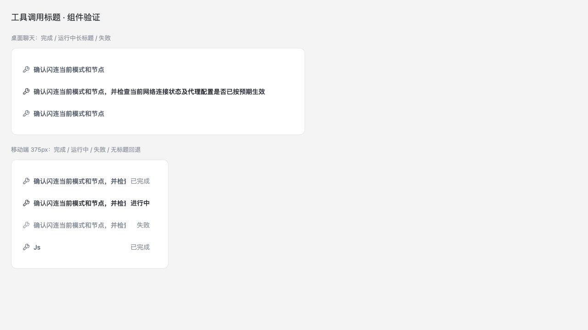
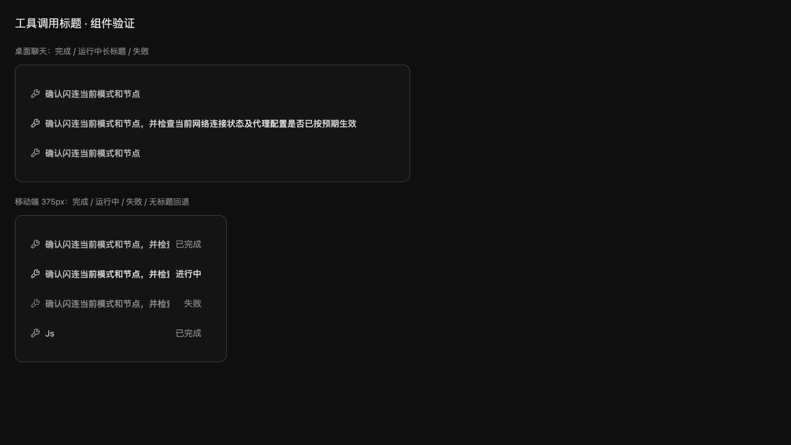

# Tool call title verification

The screenshots show real ToolCallBlock and MobileToolCall server-rendered markup with the repository's compiled Tailwind CSS and shipped light/dark theme sheets. The fixture substitutes translation and desktop replay-hook dependencies; its labels identify completed/running/failed states and empty-title fallback. This is a component preview, not a full Tauri/iPhone or live mobile-transport capture.

- Desktop frame: 640px.
- Mobile frame: 343px, within a 375px viewport with 16px outer gutters.
- Verified both themes: descriptions appear, long titles stay within the row, status text stays visible, and absent titles fall back to `Js`.
- Checked mobile modal accessible name and replay list/detail label selection through rendered component tests. Their full application chrome was not visually captured.

## Commands and outcomes

`pnpm test src/util/ui/rendering/__tests__/toolCallTitle.test.ts src/engines/ChatPanel/rendering/adapters/FallbackAdapter.test.ts src/engines/ChatPanel/blocks/ToolCallBlock/__tests__/ToolCallBlock.test.ts src/modules/WorkStation/CodeEditor/SessionReplay/__tests__/config.test.ts src/modules/WorkStation/CodeEditor/SessionReplay/__tests__/liveOperationOverlay.test.ts src/modules/WorkStation/CodeEditor/SessionReplay/__tests__/toolCallTitles.test.ts src/modules/MobileRemote/lib/transcriptReducer.test.ts src/modules/MobileRemote/components/transcript/MobileToolCall.test.ts src/modules/MobileRemote/components/transcript/MobileToolDetailModal.test.ts`

Result: 9 files / 77 tests passed.

`pnpm exec tsgo --noEmit --pretty false` passed. `pnpm exec tsc --noEmit --pretty false` exhausted Node's default approximately 4GB heap before producing diagnostics; tsgo completed the full project check.

ESLint ran on all changed frontend files and the new resolver/replay tests with `--max-warnings 0`; passed. Prettier ran on changed frontend files; Rust formatting ran on the changed module. The temporary visual-export probe passed and was removed from the application suite.

`cargo test --manifest-path src-tauri/Cargo.toml -p org2 --lib mobile_tool_title_projection -- --nocapture` passed both projection tests. The first attempt required the existing local org2-pm sidecar to be linked into the isolated worktree; no binary is included in this change. The macOS linker emitted its large `__eh_frame` compact-unwind warning for the full test binary; no test failed.

`git diff --cached --check`, `pnpm run check:test-placement`, and `git diff --cached --name-only -z | node scripts/ci/check-changed-file-length.cjs` passed. Source/AST inspection of changed production frontend files found no raw buttons, native button creation, form primitives, or substitute clickable elements. The staged diff contains no credentials, private configuration, debug logs, build caches, or unrelated changes.

## Performance review

| Area               | Verdict | Evidence                                                                                          | Change or reason kept                                       | Verification                                             |
| ------------------ | ------- | ------------------------------------------------------------------------------------------------- | ----------------------------------------------------------- | -------------------------------------------------------- |
| Background work    | keep    | No new timer, request, listener, worker, or scan.                                                 | Title is resolved only in existing projection/render calls. | Diff and call-chain inspection.                          |
| Memory             | keep    | Fixed four-name allowlist; one optional mobile string limited to 512 bytes plus marker per event. | No new cache; existing transcript/session eviction applies. | UTF-8 bound projection test and existing reducer limits. |
| Scope/isolation    | keep    | The title comes from the same event passed to the renderer/projection.                            | No global current-title state.                              | Retry/event-switch and reducer replacement tests.        |
| Rendering/hot path | keep    | Set membership and string trim; existing memoized projections reused.                             | No new subscription or growing retained structure.          | Targeted renderer/overlay tests and source inspection.   |

The lifecycle matrix introduces no additional work at start/idle/hidden/focus/network/account/session transitions. Titles are read during existing active render/projection work and released with their events. No CPU/RSS improvement is claimed; device/dual-instance performance measurement is not applicable to this stateless label change. Performance verdict: **pass** for the applicable stateless projection/render invariants; this is not a runtime performance-improvement claim.
