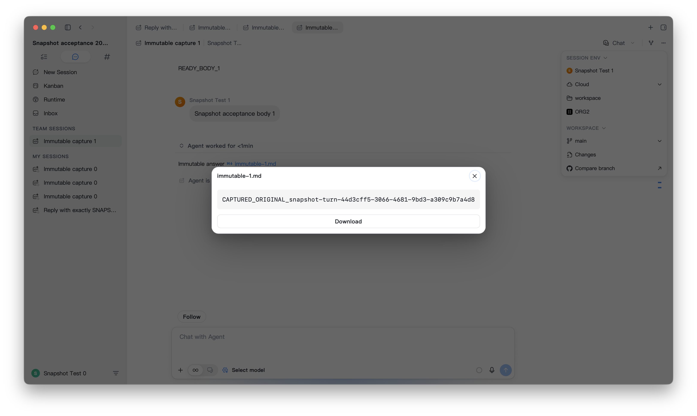
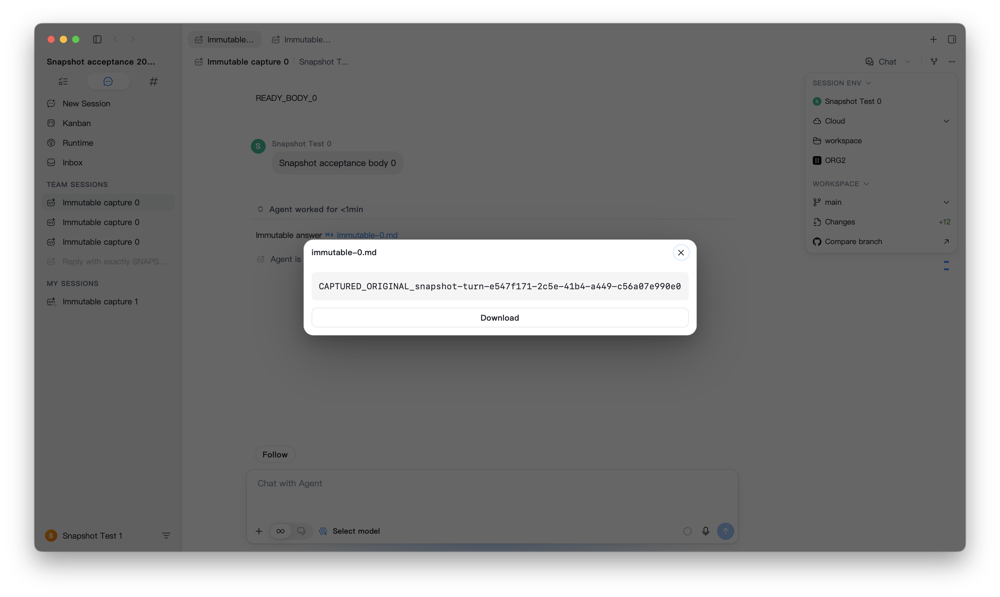

# Continuation snapshot desktop verification

Date: 2026-09-24. Implementation under test: `6c1fb67ad5` (#2135, stacked on #2128).

## Scope and environment

Two independently identified macOS Tauri debug applications used separate homes, WebKit stores, native ports, cloud identities, and a newly created test organization. The user authorized these isolated instances and test-organization writes. Existing developer applications were left running. No production deployment, manual historical cleanup, or PR merge was performed. The final log audit found incomplete startup-auth and temporary-directory isolation, described below; dedicated homes did not isolate every resource.

The current WebDriver build was compiled twice with each instance's embedded identity and the shared isolated frontend URL. The repository's webpack-dev-server 5 dependency rejects its old object-shaped `proxy` configuration. A temporary array-shaped development proxy configuration unblocked startup; it was restored afterward. No application source behavior was modified for acceptance.

This is **desktop integration evidence at the publisher, native journal, cloud transport, and rendered recipient boundaries**. Source events were seeded and the production `createCloudTailPublisher` was called directly in the running application. It does not prove real-provider continuation dispatch, canonical/native transcript reconciliation, or event-time artifact capture. No capability flag was overridden.

## Observed behavior

| Scenario                                                                | Result    | Evidence and boundary                                                                                                                                                                                                        |
| ----------------------------------------------------------------------- | --------- | ---------------------------------------------------------------------------------------------------------------------------------------------------------------------------------------------------------------------------- |
| A to B                                                                  | PASS      | First captured bytes, cloud bytes, and rendered recipient preview matched after source overwrite and deletion                                                                                                                |
| B to A                                                                  | PASS      | Same assertion with independent sender and recipient cloud identities                                                                                                                                                        |
| Attachment transport outage                                             | PASS      | File PUT alone returned an injected HTTP 503; body publication and recipient body opening succeeded                                                                                                                          |
| Repeated publication                                                    | PASS      | Publishing the same turn after overwriting its source preserved the first snapshot hash                                                                                                                                      |
| Retry after outage                                                      | PASS      | Restoring ordinary fetch let the existing worker upload the durable original bytes                                                                                                                                           |
| Acknowledgment                                                          | PASS      | Receipt became `uploaded`, bytes were released, and test-identity outboxes drained                                                                                                                                           |
| Receiver file opening                                                   | PASS      | Clicked the rendered Markdown link and asserted the original file text in the rendered preview; source no longer existed locally                                                                                             |
| Foreground recovery                                                     | PASS      | Native hide/show/focus transitions refreshed the receiving roster, then the visible row was opened                                                                                                                           |
| Provider-produced continuation                                          | BLOCKED   | Zenmux rejected `openai/gpt-4.1-mini` and `openai/gpt-5.5` with `model_not_available`; the configured OpenAI-compatible `gpt-5.5` endpoint could not connect. Attempts were cancelled; no provider row is counted as passing |
| Cross-device execution coordination                                     | UNCOVERED | Deployed capabilities omit `conversationTurnCoordination`; the application uses its existing non-coordinated path                                                                                                            |
| Compact, cache rebuild, old-build upgrade, raw Claude/Codex transitions | UNCOVERED | Not exercised by seeded publication; no extrapolation from the shared transport boundary                                                                                                                                     |
| Windows and Linux native capture                                        | UNCOVERED | This run was macOS only                                                                                                                                                                                                      |

The two measured publisher handoffs, including the body RPC and local capture, took **321 ms** and **327 ms** for the small fixture. Neither waited for attachment upload.

Exact SHA-256 agreement:

- A to B: `733a5c2d5257358b7098d2dc928fa7c8868130d44a6c8da90e0679b91e1fc313`
- B to A: `366606356fc81a7645d3dbd5b03de4d825c8199462fc692743ad3c1e776c1bab`





The manual refresh icon is hidden until sidebar hover or keyboard focus. Synthetic WebDriver pointer/focus did not reveal it, so that action was not reported as passing. Native foreground recovery, a production lifecycle path, was used instead. The visible recipient row, Markdown link, and file preview were still exercised and asserted.

## Cloud ledger and lifecycle

A service-role read captured all 3,498 existing cloud-session rows with pagination before provisioning. The test accounts can see only their new personal/test organizations. Five session rows were created in the test organization, including retained unsuccessful setup attempts. At the bilateral checkpoint, all 3,498 pre-existing rows were unchanged; no existing row had a deletion, access downgrade, event-count decrease, or epoch change.

The fleet baseline contains 767 rows with `events_epoch > 3`. These predate the run and are not evidence of a new rewrite in this PR. This run does not explain or remediate that historical condition. No historical data was changed.

Both applications were then cold-booted twice (four independent native process restarts), preserving their homes and embedded identities. After each boot, identity and the test-org roster were checked, three production sync passes were requested, and the opposite account's original file was reopened through its rendered link. All four cells passed. Each post-boot ledger preserved the five test rows' epochs, access modes, deletion state, and monotone event counts, and left all 3,498 pre-existing rows unchanged. These are seeded-source recovery cells, not raw-provider or old-build upgrade coverage. Native and frontend logs are retained locally; logs and credential-bearing fixture files are not committed.

## Desktop resources

Each idle state was sampled for approximately 20 seconds after settling. CPU percentages use differences in cumulative process CPU time, rather than a lifetime `%cpu` sample. The process groups include the native application and its associated WebKit content, GPU, and network processes. WebKit attribution uses launch timing and the isolated WebsiteDataStore paths. Existing developer applications are excluded.

| State        | Native A CPU | Native B CPU | A process-group CPU | B process-group CPU | A group ending RSS | B group ending RSS |
| ------------ | -----------: | -----------: | ------------------: | ------------------: | -----------------: | -----------------: |
| Visible idle |        0.05% |        0.10% |               1.15% |               0.80% |          313.3 MiB |          403.8 MiB |
| Hidden idle  |        0.05% |        0.05% |               0.85% |               1.00% |          131.8 MiB |          152.6 MiB |

These short windows showed no sustained RSS growth. They are not a long-duration leak test or a release-build baseline comparison.

Three **32 MiB** native capture commands took **515 ms, 254 ms, and 228 ms**. Each was followed by the real snapshot-read command and a hash check. The benchmark used a separate local identity that neither authenticated delivery worker could claim; benchmark bytes were not uploaded. Its pending bytes were bounded by the existing staging budget and remained only in the disposable test home.

The combined capture/read sequence increased native RSS from **99.8 MiB** to a sampled peak of **463.1 MiB**, ending at **156.8 MiB** after a short settling interval. This includes SQLite and the base64/JSON IPC read path, not capture alone. The run does not yet attribute the peak among those allocations or prove a long-term steady-state bound. This is an **open memory-cost investigation**, not a passing resource budget. A 32 MiB file limit is not a 32 MiB process-memory limit.

**Performance verdict: fail** for the overall multi-instance isolation invariant; **blocked** for complete memory/provider acceptance. Short idle and capture-latency evidence is now available, but peak-memory attribution, sustained/release measurements, real-provider lifecycle, upgrade, and cross-platform cells remain open.

## Isolation failures found during the final effect audit

- The secondary boot log referenced an organization outside both newly provisioned accounts before test auth was seeded. WebKit storage was scoped to the temporary home, but `shared-service-auth.json` still resolved under the reusable numbered application identifier. A clean home therefore did not establish a clean startup auth boundary. The explicit test identities used by the transfer scenarios were independently asserted, but this startup cell fails isolation.
- Secondary housekeeping logged removal of **four orphan scratchpad directories** from the UID-wide system temporary root. `orgii_temp_root()` ignores the data-home boundary, while `evict_orphan_scratchpads` decides ownership using only the current instance's session database. A directory absent from B's database can belong to A. The log records the count and parent only, so the four deleted directory names and contents cannot be reconstructed from this evidence. The test instances were stopped when this was found; no further destructive test was run.
- The cloud ledger still proves no pre-existing cloud-session mutations during this run. It does not prove absence of local temporary-file effects. The above defects need a separate instance-isolation fix; they are not hidden by the passing snapshot-transfer cells.
- Other destructive-effect matches were watchdog **startup** messages (not watchdog fires) and housekeeping counters. No forced-idle, epoch rewrite, or cloud retract was found in the retained logs.

## Additional defects and limitations found

- Development startup: webpack-dev-server 5 rejects the current object-shaped proxy configuration. The temporary compatibility adjustment is not included in this snapshot PR.
- Provider retry classification: explicit subscription/model-unavailable HTTP 404 responses were retried repeatedly (configured limit 10); title-generation side queries continued retrying after the primary turn was cancelled. These are open findings in unchanged provider/title paths, not snapshot success.
- The configured live-test OpenAI-compatible endpoint was unreachable in the isolated run. No credentials or endpoint details are published here.
- Automatic updater attempts reported the symlinked Cargo target path as unsupported. This is a debug harness limitation; packaged application behavior is unverified by this run.
- Git auto-fetch for the self-contained fixture remote reported repository-not-found. The fixture remote provides a stable scope identity but is not an actual hosted repository.

## Commands and artifacts

The local one-off acceptance scripts ran against the repository WebDriver harness and production application modules:

```sh
node tests/e2e/node_modules/@wdio/cli/bin/wdio.js run tests/e2e/wdio.conf.mjs \
  --spec tests/e2e/.local/snapshot-desktop.spec.mjs
node /tmp/org2-snapshot-verification/dual-snapshots.mjs
node /tmp/org2-snapshot-verification/capture-evidence.mjs
node /tmp/org2-snapshot-verification/resources.mjs
node /tmp/org2-snapshot-verification/active-capture.mjs
node /tmp/org2-snapshot-verification/cold-boots.mjs
node /tmp/org2-snapshot-verification/ledger.mjs bilateral
```

The holder spec only boots the two instances; it is not itself an acceptance assertion. It exited nonzero during teardown because the cold-boot script had replaced its original WebDriver sessions and explicitly closed the replacements. Both current native PIDs were confirmed absent; this harness failure is not reported as a green suite. The scripts and private ledgers are retained locally. They are not a reusable core E2E addition, and no claim of a full core UI or provider matrix pass is made. The separately reported 263 frontend tests and 17 macOS native outbox tests remain the automated regression evidence for the implementation.
