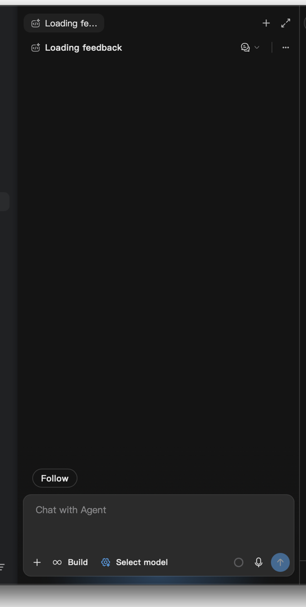
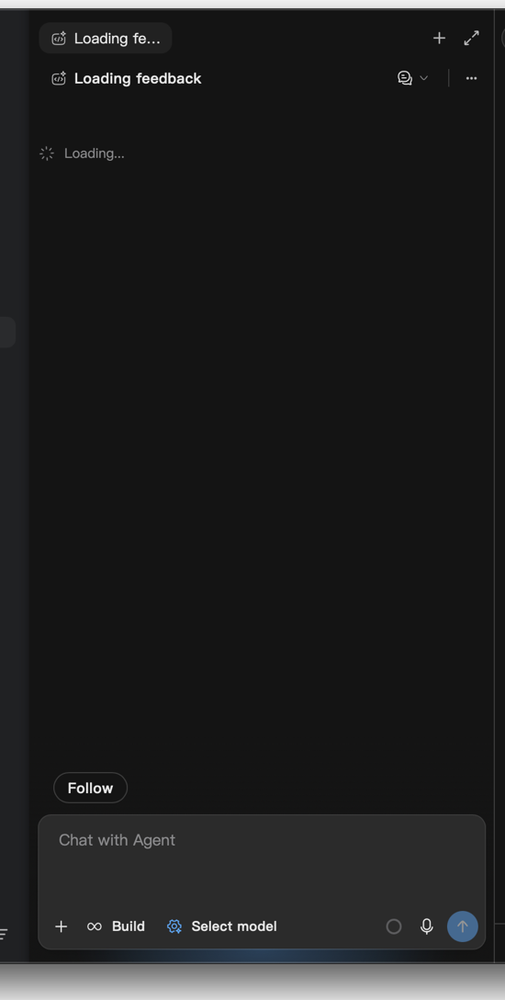
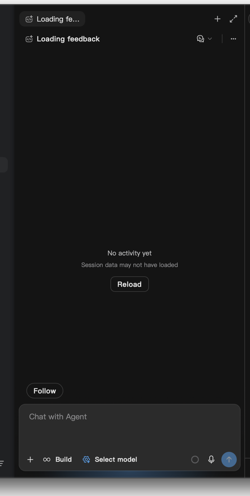

# 会话加载反馈实机验证

点击侧栏会话后，正文尚不可用时，`ChatLoadingBlock` 原先只画静态灰条；更直接的问题是空状态分支没有复用正文的标题栏留白，加载提示实际位于不透明浮动标题栏下面。空历史确认有既有的 5 秒等待，因此会出现明显空白。

修复让空状态与懒加载 fallback 复用 `resolveTranscriptTopPaddingPx` 的布局约定；共享加载提示增加本地化文字、转圈、status/busy 语义和减少动态效果支持。没有修改正文数据、加载请求、配额或这段等待时长，没有历史数据修复操作。

## 实机证据

截图来自独立数据目录的 macOS Tauri 测试窗口，裁剪到会话栏；只有专用 fixture 数据。

| 修复前                          | 修复后                       | 等待结束                 |
| ------------------------------- | ---------------------------- | ------------------------ |
|  |  |  |

同一侧栏点击回归先在旧实现失败：提示没有文字和状态语义。只补文字时仍失败：文字矩形 y=24–44，`elementFromPoint` 命中标题栏，证明 DOM 存在不等于可见。布局修复后文字 y=112–132，命中提示本身；提示在确认空状态后消失，截图显示原有 Reload 操作。

## 执行结果

- `pnpm exec vitest run --config config/vitest.config.ts src/engines/ChatPanel/blocks/primitives/ChatLoadingBlock.test.ts src/engines/ChatPanel/header/chatPanelHeaderLayout.test.ts`：2 个文件、22 条通过，含中英文与现有标题栏布局约定。
- `E2E_CHAT_RENDERING_SCENARIOS=session-loading pnpm test -- --spec ./specs/core/chat-rendering-ui.spec.mjs --mochaOpts.grep "shows visible loading feedback"`（`tests/e2e`）：1 passing。只 seed 空会话；生产侧栏点击、历史加载与空状态确认负责状态变化，未注入 loading 状态。断言文字、status/busy、真实命中检测与最后消失。
- `pnpm typecheck:fast`；对四个变更 TS/TSX 文件运行 `pnpm exec eslint ... --max-warnings 0`：通过。
- `node --check tests/e2e/specs/core/chat-rendering-ui.spec.mjs`、`git diff --check`、变更文件长度检查：通过。

运行使用隔离端口和 mock provider；加载修复没有 Rust 变更，复用本任务先前构建的 webdriver 二进制，前端来自当前分支。webpack-dev-server 5 的 proxy 配置兼容问题用本地临时适配启动，测试结束后已恢复，没有纳入本 PR。

本次覆盖深色窄分栏、等待和空状态；浅色、最大化、网络错误及云端慢正文下载没有新增实机覆盖。共享加载组件也用于嵌套内容和面板，提示高度从 16px 增加为带文字的紧凑行，极短等待可能短暂显示。没有新增定时器、轮询或 retained state；不提出运行性能提升结论。
