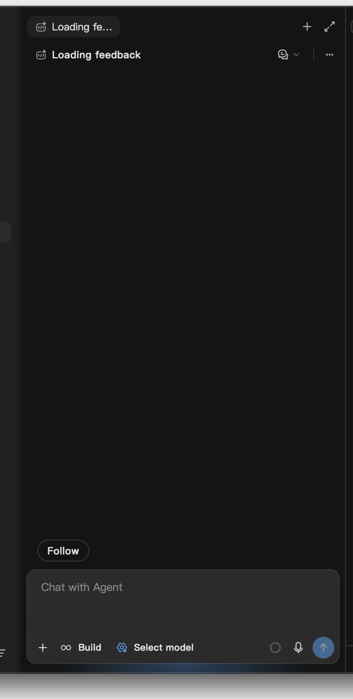
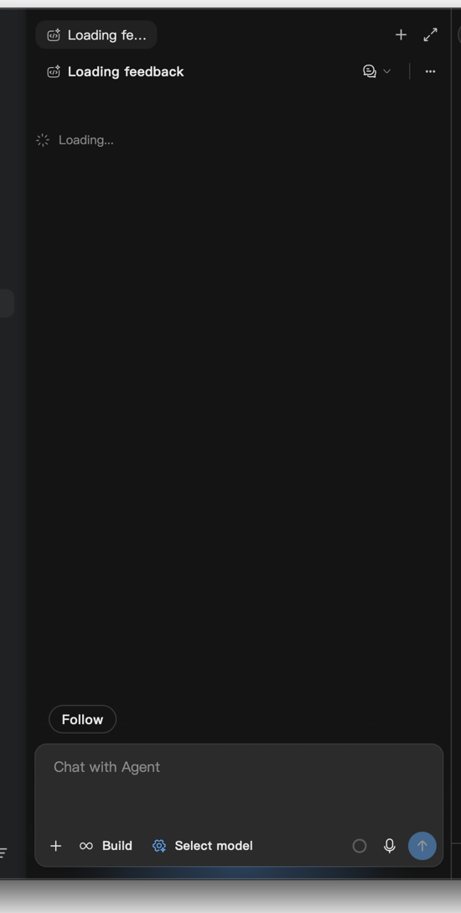
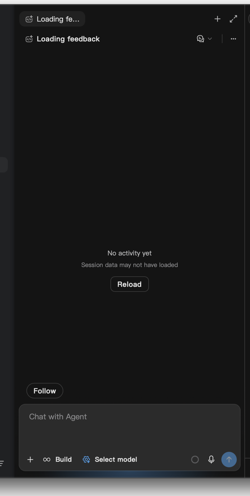

# Session Loading Feedback Verification on a Real Device

After a sidebar session was clicked, while the transcript was still unavailable, `ChatLoadingBlock` originally rendered only static gray bars. A more immediate issue was that the empty-state branch did not reuse the transcript's header spacing, so the loading indicator was hidden beneath the opaque floating header. The empty-history check already had a five-second wait, which left a conspicuous blank area.

The fix makes the empty state and lazy-loading fallback reuse the layout convention in `resolveTranscriptTopPaddingPx`. The shared loading indicator now includes localized text, a spinner, status/busy semantics, and support for reduced motion. Transcript data, loading requests, quotas, and the wait duration were not changed, and no historical data was repaired.

## Real-Device Evidence

The screenshots come from a macOS Tauri test window using an isolated data directory, cropped to the session pane; they contain only dedicated fixture data.

| Before the fix                  | After the fix                | After the wait            |
| ------------------------------- | ---------------------------- | ------------------------ |
|  |  |  |

The same sidebar-click regression first failed against the old implementation because the indicator had no text or status semantics. Adding text alone still failed: its rectangle was at y=24–44, and `elementFromPoint` hit the header, showing that DOM presence did not mean the text was visible. After the layout fix, the text was at y=112–132 and hit testing reached the indicator itself. The indicator disappeared after the empty state was confirmed, and the screenshot shows the existing Reload action.

## Results

- `pnpm exec vitest run --config config/vitest.config.ts src/engines/ChatPanel/blocks/primitives/ChatLoadingBlock.test.ts src/engines/ChatPanel/header/chatPanelHeaderLayout.test.ts`: 2 files, 22 tests passed, including Chinese and English and the existing header layout convention.
- `E2E_CHAT_RENDERING_SCENARIOS=session-loading pnpm test -- --spec ./specs/core/chat-rendering-ui.spec.mjs --mochaOpts.grep "shows visible loading feedback"` (`tests/e2e`): 1 passing. It seeds only an empty session; the production sidebar click, history loading, and empty-state confirmation drive the state changes, with no injected loading state. Assertions cover text, status/busy, real hit testing, and eventual disappearance.
- `pnpm typecheck:fast`; ran `pnpm exec eslint ... --max-warnings 0` on the four changed TS/TSX files: passed.
- `node --check tests/e2e/specs/core/chat-rendering-ui.spec.mjs`, `git diff --check`, and changed-file length check: passed.

The run used an isolated port and a mock provider. The loading fix made no Rust changes; it reused the webdriver binary built earlier for this task, and the frontend came from the current branch. A temporary local adapter was used to work around a webpack-dev-server 5 proxy configuration compatibility issue, then restored after the test; it is not part of this PR.

This check covered a narrow dark sidebar, loading, and the empty state. It added no real-device coverage for light mode, maximized windows, network errors, or slow cloud transcript downloads. The shared loading component is also used in nested content and panels; its height increased from 16px to a compact row with text, so it may briefly appear during very short waits. No timers, polling, or retained state were added, and no runtime performance improvement is claimed.
